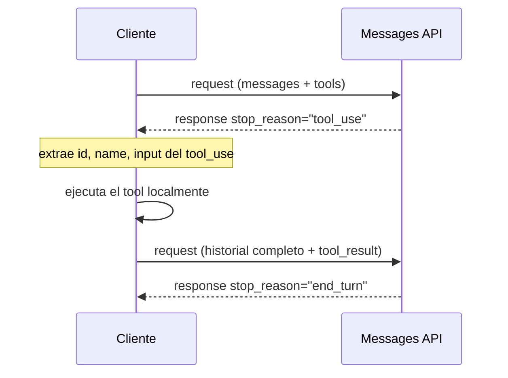
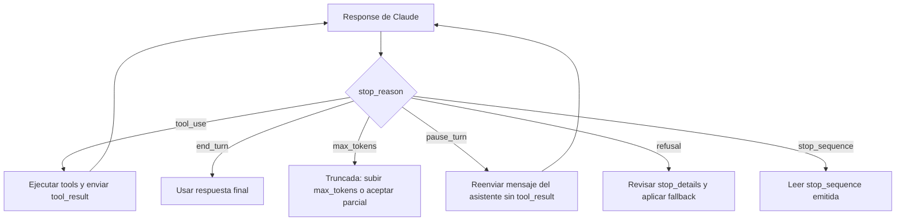

```yaml
---
bloque: 0
nombre: "Fundamentos: API de Claude, tool use y bucle agéntico"
dominio_oficial: null
peso_examen: null
version: "1.0"
fecha: "2026-08-05"
guia_oficial_examen: "1.0"
task_statements: ["0.1", "0.2", "0.3", "0.4", "0.5", "0.6"]
fuentes:
  - {titulo: "Working with the Messages API", url: "https://platform.claude.com/docs/en/build-with-claude/working-with-messages", origen: "anthropic", tipo: "doc"}
  - {titulo: "How tool use works", url: "https://platform.claude.com/docs/en/agents-and-tools/tool-use/how-tool-use-works", origen: "anthropic", tipo: "doc"}
  - {titulo: "Define tools", url: "https://platform.claude.com/docs/en/agents-and-tools/tool-use/define-tools", origen: "anthropic", tipo: "doc"}
  - {titulo: "Handle tool calls", url: "https://platform.claude.com/docs/en/agents-and-tools/tool-use/handle-tool-calls", origen: "anthropic", tipo: "doc"}
  - {titulo: "Handling stop reasons", url: "https://platform.claude.com/docs/en/build-with-claude/handling-stop-reasons", origen: "anthropic", tipo: "doc"}
  - {titulo: "Tool use overview", url: "https://platform.claude.com/docs/en/agents-and-tools/tool-use/overview", origen: "anthropic", tipo: "doc"}
  - {titulo: "Strict tool use", url: "https://platform.claude.com/docs/en/agents-and-tools/tool-use/strict-tool-use", origen: "anthropic", tipo: "doc"}
estado: aprobado
---
```

# Bloque 0 — Fundamentos: API de Claude, tool use y bucle agéntico {#bloque-0}

Este bloque es **transversal**: no corresponde a ningún dominio del blueprint oficial (`dominio_oficial: null`, `peso_examen: null`), pero es la base mecánica sobre la que se apoyan los cinco dominios examinables. Antes de razonar sobre arquitectura multi-agente, diseño de tools o gestión de contexto, hay que dominar la anatomía de la Messages API, el ciclo `tool_use`/`tool_result`, el control de flujo por `stop_reason` y las opciones de `tool_choice`. Los seis ejes de este bloque (0.1–0.6) sustentan directamente los Task Statements oficiales **1.1** (bucles agénticos), **2.1** (diseño de interfaces de tools), **2.3** (distribución de tools y configuración de tool choice) y **4.3** (salida estructurada vía tool use). Quien no interiorice esta mecánica arrastrará errores conceptuales al estudiar los dominios 1 a 5: el examen da por sentado este nivel de detalle y lo usa como base de distractores en preguntas de dominios superiores.

## Mapa del bloque

| Eje | Título | Sustenta TS oficial | Conceptos clave |
|---|---|---|---|
| 0.1 | Anatomía de la Messages API | 1.1 | `system` top-level, array `messages`, roles `user`/`assistant`, `max_tokens`, API stateless, multi-turno |
| 0.2 | Definición de tools con JSON Schema | 2.1, 4.3 | `name`, `description`, `input_schema`, `input_examples`, `strict: true`, consolidación y namespacing |
| 0.3 | Ciclo `tool_use`/`tool_result` | 1.1 | `tool_use_id`, orden de content blocks, client tools vs server tools, `is_error` |
| 0.4 | `stop_reason` como control del bucle | 1.1 | `end_turn`, `tool_use`, `max_tokens`, `pause_turn`, `refusal`, `stop_sequence`, `model_context_window_exceeded` |
| 0.5 | Opciones de `tool_choice` | 2.3, 4.3 | `auto`, `any`, `tool` (forzado), `none`, prefill automático, interacción con `strict` y extended thinking |
| 0.6 | Decisión del modelo vs flujo determinista | 1.1 | Agente vs workflow programado, prompt chaining, hooks de enforcement |

---

## 0.1 — Anatomía de la Messages API: estructura request/response, roles, array messages, max_tokens, multi-turno {#ts-0-1}

> *Sustenta Task Statement oficial 1.1* — «Design and implement agentic loops for autonomous task execution» (concretamente el conocimiento de "sending requests to Claude... and returning results for the next iteration").

**Concepto.** La Messages API (`POST /v1/messages`) es el punto de entrada único a Claude y la base de todo bucle agéntico: cada iteración del bucle no es más que un nuevo request a este endpoint con el historial acumulado. Entenderla bien evita el error de fondo más común al empezar con agentes: asumir que el servidor recuerda algo entre llamadas. No lo hace: la API es completamente **stateless**, y es responsabilidad exclusiva del cliente reconstruir y enviar el contexto completo en cada request.

**Cómo funciona.** El request lleva `model`, `max_tokens` (obligatorio) y el array `messages`; opcionalmente, `system` como parámetro **top-level**, nunca como un mensaje con `role: "system"` dentro del array (excepción: Claude Opus 5, Opus 4.8, Fable 5 y Mythos 5 admiten *system messages* a mitad de conversación, siempre después de un turno de usuario). Cada elemento de `messages` tiene `role` (`user` o `assistant`) y `content` (string o array de content blocks). `max_tokens` acota únicamente el presupuesto de tokens de **salida**; si la generación lo agota a mitad de respuesta, `stop_reason` pasa a `"max_tokens"`. La respuesta devuelve `id`, `type: "message"`, `role: "assistant"`, `content` (array de blocks **generados por el modelo**: `text` y `tool_use`; los blocks `tool_result` —y las imágenes o documentos que estos contengan— pertenecen a los mensajes `role: "user"` que construye el cliente, nunca a la respuesta del asistente), `model`, `stop_reason`, `stop_sequence` (`null` si no aplica) y `usage` (`input_tokens`, `output_tokens`). Un mismo mensaje del asistente puede mezclar un block `text` con uno `tool_use` (p. ej., "I'll check the weather" seguido de la llamada).

```json
// Request básico
{
  "model": "claude-opus-5",
  "max_tokens": 1024,
  "system": "You are a helpful assistant.",
  "messages": [
    {"role": "user", "content": "Hello, Claude"},
    {"role": "assistant", "content": "Hello!"},
    {"role": "user", "content": "Can you describe LLMs?"}
  ]
}
```

```json
// Response de éxito
{
  "id": "msg_01XFDUDYJgAACzvnptvVoYEL",
  "type": "message",
  "role": "assistant",
  "content": [{"type": "text", "text": "LLMs are..."}],
  "model": "claude-opus-5",
  "stop_reason": "end_turn",
  "stop_sequence": null,
  "usage": {"input_tokens": 12, "output_tokens": 6}
}
```

**Patrón correcto.** El patrón de conversación progresiva consiste en hacer *append* de cada turno (mensaje de usuario, respuesta del asistente) al array `messages` local del cliente, y reenviar ese array completo y actualizado en el siguiente request. Este es literalmente el mecanismo que hace posible el multi-turno y, extendido con tool results, el bucle agéntico completo. Los turnos previos no tienen por qué provenir de respuestas reales del modelo: la doc oficial permite mensajes `assistant` **sintéticos** construidos por el cliente (few-shot conversacional, contexto preconfigurado), un patrón válido y frecuente.

**Anti-patrones.** Pasar `system` como un mensaje dentro del array (`{"role": "system", "content": "..."}`) produce error o comportamiento indefinido: debe ir siempre como parámetro top-level. Asumir que el servidor mantiene contexto entre requests es el error de diseño más costoso: al ser stateless, cualquier suposición de memoria persistente en servidor provoca pérdida de historial. Enviar solo el último turno para "ahorrar tokens" tiene el mismo efecto: el modelo pierde contexto previo crítico porque nunca lo recibió.

**Trampas de examen.** El examen distingue entre "el rol `system` existe en el array `messages`" (falso, salvo la excepción de mid-conversation system messages en los modelos citados) y "`system` es un parámetro top-level" (correcto). Otra confusión típica: tratar `max_tokens` como límite de contexto total en vez de límite de tokens de **salida**.

**Fuentes.** Working with the Messages API — https://platform.claude.com/docs/en/build-with-claude/working-with-messages

---

## 0.2 — Definición de tools con JSON Schema: name, description, input_schema; qué hace buena una descripción; strict tool use {#ts-0-2}

> *Sustenta Task Statements oficiales 2.1 y 4.3* — «Design effective tool interfaces with clear descriptions and boundaries» y «Enforce structured output using tool use and JSON schemas».

**Concepto.** Una tool se define con `name` (regex `^[a-zA-Z0-9_-]{1,64}$`), `description` (texto plano, mínimo 3-4 oraciones) e `input_schema` (JSON Schema con `type: "object"`, `properties` y `required`); opcionalmente `input_examples`, un array de instancias válidas del schema. La `description` es el **único mecanismo** que tiene el modelo para decidir cuándo y cómo invocar una tool: no hay canal adicional de "intención" fuera de ese texto, por lo que su calidad determina directamente la fiabilidad de la selección de tools.

**Cómo funciona.** Una descripción efectiva cubre qué hace la tool, cuándo usarla (y cuándo NO), qué significa cada parámetro y cómo afecta al comportamiento, caveats/limitaciones explícitas, y ejemplos de entrada si el input es complejo. El campo `input_examples` (array de objetos válidos según el schema) ayuda al modelo a entender parámetros opcionales, formatos y patrones, a un coste aproximado de 20-50 tokens por ejemplo simple y 100-200 para ejemplos complejos; `input_examples` **no está soportado en server-side tools**. `strict: true` garantiza, mediante *grammar-constrained sampling* (muestreo restringido por gramática) sobre el `input`, que toda llamada a la tool matchea el schema exactamente —sin parámetros requeridos ausentes ni type mismatches—, y funciona **con cualquier valor de `tool_choice`** (incluida `"auto"`): la garantía aplica siempre que Claude decida llamar a esa tool. Combinarlo con `tool_choice: "any"` añade una segunda garantía independiente —que la llamada se produzca—, logrando la garantía compuesta llamada + conformidad de schema. Cuando el catálogo de tools crece, conviene consolidar: 4-5 tools con un parámetro `action` reducen la ambigüedad de selección frente a 20 tools hiperespecíficas; y cuando las tools abarcan varios servicios, el *namespacing* con prefijo (`github_list_prs`, `slack_send_message`) evita confusión. La API construye internamente un system prompt especial a partir de las definiciones de tools, `tool_choice` y el `system` del usuario; ese prompt de tool use no se edita a mano, es generado automáticamente.

```json
// Descripción POBRE (distractor típico)
{
  "name": "get_stock_price",
  "description": "Gets the stock price for a ticker.",
  "input_schema": {
    "type": "object",
    "properties": {"ticker": {"type": "string"}},
    "required": ["ticker"]
  }
}
```

```json
// Descripción BUENA: qué hace, cuándo usarla, límites explícitos
{
  "name": "get_stock_price",
  "description": "Retrieves the current stock price for a given ticker symbol. The ticker symbol must be a valid symbol for a publicly traded company on a major US stock exchange like NYSE or NASDAQ. The tool will return the latest trade price in USD. It should be used when the user asks about the current or most recent price of a specific stock. It will not provide any other information about the stock or company.",
  "input_schema": {
    "type": "object",
    "properties": {
      "ticker": {"type": "string", "description": "The stock ticker symbol, e.g. AAPL for Apple Inc."}
    },
    "required": ["ticker"]
  }
}
```

```json
// input_examples para parámetros opcionales/complejos
{
  "name": "get_weather",
  "description": "Get the current weather in a given location",
  "input_schema": {
    "type": "object",
    "properties": {
      "location": {"type": "string", "description": "The city and state, e.g. San Francisco, CA"},
      "unit": {"type": "string", "enum": ["celsius", "fahrenheit"], "description": "The unit of temperature"}
    },
    "required": ["location"]
  },
  "input_examples": [
    {"location": "San Francisco, CA", "unit": "fahrenheit"},
    {"location": "Tokyo, Japan", "unit": "celsius"},
    {"location": "New York, NY"}
  ]
}
```

**Patrón correcto.** Cuando dos tools son parecidas (`analyze_content` vs `analyze_document`), la descripción debe marcar la frontera explícitamente: qué acepta cada una y cuándo elegir una u otra, para evitar *misrouting*. Si un campo puede faltar en el dato origen, se marca como opcional/nullable en el schema —nunca `required`— porque el modelo no fabricará valores para satisfacer un campo requerido que el origen no siempre entrega; para categorización extensible, el patrón `enum` + campo `"other"` con detalle en string cubre los casos no previstos sin perder validación.

**Anti-patrones.** Una descripción genérica ("Gets data") deja al modelo sin contexto de cuándo usarla, con qué input y qué esperar, y el resultado es misrouting e invocaciones incorrectas. Parámetros ambiguos o solapados (una tool "lookup_data" sin especificar si busca por ID, nombre o email) fuerzan al modelo a adivinar. Marcar como `required` un campo que el documento origen no siempre trae (p. ej. `customer_phone`) empuja al modelo a inventar valores falsos para cumplir el schema. Omitir `strict: true` cuando se necesita una garantía real de validación —extracción estructurada crítica— deja abierta la posibilidad, aunque rara, de JSON inválido.

**Trampas de examen.** El examen distingue entre "la descripción es insuficiente" (causa misrouting) y "el schema es insuficiente" (causa alucinación de valores): son dos fallos distintos con soluciones distintas (mejorar prosa de `description` vs marcar campos como opcionales). También aparece como distractor la idea de que `strict: true` "solo funciona con `tool_choice: "any"` o tool forzada": es falso — `strict` garantiza la conformidad del input con cualquier `tool_choice`; lo que `"any"` aporta es garantizar además que la tool se llame (la garantía compuesta llamada + schema sí exige combinar ambos).

**Fuentes.** Define tools — https://platform.claude.com/docs/en/agents-and-tools/tool-use/define-tools · Strict tool use — https://platform.claude.com/docs/en/agents-and-tools/tool-use/strict-tool-use

---

## 0.3 — Ciclo tool_use/tool_result: bloques de contenido, tool_use_id, client tools vs server tools, errores en tool_result {#ts-0-3}

> *Sustenta Task Statement oficial 1.1* — «Design and implement agentic loops for autonomous task execution» (el ciclo completo de ejecutar tools y devolver resultados para la siguiente iteración).

**Concepto.** El ciclo `tool_use`/`tool_result` es el mecanismo concreto que hace posible el bucle agéntico: Claude emite una petición de llamada a tool, el cliente la ejecuta fuera del modelo, y el resultado vuelve a entrar en el historial para que el modelo razone sobre el siguiente paso. Todo el "agentic loop" del examen se reduce, en la práctica, a implementar correctamente este ciclo y su condición de salida.

**Cómo funciona.** La secuencia para **client tools** es: (1) request con array `tools` y mensaje de usuario; (2) response con `stop_reason: "tool_use"` y uno o más blocks `tool_use`; (3) el cliente extrae `id`, `name` e `input` de cada block; (4) el cliente ejecuta el tool real en su propio código; (5) el cliente envía un nuevo request con el historial completo más un mensaje `user` que contiene el/los block(s) `tool_result`; (6) el bucle continúa mientras `stop_reason == "tool_use"`. El block `tool_use` lleva `type: "tool_use"`, `id` (identificador único de esa llamada), `name` y `input` (JSON conforme al `input_schema`). El block `tool_result` lleva `type: "tool_result"`, `tool_use_id` (debe matchear exactamente el `id` del `tool_use` que responde), `content` opcional (string; array de blocks de texto/imagen/documento/`search_result`; o vacío) e `is_error` opcional. Hay dos reglas de ordenamiento estrictas: los `tool_result` deben venir inmediatamente después de los `tool_use` del asistente en el historial (no se interpola nada entre medias), y dentro del content array del mensaje que los contiene, los blocks `tool_result` van **primero** y cualquier texto adicional va después —invertir ese orden produce un error 400. Dentro de los client tools conviven las tools **user-defined** (schema propio) y las de **schema definido por Anthropic** pero ejecución en cliente (`bash`, `text_editor`, `memory`, `computer`). Los **server tools** (`web_search`, `web_fetch`, `code_execution`, `tool_search`) los ejecuta Anthropic internamente: si coexisten en el mismo turno con client tools, el cliente solo responde con `tool_result` para los client tools, mientras el servidor resuelve y devuelve resultado para los suyos (pudiendo aparecer un block `server_tool_use` sin resultado inmediato si va combinado en un batch con client tools). Claude puede emitir varios blocks `tool_use` en una sola respuesta (llamadas en paralelo); el cliente debe ejecutarlos todos y devolver todos sus `tool_result` en el siguiente request. Cuando la ejecución de un tool falla, el `tool_result` lleva `"is_error": true` con un mensaje descriptivo (nunca genérico tipo "failed"); Claude incorpora ese error a su siguiente respuesta y puede reintentar o escalar.

```json
// Response con tool_use
{
  "id": "msg_01Aq9w938a90dw8q",
  "type": "message",
  "role": "assistant",
  "stop_reason": "tool_use",
  "content": [
    {"type": "text", "text": "I'll check the current weather in San Francisco for you."},
    {"type": "tool_use", "id": "toolu_01A09q90qw90lq917835lq9", "name": "get_weather", "input": {"location": "San Francisco, CA"}}
  ]
}
```

```json
// Siguiente request con tool_result (content va primero si hay texto)
{
  "role": "user",
  "content": [
    {"type": "tool_result", "tool_use_id": "toolu_01A09q90qw90lq917835lq9", "content": "15 degrees Celsius, partly cloudy"}
  ]
}
```

```json
// tool_result con error: mensaje instructivo, no genérico
{
  "role": "user",
  "content": [
    {
      "type": "tool_result",
      "tool_use_id": "toolu_01A09q90qw90lq917835lq9",
      "content": "ConnectionError: the weather service API is not available (HTTP 500)",
      "is_error": true
    }
  ]
}
```

**Patrón correcto.** La condición de control es simple y única: mientras `stop_reason == "tool_use"`, continuar el bucle; en cualquier otro valor, salir. El `tool_use_id` debe preservarse exactamente entre el `tool_use` y su `tool_result` correspondiente. Los mensajes de error deben ser instructivos ("Rate limit exceeded. Retry after 60 seconds." o "Missing required 'location' parameter"), no genéricos, para habilitar recuperación inteligente del modelo. Si la ejecución retorna vacío de forma válida (no un error), se permite `tool_result` sin `content` o con `content: ""`, distinto de un `is_error: true`.

**Anti-patrones.** Colocar un block de texto antes que el `tool_result` en el content array provoca un error 400 de la API: el orden correcto es `tool_result` primero. Omitir el `tool_result` de una llamada que el asistente emitió rompe el bucle o devuelve error: cada `tool_use` exige su `tool_result` correspondiente, sin excepción. Confundir server tools con client tools —enviando manualmente un `tool_result` para un server tool— produce comportamiento indefinido, porque Anthropic ya lo ejecutó y resolvió internamente. Ignorar el flag `is_error` (no reenviarlo al historial) impide que Claude sepa que algo falló y adapte su respuesta. Un mensaje de error genérico ("Operation failed") no le da a Claude información para decidir entre reintentar o escalar.

**Trampas de examen.** El examen suele presentar como distractor un ejemplo con orden de content array invertido (texto antes de `tool_result`) para ver si se detecta el error 400. También aparece la confusión entre "el servidor mantiene el loop" (falso) y "el cliente controla el loop verificando `stop_reason`" (correcto). Otra trampa común: asumir que un server tool necesita `tool_result` manual como un client tool.

**Fuentes.** How tool use works — https://platform.claude.com/docs/en/agents-and-tools/tool-use/how-tool-use-works · Handle tool calls — https://platform.claude.com/docs/en/agents-and-tools/tool-use/handle-tool-calls · Tool use overview — https://platform.claude.com/docs/en/agents-and-tools/tool-use/overview

---

## 0.4 — stop_reason como control del bucle agéntico: valores, qué hacer ante cada uno {#ts-0-4}

> *Sustenta Task Statement oficial 1.1* — «Design and implement agentic loops for autonomous task execution» (inspeccionar `stop_reason` como mecanismo de control de flujo, evitando anti-patrones de terminación basados en texto o contadores arbitrarios).

**Concepto.** `stop_reason` es el único campo que debe determinar si el bucle agéntico continúa o termina, y con qué acción. Verificarlo antes de procesar el `content` de la respuesta es crítico: no hacerlo lleva a tratar una respuesta truncada, un rechazo o una pausa de server tools como si fuera una respuesta completa y final.

**Cómo funciona.** Los valores posibles y su tratamiento son: `"end_turn"` (respuesta completada con normalidad, se usa el resultado tal cual); `"tool_use"` (Claude quiere llamar a una tool: ejecutar, devolver `tool_result`, continuar el bucle); `"max_tokens"` (se agotó el límite de tokens de salida especificado, la respuesta queda truncada —posiblemente a media palabra—, y la opción es subir `max_tokens` o aceptar la respuesta parcial); `"stop_sequence"` (se emitió una secuencia personalizada configurada vía el parámetro `stop_sequences`; el campo `stop_sequence` de la response indica cuál); `"pause_turn"` (con server tools, se alcanzó el límite de iteraciones internas —por defecto 10— y el modelo no ha terminado; el cliente debe reenviar el mensaje del asistente, incluyendo los resultados de `server_tool_use` ya recibidos, para que el modelo continúe donde se pausó); `"refusal"` (Claude rechazó responder por política; la response incluye `stop_details` con la categoría, p. ej. "violence" o "sexual_content", útil para logging o fallback); `"model_context_window_exceeded"` (la ventana de contexto se llenó, raro con los modelos más recientes pero más común con historiales muy largos; se trata como una respuesta truncada). La lógica canónica de control es un bucle que reenvía requests mientras `stop_reason == "tool_use"` y sale explícitamente en cualquier otro valor.

```python
messages = [{"role": "user", "content": "What's the weather in San Francisco?"}]

while True:
    response = client.messages.create(
        model="claude-opus-5", max_tokens=1024, tools=tools, messages=messages
    )

    if response.stop_reason == "tool_use":
        messages.append({"role": "assistant", "content": response.content})
        tool_results = []
        for block in response.content:
            if block.type == "tool_use":
                result = execute_tool(block.name, block.input)
                tool_results.append({
                    "type": "tool_result", "tool_use_id": block.id,
                    "content": result, "is_error": False
                })
        messages.append({"role": "user", "content": tool_results})

    elif response.stop_reason == "end_turn":
        return response

    elif response.stop_reason == "max_tokens":
        break  # truncada: subir max_tokens y reintentar, o aceptar parcial

    elif response.stop_reason == "refusal":
        print(f"Refusal: {response.stop_details}")
        break

    elif response.stop_reason == "pause_turn":
        messages.append({"role": "assistant", "content": response.content})
        # reenviar sin tool_result: el servidor continúa iterando
```

**Patrón correcto.** Verificar siempre `stop_reason` con una cadena explícita `if/elif` antes de tocar `content`: es la única forma de evitar bugs sutiles cuando la respuesta no es la esperada. Ante `pause_turn`, basta con reenviar la respuesta del asistente tal cual —el servidor continúa iterando los server tools—. Ante `refusal`, conviene tener un fallback definido (modelo alternativo más permisivo, o escalado a usuario) en vez de reintentar a ciegas. Ante `max_tokens` en un bucle con tool use, hay que garantizar que el presupuesto alcanza para al menos una llamada a tool completa; si trunca, se sube `max_tokens` y se registra el caso para ajustar el límite en el futuro.

**Anti-patrones.** Asumir que la respuesta siempre llega con `"end_turn"` y procesarla sin verificar el campo lleva a tratar tool calls incompletas, rechazos o truncaciones como si fueran resultados finales. Confundir `pause_turn` con `end_turn` es especialmente grave: si se devuelve al usuario una respuesta pausada como si fuera definitiva, el trabajo de los server tools queda incompleto. Una truncación por `max_tokens` no detectada se traduce en una respuesta incompleta servida al usuario sin ningún aviso. Un `"refusal"` sin manejo explícito —dejando que el bucle continúe como si nada— ignora la política que activó el rechazo.

**Trampas de examen.** La confusión entre `pause_turn` (server tools todavía en marcha, no es terminal) y `end_turn` (terminal, respuesta lista) es un distractor recurrente. También se explota la diferencia entre "parsear señales de lenguaje natural para decidir si el bucle terminó" (anti-patrón explícito) frente a "verificar `stop_reason == 'tool_use'` vs `'end_turn'`" (patrón correcto), así como "poner un tope arbitrario de iteraciones como mecanismo principal de parada" frente a basar la parada en `stop_reason`.

**Fuentes.** Handling stop reasons — https://platform.claude.com/docs/en/build-with-claude/handling-stop-reasons · How tool use works — https://platform.claude.com/docs/en/agents-and-tools/tool-use/how-tool-use-works

---

## 0.5 — Opciones de tool_choice: auto, any, tool, none; cuándo usar cada una {#ts-0-5}

> *Sustenta Task Statements oficiales 2.3 y 4.3* — «Distribute tools appropriately across agents and configure tool choice» y «Enforce structured output using tool use and JSON schemas» (distinción entre `"auto"`, `"any"` y tool forzada como mecanismo de garantía de salida).

**Concepto.** `tool_choice` controla si Claude puede, debe, o no puede llamar a una tool, y en su caso a cuál. Es la palanca que convierte tool use en una garantía estructural (salida siempre validada por schema) o en una decisión libre del modelo, y su elección correcta depende de si el caso de uso necesita determinismo o flexibilidad.

**Cómo funciona.** Hay cuatro valores: `"auto"` (por defecto: Claude decide si llama a una tool o responde directamente, llamando solo cuando el request encaja con una capacidad descrita y la respuesta no está ya en su conocimiento); `"any"` (Claude debe llamar a alguna tool disponible —no puede responder solo con texto— pero elige cuál); `{"type": "tool", "name": "..."}` (tool forzada: Claude debe llamar exactamente a esa tool, útil para forzar el primer paso de una secuencia crítica); y `"none"` (Claude no puede usar ninguna tool, solo texto; es el comportamiento por defecto cuando no hay tools definidas). Cuando `tool_choice` es `"any"` o tool forzada, la API **prefilla automáticamente** el mensaje del asistente: esto significa que Claude no emitirá ninguna explicación en texto antes del block `tool_use`, aunque el prompt se lo pida explícitamente. La combinación `tool_choice: "any"` + `strict: true` en la definición de la tool garantiza a la vez que se llame a una tool Y que el input cumpla el schema exactamente (sin parámetros requeridos ausentes ni type mismatches). Cambiar el valor de `tool_choice` entre requests invalida los bloques de mensaje cacheados por prompt caching, aunque las definiciones de tools y el `system` prompt permanezcan cacheados. Con *extended thinking* manual (`thinking: {type: "enabled"}`), solo son compatibles `"auto"` (por defecto) o `"none"`: `"any"` y la tool forzada NO están soportados con thinking manual. El *adaptive thinking* (activado por defecto en algunos modelos como Opus 5) sí soporta tool forzada.

```json
// "any": fuerza una tool, cualquiera, cuando el tipo de documento es desconocido
{
  "model": "claude-opus-5",
  "max_tokens": 1024,
  "tools": [
    {"name": "extract_json", "description": "...", "input_schema": {}},
    {"name": "extract_xml", "description": "...", "input_schema": {}}
  ],
  "tool_choice": {"type": "any"},
  "messages": [{"role": "user", "content": "Extract this document. (type unknown)"}]
}
```

```json
// tool forzada: siempre la misma, para el primer paso de un pipeline crítico
{
  "tool_choice": {"type": "tool", "name": "extract_metadata"}
}
```

```json
// "any" + strict: true — garantía combinada de llamada Y schema compliance
{
  "tools": [
    {"name": "extract_data", "description": "...", "strict": true, "input_schema": {}}
  ],
  "tool_choice": {"type": "any"}
}
```

**Patrón correcto.** Cuando se necesita salida estructurada garantizada, `tool_choice: "any"` combinado con `strict: true` es la elección. Cuando el flujo exige un orden crítico ("siempre verificar al cliente antes de procesar un refund"), se fuerza la tool concreta en el primer paso y se deja `"auto"` para el resto, preservando flexibilidad donde no hay riesgo. La mayoría de casos de uso conversacionales usan `"auto"` acompañado de un `system` prompt que orienta cuándo llamar tools ("Use tools to investigate before responding" vs "Respond directly from training if you can"). Cuando el tipo de documento de entrada es desconocido pero hay varios extraction schemas disponibles, `"any"` es más flexible que forzar una tool concreta porque deja que el modelo elija cuál encaja.

**Anti-patrones.** Forzar una tool en cada turno del bucle elimina la flexibilidad del modelo: debe limitarse a pasos realmente críticos (verificación de cliente) o al primer paso de un pipeline. Usar `"any"` sin dar contexto claro de qué se espera en la respuesta (p. ej. pedir "extract data" sin definir campos) deja que el modelo elija tool o input equivocados. Configurar `"none"` y a la vez pedir en el prompt que se llame a una tool es inconsistente: la API rechazará la llamada. Ignorar el efecto de prefill de `"any"`/tool forzada —pidiendo que el modelo "explique antes de llamar"— no tiene efecto: el prefill lo impide por diseño.

**Trampas de examen.** El distractor más frecuente contrasta `"auto"` (el modelo PUEDE responder sin tool) con `"any"` (el modelo DEBE llamar a una tool, pero elige cuál) y con la forzada (DEBE llamar exactamente a esa). Otra trampa: presentar `tool_choice: "any"` como compatible con extended thinking manual, cuando en realidad solo es compatible con *adaptive* thinking, no con *manual* thinking. También aparece la confusión entre "cambiar `tool_choice` no afecta el caching" (falso: invalida bloques de mensaje cacheados, aunque tools/system persistan cacheados).

**Fuentes.** Define tools — https://platform.claude.com/docs/en/agents-and-tools/tool-use/define-tools · Tool use overview — https://platform.claude.com/docs/en/agents-and-tools/tool-use/overview

---

## 0.6 — Decisión dirigida por el modelo vs flujos deterministas preconfigurados: cuándo conviene un agente y cuándo un workflow programado {#ts-0-6}

> *Sustenta Task Statement oficial 1.1* — «Design and implement agentic loops for autonomous task execution» (la distinción explícita entre "model-driven decision-making" y "pre-configured decision trees or tool sequences" que forma parte del conocimiento exigido en este task statement).

**Concepto.** La elección entre dejar que Claude decida en cada turno qué tool llamar y en qué orden (decisión dirigida por el modelo, propia de un agente) o fijar de antemano una secuencia de pasos sin margen de decisión (flujo determinista, propio de un workflow programado) es la bisagra conceptual que separa flexibilidad de garantía. No es una elección binaria de "todo agente" o "todo workflow": la pregunta que decide es si el sistema necesita ser 100% determinístico porque una falla es crítica, o si puede permitirse adaptación a contexto variable.

**Cómo funciona.** Un agente (p. ej. un customer support agent) analiza el request entrante y decide, con `tool_choice: "auto"`, si resolver directamente o escalar, basándose en el contenido y no en una ruta fija. Un workflow determinista fija la secuencia sin decisión del modelo —"siempre: 1. verificar cliente, 2. buscar pedido, 3. procesar refund"— y si cualquier paso falla, se detiene sin margen de adaptación; se reserva para operaciones críticas donde el cumplimiento no es negociable. Tool use da soporte a ambos extremos: en modo agente, `tool_choice: "auto"` deja la decisión al modelo, y un sistema de hooks (p. ej. `PostToolUse`) puede interceptar llamadas para forzar reglas de negocio sin sacrificar la flexibilidad general; en modo workflow, `tool_choice` forzado en un orden concreto, o gates programáticos de prerrequisitos, bloquean tools hasta que sus dependencias se cumplen. Relacionado con esta distinción están el *prompt chaining* (secuencia fija de llamadas, pipeline determinista) y la *dynamic decomposition* (el modelo genera subtareas a partir de hallazgos intermedios, dirigido por el modelo). El patrón coordinador-subagente es en sí mismo dirigido por modelo —el coordinador decide qué subagentes invocar y en qué orden según la complejidad de la query— aunque cada subagente individual pueda internamente ejecutar un workflow determinista de tarea acotada.

```python
# AGENTE: tool_choice "auto", el modelo decide qué tool llamar y cuándo
response = client.messages.create(
    model="claude-opus-5",
    max_tokens=4096,
    tools=[get_customer, lookup_order, process_refund, escalate_to_human],
    tool_choice={"type": "auto"},
    system="You are a support agent. Analyze customer requests and decide whether to resolve or escalate.",
    messages=messages
)
```

```python
# WORKFLOW: secuencia fija, sin decisión del modelo
def process_refund_workflow(customer_id, order_id):
    customer = get_customer(customer_id)
    if not customer.verified:
        return error("Customer not verified")
    order = lookup_order(order_id)
    if order.status != "shipped":
        return error("Order not eligible")
    return process_refund(order_id, amount=order.total)
```

```python
# HOOK de enforcement dentro de un agente: determinismo puntual sin perder flexibilidad
if response.stop_reason == "tool_use":
    for block in response.content:
        if block.type == "tool_use" and block.name == "process_refund":
            amount = block.input.get("amount", 0)
            if amount > 500:
                block.name = "escalate_to_human"  # bloquea y redirige
```

**Patrón correcto.** Usar un agente para las fases de descubrimiento y decisión (donde la variabilidad del caso real exige razonamiento), y reservar el workflow determinista —o un hook de enforcement dentro del propio agente— para los pasos que no admiten fallo: refund, delete, escalación. Si los pasos son siempre A → B → C sin excepción, el *prompt chaining* fija esa secuencia sin dejar que el modelo la reordene. Para orquestación multi-agente, el patrón coordinador + subagentes combina un coordinador dirigido por modelo con subagentes que pueden ser deterministas en su tarea concreta. Los hooks permiten mantener el agente flexible en su decisión general (cuándo escalar, cuándo auto-resolver) mientras se aplican garantías duras (p. ej. "el refund nunca supera $500") como restricción no negociable separada del prompt.

**Anti-patrones.** Confiar solo en instrucciones de prompt ("verify customer first") para garantizar un orden crítico falla en la práctica —el propio exam guide documenta un caso donde esta aproximación falla en el 12% de los casos—; la solución correcta es un hook o un gate de prerrequisito programático, no una instrucción de texto. Un workflow rígido sin ningún fallback (si "verify" falla, el proceso simplemente se detiene) es correcto quirúrgicamente en operaciones que exigen ese rigor, pero incorrecto si el caso admitía reintento o escalado — la decisión de rigidez debe ser deliberada, no accidental. Forzar todas las tools de un agente (`tool_choice` forzado en cada paso) elimina cualquier rasgo de agente real: en ese punto es un workflow disfrazado, y conviene reconocerlo como tal. Encadenar varios prompts sin compartir estado entre ellos (sin scratchpad ni salida estructurada intermedia) obliga a cada paso a redescubrir lo que el anterior ya sabía. Ignorar el coste de los agentes —más iteraciones, más tokens— frente a un workflow fijo —más directo, más barato— es un error de diseño cuando el presupuesto es ajustado y la flexibilidad no aporta valor real al caso de uso.

**Trampas de examen.** El examen contrasta "decisión dirigida por el modelo" con "árboles de decisión preconfigurados o secuencias de tools fijas" como opciones textualmente próximas pero conceptualmente opuestas; también aparece el distractor de asumir que el prompt-only guidance es suficiente para garantizar comportamiento crítico, cuando la fuente documenta explícitamente su tasa de fallo frente a mecanismos programáticos (hooks, gates).

**Fuentes.** How tool use works — https://platform.claude.com/docs/en/agents-and-tools/tool-use/how-tool-use-works (patrón de bucle e implícito en la distinción model-driven vs pre-configured, referenciado también en el exam guide oficial, Task Statements 1.1, 1.2, 1.4, 1.5, 1.6).

---

## Tabla de decisión del dominio {#ts-0-decision}

| Situación | Elección correcta | Por qué |
|---|---|---|
| Necesitas salida estructurada garantizada por schema | `tool_choice: "any"` + `strict: true` en la tool | El prefill automático fuerza la llamada; `strict` garantiza que el input cumple exactamente el schema |
| Orden crítico de pasos (p. ej. verificar antes de procesar un refund) | Tool forzada (`{"type": "tool", "name": "..."}`) en el primer paso, `"auto"` en el resto | Garantiza la secuencia sin sacrificar flexibilidad en los pasos no críticos |
| Conversación general donde la tool es opcional | `tool_choice: "auto"` (por defecto) | Deja que el modelo decida si una tool aporta valor real a la respuesta |
| Modo QA puro, sin efectos secundarios permitidos | `tool_choice: "none"` | Impide cualquier llamada a tool, solo texto |
| Falla crítica no negociable (compliance, límites de dinero) | Workflow determinista programado o hook de enforcement, no solo prompting | El prompt-only guidance falla en la práctica (12% documentado en el exam guide); el gate programático no depende del razonamiento del modelo |
| Tarea variable que requiere adaptación a contexto nuevo | Agente (`tool_choice: "auto"`, decisión dirigida por el modelo) | El modelo puede investigar y ajustar su plan de acción dinámicamente |
| Tool ejecutada por la infraestructura de Anthropic (`web_search`, `code_execution`, etc.) | Server tool: no se envía `tool_result` manual | Anthropic la ejecuta y resuelve internamente; un `tool_result` manual produce comportamiento indefinido |
| Tool ejecutada por tu propio código | Client tool: el cliente parsea `tool_use`, ejecuta, y retorna `tool_result` | El bucle agéntico depende de que el cliente cierre el ciclo explícitamente |
| Extended thinking manual activado (`thinking: {type: "enabled"}`) | `tool_choice` solo `"auto"` o `"none"` | `"any"` y la tool forzada no son compatibles con thinking manual (sí con adaptive thinking) |

## Diagramas



El diagrama muestra que la API es stateless: cada iteración del bucle agéntico reenvía el historial completo acumulado por el cliente, y es el cliente quien decide cuándo terminar el ciclo según el valor de `stop_reason`.



El diagrama muestra que solo `tool_use` y `pause_turn` realimentan el bucle; el resto de valores son estados terminales que exigen una decisión explícita de la aplicación (aceptar, truncar, reintentar o escalar).

## Deuda conocida

<!-- HUECO: 0.1/0.5 — Prefill técnico exacto de tool_choice "any"/"tool". La documentación menciona que la API "prefills the assistant message" pero no detalla qué contenido exacto se prefilla ni cómo afecta el formato final de la respuesta; falta un ejemplo explícito del contenido prefillado. -->
<!-- HUECO: 0.3 — Timing de ejecución paralela de tool_use. Las fuentes confirman que múltiples bloques tool_use se ejecutan en paralelo, pero no especifican latencia, determinismo en el orden de ejecución, ni si aplica un timeout global. -->
<!-- HUECO: 0.4 — stop_sequence personalizada. El campo stop_sequence existe en el request (parámetro stop_sequences), pero faltan ejemplos completos de configuración, formato y casos de uso. -->
<!-- HUECO: 0.5 — Interacción de tool_choice con streaming. No hay documentación disponible sobre cómo tool_choice interactúa con respuestas en streaming; las 2 fuentes de Skilljar que podrían cubrirlo no fueron accesibles (login restringido). -->
<!-- HUECO: 0.6 — Métricas cuantitativas del trade-off agente vs workflow. El exam guide sugiere que los agentes ganan en adaptación y los workflows en garantías críticas, pero no aporta datos de latencia, coste en tokens ni success rate comparables. -->
