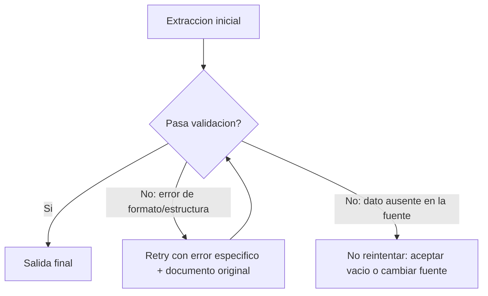
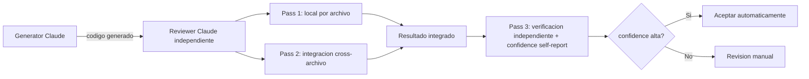

```yaml
---
bloque: 1
nombre: "Prompt Engineering y salida estructurada"
dominio_oficial: "D4"
peso_examen: 20
version: "1.0"
fecha: "2026-08-05"
guia_oficial_examen: "1.0"
task_statements: ["4.1", "4.2", "4.3", "4.4", "4.5", "4.6"]
fuentes:
  - {titulo: "Claude prompting best practices", url: "https://platform.claude.com/docs/en/build-with-claude/prompt-engineering/claude-prompting-best-practices", origen: "anthropic", tipo: "doc"}
  - {titulo: "Structured outputs", url: "https://platform.claude.com/docs/en/build-with-claude/structured-outputs", origen: "anthropic", tipo: "doc"}
  - {titulo: "Strict tool use", url: "https://platform.claude.com/docs/en/agents-and-tools/tool-use/strict-tool-use", origen: "anthropic", tipo: "doc"}
  - {titulo: "Batch processing (Message Batches API)", url: "https://platform.claude.com/docs/en/build-with-claude/batch-processing", origen: "anthropic", tipo: "doc"}
  - {titulo: "Define success criteria y evals", url: "https://platform.claude.com/docs/en/docs/test-and-evaluate/develop-tests", origen: "anthropic", tipo: "doc"}
  - {titulo: "Interactive Prompt Engineering Tutorial", url: "https://github.com/anthropics/prompt-eng-interactive-tutorial", origen: "anthropic", tipo: "tutorial"}
  - {titulo: "Claude Cookbooks (GitHub)", url: "https://github.com/anthropics/claude-cookbooks", origen: "anthropic", tipo: "repo"}
estado: aprobado
---
```

# Bloque 1 — Prompt Engineering y salida estructurada {#bloque-1}

Este bloque cubre el Dominio 4 del blueprint oficial, "Prompt Engineering & Structured Output" (20% del examen), el segundo dominio de mayor peso tras la arquitectura agéntica. El hilo conductor de los seis task statements es un mismo problema recurrente en los escenarios del examen: construir pipelines de extracción y revisión de código que produzcan salida fiable, consistente y auditable a partir de un modelo probabilístico. El bloque avanza en capas — criterios explícitos (4.1) y few-shot (4.2) atacan la calidad del *juicio* del modelo; tool use con JSON schemas (4.3) y validación/retry (4.4) atacan la *conformidad estructural* de la salida; batch processing (4.5) atacan la *economía* de ejecutarlo a escala; y multi-instancia/multi-pass (4.6) atacan la *fiabilidad* cuando una sola pasada no basta. El examen evalúa aquí sobre todo el juicio de diseño: qué mecanismo aplica a qué síntoma (falsos positivos, alucinación, inconsistencia de formato, coste, latencia) y por qué las soluciones puramente basadas en prompting fallan donde hace falta una garantía estructural o arquitectónica.

## Mapa del bloque

| Task statement | Sección | Conceptos clave |
|---|---|---|
| 4.1 | [4.1 Criterios explícitos para precisión](#ts-1-1) | criterios categóricos vs confianza, severidad con ejemplos, deshabilitar categorías de alto falso positivo |
| 4.2 | [4.2 Few-shot prompting](#ts-1-2) | 2-4 ejemplos dirigidos, tags `<example>`/`<examples>`, razonamiento explícito, reducción de alucinación |
| 4.3 | [4.3 Tool use y JSON schemas](#ts-1-3) | `strict: true`, `tool_choice` (`auto`/`any`/forzado), required vs optional, enum + "other" |
| 4.4 | [4.4 Validación, retry y feedback loops](#ts-1-4) | retry con error específico, límites del retry, `detected_pattern`, validación cruzada de campos |
| 4.5 | [4.5 Batch processing](#ts-1-5) | Message Batches API, `custom_id`, límites 100k/256MB, SLA por frecuencia de envío |
| 4.6 | [4.6 Multi-instancia y multi-pass review](#ts-1-6) | self-review vs revisor independiente, local pass vs integration pass, confidence routing, pasada de verificación independiente |

---

## 4.1 — Diseñar prompts con criterios explícitos para mejorar la precisión y reducir falsos positivos {#ts-1-1}

> *Task statement oficial:* «Design prompts with explicit criteria to improve precision and reduce false positives»

**Concepto.** El error de diseño más costoso en prompts de clasificación o revisión es apoyarse en instrucciones vagas del tipo "sé conservador" o "solo reporta hallazgos de alta confianza": el modelo no tiene una definición operativa de "confianza" o "conservador", así que la interpreta de forma arbitraria y la precisión no mejora frente a instrucciones genéricas. El problema real que resuelve este task statement es la confianza del desarrollador en la herramienta: una categoría con muchos falsos positivos socava la confianza incluso en categorías que sí son precisas, así que el diseño de criterios no es solo un ajuste de calidad sino una cuestión de adopción.

**Cómo funciona.** El enfoque que exige el examen es sustituir el filtrado basado en confianza por criterios categóricos explícitos: definir en el prompt, con lenguaje concreto, qué tipos de problema se reportan (bugs, seguridad) y cuáles se omiten (estilo menor, patrones locales del equipo). Para severidad, el patrón es dar ejemplos de código concretos por cada nivel (crítica, alta, media, baja), no solo una etiqueta textual, porque eso es lo que produce clasificación consistente entre ejecuciones. Cuando una categoría concreta tiene una tasa de falsos positivos alta, la mitigación táctica es deshabilitarla temporalmente mientras se refina su prompt, en lugar de dejarla activa erosionando confianza. La regla general de Claude prompting best practices — mostrar el prompt a un colega con contexto mínimo y comprobar si lo entendería — es el test de humo para detectar ambigüedad antes de desplegar.

```
Vago (no mejora precisión):
"Flag comments only when confidence is high."

Explícito (criterio categórico verificable):
"Flag a comment only when the claimed behavior contradicts the actual code behavior.
Do NOT flag: style preferences, comments that are imprecise but not contradictory,
comments about intent rather than mechanism."
```

```xml
<examples>
  <example>
    <input>commented_code = true, actual_behavior = true</input>
    <classification>NO REPORT</classification>
    <reason>El comentario describe con precisión el comportamiento actual</reason>
  </example>
  <example>
    <input>commented_code = "close file", actual_behavior = "delete file"</input>
    <classification>REPORT</classification>
    <reason>El comentario contradice el comportamiento real — crítico encontrar discrepancias</reason>
  </example>
</examples>
```

**Patrón correcto.** Escribir criterios de revisión que definan explícitamente qué se reporta frente a qué se omite, con ejemplos concretos de código por nivel de severidad, y usar tags `<example>`/`<examples>` para separar los ejemplos de las instrucciones —así el modelo no los confunde con parte del prompt—. Medir la tasa de falsos positivos por categoría y desactivar temporalmente las peores mientras se iteran sus criterios es la vía correcta para restaurar confianza sin perder cobertura en el resto.

**Anti-patrones.** Confiar en instrucciones de "conservadurismo" o umbrales de confianza sin definición operativa no resuelve la raíz: el modelo sigue sin un criterio verificable, y la precisión no mejora frente a la línea base. Intentar arreglarlo en post-procesamiento (filtrando resultados después de generarlos) tampoco ataca la causa: el criterio mal definido sigue produciendo el mismo ruido, solo que ahora se descarta a ciegas en lugar de nunca haberse generado.

**Trampas de examen.** El examen contrapone "confidence-based filtering" con "criterios categóricos específicos" como opciones textualmente parecidas pero con eficacia muy distinta: la respuesta correcta casi siempre es la segunda. Otro distractor típico presenta "deshabilitar la categoría para siempre" como solución, cuando la fuente especifica que es una medida *temporal* mientras se mejora el prompt.

**Fuentes.** exam-guide-oficial-v1.0.txt — Domain 4, TS 4.1 (líneas 501-517) · Claude prompting best practices — https://platform.claude.com/docs/en/build-with-claude/prompt-engineering/claude-prompting-best-practices

---

## 4.2 — Aplicar few-shot prompting para mejorar consistencia y calidad de la salida {#ts-1-2}

> *Task statement oficial:* «Apply few-shot prompting to improve output consistency and quality»

**Concepto.** Cuando instrucciones detalladas por sí solas producen resultados inconsistentemente formateados, los ejemplos few-shot son la técnica más efectiva para lograr salida consistente y accionable. El problema que resuelve va más allá del formato: los ejemplos bien elegidos enseñan al modelo a generalizar *juicio* — cómo manejar casos ambiguos o nuevos patrones — en lugar de limitarse a igualar los casos pre-especificados en el prompt.

**Cómo funciona.** El rango recomendado es de 2 a 4 ejemplos dirigidos para escenarios ambiguos (mostrando el razonamiento de por qué se eligió una acción sobre alternativas plausibles) y de 3 a 5 ejemplos cuando el objetivo es consistencia general de formato. Los ejemplos se envuelven en tags `<example>` (singular) o `<examples>` (plural) para separarlos claramente de las instrucciones. Cuatro usos concretos documentados: (1) fijar el formato exacto de salida (location, issue, severity, suggested_fix) cuando instrucciones solas producen JSON inconsistente; (2) demostrar el manejo de casos ambiguos, incluyendo el razonamiento explícito de por qué se descartó una alternativa; (3) distinguir patrones de código aceptables de problemas genuinos, mostrando ambos lados; (4) reducir alucinación en extracción, incluyendo ejemplos con estructuras de documento variadas (citas inline vs bibliografía) y ejemplos donde un campo está correctamente ausente (`null`) en vez de inventado.

```xml
<examples>
  <example>
    <input>var x = "hello"; console.log(x.toUpperCase())</input>
    <output_format>
      <location>line_5</location>
      <issue>potential_type_error</issue>
      <severity>medium</severity>
      <suggested_fix>ensure variable is string before calling method</suggested_fix>
    </output_format>
  </example>
  <example>
    <input>// undefined variable used
result = y + 5</input>
    <output_format>
      <location>line_2</location>
      <issue>undefined_variable</issue>
      <severity>high</severity>
      <suggested_fix>declare y with var/let/const before use</suggested_fix>
    </output_format>
  </example>
</examples>
```

**Patrón correcto.** Elegir pocos ejemplos (2-4) pero muy dirigidos al punto ambiguo real del dominio, incluyendo el razonamiento ("se selecciona `auth_validate` porque el contexto menciona permisos, no `load_user`"), en vez de ejemplos genéricos que no reflejan la distribución real de casos de producción. Para extracción, incluir siempre al menos un ejemplo con un campo correctamente vacío enseña la distinción entre "ausente" y "hay que inventarlo".

**Anti-patrones.** Ejemplos genéricos que no cubren la variabilidad real de los datos no generalizan: el modelo iguala el patrón superficial del ejemplo, no el criterio subyacente. Añadir más de 5 ejemplos sin ganancia de claridad infla el *context length* sin mejorar consistencia proporcionalmente. Dar ejemplos de solo input/output sin razonamiento explícito desaprovecha la capacidad de generalización a casos nuevos: el modelo aprende a copiar el patrón, no a decidir en zonas grises.

**Trampas de examen.** El examen distingue "más ejemplos siempre ayuda" (falso) de "pocos ejemplos bien dirigidos al caso ambiguo generalizan mejor" (correcto). También aparece como distractor omitir el razonamiento en los ejemplos como si el formato de salida por sí solo bastara para enseñar juicio en casos ambiguos.

**Fuentes.** exam-guide-oficial-v1.0.txt — Domain 4, TS 4.2 (líneas 518-542) · Claude prompting best practices — https://platform.claude.com/docs/en/build-with-claude/prompt-engineering/claude-prompting-best-practices

---

## 4.3 — Reforzar salida estructurada con tool use y JSON schemas {#ts-1-3}

> *Task statement oficial:* «Enforce structured output using tool use and JSON schemas»

**Concepto.** Cuando la salida debe conformar exactamente a un schema (para alimentar un pipeline downstream sin parseo frágil), tool use con JSON schemas es el enfoque más fiable: elimina por completo los errores de *sintaxis* JSON. Es crítico entender el límite exacto de esta garantía: strict tool use (`strict: true`) valida estructura y tipos mediante *grammar-constrained sampling* (muestreo restringido por gramática), pero no valida semántica — un line item que no suma al total, o un valor colocado en el campo equivocado, pasan el schema sin problema.

**Cómo funciona.** `tool_choice` tiene tres comportamientos relevantes aquí: `"auto"` permite al modelo devolver texto en vez de llamar a la tool (no garantiza tool use); `"any"` obliga a llamar a alguna tool pero deja elegir cuál, útil cuando hay varios schemas de extracción y el tipo de documento es desconocido; y la selección forzada (`{"type": "tool", "name": "extract_metadata"}`) asegura que una tool concreta corre antes de pasos de enriquecimiento posteriores. El diseño de campos es la palanca principal contra la alucinación: solo deben marcarse `required` los campos que existen siempre en los documentos de origen; el resto se deja opcional/nullable, para que el modelo no fabrique valores con tal de satisfacer el schema. Para categorías extensibles, el patrón es un `enum` con un valor `"other"` acompañado de un campo de detalle en string, y añadir valores como `"unclear"` para casos genuinamente ambiguos. Aunque el schema sea estricto, sigue haciendo falta normalización en el prompt para formatos de origen inconsistentes (por ejemplo, fechas en múltiples formatos que deben convertirse a `YYYY-MM-DD`).

```typescript
{
  name: "extract_data",
  description: "Extract structured data from document",
  strict: true,
  input_schema: {
    type: "object",
    properties: {
      title: { type: "string" },
      amount: { type: "number" },
      date: { type: "string", format: "date" },
      category: {
        type: "string",
        enum: ["positive", "negative", "neutral", "other"]
      },
      category_details: {
        type: "string",
        description: "Use when category is 'other'"
      }
    },
    required: ["title", "amount"],
    additionalProperties: false
  }
}
```

En strict mode están soportados los tipos básicos (`object`, `array`, `string`, `integer`, `number`, `boolean`, `null`), `enum`, `anyOf`, `allOf`, `$ref`/`definitions`, los formatos de string `date-time`, `date`, `email`, `uri`, `uuid`, `required` y `additionalProperties: false`. NO están soportados: schemas recursivos, restricciones numéricas (`minimum`/`maximum`), restricciones de string (`minLength`/`maxLength`) ni `additionalProperties: true`. Esta lista **no es exhaustiva** —entre otros keywords y formatos—; la referencia completa de lo soportado y no soportado en strict mode vive en la página oficial structured-outputs.

**Patrón correcto.** Usar `tool_choice: "any"` cuando el tipo de documento es incierto pero hay varios schemas candidatos; forzar una tool específica cuando el orden de ejecución es crítico (extracción antes de enriquecimiento); diseñar los campos opcionales por defecto y solo marcar `required` lo verdaderamente garantizado por el origen; y añadir siempre reglas de normalización de formato en el prompt incluso con schema estricto.

**Anti-patrones.** Marcar todos los campos como `required` fuerza al modelo a alucinar datos cuando el documento fuente está incompleto — el schema estricto no evita esto, lo garantiza. Confiar en `strict: true` sin reglas de normalización deja que fuentes con formatos variados no conformen al schema esperado en la práctica. El error conceptual más grave es confundir sintaxis con semántica: strict mode valida que el JSON tiene la forma correcta, no que los números cuadren o que el campo correcto lleve el valor correcto. Dejar `additionalProperties: true` en un contexto de strict mode contradice el propósito de un schema explícito.

**Trampas de examen.** El distractor central de este task statement es presentar `strict: true` como una garantía completa de calidad de extracción — el examen espera que se identifique que solo elimina errores de sintaxis, no semánticos. Otro distractor habitual contrapone `"auto"` (no garantiza tool use) con `"any"` (garantiza tool use, tool libre) y la selección forzada (garantiza tool use, tool fija).

**Fuentes.** exam-guide-oficial-v1.0.txt — Domain 4, TS 4.3 (líneas 543-569) · Strict tool use — https://platform.claude.com/docs/en/agents-and-tools/tool-use/strict-tool-use · Structured outputs — https://platform.claude.com/docs/en/build-with-claude/structured-outputs

---

## 4.4 — Implementar validación, reintentos y bucles de feedback {#ts-1-4}

> *Task statement oficial:* «Implement validation, retry, and feedback loops for extraction quality»

**Concepto.** Tool use elimina errores de sintaxis, pero no los semánticos (4.3); este task statement cubre el mecanismo que sí ataca esos errores: reintentar con feedback específico de qué falló. El matiz crítico es reconocer cuándo un retry puede funcionar (errores de formato o estructura) y cuándo es estructuralmente inútil (la información simplemente no está en el documento de origen).

**Cómo funciona.** El patrón de retry-con-error-feedback consiste en anexar al prompt de reintento los errores de validación exactos —no un mensaje genérico— para guiar al modelo hacia la corrección: incluir el documento original, la extracción fallida y los errores específicos detectados, de modo que el modelo tenga todo el contexto necesario para autocorregirse. Para habilitar análisis sistemático de por qué se descartan hallazgos, el diseño de campo `detected_pattern` etiqueta qué construcción de código disparó cada hallazgo, permitiendo correlacionar categorías con tasas de descarte. Para validación de datos inconsistentes en el origen, el patrón de auto-corrección extrae tanto `calculated_total` (derivado) como `stated_total` (declarado en el documento) y expone un booleano `conflict_detected` cuando no coinciden.

```
Prompt inicial: "Extract invoice data as JSON"
Respuesta: { "items": [...], "total": 1500 }  ← validación falla

Follow-up: "The extraction failed validation:
- Sum of item amounts ($1000) != stated total ($1500)
- Fix the discrepancy by re-examining the document.
Provide the corrected extraction."
```

```json
{
  "finding": "potential null pointer dereference",
  "location": "line 42",
  "detected_pattern": "variable_accessed_without_null_check",
  "confidence": 0.85
}
```

```json
{
  "stated_total": 1500,
  "calculated_total": 1000,
  "conflict_detected": true,
  "conflict_description": "Sum of items does not match stated total"
}
```

**Patrón correcto.** Reintentar siempre con el error de validación específico incluido en el prompt de follow-up, junto con el documento original y la extracción fallida completa. Antes de programar un bucle de retry, distinguir si el fallo es de formato/estructura (recuperable con retry) o de información ausente en la fuente (no recuperable: requiere cambiar de fuente o aceptar el vacío). Instrumentar `detected_pattern` desde el primer diseño del schema de hallazgos habilita, más adelante, un análisis sistemático de qué categorías generan más descartes por parte de los desarrolladores.

**Anti-patrones.** Reintentar con un mensaje genérico ("try again") no da al modelo información accionable sobre qué corregir, y el resultado suele repetir el mismo error. Reintentar cuando la información no existe en el documento fuente es un bucle sin salida: ningún número de reintentos generará un dato que no está ahí. No instrumentar `detected_pattern` desde el principio impide, más tarde, cualquier análisis de por qué ciertas categorías de hallazgo se descartan sistemáticamente.

**Trampas de examen.** El examen presenta escenarios donde el "arreglo" obvio es "reintentar más veces" cuando la causa real es información ausente en la fuente — la respuesta correcta reconoce el límite del retry, no lo fuerza. También se explota la distinción entre error semántico (el schema es válido pero los valores no cuadran) y error de sintaxis (ya eliminado por tool use), presentados como si fueran el mismo tipo de fallo.

**Fuentes.** exam-guide-oficial-v1.0.txt — Domain 4, TS 4.4 (líneas 570-589)

---

## 4.5 — Diseñar estrategias eficientes de batch processing {#ts-1-5}

> *Task statement oficial:* «Design efficient batch processing strategies»

**Concepto.** No todo procesamiento a escala necesita respuesta inmediata: cuando el workload es no bloqueante y tolera latencia (reportes overnight, auditorías semanales, generación nocturna de tests), la Message Batches API ofrece un 50% de ahorro de coste a cambio de una ventana de procesamiento de hasta 24 horas, sin SLA de latencia garantizado. La decisión de diseño central de este task statement es reconocer cuándo ese trade-off es aceptable y cuándo no.

**Cómo funciona.** Cada request de un batch lleva un `custom_id` que correlaciona la petición con su respuesta correspondiente — indispensable porque las respuestas no llegan necesariamente en el mismo orden ni de forma síncrona. El formato exigido es una cadena de 1 a 64 caracteres que cumpla el patrón `^[a-zA-Z0-9_-]{1,64}$` (letras, dígitos, guion y guion bajo); un `custom_id` que no cumpla ese patrón (por longitud o por caracteres no permitidos, p. ej. espacios o puntos) es un distractor de examen plausible presentado como request válida. El límite de un batch es 100.000 requests o 256 MB de tamaño total, lo que se alcance primero; la mayoría de los batches se completan en menos de una hora, con un máximo de 24 horas antes de expirar, y los resultados quedan accesibles durante 29 días. La limitación arquitectónica más importante: el batch API no soporta *multi-turn tool calling* dentro de una misma request — no se puede ejecutar una tool a mitad de proceso y devolver el resultado dentro del mismo request batcheado, porque cada request se procesa de forma independiente y sin estado compartido. Tampoco están soportados en batch: `stream: true`, `speed` (fast mode), `store`/`previous_thread_event_id` (threads), `cache_hint`/`context_hint`, ni `max_tokens: 0`.

```python
requests = [
    {
        "custom_id": "invoice-001",
        "params": {
            "model": "claude-opus-5",
            "max_tokens": 1024,
            "messages": [{"role": "user", "content": "Extract invoice data..."}]
        }
    },
    {
        "custom_id": "invoice-002",
        "params": {
            "model": "claude-opus-5",
            "max_tokens": 1024,
            "messages": [{"role": "user", "content": "Extract invoice data..."}]
        }
    }
]

batch = client.messages.batches.create(requests=requests)
```

**Patrón correcto.** Elegir la API síncrona para flujos bloqueantes (pre-merge checks, feedback en tiempo real) y reservar el batch para lo que puede esperar. Calcular la frecuencia de envío en función del SLA requerido: por ejemplo, para garantizar un SLA de 30 horas con un procesamiento batch de hasta 24 horas, hay que enviar lotes cada 4 horas. Ante fallos, reenviar solo los documentos fallidos identificados por su `custom_id`, con las modificaciones apropiadas (por ejemplo, *chunking* de documentos que excedieron el límite de contexto). Antes de lanzar un batch masivo, refinar el prompt sobre una muestra pequeña para maximizar la tasa de éxito en el primer intento y reducir reenvíos costosos.

**Anti-patrones.** Usar batch para un flujo que necesita respuesta en minutos es un error de diseño de fondo: el máximo de 24 horas hace el batch inadecuado para cualquier caso bloqueante. No usar `custom_id` para correlacionar hace imposible saber qué respuesta corresponde a qué request en un lote grande. Enviar 100.000 requests con un prompt no probado desperdicia coste y tiempo en fallos evitables. Esperar poder ejecutar tool calling multi-turno dentro de un batch ignora que cada request se procesa de forma completamente independiente, sin estado compartido entre pasos.

**Trampas de examen.** El examen suele plantear un escenario con un SLA numérico concreto (por ejemplo, "30 horas") y pedir la frecuencia de envío correcta dado el límite de 24 horas del batch — es un cálculo aritmético directo que hay que saber montar. También aparece como distractor la idea de que el batch API soporta tool calling completo igual que la API síncrona.

**Fuentes.** exam-guide-oficial-v1.0.txt — Domain 4, TS 4.5 (líneas 590-611) · Batch processing (Message Batches API) — https://platform.claude.com/docs/en/build-with-claude/batch-processing

---

## 4.6 — Diseñar arquitecturas de multi-instancia y multi-pass review {#ts-1-6}

> *Task statement oficial:* «Design multi-instance and multi-pass review architectures»

**Concepto.** Un modelo que acaba de generar código retiene en su contexto el razonamiento que usó para generarlo, lo que lo hace menos propenso a cuestionar sus propias decisiones si se le pide revisarlo en la misma sesión. Este task statement cubre el diseño arquitectónico que corrige esa limitación: separar generación y revisión en instancias independientes, y separar el volumen de revisión en pasadas con foco distinto para evitar diluir la atención del modelo.

**Cómo funciona.** Una instancia de Claude independiente —sin el contexto de razonamiento previo del generador— es más efectiva detectando problemas sutiles que las instrucciones de auto-revisión o el extended thinking dentro de la misma sesión. Para reviews de múltiples archivos, dividir el trabajo en *local analysis passes* (por archivo: problemas locales, patrones directos, sintaxis) y *cross-file integration passes* (análisis de flujo de datos entre archivos, dependencias, contradicciones) evita tanto la dilución de atención como los hallazgos contradictorios que aparecen cuando se intenta hacer ambos análisis a la vez. El *self-reporting* de confianza junto a cada hallazgo habilita *calibrated review routing*: los hallazgos de alta confianza se aceptan directamente y los de baja confianza se enrutan a revisión manual.

La guía oficial (TS 4.6, «running verification passes») describe una tercera variante arquitectónica, distinta de las instancias de extracción/split anteriores: una **pasada de verificación independiente**, ejecutada por una instancia separada *después* de que el resultado local y el de integración ya se han combinado. Su única función es revisar ese resultado ya integrado y reportar su propia confianza sobre si es correcto — no vuelve a analizar el código desde cero ni sustituye a las pasadas local/integration, sino que añade una comprobación final de extremo a extremo sobre el output ya ensamblado, con su propio *confidence self-report* independiente del de los hallazgos individuales.

```python
# Generator instance
generated_code = generator_claude.generate_code(prompt)

# Independent reviewer instance (different context, no knowledge of generator's reasoning)
review = reviewer_claude.review_code(
    code=generated_code,
    criteria=review_criteria
    # NO incluir razonamiento del generador
)
```

```python
# Pass 1: Local file analysis
local_findings = []
for file in files:
    findings = claude.analyze_file(
        file=file,
        focus="local issues, syntax, direct patterns"
    )
    findings = [{**f, "confidence": ...} for f in findings]
    local_findings.extend(findings)

# Pass 2: Integration analysis (cross-file)
integration_findings = claude.analyze_integration(
    files=files,
    local_findings=local_findings,
    focus="data flow, dependencies, contradictions"
)
```

**Patrón correcto.** Usar siempre una segunda instancia independiente —sin el razonamiento del generador— para revisar código generado, en lugar de pedirle a la misma instancia que se autoevalúe. Para código multi-archivo, dividir la revisión en pase local por archivo más un pase de integración cross-archivo. Instrumentar cada hallazgo con un campo de confianza propio del modelo para habilitar enrutamiento calibrado hacia revisión manual solo donde hace falta.

**Anti-patrones.** Pedir auto-revisión en la misma instancia que generó el código es menos efectivo por diseño: el modelo retiene su razonamiento previo y tiende a confirmarlo en vez de cuestionarlo. Hacer una única pasada sobre código multi-archivo intentando capturar a la vez problemas locales y de integración diluye la atención del modelo y produce hallazgos contradictorios entre sí. No rastrear confianza por hallazgo elimina la posibilidad de priorizar qué resultados necesitan validación manual, obligando a revisar todo con el mismo nivel de escrutinio.

**Trampas de examen.** El distractor más frecuente presenta "usar extended thinking para que el modelo se autocuestione más a fondo" como sustituto de una instancia independiente — la fuente es explícita en que ni las instrucciones de auto-revisión ni el extended thinking igualan la efectividad de un revisor sin el contexto de razonamiento del generador. También se explota la confusión entre dividir el trabajo por *volumen* (varios chunks del mismo tipo de análisis) frente a dividir por *tipo de análisis* (local vs integración), que es la distinción correcta que exige la fuente.

**Fuentes.** exam-guide-oficial-v1.0.txt — Domain 4, TS 4.6 (líneas 612-626)

---

## Tabla de decisión del dominio {#ts-1-decision}

| Situación | Elección correcta | Por qué |
|---|---|---|
| Reducir falsos positivos en clasificación/revisión | Criterios categóricos explícitos (qué reportar vs qué omitir) | Los umbrales de confianza o instrucciones vagas no dan al modelo un criterio operativo verificable |
| Salida inconsistente pese a instrucciones detalladas | Few-shot (2-4 ejemplos dirigidos, con razonamiento) | Los ejemplos generalizan juicio a casos nuevos mejor que más instrucción textual |
| Necesitas conformidad garantizada de schema | Tool use con `strict: true` | Elimina errores de sintaxis JSON mediante grammar-constrained sampling |
| Necesitas validar que los valores tienen sentido (no solo la forma) | Validación semántica + retry con error específico | `strict` no valida semántica; solo un chequeo explícito (p. ej. suma de campos) la detecta |
| Tipo de documento desconocido, varios schemas candidatos | `tool_choice: "any"` | Garantiza tool use dejando al modelo elegir el schema adecuado |
| Orden de ejecución crítico (extracción antes de enriquecimiento) | Tool forzada (`{"type": "tool", "name": "..."}`) | Garantiza que la tool concreta se ejecuta antes que los pasos siguientes |
| Campo puede estar ausente en el documento fuente | Campo opcional/nullable, nunca `required` | Marcarlo required fuerza al modelo a fabricar el valor |
| La extracción falla validación por formato/estructura | Retry con el error de validación específico incluido | El modelo puede corregir si sabe exactamente qué falló |
| La extracción falla porque el dato no existe en la fuente | No reintentar: cambiar de fuente o aceptar el vacío | Ningún número de reintentos genera un dato ausente en el origen |
| Workload tolera latencia (reportes overnight, auditorías) | Message Batches API | 50% de ahorro de coste a cambio de hasta 24h de ventana, sin SLA garantizado |
| Workload bloqueante (pre-merge checks, feedback en vivo) | API síncrona | El batch no garantiza latencia y puede tardar hasta 24h |
| Revisar código recién generado | Instancia independiente, sin el razonamiento del generador | El self-review retiene contexto de generación y cuestiona menos sus propias decisiones |
| Review de múltiples archivos | Pase local por archivo + pase de integración cross-archivo | Evita dilución de atención y hallazgos contradictorios de un pase único combinado |

## Diagramas



El diagrama muestra que un fallo de validación no dispara automáticamente un retry: solo los errores de formato o estructura se benefician del bucle de feedback; si la causa es información ausente en el documento fuente, el diseño correcto es salir del bucle y tratarlo como un vacío legítimo.



El diagrama muestra que la instancia revisora es independiente del generador (sin su contexto de razonamiento), que la revisión se divide en dos pasadas de foco distinto (local e integración) y que una tercera pasada de verificación independiente revisa el resultado ya integrado y aporta su propio confidence self-report antes de enrutar según confianza.

## Deuda conocida

<!-- HUECO: 4.1/4.4 — Implementación detallada de evals/graders. Las notas de entrada referencian "Define success criteria & evals" para métricas de precisión/falsos positivos, pero el material accesible cubre solo métodos genéricos de definición de criterios de éxito, sin notebooks o graders específicos para precisión de clasificación o tasas de falso positivo. -->
<!-- HUECO: 4.6 — Implementación práctica en Agent SDK. La guía oficial es breve en TS 4.6; el detalle de cómo instrumentar multi-instancia (subagentes independientes) y confidence routing con el Agent SDK concreto no está cubierto en las fuentes procesadas para este bloque — se espera que se resuelva en el Bloque 4 (Agent SDK). -->
<!-- HUECO: fuente en video "Prompting 101 — Code w/ Claude" no accesible (sin transcripción extraíble); no se ha incorporado contenido de esa fuente a este corpus. -->
