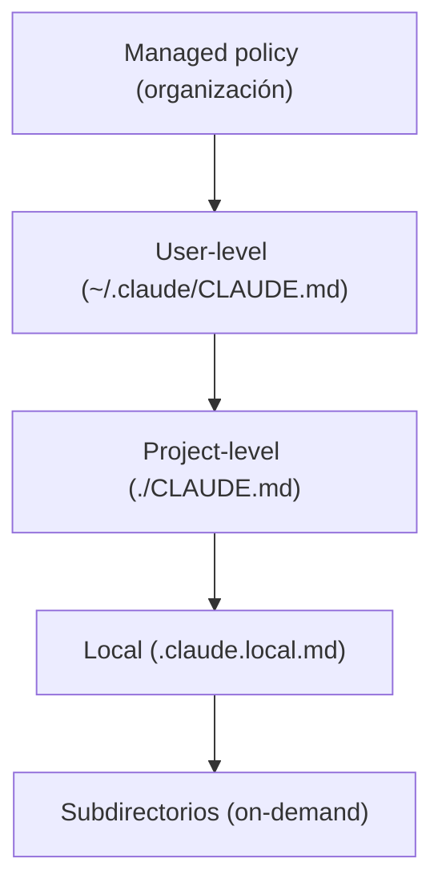
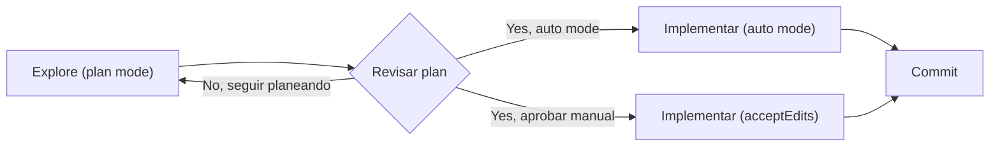

```yaml
---
bloque: 2
nombre: "Claude Code: configuración y flujos"
dominio_oficial: "D3"
peso_examen: 20
version: "1.0"
fecha: "2026-08-05"
guia_oficial_examen: "1.0"
task_statements: ["3.1", "3.2", "3.3", "3.4", "3.5", "3.6"]
fuentes:
  - {titulo: "Memory (CLAUDE.md)", url: "https://code.claude.com/docs/en/memory", origen: "anthropic", tipo: "doc"}
  - {titulo: "Extend Claude with skills", url: "https://code.claude.com/docs/en/skills", origen: "anthropic", tipo: "doc"}
  - {titulo: "Explore the .claude directory", url: "https://code.claude.com/docs/en/claude-directory", origen: "anthropic", tipo: "doc"}
  - {titulo: "Permission modes", url: "https://code.claude.com/docs/en/permission-modes", origen: "anthropic", tipo: "doc"}
  - {titulo: "Best practices", url: "https://code.claude.com/docs/en/best-practices", origen: "anthropic", tipo: "doc"}
  - {titulo: "Headless mode", url: "https://code.claude.com/docs/en/headless", origen: "anthropic", tipo: "doc"}
  - {titulo: "GitHub Actions", url: "https://code.claude.com/docs/en/github-actions", origen: "anthropic", tipo: "doc"}
  - {titulo: "GitHub Code Review", url: "https://code.claude.com/docs/en/code-review", origen: "anthropic", tipo: "doc"}
estado: aprobado
---
```

# Bloque 2 — Claude Code: configuración y flujos {#bloque-2}

Este bloque cubre el dominio oficial **D3 — Claude Code Configuration & Workflows** (20% del examen), el segundo en peso tras el dominio de arquitectura de agentes. A diferencia de los bloques que tratan la mecánica de la Messages API o el diseño de tools, aquí el objeto de examen es Claude Code como herramienta de desarrollo: cómo se configura su memoria persistente (`CLAUDE.md`), cómo se extiende con comandos y skills, cómo se acotan convenciones a subconjuntos de archivos, cuándo conviene planificar antes de ejecutar, cómo se refina iterativamente una solución, y cómo se integra en pipelines automatizados. El examen evalúa tanto conocimiento declarativo (sintaxis exacta de frontmatter, jerarquía de carga, flags de CLI) como criterio de aplicación (cuándo un mecanismo es preferible a otro ante un escenario concreto), por lo que cada sección de este corpus incluye tanto la mecánica exacta como las señales que distinguen la elección correcta de sus distractores.

## Mapa del bloque

| Task statement | Sección | Conceptos clave |
|---|---|---|
| 3.1 | Jerarquía y organización modular de CLAUDE.md | managed/user/project/local/subdirectory, `@import`, `.claude/rules/`, `/memory`, `/context`, límite de 200 líneas |
| 3.2 | Custom slash commands y skills | `.claude/commands/` vs `.claude/skills/`, frontmatter (`description`, `context: fork`, `allowed-tools`, `argument-hint`, `disable-model-invocation`), precedencia skill/command |
| 3.3 | Path-specific rules | `.claude/rules/` con frontmatter `paths:`, glob patterns, brace expansion, precedencia user/project |
| 3.4 | Plan mode vs ejecución directa | `Shift+Tab`, `--permission-mode plan`, Explore subagent, workflow Explore→Plan→Implement→Commit |
| 3.5 | Refinamiento iterativo | ejemplos concretos input/output, TDD iteration, interview pattern, evidencia vs aserciones, `/clear` |
| 3.6 | Claude Code en CI/CD | `-p`/`--print`, `--output-format json`, `--json-schema`, `--bare`, GitHub Actions, session isolation |

---

## 3.1 — Configuración de CLAUDE.md: jerarquía, scoping y organización modular {#ts-2-1}

> *Task statement oficial:* «Configure CLAUDE.md files with appropriate hierarchy, scoping, and modular organization»

**Concepto.** `CLAUDE.md` es un archivo markdown que Claude Code lee al inicio de cada sesión para obtener instrucciones persistentes: convenciones de código, comandos de build, decisiones arquitectónicas del proyecto. Existe para resolver el problema de repetir el mismo contexto sesión tras sesión; sin él, cada conversación empieza desde cero y Claude repite los mismos errores que ya se corrigieron antes.

**Cómo funciona.** La jerarquía de carga, de más general a más específico, es: managed policy (nivel organización, no excluible por configuración individual) → user-level (`~/.claude/CLAUDE.md`, personal, no se comparte por control de versiones) → project-level (`./CLAUDE.md` o `./.claude/CLAUDE.md`, compartido con el equipo vía version control) → local (`./.claude.local.md`, personal y específico del proyecto, pensado para `.gitignore`) → subdirectorios, que cargan **on-demand** cuando Claude lee archivos dentro de ellos, no al inicio de sesión. Los archivos no se sobrescriben entre sí: se **concatenan** en el contexto, y dentro del árbol de directorios los ficheros superiores se cargan antes que los inferiores, de modo que las instrucciones más cercanas al directorio de trabajo se leen en último lugar. El objetivo de tamaño es **menos de 200 líneas**: archivos más largos consumen más contexto y reducen la adherencia a las instrucciones. Para mantener modularidad sin monolitos, la sintaxis `@import` referencia archivos externos (p. ej. importar el fichero de estándares relevante para cada paquete de un monorepo) y admite `@import` recursivos (un archivo importado que a su vez importa otro), con una profundidad máxima de **4 saltos**; una referencia entre backticks (`` `@path` ``) se trata como texto literal y NO se importa. En monorepos, `claudeMdExcludes` permite excluir de la carga el `CLAUDE.md` de otros equipos. El comando `/memory` lista las ubicaciones de todos los archivos de memoria (user y project scope) y permite abrirlos y editarlos; `/context` muestra bajo **Memory files** cuáles realmente cargaron en la sesión activa, lo que sirve para diagnosticar por qué una instrucción no se está aplicando. Existe además la *auto memory*: notas que Claude escribe automáticamente a partir de correcciones y preferencias observadas, guardadas en `~/.claude/projects/<project>/memory/` y cargadas al inicio (primeras 200 líneas o 25 KB de `MEMORY.md`); está activa por defecto y se desactiva con el toggle de `/memory` o `autoMemoryEnabled: false` en settings.

```markdown
# ~/.claude/CLAUDE.md (user-level: personal, no se comparte)
## Preferences
- Use prettier for formatting
- Prefer TypeScript over JavaScript
```

```json
// .claude/settings.json — managed CLAUDE.md a nivel organización
{
  "claudeMd": "Always run `make lint` before committing.\nNever push directly to main."
}
```

```markdown
# Import de archivo externo (@import real, sin backticks)
@docs/testing-standards.md

# Esto NO se importa: se trata como texto literal
`@docs/testing-standards.md`
```

**Patrón correcto.** El comando `/init` analiza el codebase y genera un `CLAUDE.md` inicial con build commands, instrucciones de test y convenciones detectadas; si ya existe uno, sugiere mejoras en vez de sobrescribirlo. Se añade a `CLAUDE.md` cuando Claude comete el mismo error dos veces, cuando una code review atrapa algo que debería haber sabido, o cuando un nuevo miembro del equipo necesitaría ese contexto. Se documentan ahí comandos de build, convenciones de testing, reglas de estilo que difieren de los defaults, decisiones arquitectónicas específicas del proyecto y gotchas no obvios del entorno; se excluye lo que Claude puede inferir leyendo el código, las convenciones estándar del lenguaje, documentación de API detallada (mejor enlazarla) e información que cambia con frecuencia.

**Anti-patrones.** Superar las 200 líneas diluye la adherencia porque las instrucciones importantes se pierden en el ruido; la solución es modularizar con `@import` o mover contenido a `.claude/rules/`. Instrucciones contradictorias entre distintos `CLAUDE.md` del árbol fuerzan a Claude a elegir arbitrariamente entre ellas, de ahí la necesidad de revisión periódica. Instrucciones vagas ("format code nicely") se siguen de forma inconsistente frente a instrucciones concretas ("use 2-space indentation").

**Trampas de examen.** El examen construye escenarios de diagnóstico: un nuevo miembro del equipo no recibe ciertas instrucciones porque están en `~/.claude/CLAUDE.md` (user-level, personal) en vez de en el `CLAUDE.md` del proyecto (compartido vía control de versiones). Otra confusión explotada es tratar los archivos de subdirectorio como si cargaran siempre al inicio de sesión, cuando en realidad cargan on-demand al leer ficheros de esa carpeta. También se contrasta `@import` sin backticks (importación real) contra la misma sintaxis entre backticks (texto literal, sin efecto). Un distractor clásico es asumir que el contenido de `CLAUDE.md` forma parte del system prompt: en realidad se entrega como **mensaje de usuario posterior al system prompt**, por lo que no hay garantía de cumplimiento estricto —es guía de contexto, no configuración forzada—; para bloquear una acción con garantía hace falta un hook `PreToolUse`, no una instrucción en `CLAUDE.md`.

**Fuentes.** Memory (CLAUDE.md) — https://code.claude.com/docs/en/memory

---

## 3.2 — Custom slash commands y skills: frontmatter, scoping y precedencia {#ts-2-2}

> *Task statement oficial:* «Create and configure custom slash commands and skills»

**Concepto.** Los custom slash commands y las skills son, en la implementación actual, el mismo mecanismo: un archivo en `.claude/commands/deploy.md` y una skill en `.claude/skills/deploy/SKILL.md` crean ambos el comando `/deploy` y funcionan de forma idéntica. Existen para encapsular procedimientos repetibles —checklists, workflows multi-paso, conocimiento de referencia— que de otro modo habría que volver a explicar en cada sesión.

**Cómo funciona.** `SKILL.md` es el archivo de entrada obligatorio de cada directorio de skill; contiene YAML frontmatter más contenido markdown, y puede acompañarse de archivos adicionales opcionales (plantillas, ejemplos, scripts). A diferencia de `CLAUDE.md`, el cuerpo de una skill solo carga cuando se invoca o cuando Claude determina que es relevante para la tarea, de modo que referencias extensas no cuestan contexto hasta que se necesitan. El frontmatter admite varios campos: `description` (el texto que Claude lee para decidir cuándo auto-invocar la skill; se recomienda hacerla explícita porque mejora la precisión del matching, pero **no es requisito para la auto-invocación** — si se omite, Claude usa como respaldo el primer párrafo del cuerpo markdown de `SKILL.md`, de modo que la skill sigue siendo candidata a auto-invocarse, solo que con peor calidad de matching), `context: fork` (aísla la ejecución en un subagente con contexto separado, evitando que salidas verbosas contaminen la conversación principal), `allowed-tools` (string separado por comas/espacios o lista YAML que preaprueba herramientas para el turno de invocación; el permiso se limpia al enviar el siguiente mensaje), `disallowed-tools` (inverso de `allowed-tools`: veta explícitamente herramientas concretas durante la invocación), `argument-hint` (pista mostrada en autocompletado, p. ej. `[issue-number]` o `[filename] [format]`), `disable-model-invocation: true` (impide que Claude cargue la skill automáticamente —para workflows de disparo manual como `/deploy`— y además evita que se precargue en subagentes), y `user-invocable` (controla si la skill puede invocarse manualmente con `/nombre`; es el eje complementario a `disable-model-invocation`, que solo controla la invocación automática por el modelo). Los campos booleanos del frontmatter aceptan, además de `true`/`false`, los valores `yes`, `no`, `on`, `off`, `1`, `0` (sin distinguir mayúsculas/minúsculas). El scoping es paralelo al de `CLAUDE.md`: `.claude/commands/` y `.claude/skills/` a nivel de proyecto se comparten vía control de versiones; `~/.claude/commands/` y `~/.claude/skills/` a nivel de usuario son personales. El directorio `.claude/skills/` admite symlinks a directorios en otra ubicación del disco, útil para compartir un conjunto de reglas entre proyectos.

```markdown
# .claude/skills/summarize-changes/SKILL.md
---
description: Summarizes uncommitted changes and flags risky patterns. Use when asking about changes.
---

## Current changes
!`git diff HEAD`

Summarize above in 2-3 bullets. List risks: missing error handling, hardcoded values, untested changes.
```

```yaml
---
name: my-skill
description: What this skill does
disable-model-invocation: true
allowed-tools: "Read,Grep"
argument-hint: "[issue-number]"
context: fork
---
```

```markdown
# .claude/commands/fix-issue.md (alternativa de comando en archivo único)
Fix the GitHub issue: $ARGUMENTS
1. Use `gh issue view` to get details
2. Search codebase for relevant files
3. Implement necessary changes
4. Write and run tests
5. Create commit and push
```

**Patrón correcto.** Se crea una skill cuando se repite pegando las mismas instrucciones, checklist o procedimiento multi-paso, o cuando una sección de `CLAUDE.md` ha crecido hasta convertirse en un procedimiento en vez de un hecho. Las skills de contenido de referencia (convenciones, patrones, guías de estilo) corren inline para que Claude las use con el contexto actual; las skills de contenido de tarea (deployments, commits, generación de código paso a paso) suelen marcarse `disable-model-invocation: true` para disparo manual. `context: fork` se reserva para skills que producen salida verbosa (análisis de codebase) o exploratoria (brainstorming de alternativas); `allowed-tools` restringe el acceso durante la ejecución —por ejemplo, limitar a `Read`/`Grep` en skills de análisis de solo lectura, sin `Write`/`Bash`—. Para personalizar sin afectar al equipo, se crean variantes personales en `~/.claude/skills/` con nombres distintos a los del proyecto. La elección entre skill (invocación on-demand para workflows específicos de tarea) y `CLAUDE.md` (estándares universales siempre cargados) depende de si la instrucción aplica a todo el trabajo o solo a una tarea puntual.

**Anti-patrones.** El campo `name` en una skill personal solo cambia la etiqueta que se muestra, no el comando invocado: el comando sigue determinado por el nombre del directorio o archivo, y para cambiarlo hay que renombrar esa carpeta o fichero. Si existen una skill y un comando con el mismo nombre, la skill tiene precedencia. Omitir `description` no desactiva la auto-invocación: Claude recurre al primer párrafo del markdown como descripción de respaldo, aunque con peor calidad de matching que una `description` explícita bien redactada.

**Trampas de examen.** El examen distingue entre configurar `allowed-tools` para restringir acceso (p. ej. limitar a operaciones de escritura de archivo para prevenir acciones destructivas) frente a `disable-model-invocation` para prevenir invocación automática: son mecanismos distintos con propósitos distintos (restricción de herramientas vs control de disparo). También aparece como distractor la idea de que renombrar el campo `name` cambia el comando invocable, cuando en realidad solo afecta la etiqueta mostrada. Otro distractor clásico es asumir que omitir `description` desactiva la auto-invocación de la skill: en realidad sigue siendo candidata, solo que con peor matching (fallback al primer párrafo del cuerpo). También se confunde `disallowed-tools` con `allowed-tools` (uno permite explícitamente, el otro veta) y `user-invocable` con `disable-model-invocation` (uno rige la invocación manual, el otro la automática).

**Fuentes.** Extend Claude with skills — https://code.claude.com/docs/en/skills · Explore the .claude directory — https://code.claude.com/docs/en/claude-directory

---

## 3.3 — Path-specific rules: glob patterns y carga condicional en .claude/rules/ {#ts-2-3}

> *Task statement oficial:* «Apply path-specific rules for conditional convention loading»

**Concepto.** El directorio `.claude/rules/` organiza instrucciones en archivos markdown por tema, con descubrimiento recursivo de subdirectorios. Resuelve un problema distinto al de `CLAUDE.md` monolítico: aplicar una convención a archivos de un mismo tipo dispersos por todo el codebase (todos los ficheros de test, por ejemplo) sin tener que replicar un `CLAUDE.md` en cada directorio donde aparezcan.

**Cómo funciona.** Una rule sin frontmatter `paths:` carga al inicio de sesión igual que `.claude/CLAUDE.md`; una rule con `paths:` carga **on-demand**, solo cuando Claude lee un archivo que matchea alguno de los glob patterns declarados, lo que reduce contexto irrelevante y uso de tokens. Los patrones siguen sintaxis glob estándar: `**/*.ts` matchea archivos TypeScript en cualquier directorio, `src/**/*` matchea todo dentro de `src/`, `*.md` matchea solo en la raíz, y `src/components/*.tsx` es específico de una carpeta. Un mismo campo `paths` admite múltiples patrones y brace expansion (`src/**/*.{ts,tsx}`) para cubrir varias extensiones a la vez; existe un presupuesto compartido de **1.000 patrones expandidos y 4 MiB por rule** para los patrones con llaves (los patrones sin llaves no cuentan contra ese límite). El carácter `[` se interpreta como apertura de bracket expression (p. ej. `[abc]`); para un `[` literal hay que escaparlo como `\[`, porque un patrón con bracket inválido (como `photos [2024/**`) no genera error pero no matchea nada. Las rules a nivel de usuario (`~/.claude/rules/`) aplican a todos los proyectos de la máquina y cargan **antes** que las rules de proyecto, con lo que estas últimas tienen mayor precedencia. `.claude/rules/` también admite symlinks —incluida la detección segura de symlinks circulares— y los cambios en el directorio se recogen en caliente dentro de la sesión activa, sin reinicio, siempre que el directorio ya existiera al comenzar la sesión.

```markdown
---
paths:
  - "**/*.test.ts"
  - "**/*.test.tsx"
---

# Testing Rules
- Use descriptive test names: "should [expected] when [condition]"
- Mock external dependencies, not internal modules
- Clean up side effects in afterEach
```

```yaml
---
paths:
  - "src/**/*.{ts,tsx}"
  - "lib/**/*.ts"
  - "tests/**/*.test.ts"
---
```

**Patrón correcto.** Se recurre a `.claude/rules/` cuando `CLAUDE.md` se acerca a las 200 líneas, dividiendo el contenido en archivos enfocados por tema (`testing.md`, `api-conventions.md`, `deployment.md`). Las path-scoped rules son la elección correcta frente a un `CLAUDE.md` de subdirectorio cuando la convención debe aplicarse a archivos por tipo independientemente de su ubicación en el árbol —por ejemplo, `**/*.test.tsx` para todos los archivos de test, estén donde estén—. Compartir rules entre proyectos se resuelve con symlinks: `ln -s ~/shared-claude-rules .claude/rules/shared` o enlazando un fichero suelto como `ln -s ~/company-standards/security.md .claude/rules/security.md`.

**Anti-patrones.** Un `paths` con demasiados grupos de llaves que expanden por encima de 1.000 patrones o 4 MiB hace que la búsqueda use el patrón sin expandir, con lo que no matchea nada: conviene mantener acotados los grupos de brace expansion. Una bracket expression inválida (un `[` sin cierre o grupo válido) hace que ese patrón concreto no matchee nada, pero el resto de la rule sigue siendo válido; la solución es escapar el `[` literal.

**Trampas de examen.** El examen contrasta la ventaja de las path-scoped rules sobre los `CLAUDE.md` de subdirectorio precisamente quando la convención abarca múltiples directorios (tests dispersos por todo el codebase): en ese escenario, replicar `CLAUDE.md` por carpeta es inferior a una sola rule con glob. También se explota la precedencia: rules de usuario cargan antes, por lo que las de proyecto prevalecen ante un conflicto. Como con `CLAUDE.md`, las rules de `.claude/rules/` son guía no vinculante —contexto que Claude puede no seguir al pie de la letra—, no configuración que fuerce un comportamiento; el único mecanismo que garantiza bloquear una acción es un hook `PreToolUse`.

**Fuentes.** Memory (CLAUDE.md) — https://code.claude.com/docs/en/memory

---

## 3.4 — Plan mode vs ejecución directa: cuándo explorar antes de ejecutar {#ts-2-4}

> *Task statement oficial:* «Determine when to use plan mode vs direct execution»

**Concepto.** Plan mode existe para separar la fase de exploración y diseño de la fase de cambio efectivo del código, permitiendo investigar el codebase, evaluar enfoques y comprometerse a una arquitectura antes de que se produzca ninguna modificación. Resuelve el riesgo de reescritura costosa cuando una tarea admite varios enfoques válidos y el primero elegido resulta equivocado.

**Cómo funciona.** Plan mode está pensado para tareas complejas: cambios a gran escala, múltiples enfoques válidos, decisiones arquitectónicas, modificaciones multi-archivo. La ejecución directa es apropiada para cambios simples y bien acotados (por ejemplo, añadir una única validación a una función). Se activa pulsando `Shift+Tab` hasta que la barra de estado muestre `⏸ plan mode on` (el ciclo recorre default → acceptEdits → plan), arrancando la sesión con `claude --permission-mode plan`, o prefijando un prompt con `/plan` dentro de una sesión normal. En plan mode, Claude lee archivos y responde preguntas sin aplicar cambios; las ediciones quedan bloqueadas hasta que el plan se aprueba. Cuando el auto mode está disponible y `useAutoModeDuringPlan` está activo (valor por defecto), un clasificador revisa los comandos de shell durante la planificación en vez de solicitar aprobación explícita; si el auto mode no está disponible, los comandos que caen fuera del conjunto de solo lectura integrado sí solicitan aprobación. Al terminar de planificar, Claude presenta el plan y pregunta cómo proceder, con tres opciones: aprobar y usar auto mode, aprobar y aplicar ediciones manualmente, o seguir planificando. `Ctrl+G` abre el plan propuesto en el editor por defecto para modificarlo directamente antes de que Claude continúe. El **Explore subagent** aísla las fases de descubrimiento verboso en un contexto separado y devuelve solo resúmenes, preservando el contexto de la conversación principal durante tareas multi-fase.

```bash
# Arrancar directamente en plan mode
claude --permission-mode plan
```

```bash
# Activar plan mode dentro de una sesión con /plan
/plan
```

```bash
# Cambiar de modo dentro de sesión: Shift+Tab recorre default → acceptEdits → plan
Shift+Tab
```

**Patrón correcto.** El workflow recomendado es Explore → Plan → Implement → Commit: la fase Explore ocurre en plan mode, el plan se aprueba, y luego se cambia a modo default, acceptEdits o auto para la implementación. Plan mode es la elección para tareas con implicación arquitectónica —reestructuración de microservicios, migraciones de librería que afectan a 45 o más archivos, elección entre enfoques de integración con requisitos de infraestructura distintos—, mientras que la ejecución directa se reserva para cambios bien entendidos y de alcance claro, como un bug fix de un solo archivo con stack trace evidente o añadir una condición de validación de fecha. Para tareas cortas, la recomendación explícita es saltarse el plan: "si puedes describir el diff en una frase, sáltate el plan". Delegar investigación con subagentes ("usa subagentes para investigar X") mantiene la conversación principal limpia de exploración verbosa.

**Anti-patrones.** Saltar directamente a escribir código sin exploración ni planificación puede producir una solución que resuelve el problema equivocado. En el extremo opuesto, planificar sistemáticamente incluso ediciones triviales de un solo archivo introduce overhead innecesario y ralentiza el flujo de trabajo.

**Trampas de examen.** El examen usa umbrales concretos como señal de complejidad arquitectónica ("migraciones afectando 45+ archivos", "múltiples enfoques válidos con requisitos de infraestructura distintos") para distinguir plan mode de ejecución directa, frente a descriptores de baja complejidad ("bug fix de un solo archivo", "añadir una condición"). También se explota la combinación válida de ambos modos: planificar la investigación de una migración y luego ejecutar el enfoque aprobado en modo directo, en vez de tratarlos como mutuamente excluyentes.

**Fuentes.** Permission modes — https://code.claude.com/docs/en/permission-modes · Best practices — https://code.claude.com/docs/en/best-practices

---

## 3.5 — Refinamiento iterativo: ejemplos concretos, TDD, interview pattern y verificación {#ts-2-5}

> *Task statement oficial:* «Apply iterative refinement techniques for progressive improvement»

**Concepto.** Cuando una descripción en prosa se interpreta de forma inconsistente, existen técnicas concretas para converger más rápido hacia el resultado esperado en vez de iterar a ciegas con correcciones sucesivas. Estas técnicas existen porque el coste de una mala especificación inicial —sesiones largas acumulando correcciones fallidas— suele superar el coste de invertir tiempo en clarificar antes de implementar.

**Cómo funciona.** Los ejemplos concretos de entrada/salida son la forma más efectiva de comunicar transformaciones esperadas cuando la descripción en prosa se interpreta de forma inconsistente. La iteración dirigida por tests (*test-driven iteration*) consiste en escribir primero la suite de tests que cubre comportamiento esperado, casos límite y requisitos de rendimiento, y luego iterar compartiendo los fallos de test para guiar la mejora progresiva. El *interview pattern* consiste en pedir a Claude que haga preguntas para sacar a la luz consideraciones que el desarrollador no había anticipado, antes de implementar, especialmente útil en dominios poco familiares (estrategias de invalidación de caché, modos de fallo). Sobre cuándo agrupar correcciones: los problemas que interactúan entre sí se comunican en un único mensaje detallado, mientras que los problemas independientes se corrigen de forma secuencial. Dar a Claude evidencia (salida de tests, resultado de un comando, una captura de pantalla) en vez de solo aserciones es más rápido de revisar que volver a ejecutar la verificación uno mismo, y es lo que distingue una sesión supervisada de una desatendida. El contexto se llena rápido: si Claude corrige el mismo problema más de dos veces en una sesión, el contexto queda contaminado de enfoques fallidos; la recomendación es entonces `/clear` y escribir un prompt inicial mejor que incorpore lo aprendido, porque una sesión larga con correcciones acumuladas suele rendir peor que una sesión limpia con mejor prompt. Aportar contenido rico —referenciar archivos con `@`, pegar imágenes, dar URLs, canalizar datos— deja que Claude obtenga por sí mismo lo que necesita vía Bash, MCP o Read. `Esc` interrumpe a Claude a mitad de acción; `Esc` dos veces o `/rewind` abre el menú de rebobinado.

```text
Concrete input/output example pattern:

"write a validateEmail function.
example test cases:
- user@example.com → true
- invalid@.com → false
- user@test.co.uk → true

run tests after implementing"
```

```text
Interview pattern prompt:

"I want to build [feature]. Interview me in detail using AskUserQuestion.

Ask about technical implementation, UI/UX, edge cases, concerns, tradeoffs.

Keep interviewing until we've covered everything, then write spec to SPEC.md"
```

**Patrón correcto.** Proporcionar 2-3 ejemplos concretos de entrada/salida clarifica los requisitos de transformación cuando la descripción en lenguaje natural produce resultados inconsistentes. Escribir la suite de tests antes de implementar, cubriendo comportamiento esperado, casos límite y rendimiento, y luego iterar compartiendo los fallos. Usar el interview pattern para sacar a la luz consideraciones de diseño antes de implementar en dominios poco familiares. Corregir el rumbo tan pronto se detecta una desviación: los bucles de feedback ajustados producen mejores soluciones más rápido. Separar la sesión de escritura de la especificación de la sesión de implementación elimina el sesgo de contexto acumulado.

**Anti-patrones.** Un prompt vago ("add tests for foo.py") frente a uno específico ("write a test for foo.py covering the edge case when the user is logged out, avoid mocks") produce más correcciones necesarias en el primer caso. Un `CLAUDE.md` sobrecargado hace que, aunque la regla esté escrita, se pierda entre el ruido y Claude no la siga; la solución es podar sin piedad. Una especificación sobre-detallada que no deja margen de interpretación puede llevar a una implementación sub-diseñada, mientras que especificaciones poco detalladas requieren más bucles de refinamiento.

**Trampas de examen.** El examen distingue el criterio para decidir entre un único mensaje con todos los problemas (cuando interactúan entre sí) y la corrección secuencial (cuando son independientes): tratar problemas independientes en un solo mensaje o problemas interdependientes de forma secuencial es el error que se penaliza. También se contrasta dar "evidencia" (salida verificable) frente a dar solo una "aserción" de que algo funciona, como criterio de fiabilidad de una sesión no supervisada. Otra confusión habitual es `/clear` frente a `/compact`: `/clear` borra el contexto por completo (la sesión empieza de cero), mientras que `/compact` lo resume conservando lo esencial; son la opción correcta en escenarios distintos —`/clear` cuando el contexto está contaminado de enfoques fallidos, `/compact` cuando solo hace falta liberar espacio sin perder el hilo de la tarea—.

**Fuentes.** Best practices — https://code.claude.com/docs/en/best-practices

---

## 3.6 — Integración de Claude Code en pipelines CI/CD {#ts-2-6}

> *Task statement oficial:* «Integrate Claude Code into CI/CD pipelines»

**Concepto.** Claude Code puede ejecutarse en modo no interactivo dentro de pipelines automatizados, lo que permite usarlo como linter, revisor de código o generador de tests dentro de CI/CD. Este modo existe porque un pipeline no puede esperar entrada interactiva del usuario ni interpretar salida en prosa libre: necesita ejecución determinista, con código de salida verificable y, cuando aplica, salida estructurada parseable por máquina.

**Cómo funciona.** El flag `-p` (o `--print`) ejecuta Claude Code en modo no interactivo, previniendo que el pipeline se quede colgado esperando entrada. El flag `--output-format json` devuelve un JSON estructurado con el resultado, el ID de sesión y metadatos, incluyendo `total_cost_usd` y un desglose de coste por modelo para llevar seguimiento de gasto. El flag `--json-schema` fuerza que la salida cumpla un JSON Schema dado; la respuesta incluye los metadatos habituales más el campo `structured_output`, conforme al schema. `CLAUDE.md` sirve como mecanismo para dar contexto de proyecto (estándares de testing, convenciones de fixtures, criterios de revisión) al Claude Code invocado desde CI. El aislamiento de contexto de sesión es un principio clave: la misma sesión de Claude que generó el código es menos efectiva revisando sus propios cambios que una instancia de revisión independiente. Al re-ejecutar revisiones tras nuevos commits, conviene incluir los hallazgos de revisiones previas en el contexto e instruir a Claude para que reporte solo issues nuevos o aún no resueltos, evitando comentarios duplicados; de forma análoga, aportar los archivos de test existentes evita que la generación de tests sugiera escenarios ya cubiertos. El modo `--bare` reduce el tiempo de arranque saltando el auto-descubrimiento de hooks, skills, plugins, servidores MCP, auto memory y `CLAUDE.md`, útil en CI donde importa la consistencia de resultados; en modo bare no se leen credenciales OAuth ni el keychain del sistema, así que para la API de Anthropic hay que fijar `ANTHROPIC_API_KEY` en el entorno. Claude Code sale con código 0 en éxito y no-cero en fallo, permitiendo que los scripts ramifiquen según el estado de salida. La entrada por stdin está limitada a 10 MB; si se excede, Claude termina con error y estado no-cero, y para entradas mayores conviene escribir el contenido a un archivo y referenciarlo en el prompt. Para GitHub, el comando `/install-github-app` desde el terminal de Claude Code instala interactivamente la integración (instalación de la GitHub App, secreto de API key, selección de workflow). El workflow básico `@claude` se dispara con los eventos `issue_comment` y `pull_request_review_comment`, es decir, responde cuando alguien menciona `@claude` en un comentario de PR o issue; los triggers `pull_request: [opened, synchronize]` e `issues: [opened, assigned]` no son parte de ese workflow básico, sino de variantes de ejemplo (workflows con skills/plugin, o las variantes de despliegue en Bedrock/GCP) que sí reaccionan a la apertura o sincronización de un PR o a la apertura/asignación de un issue sin necesidad de mención explícita. Distinta de ambas es la funcionalidad **GitHub Code Review**, que provee revisión automática de PRs sin mención `@claude`, como capacidad propia de la integración. El parámetro `claude_args` de la Action acepta argumentos de CLI adicionales (p. ej. `--max-turns 5`, `--model claude-sonnet-5`). Un workflow puede invocar una skill con `/skill-name` en el prompt; para skills del proyecto en `.claude/skills/`, es necesario ejecutar `actions/checkout` antes del paso de la acción.

```bash
# Modo no interactivo básico
claude -p "Find and fix the bug in auth.py"
```

```bash
# Con herramientas pre-aprobadas
claude -p "Run the test suite and fix any failures" \
  --allowedTools "Bash,Read,Edit"
```

```bash
# Salida JSON estructurada
claude -p "Summarize this project" --output-format json
```

```bash
# JSON Schema para salida estructurada estricta
claude -p "Extract the main function names from auth.py" \
  --output-format json \
  --json-schema '{"type":"object","properties":{"functions":{"type":"array","items":{"type":"string"}}},"required":["functions"]}'
```

```bash
# Modo bare: sin auto-discovery
claude --bare -p "Summarize README.md" --allowedTools "Read"
```

```bash
# Canalizar datos vía stdin
cat build-error.txt | claude -p 'concisely explain the root cause' > output.txt
```

```yaml
# GitHub Actions — workflow v1.0 (GA)
- uses: anthropics/claude-code-action@v1
  with:
    anthropic_api_key: ${{ secrets.ANTHROPIC_API_KEY }}
    prompt: "Review this PR for security issues"
    claude_args: |
      --append-system-prompt "Follow our coding standards"
      --max-turns 10
      --model claude-sonnet-5
```

```bash
# Continuar una conversación entre invocaciones
session_id=$(claude -p "Start a review" --output-format json | jq -r '.session_id')
claude -p "Continue that review" --resume "$session_id"
```

**Patrón correcto.** Ejecutar Claude en CI con `-p` previene bloqueos por entrada interactiva. Combinar `--output-format json` con `--json-schema` produce hallazgos parseables por máquina para publicar automáticamente como comentarios inline en PRs. Un patrón habitual es envolver la llamada no interactiva en un script para usar Claude como linter o revisor específico del proyecto: `"lint:claude": "git diff main | claude -p \"you are typo linter. report filename:line and issue.\""`. Otro patrón es la auditoría de seguridad: canalizar un diff a Claude pidiendo una revisión de inyección, autenticación y secretos hardcodeados. Documentar en `CLAUDE.md` los estándares de testing, criterios de valor de un test y los fixtures disponibles mejora la calidad de la generación de tests y reduce la salida de bajo valor.

**Anti-patrones.** Usar la misma sesión de Claude para generar código y revisarlo sesga el contexto hacia la propia implementación; una instancia de revisión independiente da mejores resultados. Olvidar aportar el contexto de tests existentes hace que Claude genere escenarios de test duplicados, desperdiciando tokens. Sub-documentar estándares en `CLAUDE.md` empobrece la calidad de la generación de tests por falta de contexto sobre fixtures y criterios. No gestionar el código de salida en los scripts impide ramificar sobre el fallo: siempre hay que capturar `$?` tras una llamada no interactiva.

**Trampas de examen.** El examen distingue `-p`/`--print` (modo no interactivo, evita cuelgues) de `--bare` (salta auto-discovery de hooks/skills/plugins/MCP/CLAUDE.md/auto memory, además de no leer credenciales OAuth): son flags combinables mas no intercambiables. También contrasta `--output-format json` (metadatos estructurados incluyendo coste) con `--json-schema` (fuerza conformidad estricta de la salida con un schema dado, en el campo `structured_output`). Otra trampa habitual: presentar la revisión con la misma sesión que generó el código como equivalente a una revisión independiente, cuando el examen la documenta explícitamente como menos efectiva.

**Fuentes.** Headless mode — https://code.claude.com/docs/en/headless · GitHub Actions — https://code.claude.com/docs/en/github-actions · GitHub Code Review — https://code.claude.com/docs/en/code-review

---

## Tabla de decisión del dominio {#ts-2-decision}

| Situación | Elección correcta | Por qué |
|---|---|---|
| `CLAUDE.md` se acerca a 200 líneas | Modularizar con `@import` o mover a `.claude/rules/` | Archivos largos reducen adherencia; el contenido se pierde en el ruido |
| Instrucción personal que no debe llegar al equipo | `~/.claude/CLAUDE.md` o `~/.claude/skills/` (user-level) | No se comparte vía control de versiones; permanece local a ese usuario |
| Convención que debe llegar a todo el equipo | `./CLAUDE.md` o `.claude/skills/` en el proyecto | Se versiona junto al código y se sincroniza para todos |
| Convención por tipo de archivo dispersa en el árbol (p. ej. todos los tests) | Path-scoped rule en `.claude/rules/` con `paths:` | Aplica por glob independientemente del directorio, sin replicar `CLAUDE.md` por carpeta |
| Skill y comando con el mismo nombre coexisten | La skill tiene precedencia | Comportamiento documentado del resolutor de comandos |
| Skill produce salida verbosa o exploratoria | `context: fork` | Aísla el output en un subagente sin contaminar la conversación principal |
| Tarea con implicación arquitectónica (multi-archivo, varios enfoques válidos) | Plan mode antes de ejecutar | Permite explorar y diseñar sin comprometerse a cambios, evitando rework costoso |
| Cambio simple y bien acotado (bug fix de un archivo, condición puntual) | Ejecución directa | El overhead de planificar no aporta valor cuando el diff es evidente |
| Problemas de una revisión que interactúan entre sí | Corregirlos en un único mensaje detallado | Corregir uno sin considerar el otro puede producir soluciones incompatibles |
| Problemas independientes entre sí | Corrección secuencial | Aislar cada corrección evita mezclar contexto de fallos no relacionados |
| Revisar código recién generado por Claude en CI | Instancia de revisión independiente, no la misma sesión | La misma sesión revisa con sesgo hacia su propia implementación |
| Ejecutar Claude Code en un pipeline automatizado | `-p`/`--print`, y `--bare` si se necesita arranque rápido y consistente | `-p` evita cuelgues por entrada interactiva; `--bare` salta auto-discovery no determinista |

## Diagramas



El diagrama muestra el orden de carga de `CLAUDE.md`, de más general a más específico; los archivos se concatenan en el contexto (no se sobrescriben) y los subdirectorios solo cargan cuando Claude lee archivos dentro de ellos.



El diagrama muestra el workflow Explore → Plan → Implement → Commit: la fase de plan mode no aplica cambios hasta que el plan se aprueba explícitamente, con tres desenlaces posibles tras la revisión.

## Deuda conocida

<!-- HUECO: 3.1 — @import en archivos de .claude/rules/. La documentación menciona @import solo en el contexto de CLAUDE.md; no hay evidencia literal de que la misma sintaxis funcione dentro de archivos de .claude/rules/. -->
<!-- HUECO: 3.2 — Campo disallowed-tools en frontmatter de skills. La documentación lo menciona de forma limitada; falta precisar su interacción exacta con allowed-tools y con el sistema de permisos denegados. -->
<!-- HUECO: 3.4 — Implementación exacta del Explore subagent. Las fuentes confirman su función (aislar descubrimiento verboso, devolver resúmenes) pero no detallan si es un mecanismo built-in invocado automáticamente o si requiere configuración explícita por parte del usuario. -->

Quedan fuera deliberadamente por no aportar valor de examen o exceder el alcance verificado de este corpus: los niveles enterprise de skills y la precedencia enterprise > personal > project, las skills anidadas con nombre cualificado, `skillOverrides`, los campos avanzados de frontmatter (`paths`, `model`, `effort`, `background`, `agent`, `shell`, `arguments`), y la condición `/goal` combinada con un Stop hook como verification gate.