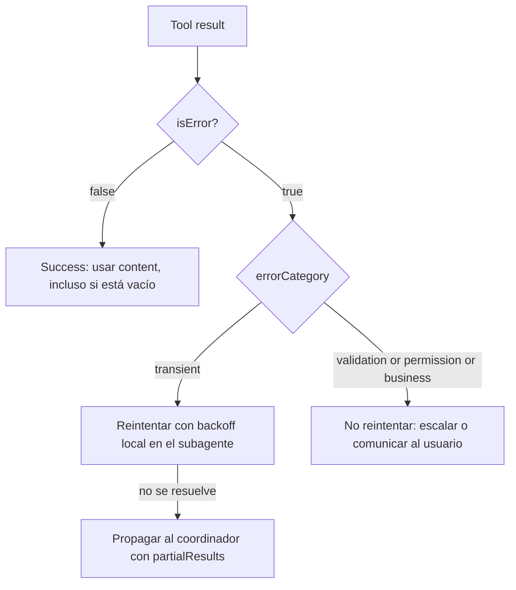
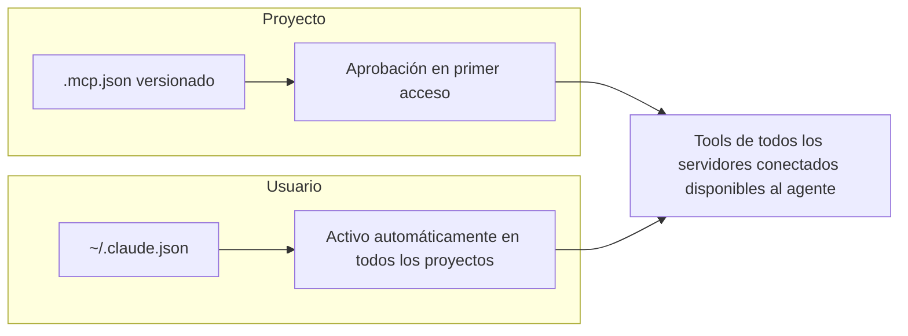

```yaml
---
bloque: 3
nombre: "Diseño de tools y MCP"
dominio_oficial: "D2"
peso_examen: 18
version: "1.0"
fecha: "2026-08-05"
guia_oficial_examen: "1.0"
task_statements: ["2.1", "2.2", "2.3", "2.4", "2.5"]
fuentes:
  - {titulo: "Define tools", url: "https://platform.claude.com/docs/en/agents-and-tools/tool-use/define-tools", origen: "anthropic", tipo: "doc"}
  - {titulo: "Writing effective tools for agents", url: "https://www.anthropic.com/engineering/writing-tools-for-agents", origen: "anthropic", tipo: "blog"}
  - {titulo: "Build an MCP server", url: "https://modelcontextprotocol.io/docs/develop/build-server", origen: "mcp", tipo: "doc"}
  - {titulo: "MCP quickstart", url: "https://code.claude.com/docs/en/mcp-quickstart", origen: "anthropic", tipo: "doc"}
  - {titulo: "Connect Claude Code to tools via MCP", url: "https://code.claude.com/docs/en/mcp", origen: "anthropic", tipo: "doc"}
  - {titulo: "Tools reference", url: "https://code.claude.com/docs/en/tools-reference", origen: "anthropic", tipo: "doc"}
estado: aprobado
---
```

# Bloque 3 — Diseño de tools y MCP {#bloque-3}

Este bloque cubre el Domain 2 oficial, "Tool Design & MCP Integration" (18% del examen), y responde a una pregunta central: ¿cómo se diseña la interfaz entre un agente y el mundo exterior para que la selección y ejecución de tools sea fiable, recuperable y escalable? Los cinco task statements recorren ese eje de dentro hacia fuera: primero cómo escribir una `description` y un `input_schema` que el modelo pueda interpretar sin ambigüedad (2.1); después cómo comunicar fallos de forma estructurada para que el agente decida entre reintentar, escalar o abandonar (2.2); a continuación cómo repartir el catálogo de tools entre agentes especializados y forzar su uso con `tool_choice` (2.3); luego cómo conectar servidores MCP —el protocolo estándar para exponer tools y recursos externos— a Claude Code y a flujos de agentes (2.4); y por último cómo usar con criterio el set de tools nativas de Claude Code —Read, Write, Edit, Bash, Grep, Glob— en tareas de exploración y modificación de código (2.5). El examen trata este dominio como una prueba de juicio de ingeniería: no basta con conocer la sintaxis de `tool_choice` o el flag `isError`, hay que reconocer cuándo un diseño de tool concreto producirá misrouting, cuándo un error mal categorizado bloqueará la recuperación de un agente, y cuándo escalar de tools nativas a un servidor MCP tiene sentido frente a construir uno propio innecesariamente.

## Mapa del bloque

| Task statement | Sección | Conceptos clave |
|---|---|---|
| 2.1 | Interfaces de tools: descripciones y límites | `description`, `input_schema`, consolidación, namespacing, `input_examples`, misrouting |
| 2.2 | Errores estructurados en tools MCP | `isError`, `errorCategory`, `isRetryable`, recuperación local en subagentes, resultados vacíos vs error |
| 2.3 | Distribución de tools y `tool_choice` | scoped tool access, `tool_choice: auto/any/tool forzado`, sobrecarga de tools |
| 2.4 | Integración de servidores MCP | `.mcp.json` vs `~/.claude.json`, expansión de variables de entorno, MCP resources, community servers |
| 2.5 | Tools nativas de Claude Code | Read, Write, Edit, Bash, Grep, Glob: comportamiento, permisos, patrones de exploración incremental |

---

## 2.1 — Design effective tool interfaces with clear descriptions and boundaries {#ts-3-1}

> *Task statement oficial:* «Design effective tool interfaces with clear descriptions and boundaries»

**Concepto.** La `description` de una tool es el único canal por el que el modelo decide cuándo y cómo invocarla: no hay un canal adicional de "intención" fuera de ese texto. Cuando la descripción es mínima ("Retrieves customer information" frente a "Retrieves order details"), el modelo no tiene contexto suficiente para diferenciar tools parecidas y el resultado es *misrouting* (enrutado incorrecto hacia la tool equivocada). Este task statement trata el diseño de la interfaz de la tool —nombre, descripción, schema, granularidad— como una disciplina de ingeniería con reglas propias, no como un detalle menor de implementación.

**Cómo funciona.** El JSON mínimo de una tool exige `name` (regex `^[a-zA-Z0-9_-]{1,64}$`), `description` (texto explicando qué hace, cuándo usarla frente a alternativas, inputs/outputs esperados, condiciones de contorno y limitaciones, con al menos 3-4 oraciones para tools sencillas y más para tools complejas) e `input_schema` (JSON Schema con `type`, `properties`, `required`). El campo opcional `input_examples` añade instancias válidas de entrada para aclarar patrones ambiguos —formatos, objetos anidados— a un coste de 20-50 tokens por ejemplo simple y 100-200 para ejemplos complejos. Dos principios de diseño gobiernan la granularidad del catálogo: **consolidación** (agrupar operaciones relacionadas en una sola tool con un parámetro `action`, en vez de exponer cada endpoint de una API como una tool separada: `schedule_event` en lugar de `list_users` + `list_events` + `create_event`) y su contrario, **descomposición por propósito** (dividir una tool genérica en funciones con contratos de entrada/salida bien definidos cuando sus responsabilidades se solapan, p. ej. partir `analyze_document` en `extract_data_points`, `summarize_content` y `verify_claim_against_source`). El *namespacing* con prefijos o sufijos (`asana_search`, `asana_projects_search`) ayuda al modelo a diferenciar tools de distintos servicios cuando coexisten muchas en el mismo contexto. Las descripciones jerárquicas —una línea de propósito, seguida de inputs esperados, ejemplos de consulta, condiciones de contorno y qué NO hace la tool— facilitan la decisión de selección. En el diseño del output también hay reglas: usar nombres de campo semánticos (`name`, `image_url`) en vez de identificadores opacos (`uuid`, `256px_image_url`) reduce consumo de tokens y mejora el razonamiento del modelo, y aplicar paginación/truncado por defecto evita que el payload de respuesta sature el contexto con información de bajo valor.

```json
// Definición mínima de una tool
{
  "name": "tool_name",
  "description": "Detailed description: what it does, when to use it, boundaries, caveats",
  "input_schema": {
    "type": "object",
    "properties": { "param1": { "type": "string" } },
    "required": ["param1"]
  }
}
```

```text
Descripción POBRE: "Gets the stock price for a ticker."

Descripción BUENA: "Retrieves the current stock price for a given ticker symbol.
The ticker symbol must be a valid symbol for a publicly traded company on a major
US stock exchange like NYSE or NASDAQ. The tool will return the latest trade
price in USD. It should be used when the user asks about the current or most
recent price of a specific stock. It will not provide any other information
about the stock or company."
```

**Patrón correcto.** Cuando dos tools se solapan funcionalmente (`analyze_content` vs `analyze_document` con descripciones casi idénticas), la corrección es renombrar y reescribir la descripción para eliminar la ambigüedad —por ejemplo, `analyze_content` pasa a `extract_web_results` con una descripción específica de contenido web—, no simplemente añadir más texto a las dos descripciones existentes. La consolidación en tools con parámetro `action` reduce la superficie de decisión del modelo frente a un catálogo con una tool por cada endpoint de API. Cuando las descripciones por sí solas no bastan para desambiguar un escenario, 2-4 *few-shot examples* mostrando el razonamiento de selección de tool para peticiones ambiguas cierran el hueco. "Writing effective tools for agents" plantea el diseño de tools como un ciclo iterativo, no como un ejercicio de una sola pasada: prototipar rápido con servidores MCP locales, evaluar el prototipo contra tareas realistas (no casos de juguete), iterar la `description` y el `input_schema` a partir de las transcripciones reales de uso del agente, y validar el resultado contra un *held-out set* de tareas no usadas durante la iteración.

**Anti-patrones.** Descripciones mínimas tipo "Gets the stock price" fuerzan al modelo a adivinar cuándo aplican, produciendo *misrouting* documentado como causa raíz de fallos de selección. Crear una tool por cada endpoint de una API (`list_users`, `list_events`, `create_event` en vez de una `schedule_event` con `action`) multiplica la complejidad de decisión sin aportar valor real. Tools con propósitos solapados y descripciones casi idénticas (`analyze_content` vs `analyze_document`) impiden que el modelo elija correctamente; la solución no es documentación adicional sino renombrar y diferenciar. Devolver payloads con todos los campos posibles obliga al modelo a parsear datos irrelevantes y desperdicia contexto. Un `system` prompt con instrucciones sensibles a palabras clave puede crear asociaciones de tool no deseadas y anular descripciones bien escritas: la calidad de la `description` no es garantía si el prompt de sistema introduce sesgos de selección por su cuenta.

**Trampas de examen.** El examen distingue entre "la descripción es insuficiente" (causa *misrouting* entre tools similares) y "el catálogo tiene demasiadas tools granulares" (causa complejidad de decisión, tema que se retoma en 2.3): son dos problemas de diseño distintos con remedios distintos (reescribir descripción vs consolidar/scoping). También aparece como distractor la idea de que basta con "más texto" en la descripción cuando el problema real es el solapamiento funcional entre dos tools —la solución correcta ahí es renombrar y diferenciar, no simplemente alargar la prosa—.

**Fuentes.** Define tools — https://platform.claude.com/docs/en/agents-and-tools/tool-use/define-tools · Writing effective tools for agents — https://www.anthropic.com/engineering/writing-tools-for-agents

---

## 2.2 — Implement structured error responses for MCP tools {#ts-3-2}

> *Task statement oficial:* «Implement structured error responses for MCP tools»

**Concepto.** MCP (Model Context Protocol) comunica el fallo de una tool al agente mediante el flag `isError` en el resultado; este es el mecanismo estándar de señalización de errores en el protocolo. El problema que resuelve este task statement es que una respuesta de error genérica ("Operation failed") no le da al agente ninguna base para decidir entre reintentar, escalar o abandonar la tarea: la estructura del error —no solo su presencia— es lo que habilita recuperación inteligente.

**Cómo funciona.** Un resultado de error MCP lleva `isError: true`, un `content` con texto legible para humanos, y metadatos adicionales (`_metadata`) que categorizan el fallo: **transient** (timeouts, servicio no disponible — reintentable), **validation** (input inválido — no reintentable), **business** (violación de reglas de negocio — no reintentable) y **permission** (acceso denegado — no reintentable). El campo `isRetryable` (booleano) señala explícitamente si el agente debe reintentar o no; para errores de negocio, además conviene incluir una explicación orientada al usuario final para que el agente pueda comunicar el motivo sin reintentar en vano (p. ej. un reembolso que excede el límite de una transacción). Dentro de una arquitectura de subagentes, la recuperación de errores transitorios debe resolverse localmente dentro del subagente (reintento con backoff); solo los errores que el subagente no puede resolver se propagan al coordinador, junto con los resultados parciales obtenidos y una descripción de qué se intentó. Un punto de diseño crítico y fácil de pasar por alto: una consulta que se ejecuta con éxito pero no encuentra resultados es un caso de éxito (`isError: false`, contenido vacío), completamente distinto de un timeout o un permiso denegado; devolver un resultado vacío legítimo como si fuera un fallo (`isError: true`) rompe la capacidad del agente de interpretar correctamente qué pasó.

```json
// Error estructurado con metadata de categorización (esquema base oficial)
{
  "isError": true,
  "content": [
    { "type": "text", "text": "Human-readable error description" }
  ],
  "_metadata": {
    "errorCategory": "transient|validation|permission|business",
    "isRetryable": true
  }
}
```

```json
// Propagación subagente → coordinador: el subagente no pudo resolver
// el error localmente y escala añadiendo contexto adicional (campos
// ilustrativos de esta arquitectura, no parte del esquema base oficial)
{
  "isError": true,
  "content": [
    { "type": "text", "text": "Human-readable error description" }
  ],
  "_metadata": {
    "errorCategory": "transient|validation|permission|business",
    "isRetryable": true,
    "originalQuery": "what was attempted",
    "partialResults": []
  }
}
```

```json
// Respuesta exitosa (sin error)
{
  "isError": false,
  "content": [
    { "type": "text", "text": "Response content" }
  ]
}
```

```text
// Error de negocio: no reintentable, explicación orientada al cliente
"isRetryable": false,
"text": "Refund amount $750 exceeds the maximum single-transaction limit of $500.
         Please contact the customer support team for policy exceptions."
```

**Patrón correcto.** Incluir siempre `errorCategory` para que agentes downstream apliquen la lógica de recuperación correcta sin tener que parsear texto libre. Cuando una operación tiene éxito parcial, devolver tanto los resultados parciales como metadatos de qué se intentó, para que el coordinador decida entre continuar con datos parciales o escalar. Los subagentes deben implementar reintentos con backoff exponencial para fallos transitorios localmente, y propagar al coordinador únicamente lo que no pudieron resolver, reduciendo ruido a nivel de coordinador. Un resultado con cero coincidencias es éxito (`isError: false`), no error.

**Anti-patrones.** Respuestas de error genéricas ("Operation failed", "Error occurred") sin categoría ni indicación de reintento fuerzan al agente a reintentar indiscriminadamente o escalar prematuramente, desperdiciando tiempo y paciencia del usuario. Tratar todos los errores como reintentables (o todos como no reintentables) impide una recuperación inteligente: los errores de validación y de permisos nunca deben reintentarse, solo los transitorios. Suprimir silenciosamente errores —devolver un resultado vacío como éxito cuando en realidad la consulta falló— rompe la propagación de errores porque el coordinador no puede distinguir entre "no hay resultados" y "la consulta no se ejecutó". Omitir resultados parciales en el contexto de un error cuando la operación fue parcialmente exitosa impide que el coordinador continúe con los datos disponibles.

**Trampas de examen.** El examen suele presentar pares de escenarios casi idénticos donde la única diferencia es si el error es transitorio o de negocio, para comprobar si se aplica correctamente `isRetryable`. Otra trampa habitual: un resultado vacío legítimo presentado como si necesitara `isError: true`, cuando la categorización correcta es éxito con contenido vacío. También aparece la distinción entre "el subagente resuelve localmente y propaga solo lo irresoluble" (patrón correcto) frente a "el subagente propaga todos los errores al coordinador sin intentar recuperación" (anti-patrón que genera ruido innecesario).

**Fuentes.** Build an MCP server — https://modelcontextprotocol.io/docs/develop/build-server

---

## 2.3 — Distribute tools appropriately across agents and configure tool choice {#ts-3-3}

> *Task statement oficial:* «Distribute tools appropriately across agents and configure tool choice»

**Concepto.** Dar acceso a un agente a demasiadas tools (p. ej. 18 en vez de 4-5) degrada la fiabilidad de selección al aumentar la complejidad de decisión: el agente tiene más opciones entre las que confundirse. Además, los agentes con tools fuera de su especialización tienden a usarlas mal —un agente de síntesis con acceso a búsqueda web intentará buscar en vez de apoyarse en los datos ya recopilados—. Este task statement trata la distribución del catálogo de tools entre agentes especializados, y la configuración de `tool_choice`, como dos palancas del mismo problema: reducir la superficie de decisión a lo estrictamente necesario para cada rol.

**Cómo funciona.** El principio de **scoped tool access** consiste en dar a cada agente solo las tools necesarias para su rol, con tools cruzadas limitadas para necesidades de alta frecuencia específicas (p. ej. una tool `verify_fact` disponible también para el agente de síntesis, aunque pertenezca conceptualmente al rol de verificación). `tool_choice` tiene tres configuraciones relevantes: `"auto"` (Claude decide si llama a alguna tool o no; es el valor por defecto cuando se proveen `tools`), `"any"` (Claude debe usar alguna de las tools provistas, pero no se le fuerza cuál; garantiza que se llamará a una tool), y la selección forzada `{"type": "tool", "name": "..."}` (garantiza que se llame exactamente a esa tool, útil para forzar un primer paso obligatorio en una secuencia, como `extract_metadata` antes de tools de enriquecimiento). Combinar `tool_choice: "any"` con `strict: true` en la tool garantiza a la vez que se llamará a una tool y que su input cumplirá el schema exactamente. Reducir el número de tools por agente también reduce el overhead de tokens por sesión, porque las tools de cada servidor conectado se cargan en el contexto al inicio de la sesión. Un matiz importante de `"any"` y de la tool forzada: en ambos casos la API prefila el mensaje del asistente para forzar la llamada, por lo que el modelo no emite texto natural antes del `tool_use` aunque el prompt pida explícitamente un razonamiento previo o un comentario conversacional. Si se necesita tanto contexto conversacional como la garantía de llamada, la combinación correcta es `tool_choice: "auto"` junto con una instrucción explícita en el prompt pidiendo el uso de la tool, no `"any"` ni la tool forzada.

```json
{
  "model": "claude-opus-5",
  "tools": [ ],
  "tool_choice": "auto"
}
```

```json
{ "tool_choice": {"type": "tool", "name": "get_weather"} }
```

```yaml
# Restricción de tools de un subagente en el Agent SDK
---
name: "synthesis-agent"
tools: ["verify_fact", "read_documents"]
disallowedTools: ["web_search"]
---
```

**Patrón correcto.** El *role-based tool scoping* asigna a cada agente exactamente el catálogo de su especialización: un agente de búsqueda web tiene `[search_web, fetch_url]`, uno de análisis tiene `[extract_data, analyze_text]`, uno de síntesis tiene `[verify_fact, summarize]`, y las tools cruzadas (como `verify_fact`) se listan explícitamente solo donde se necesitan. Sustituir tools genéricas por alternativas restringidas —`fetch_url` genérica por `load_document`, que valida URLs de documentos— reduce el riesgo de mal uso. Cuando el orden de pasos es crítico (autenticar antes de procesar un reembolso), forzar la tool concreta con `{"type": "tool", "name": "extract_metadata"}` en el primer paso garantiza la secuencia; los pasos siguientes se gestionan en turnos posteriores. Cuando la salida debe ser siempre datos estructurados y nunca solo texto conversacional, `tool_choice: "any"` combinado con `strict: true` da la garantía compuesta de llamada más conformidad de schema.

**Anti-patrones.** Dar todas las tools a todos los agentes incrementa el tamaño de contexto por sesión y provoca mal uso —agentes de síntesis intentando búsquedas que no les corresponden—; el scoping por rol previene esta confusión. Confiar en exceso en `tool_choice: "auto"` cuando la secuencia es crítica (p. ej. autenticación antes de procesar un reembolso) permite que el agente se salte prerrequisitos; ahí se necesita selección forzada para un orden determinista. No usar `tool_choice: "any"` cuando la salida debe ser datos estructurados provoca que el modelo devuelva comentario conversacional en lugar de llamar a la tool esperada.

**Trampas de examen.** El examen contrasta escenarios con un catálogo de tools desproporcionado (muchas más de las 4-5 necesarias para el rol) frente a un catálogo bien acotado, para evaluar si se reconoce la degradación de fiabilidad de selección. También aparece la confusión entre `"any"` (garantiza llamada a alguna tool, sin especificar cuál) y la tool forzada (garantiza la tool exacta): son conceptos cercanos textualmente pero con implicaciones distintas para el orden de ejecución. Otra trampa habitual: asumir que forzar `tool_choice` con `"any"` o con una tool concreta permite además obtener texto de razonamiento previo del modelo antes del `tool_use`; el prefill de la API lo impide, y la solución correcta cuando se necesita ese texto es `"auto"` con instrucción explícita.

**Fuentes.** Define tools — https://platform.claude.com/docs/en/agents-and-tools/tool-use/define-tools · MCP quickstart — https://code.claude.com/docs/en/mcp-quickstart

---

## 2.4 — Integrate MCP servers into Claude Code and agent workflows {#ts-3-4}

> *Task statement oficial:* «Integrate MCP servers into Claude Code and agent workflows»

**Concepto.** MCP (Model Context Protocol) es el mecanismo estándar para conectar herramientas y fuentes de datos externas a Claude Code y a flujos de agentes, evitando reimplementar integraciones ad hoc por cada servicio. El problema que resuelve este task statement es de alcance y gobernanza: dónde se registra un servidor MCP (a nivel de proyecto o de usuario), cómo se gestionan credenciales sin comprometerlas, y cuándo conviene un servidor comunitario frente a uno propio.

**Cómo funciona.** Hay dos ámbitos de configuración: **project-level** (`.mcp.json`, versionado en el repositorio, disponible para todo el equipo — el primer acceso pide aprobación explícita del usuario antes de conectar, como medida de seguridad, y una vez aprobado queda disponible en todas las sesiones de ese proyecto) y **user-level** (`~/.claude.json`, registrado una sola vez y activo automáticamente en todos los proyectos del usuario, sin aprobación por proyecto — pensado para servidores personales o experimentales). La expansión de variables de entorno dentro de `.mcp.json` (sintaxis `${GITHUB_TOKEN}`) permite gestionar credenciales sin comprometerlas en el control de versiones; las variables se resuelven en el momento de la conexión. Las tools de todos los servidores MCP configurados se descubren en el momento de la conexión y quedan disponibles simultáneamente para el agente: no existe un paso explícito de selección de servidor, el agente elige entre todas las tools disponibles igual que con cualquier otra tool. Los **MCP resources** son un mecanismo distinto de las tools: exponen catálogos de contenido de solo lectura (resúmenes de issues, jerarquías de documentación, esquemas de base de datos) para que el agente vea qué datos existen sin necesidad de llamadas de tool exploratorias. Cuando las descripciones de las tools de un servidor MCP están poco detalladas, el agente tiende a preferir tools nativas más simples (como Grep) frente a alternativas MCP potencialmente más capaces; mejorar esas descripciones —explicando capacidades y outputs con el mismo rigor que en 2.1— corrige ese sesgo. Para integraciones estándar (Jira, Slack, GitHub) conviene evaluar servidores comunitarios existentes antes de construir uno propio; el desarrollo a medida se reserva para flujos específicos del equipo.

```json
// .mcp.json de proyecto: servidor HTTP remoto
{
  "mcpServers": {
    "claude-code-docs": {
      "type": "http",
      "url": "https://code.claude.com/docs/mcp"
    }
  }
}
```

```json
// .mcp.json de proyecto: servidor local stdio
{
  "mcpServers": {
    "playwright": {
      "type": "stdio",
      "command": "npx",
      "args": ["-y", "@playwright/mcp@latest"]
    }
  }
}
```

```json
// Expansión de variable de entorno para credenciales
{
  "mcpServers": {
    "github": {
      "type": "http",
      "url": "https://github.com/mcp",
      "env": { "GITHUB_TOKEN": "${GITHUB_TOKEN}" }
    }
  }
}
```

```bash
# Añadir un servidor MCP vía CLI
claude mcp add --transport http server-name https://example.com/mcp
```

```text
# Referencia a un MCP resource dentro de un prompt
# formato: @server:protocol://resource/path (el componente de protocolo es obligatorio)
@github:issue://123
@docs:file://api/authentication
```

**Patrón correcto.** Configuración en capas: servidores de proyecto (`.mcp.json`) para estándares de equipo (GitHub, Jira), servidores de usuario (`~/.claude.json`) para utilidades personales y experimentales. Al integrar un servidor MCP, mejorar sus descripciones de tool por defecto —igual que en 2.1— evita que el agente prefiera tools nativas menos capaces. Cuando el diseño lo permite, exponer datos como MCP resources en vez de tools reduce la necesidad de llamadas exploratorias. Antes de construir un servidor MCP propio para una integración estándar, evaluar el directorio de servidores comunitarios de Anthropic.

**Anti-patrones.** Comprometer credenciales directamente en `.mcp.json` (en vez de usar expansión de variables `${VAR}`) rompe la seguridad del proyecto versionado. Definir demasiados servidores por proyecto incrementa el overhead de contexto y el consumo de tokens por sesión; conviene retirar los que no se usan. Descripciones pobres en las tools de un servidor MCP hacen que el agente ignore tools capaces y prefiera alternativas nativas menos potentes. Construir servidores propios para integraciones estándar (Jira, Slack) desperdicia esfuerzo cuando ya existen servidores comunitarios equivalentes; el desarrollo a medida debe reservarse para flujos específicos del equipo. Usar como nombre de servidor uno de los nombres reservados (`workspace`, `claude-in-chrome`, `computer-use`, `Claude Preview`, `Claude Browser`) es inválido: esos nombres están reservados y no deben reutilizarse para servidores MCP propios.

**Trampas de examen.** El examen distingue con cuidado "project-level, versionado, aprobación en primer acceso" (`.mcp.json`) de "user-level, activo automáticamente en todos los proyectos" (`~/.claude.json`): confundir cuál requiere aprobación explícita es un distractor típico. También aparece la idea errónea de que las tools MCP requieren un paso de selección de servidor explícito, cuando en realidad todas las tools de todos los servidores conectados están disponibles simultáneamente desde el momento de la conexión. Otro distractor de configuración: un servidor definido en `.mcp.json` con `url` pero sin el campo `"type"` — Claude Code no infiere `"http"` a partir de la presencia de `url`, lo interpreta como `stdio` por defecto y la conexión falla; el campo `"type"` es obligatorio.

**Fuentes.** Connect Claude Code to tools via MCP — https://code.claude.com/docs/en/mcp · MCP quickstart — https://code.claude.com/docs/en/mcp-quickstart

---

## 2.5 — Select and apply built-in tools (Read, Write, Edit, Bash, Grep, Glob) effectively {#ts-3-5}

> *Task statement oficial:* «Select and apply built-in tools (Read, Write, Edit, Bash, Grep, Glob) effectively»

**Concepto.** Claude Code expone un set nativo de tools de exploración y modificación de ficheros —Read, Write, Edit, Bash, Grep, Glob—, cada una con un propósito y un contrato de permisos distintos. Este task statement evalúa el criterio para elegir la tool correcta según la tarea (búsqueda de contenido frente a búsqueda de rutas, modificación puntual frente a reescritura completa) y reconocer cuándo el uso incorrecto de una tool nativa produce fallos evitables (Edit sobre texto no único, lectura completa de un repositorio enorme).

**Cómo funciona.** **Read** carga el contenido completo de un fichero con números de línea; si excede el límite de tokens devuelve la primera página con aviso de vista parcial y soporta `offset`/`limit`. Read maneja tipos especiales: imágenes PNG/JPG como contenido visual (con reescalado automático en ficheros grandes), PDFs completos en documentos cortos o por rangos de páginas (`pages: "1-5"`, hasta 20 páginas por llamada) en PDFs de más de 10 páginas, y notebooks Jupyter (.ipynb) con todas las celdas y sus outputs. Read es de solo lectura y no requiere permiso por defecto para rutas dentro del directorio de trabajo. **Write** crea un fichero nuevo o sobrescribe uno existente con el contenido completo (sin append ni merge); si el fichero ya existe, exige que Claude lo haya leído antes en la conversación actual, o la escritura falla — los ficheros nuevos no tienen ese requisito. Write requiere permiso. **Edit** realiza reemplazo de cadena exacta: toma `old_string` y `new_string` y sustituye la primera coincidencia exacta, sin regex ni fuzzy matching. Para que Edit se aplique deben cumplirse tres condiciones: lectura previa del fichero en la conversación actual (aunque modelos recientes pueden editar ficheros no leídos si la lectura no requeriría permiso), coincidencia exacta de `old_string`, y unicidad de esa coincidencia (o usar `replace_all: true`). Cuando Edit falla por coincidencias no únicas, el patrón de respaldo es Read + Write. Edit requiere permiso, y una regla de permiso de Edit también concede acceso de lectura a la misma ruta. **Bash** ejecuta comandos de shell; un conjunto de comandos de solo lectura (`ls`, `cat`, `echo`, `pwd`, `head`, `tail`, `grep`, `find`, `wc`, `which`, `diff`, `stat`, `du`, `cd`, `git`) se ejecuta sin prompt de permiso. Las variables de entorno no persisten entre comandos salvo que se fijen con `CLAUDE_ENV_FILE`; cada comando corre en un proceso separado. El timeout por defecto es de 2 minutos (máximo 10, configurable con `BASH_DEFAULT_TIMEOUT_MS` y `BASH_MAX_TIMEOUT_MS`); los comandos que superan el timeout pasan a segundo plano automáticamente. Bash requiere permiso. **Grep** busca patrones en el contenido de ficheros (líneas, no ficheros) y está construido sobre ripgrep, no el grep POSIX estándar, por lo que requiere sintaxis de escape propia de ripgrep (p. ej. `interface\{\}` para encontrar `interface{}` en Go). Tiene tres modos de salida: `files_with_matches` (rutas de fichero, por defecto), `content` (líneas con fichero y número de línea) y `count` (número de coincidencias por fichero y total). Respeta `.gitignore` por defecto; para buscar en ficheros ignorados hay que pasar la ruta directamente. Soporta `glob` (p. ej. `**/*.tsx`) y `type` (p. ej. `py`, `rust`); el matching es de una sola línea por defecto, y `multiline: true` habilita patrones que cruzan líneas. Grep es de solo lectura. **Glob** encuentra ficheros por patrón de nombre, con soporte de `**` para recursividad (`**/*.js` en cualquier profundidad, `src/**/*.ts` bajo `src/`) y expansión de llaves (`*.{json,yaml}`). Los resultados se ordenan por fecha de modificación, con un tope de 100 ficheros y un flag de truncamiento que indica que hay que acotar el patrón. Glob no respeta `.gitignore` por defecto (variable `CLAUDE_CODE_GLOB_NO_IGNORE=false` para habilitarlo). Glob es de solo lectura.

**Patrón correcto.** Usar Grep para buscar contenido de código a través de una base de código (localizar todos los llamadores de una función, mensajes de error, imports). Usar Glob para descubrir ficheros por patrón de nombre (`**/*.test.tsx` para todos los tests, `src/**/*.ts` para TypeScript bajo `src`). Cuando Edit falla por texto no único, recurrir a Read + Write como respaldo fiable. Construir comprensión de la base de código de forma incremental: empezar con Grep para localizar puntos de entrada, después Read para seguir imports y trazar flujos, en vez de leer todo el repositorio por adelantado. Para rastrear el uso de una función, identificar primero todos los nombres exportados y luego usar Grep para cada nombre a través de la base de código, incluyendo módulos wrapper. Ejecutar Bash con comandos de solo lectura sobre un fichero concreto puede satisfacer el requisito de lectura previa antes de un Edit posterior.

**Anti-patrones.** Leer bases de código enteras por adelantado agota el contexto y elimina la posibilidad de exploración incremental; conviene empezar con Grep para búsquedas dirigidas. Usar Edit sin haber leído el fichero antes falla la comprobación de lectura previa (salvo en modelos recientes con permisos relajados en ese punto). Editar con un `old_string` no único falla cuando el texto aparece varias veces; ahí Read + Write sustituye a Edit. Usar Edit para crear ficheros nuevos es ineficiente: Write es la tool correcta para creación. Apoyarse en exceso en Bash (`cat`, `head`, `tail`) para lecturas de ficheros grandes en vez de Read puede truncar o perder contexto. No usar Glob para descubrimiento de ficheros y depender de listados manuales con `ls`/`find` vía Bash es más lento que el pattern matching nativo de Glob.

**Trampas de examen.** El examen distingue con precisión Grep (busca contenido/líneas dentro de ficheros) de Glob (busca ficheros por patrón de nombre): tratar ambas como intercambiables es un distractor recurrente. También aparece la confusión entre "Edit falla por match no único" y "Edit falla por no haber leído el fichero": son dos condiciones distintas de las tres que Edit exige (lectura previa, coincidencia exacta, unicidad), y el remedio para la primera (Read + Write) no resuelve la segunda (basta con leer el fichero).

**Fuentes.** Tools reference — https://code.claude.com/docs/en/tools-reference

---

## Tabla de decisión del dominio {#ts-3-decision}

| Situación | Elección correcta | Por qué |
|---|---|---|
| Dos tools se solapan funcionalmente y el modelo las confunde | Renombrar + reescribir descripciones para diferenciar propósito | El solapamiento textual, no la falta de longitud, es la causa del *misrouting* |
| Catálogo con una tool por cada endpoint de API | Consolidar en tools con parámetro `action` | Reduce la superficie de decisión del modelo frente a muchas tools hiperespecíficas |
| Error de servicio no disponible o timeout | `errorCategory: "transient"`, `isRetryable: true` | El agente puede reintentar razonablemente; no es un fallo permanente |
| Error de validación, negocio o permisos | `isRetryable: false` + explicación orientada al usuario | Reintentar no cambia el resultado; el agente debe escalar o comunicar el motivo |
| Consulta ejecutada con éxito pero sin resultados | `isError: false`, contenido vacío | Es un resultado válido, distinto de un fallo de acceso o timeout |
| Agente necesita decidir libremente si usar una tool | `tool_choice: "auto"` | Es el comportamiento por defecto; el modelo llama solo si aporta valor |
| Salida debe ser siempre una llamada a tool, nunca solo texto | `tool_choice: "any"` (+ `strict: true` si además se exige schema exacto) | Garantiza la llamada; `strict` añade la garantía de conformidad del input |
| Un paso debe ejecutarse siempre primero en una secuencia | Tool forzada `{"type": "tool", "name": "..."}` | Garantiza el orden sin necesidad de reintentos ni validación posterior |
| Servidor MCP compartido por todo el equipo | `.mcp.json` de proyecto, versionado | Requiere aprobación explícita en primer acceso; disponible para todo el equipo tras aprobarse |
| Servidor MCP personal o experimental | `~/.claude.json` de usuario | Se activa automáticamente en todos los proyectos del usuario, sin aprobación por proyecto |
| Integración estándar (Jira, Slack, GitHub) | Servidor MCP comunitario existente | Evita reimplementar integraciones ya cubiertas; reservar desarrollo propio para flujos específicos del equipo |
| Buscar contenido de código (funciones, errores, imports) | Grep | Busca líneas dentro de ficheros, no nombres de fichero |
| Buscar ficheros por patrón de nombre o extensión | Glob | Pattern matching sobre rutas, con soporte de `**` y expansión de llaves |
| Edit falla por texto no único | Read + Write | Edit exige coincidencia única de `old_string`; Read + Write no tiene esa restricción |

## Diagramas



El diagrama muestra que la primera bifurcación es `isError`, no la ausencia de resultados: un resultado vacío exitoso sigue el camino de éxito, y solo los errores transitorios activan el reintento local antes de escalar al coordinador.



El diagrama muestra que ambos ámbitos de configuración convergen en el mismo resultado —tools disponibles simultáneamente para el agente desde la conexión—, pero difieren en gobernanza: aprobación explícita por proyecto frente a activación automática por usuario.

## Deuda conocida

Ninguna. Los task statements 2.1–2.5 quedan cubiertos completamente por las notas de extracción, con fuentes oficiales de platform.claude.com, code.claude.com y modelcontextprotocol.io para cada afirmación.
