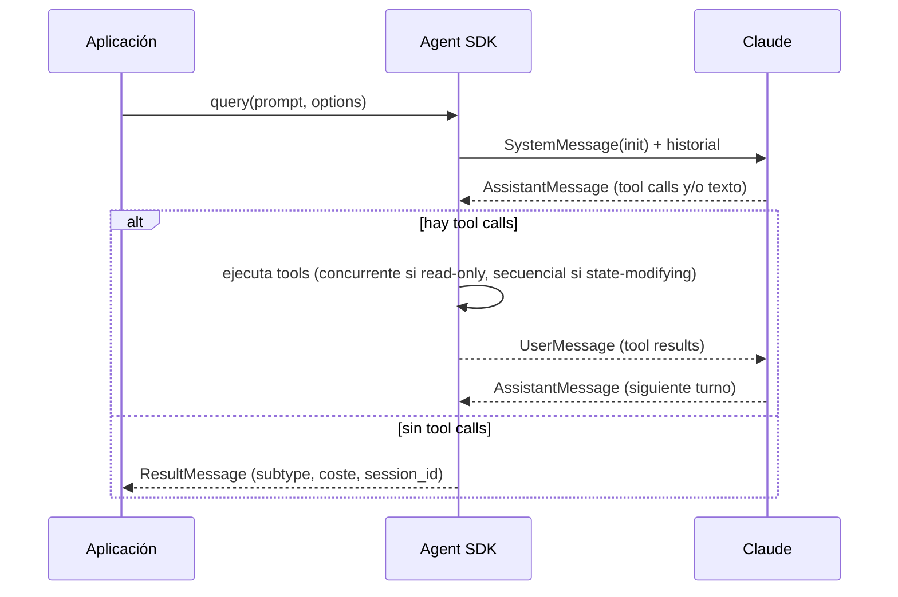
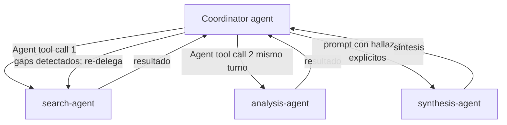

```yaml
---
bloque: 4
nombre: "Agent SDK: arquitectura agéntica y orquestación"
dominio_oficial: "D1"
peso_examen: 27
version: "1.0"
fecha: "2026-08-05"
guia_oficial_examen: "1.0"
task_statements: ["1.1", "1.2", "1.3", "1.4", "1.5", "1.6", "1.7"]
fuentes:
  - {titulo: "How the agent loop works", url: "https://code.claude.com/docs/en/agent-sdk/agent-loop", origen: "anthropic", tipo: "doc"}
  - {titulo: "Subagents in the SDK", url: "https://code.claude.com/docs/en/agent-sdk/subagents", origen: "anthropic", tipo: "doc"}
  - {titulo: "Hooks del Agent SDK", url: "https://code.claude.com/docs/en/agent-sdk/hooks", origen: "anthropic", tipo: "doc"}
  - {titulo: "Work with sessions", url: "https://code.claude.com/docs/en/agent-sdk/sessions", origen: "anthropic", tipo: "doc"}
  - {titulo: "How we built our multi-agent research system", url: "https://www.anthropic.com/engineering/built-multi-agent-research-system", origen: "anthropic", tipo: "blog"}
  - {titulo: "Introduction to Subagents (Skilljar)", url: "https://anthropic.skilljar.com/introduction-to-subagents", origen: "anthropic", tipo: "curso"}
estado: aprobado
---
```

# Bloque 4 — Agent SDK: arquitectura agéntica y orquestación {#bloque-4}

Este bloque cubre el **Domain 1: Agentic Architecture & Orchestration** del blueprint oficial, el de mayor peso del examen (**27%**). Construye directamente sobre la mecánica de bucle agéntico y tool use del Bloque 0, pero eleva el nivel de abstracción a lo que ofrece el **Agent SDK** (*Software Development Kit*, kit de desarrollo de software): la capa que envuelve el bucle `tool_use`/`tool_result` en una API de más alto nivel (`query()`), añade orquestación multi-agente mediante subagentes, hooks para intercepción determinista, y gestión de sesiones persistentes. Los siete task statements (1.1–1.7) forman una progresión coherente: primero el bucle agéntico como unidad atómica (1.1), luego cómo coordinarlo entre múltiples agentes (1.2, 1.3), cómo forzar determinismo dentro de flujos que por defecto son probabilísticos (1.4, 1.5), cómo descomponer tareas complejas en subtareas (1.6), y finalmente cómo persistir y retomar el estado de una sesión de trabajo (1.7). El examen evalúa aquí sobre todo **juicio arquitectónico**: cuándo un agente dirigido por el modelo es la elección correcta frente a un workflow determinista, y cuándo la garantía debe ser programática (hooks, gates) en lugar de confiar en el prompt.

## Mapa del bloque

| Task statement | Título | Conceptos clave |
|---|---|---|
| 1.1 | Bucles agénticos para ejecución autónoma | lifecycle de 5 pasos, `turn`, tipos de mensaje del SDK, `maxTurns`/`max_turns`, ejecución concurrente vs secuencial de tools |
| 1.2 | Orquestación multi-agente coordinator-subagent | hub-and-spoke, task decomposition, dynamic subagent selection, parallel execution (3–5 subagentes) |
| 1.3 | Invocación de subagentes, paso de contexto y spawning | Agent tool (antes Task), aislamiento de contexto, `AgentDefinition`, `forkSession`/`fork_session` |
| 1.4 | Workflows multi-paso con enforcement y handoff | programmatic enforcement vs prompt guidance, prerequisite gates, structured handoff summaries |
| 1.5 | Hooks del Agent SDK para intercepción y normalización | `PreToolUse`, `PostToolUse`, `UserPromptSubmit`, `Stop`, `HookMatcher` |
| 1.6 | Estrategias de descomposición de tareas | prompt chaining vs dynamic decomposition, multi-pass code review, adaptive investigation plans |
| 1.7 | Gestión de estado de sesión, resumption y forking | `--resume`, `continue`, `forkSession`/`fork_session`, persistencia en `.jsonl` |

---

## 1.1 — Design and implement agentic loops for autonomous task execution {#ts-4-1}

> *Task statement oficial:* «Design and implement agentic loops for autonomous task execution»

**Concepto.** El *agentic loop* (bucle agéntico) es el ciclo fundamental que ejecuta el Agent SDK: Claude evalúa el estado actual y responde con tool calls, texto final, o ambos; el SDK ejecuta las herramientas solicitadas; los resultados vuelven a Claude; y el ciclo se repite hasta que la respuesta ya no contiene tool calls. El SDK envuelve el mecanismo `stop_reason` de la Messages API (Bloque 0) en una interfaz de streaming de mensajes tipados, de modo que el desarrollador no gestiona manualmente el array `messages` ni inspecciona `stop_reason` directamente: consume un generador asíncrono (`query()`) que emite eventos ya clasificados.

**Cómo funciona.** El *lifecycle* tiene cinco pasos: (1) el prompt se recibe junto con `system prompt`, definiciones de tools e historial, y el SDK emite un `SystemMessage` con `subtype: "init"`; (2) Claude evalúa y responde —texto, tool calls, o ambos— y el SDK emite un `AssistantMessage`; (3) el SDK ejecuta cada tool solicitada y los resultados alimentan el siguiente turno; (4) los pasos 2 y 3 se repiten mientras la respuesta de Claude incluya tool calls; (5) al producir una respuesta sin tool calls, el SDK emite el `AssistantMessage` final seguido de un `ResultMessage` con el texto, uso de tokens, coste y `session_id`. Un **turn** es esa ronda completa (respuesta con tool calls → ejecución → resultados devueltos) sin que el código de la aplicación ceda el control; los turns se acumulan contra `maxTurns` (`max_turns`), un límite de seguridad —no el mecanismo principal de parada—. Los tipos de mensaje del loop son cinco: `SystemMessage` (eventos de ciclo de vida: `"init"`, `"compact_boundary"`, `"informational"`, `"worker_shutting_down"`), `AssistantMessage` (bloques de texto y tool calls), `UserMessage` (resultado de cada tool ejecutada, devuelto a Claude), `StreamEvent` (solo con partial messages habilitados, eventos raw de streaming) y `ResultMessage` (fin del loop, con `subtype` entre `success`, `error_max_turns`, `error_max_budget_usd`, `error_during_execution` y `error_max_structured_output_retries`). Cuando Claude solicita varias tool calls en un mismo turno, el SDK las ejecuta **concurrentemente** si son de solo lectura (`Read`, `Glob`, `Grep`, MCP read-only) y **secuencialmente** si modifican estado (`Edit`, `Write`, `Bash`), para evitar conflictos de escritura. El *context window* se acumula a lo largo de toda la sesión —nunca se resetea entre turns— incluyendo system prompt, tool definitions, historial, inputs y outputs de tools; el contenido estático se cachea automáticamente vía prompt caching.

La abstracción de más alto nivel del SDK (turns, tipos de mensaje) descansa sobre el mismo campo `stop_reason` de la Messages API subyacente que ya aparece en el Bloque 0: mientras la respuesta de Claude trae `stop_reason: "tool_use"`, el bucle continúa (hay tool calls que ejecutar y cuyo resultado alimentar de vuelta); cuando la respuesta trae `stop_reason: "end_turn"`, el bucle termina porque no hay más acción que tomar. El SDK no obliga al desarrollador a inspeccionar `stop_reason` turno a turno, pero lo expone igualmente: `ResultMessage.stop_reason` indica por qué el modelo dejó de generar en su último turno, con valores documentados como `"end_turn"` (fin normal), `"max_tokens"` (tope de tokens de salida alcanzado) y `"refusal"` (el modelo rechazó la petición); en los `subtype` de error el campo conserva el valor de la última respuesta del modelo antes de que el loop terminara. `maxBudgetUsd` (`max_budget_usd` en Python) es el límite de coste equivalente a `maxTurns` pero medido en gasto estimado en USD: al alcanzarse, el `ResultMessage` llega con `subtype: "error_max_budget_usd"` en lugar de `"success"`; el gasto de los subagentes cuenta contra el mismo presupuesto total.

```typescript
import { query } from "@anthropic-ai/claude-agent-sdk";

for await (const message of query({
  prompt: "Find and fix bugs in auth module",
  options: {
    allowedTools: ["Read", "Edit", "Bash", "Glob", "Grep"],
    settingSources: ["project"],  // Python: setting_sources
    maxTurns: 30,                 // Python: max_turns
    effort: "high"                // "low" | "medium" | "high" | "xhigh" | "max"
  }
})) {
  if (message.type === "assistant") {
    for (const block of message.message.content) {
      if (block.type === "tool_use") console.log(`Tool called: ${block.name}`);
    }
  }
  if (message.type === "result") {
    if (message.subtype === "success") console.log(message.result);
    else if (message.subtype === "error_max_turns") console.log(`Hit turn limit. Resume ${message.session_id}`);
    console.log(`Cost: $${message.total_cost_usd.toFixed(4)}`);
  }
}
```

**Patrón correcto.** El SDK decide continuar o parar el loop en función de si la respuesta de Claude contiene tool calls (continúa) o es solo texto (para); `maxTurns`/`max_turns` es una red de seguridad frente a loops descontrolados, no el criterio primario de terminación. La aplicación debe inspeccionar `ResultMessage.subtype` para distinguir un cierre exitoso de un corte por límite de turnos, presupuesto (`error_max_budget_usd`) o error de ejecución, y actuar en consecuencia (p. ej. reanudar sesión con el `session_id` capturado).

**Anti-patrones.** Parsear señales de lenguaje natural en el texto de Claude (buscar frases como "I'm done") para decidir si el loop terminó falla porque un agente no siempre produce esas señales explícitas. Usar un tope arbitrario de iteraciones como mecanismo *principal* de parada —en lugar de red de seguridad— corta arbitrariamente tareas legítimas que necesitan más pasos. Asumir que la presencia de texto en la respuesta indica finalización falla porque Claude puede devolver texto y tool calls en el mismo turno; la señal correcta es la ausencia de tool calls, no la presencia de texto.

**Trampas de examen.** El examen contrasta explícitamente estos tres anti-patrones (parsing de lenguaje natural, iteration caps como mecanismo principal, texto como indicador de completion) con el patrón correcto de inspeccionar si la respuesta contiene tool calls. También aparece como distractor la idea de que todas las tool calls de un turno se ejecutan siempre concurrentemente: solo las de solo lectura lo hacen; las que modifican estado se serializan. Un distractor adicional confunde "ausencia de tool calls en la respuesta" (la señal de alto nivel que expone el SDK) con la señal real subyacente: el bucle continúa mientras `stop_reason` sea `"tool_use"` y termina cuando es `"end_turn"`; tratar `max_tokens` o `refusal` como si fueran el cierre normal del loop es otro error común.

**Fuentes.** How the agent loop works — https://code.claude.com/docs/en/agent-sdk/agent-loop

---

## 1.2 — Orchestrate multi-agent systems with coordinator-subagent patterns {#ts-4-2}

> *Task statement oficial:* «Orchestrate multi-agent systems with coordinator-subagent patterns»

**Concepto.** El patrón coordinator-subagent organiza un sistema multi-agente como una arquitectura **hub-and-spoke** (eje y radios): un coordinator agent gestiona toda la comunicación entre subagentes, el manejo de errores y el enrutamiento de información, mientras los subagentes nunca se comunican directamente entre sí. Existe porque delegar razonamiento en paralelo a agentes especializados reduce drásticamente el tiempo de tareas de investigación complejas, pero solo si el enrutamiento permanece centralizado y observable.

**Cómo funciona.** Las responsabilidades del coordinator son cuatro: *task decomposition* (analizar los requisitos de la query), *dynamic subagent selection* (decidir qué subagentes invocar según la complejidad, sin rutear siempre por el pipeline completo), *result aggregation* (recolectar los outputs) e *iterative refinement* (evaluar el output de síntesis en busca de huecos, re-delegar con queries específicas, y re-invocar la síntesis hasta que la cobertura sea suficiente). En la arquitectura de investigación multi-agente de Anthropic, el lead agent genera entre 3 y 5 subagentes de forma **concurrente** —no secuencial— y cada subagente ejecuta 3 o más tools en paralelo; este patrón redujo el tiempo de investigación hasta un 90% en queries complejas. La estrategia de delegación exige especificaciones explícitas —objetivos, formato de output, guía de tools, límites claros—: instrucciones vagas ("research this") provocan duplicación de trabajo entre subagentes porque cada uno interpreta el alcance a su manera. Toda comunicación de subagentes debe fluir a través del coordinator, lo que mantiene observabilidad, manejo consistente de errores y control del flujo de información. En la *result aggregation*, el coordinator recibe el mensaje final de cada subagente como resultado de la Agent tool, pero puede resumirlo en su propia respuesta en lugar de reproducirlo literalmente (ver 1.3 para el mecanismo exacto).

```typescript
import { query } from "@anthropic-ai/claude-agent-sdk";

for await (const message of query({
  prompt: "Research AI safety and prepare a comprehensive report",
  options: {
    allowedTools: ["Read", "Grep", "Glob", "Agent"],
    agents: {
      "search-agent": {
        description: "Web search specialist for finding authoritative sources",
        prompt: "You are a research specialist. Find and catalog credible sources...",
        tools: ["WebSearch", "WebFetch"]
      },
      "analysis-agent": {
        description: "Document analysis specialist",
        prompt: "You analyze documents and extract key findings...",
        tools: ["Read", "Grep", "Glob"]
      },
      "synthesis-agent": {
        description: "Synthesis specialist that combines findings",
        prompt: "You synthesize findings from multiple sources...",
        tools: ["Read", "Write"]
      }
    }
  }
})) {
  if ("result" in message) console.log(message.result);
}
```

**Patrón correcto.** El coordinator debe seleccionar dinámicamente qué subagentes invocar según la complejidad real de la query, particionando el alcance de investigación (subtemas o tipos de fuente distintos por subagente) para minimizar duplicación, y ejecutando un bucle de refinamiento iterativo hasta cobertura suficiente antes de devolver la síntesis final.

**Anti-patrones.** Descomponer la tarea de forma demasiado estrecha (*overly narrow task decomposition*) produce cobertura incompleta de temas de investigación amplios: la corrección es especificar objetivos de investigación amplios y dejar que cada subagente decida cómo investigar dentro de esos límites, no fijar sub-preguntas demasiado específicas de antemano. Rutear siempre por el pipeline completo, incluso cuando la query es simple, incurre en coste y latencia innecesarios. Dar instrucciones de delegación vagas —"research AI safety" sin objetivos, formato ni guía de tools— hace que los subagentes no sepan cómo dividir el trabajo, y el resultado es duplicación de esfuerzo entre ellos.

**Trampas de examen.** El examen distingue "coordinador que siempre invoca el pipeline completo" (anti-patrón, ineficiente) de "coordinador que selecciona dinámicamente subagentes según complejidad" (patrón correcto). También contrasta la ejecución **secuencial** de subagentes (lenta, anti-patrón cuando la tarea lo permite) con la ejecución **concurrente** de 3–5 subagentes (patrón que Anthropic documenta con la cifra de reducción del 90% en tiempo de investigación).

**Fuentes.** Subagents in the SDK — https://code.claude.com/docs/en/agent-sdk/subagents · How we built our multi-agent research system — https://www.anthropic.com/engineering/built-multi-agent-research-system

---

## 1.3 — Configure subagent invocation, context passing, and spawning {#ts-4-3}

> *Task statement oficial:* «Configure subagent invocation, context passing, and spawning»

**Concepto.** Spawnear un subagente y pasarle contexto correctamente es la mecánica concreta que hace posible el patrón coordinator-subagent del task statement anterior. El mecanismo es la **Agent tool** —renombrada desde `"Task"` en la versión 2.1.63 del SDK (el exam guide oficial, redactado sobre una versión anterior, todavía cita el nombre `"Task"`; ambas variantes designan la misma tool)—, que requiere que `allowedTools` incluya `"Agent"` (o `"Task"` en SDKs anteriores a la 2.1.63) para que el coordinator pueda invocar subagentes.

**Cómo funciona.** Los subagentes operan con **contexto aislado**: no heredan automáticamente ni la conversation history del coordinator ni memoria entre invocaciones. Lo que sí heredan es su propio system prompt (`AgentDefinition.prompt`), el prompt de la llamada a la Agent tool, el `CLAUDE.md` del proyecto si `settingSources`/`setting_sources` lo incluye, y el subconjunto de tools declarado en `tools`. Lo que **no** heredan es el historial de conversación del coordinator, los resultados de tools del padre, el system prompt del padre, ni el contenido de skills precargadas (salvo que se listen explícitamente en `AgentDefinition.skills`). La configuración de `AgentDefinition` incluye, entre otros: `description` (`string`, obligatorio: cuándo usar este agente), `prompt` (`string`, obligatorio: system prompt del agente), `tools` (`string[]`, opcional: si se omite, hereda todas las tools disponibles para subagentes), `disallowedTools` (`string[]`, opcional: quita tools del conjunto heredado), `model` (opcional: alias como `'haiku'`, `'sonnet'`, `'opus'`, `'inherit'` o un model ID completo), `skills` (`string[]`, opcional: nombres de skills a precargar en el contexto del subagente), `memory` (opcional: `'user' | 'project' | 'local'`), `mcpServers` (opcional), `initialPrompt` (`string`, opcional: se auto-envía como primer turno de usuario solo cuando este agente corre como agente principal del hilo; se ignora si se invoca como subagente), `maxTurns`/`max_turns`, `background` (`boolean`, opcional: ejecuta el agente como tarea en segundo plano no bloqueante al invocarse), `effort` y `permissionMode` (opcional: modo de permisos para la ejecución de tools dentro de este agente). `disallowedTools` también acepta patrones a nivel de servidor MCP: `mcp__server` o `mcp__server__*` retiran todas las tools de ese servidor concreto, y `mcp__*` retira todas las tools MCP de cualquier servidor. `mcpServers` tiene tipo `(string | object)[]`: cada elemento es el nombre de un servidor ya configurado o una configuración inline. Para spawnear subagentes en paralelo, el coordinator debe emitir múltiples llamadas a la Agent tool en una **única respuesta** (mismo turno), no en turnos separados. `forkSession: true` (`fork_session=True`) crea ramas independientes de sesión desde una línea base de análisis compartida, útil para explorar enfoques divergentes sin perder el original. Al pasar contexto entre agentes, conviene usar formatos de datos estructurados que separen contenido de metadatos (URLs de fuente, nombres de documento, número de página), para preservar la atribución cuando el agente de síntesis combina hallazgos. El coordinator recibe el mensaje final del subagente como resultado de la Agent tool, pero puede resumirlo en su propia respuesta al usuario en lugar de citarlo literalmente; para preservar el output del subagente palabra por palabra hay que indicarlo explícitamente en el prompt (o en el `systemPrompt`) de la llamada principal a `query()`.

```typescript
const codeReviewer: AgentDefinition = {
  description: "Expert code review specialist. Use for quality, security reviews.",
  prompt: `You are a code review specialist with expertise in security and performance.
When reviewing code: identify security vulnerabilities, check performance issues,
verify adherence to coding standards. Be thorough but concise.`,
  tools: ["Read", "Grep", "Glob"],   // read-only: aislamiento de escritura
  model: "sonnet",
  maxTurns: 20,                       // Python: max_turns
  effort: "high"
};

// Contexto explícito: los hallazgos previos se incluyen en el prompt, no se asumen heredados
const synthesisPrompt = `Synthesize these findings from search and analysis:

Search results:
${webSearchResults}

Document analysis:
${documentAnalysis}

Create comprehensive report with proper attribution.`;
```

**Patrón correcto.** Inyectar explícitamente en el prompt de la Agent tool los hallazgos completos de agentes previos (resultados de búsqueda web, salidas de análisis documental) en lugar de asumir herencia automática de contexto; usar formatos estructurados (JSON) para separar afirmaciones de su evidencia, URL, documento y página; y especificar en el prompt del coordinator objetivos de investigación y criterios de calidad en lugar de instrucciones procedimentales paso a paso, para permitir adaptabilidad del subagente.

**Anti-patrones.** Asumir herencia automática de contexto —esperar que un subagente tenga acceso al historial de conversación previo del coordinator— falla porque el contexto de los subagentes está aislado por diseño: todo debe pasarse explícitamente. Descripciones de tarea vagas en la llamada a la Agent tool ("research this" sin objetivos, formato esperado ni alcance) dejan al subagente sin saber concretamente qué investigar.

**Trampas de examen.** El examen puede presentar el nombre de la tool como `"Task"` (literal del exam guide, versión previa al SDK 2.1.63) o como `"Agent"` (nombre actual); ambas son correctas según la versión de referencia, y no debe interpretarse como una tool distinta. La trampa real está en confundir "el subagente hereda contexto automáticamente" (falso) con "el contexto debe inyectarse explícitamente en el prompt" (correcto).

**Fuentes.** Subagents in the SDK — https://code.claude.com/docs/en/agent-sdk/subagents · Introduction to Subagents (Skilljar, parcial) — https://anthropic.skilljar.com/introduction-to-subagents [NO OFICIAL]

---

## 1.4 — Implement multi-step workflows with enforcement and handoff patterns {#ts-4-4}

> *Task statement oficial:* «Implement multi-step workflows with enforcement and handoff patterns»

**Concepto.** Existe una distinción crítica entre *programmatic enforcement* (hooks, gates de prerrequisitos) y *prompt-based guidance*: la primera da cumplimiento determinista; la segunda, por sí sola, tiene una tasa de fallo distinta de cero. Esta distinción importa siempre que el paso de un workflow tenga consecuencias financieras o de seguridad —verificación de identidad antes de una operación financiera es el ejemplo canónico del exam guide— porque en esos casos las instrucciones de prompt no bastan como único mecanismo de cumplimiento.

**Cómo funciona.** Un *prerequisite gate* programático bloquea llamadas a tools posteriores hasta que un paso previo se ha completado —por ejemplo, bloquear `process_refund` hasta que `get_customer` haya devuelto un customer ID verificado—. Cuando una petición de cliente mezcla varias preocupaciones distintas, el patrón correcto es descomponerla en ítems separados, investigar cada uno en paralelo compartiendo contexto, y solo entonces sintetizar una resolución unificada. Para escalados a mitad de proceso (*handoff* a un humano), el protocolo estructurado incluye ID de cliente, causa raíz, importe y acción recomendada, de forma que el agente humano tenga contexto suficiente sin necesitar acceso al transcript completo de la conversación.

```typescript
// Structured handoff summary
const handoffSummary = {
  customerId: "CUST-12345",
  rootCause: "Damaged package on arrival - photo evidence provided",
  refundAmount: "$85.00",
  recommendedAction: "Process full refund + send replacement",
  additionalContext: "Customer has been with us 5 years, high lifetime value"
};

const escalationPrompt = `Escalating to human agent:
${JSON.stringify(handoffSummary, null, 2)}

Customer message: "Please help, my package arrived broken."`;
```

```python
# Prerequisite gate programático vía PreToolUse hook.
# Firma real del callback: (input_data, tool_use_id, context); en Python
# el acceso a los campos es por clave de diccionario, no por atributo.
verified_customers = set()

async def record_verified_customer(input_data, tool_use_id, context):
    # PostToolUse: registra que get_customer devolvió una identidad verificada
    if input_data["tool_name"] == "get_customer":
        result = input_data.get("tool_result", {})
        if result.get("verified"):
            verified_customers.add(result.get("customer_id"))
    return {}

async def prerequisite_gate_hook(input_data, tool_use_id, context):
    # PreToolUse: bloquea process_refund hasta que get_customer haya verificado al cliente
    if input_data["tool_name"] == "process_refund":
        customer_id = input_data["tool_input"].get("customer_id")
        if customer_id not in verified_customers:
            return {
                "hookSpecificOutput": {
                    "hookEventName": input_data["hook_event_name"],
                    "permissionDecision": "deny",
                    "permissionDecisionReason": "Customer verification required. Call get_customer first.",
                }
            }
    return {}

# Registro: hooks = { "PreToolUse": [{ matcher: "process_refund", hooks: [prerequisite_gate_hook] }],
#                      "PostToolUse": [{ matcher: "get_customer", hooks: [record_verified_customer] }] }
# El matcher es un string: lista exacta separada por "|" o "," (p. ej. "Write|Edit"),
# o regex si contiene otros caracteres (p. ej. "^mcp__" para todas las MCP tools).
```

**Patrón correcto.** Implementar el gate de prerrequisito como hook (ver 1.5) en lugar de como instrucción de prompt, cuando el paso protegido es crítico. Descomponer solicitudes multi-concern en ítems, investigarlos en paralelo con contexto compartido, y sintetizar una única resolución. Compilar siempre un resumen estructurado (no prosa libre) al escalar a un humano.

**Anti-patrones.** Confiar en instrucciones de prompt ("always verify customer before processing refund") sin enforcement programático falla porque los LLM ocasionalmente saltan pasos: el dato documentado es que `get_customer` se omite en un 12% de los casos cuando el único control es la instrucción de prompt. Ese 12% es exactamente el "non-zero failure rate" al que se refiere el conocimiento exigido por este task statement.

**Trampas de examen.** El examen contrasta "programmatic enforcement" (hooks, gates — determinista) con "prompt-based guidance" (probabilística, tasa de fallo no nula) como opciones de respuesta cercanas mediante el mismo vocabulario ("ensure", "instruct", "always"): la señal correcta para elegir enforcement programático es la presencia de consecuencias financieras o de seguridad en el paso protegido.

**Fuentes.** Exam Guide Oficial — exam-guide-oficial-v1.0.txt (Task Statement 1.4)

---

## 1.5 — Apply Agent SDK hooks for tool call interception and data normalization {#ts-4-5}

> *Task statement oficial:* «Apply Agent SDK hooks for tool call interception and data normalization»

**Concepto.** Los **hooks** son *callbacks* (funciones de retorno de llamada) que se ejecutan en respuesta a eventos del agente. Existen porque hay dos necesidades que el prompting probabilístico no puede garantizar: transformar datos heterogéneos antes de que el modelo los procese, y bloquear determinísticamente acciones que violan reglas de negocio. Los hooks corren **fuera** del *context window* del agente —en el proceso de la aplicación, no dentro de la conversación con Claude—, así que no consumen contexto y pueden cortocircuitar el loop: un hook `PreToolUse` que rechaza una llamada impide su ejecución, y Claude recibe un mensaje de rechazo en su lugar.

**Cómo funciona.** Los patrones de hook más usados son `PreToolUse` (antes de ejecutar una tool: validar inputs, bloquear comandos peligrosos), `PostToolUse` (después de que la tool retorna: auditar outputs, normalizar datos), `UserPromptSubmit` (cuando se envía un prompt: inyectar contexto adicional) y `Stop` (cuando el agente termina: validar el resultado, guardar el estado de sesión). Un `PostToolUse` típico normaliza formatos de dato heterogéneos —timestamps Unix, ISO 8601, códigos de estado numéricos— provenientes de distintas MCP tools, a un formato consistente antes de que el modelo los reciba. Un `PreToolUse` típico bloquea acciones que violan política (p. ej., refunds superiores a $500) y redirige a un workflow alternativo (escalación humana). La elección entre hooks y enforcement basado en prompt sigue la misma regla del task statement 1.4: hooks para reglas de negocio que exigen cumplimiento garantizado, prompt para guía probabilística.

El registro de hooks se hace vía la opción `hooks` de `query()`: un objeto/diccionario cuyas claves son el nombre del evento (`PreToolUse`, `PostToolUse`, `Stop`, ...) y cuyos valores son arrays de *matchers*, cada uno con `matcher` (opcional), `hooks` (array de callbacks, obligatorio) y `timeout` (opcional, en segundos). El `matcher` es un **string**, no un objeto: si contiene solo letras, dígitos, `_`, `-`, espacios, `,` y `|`, se compara como lista exacta de alternativas separadas por `|` o `,` (p. ej. `"Write|Edit"` o `"Write, Edit"` casan exactamente esas dos tools); cualquier otro carácter lo convierte en una expresión regular sin anclar (p. ej. `"^mcp__"` casa toda MCP tool cuyo nombre empiece por `mcp__`). Omitir el matcher, o usar `"*"` o cadena vacía, casa todas las ocurrencias del evento. Para MCP, el patrón de nombre de tool es `mcp__<server>__<action>`; un matcher como `"mcp__memory"` (solo caracteres de coincidencia exacta) NO casa ninguna tool de ese servidor — hace falta `"mcp__memory__.*"` para casar todas sus tools.

Cada callback de hook recibe siempre **tres argumentos**: `(input_data, tool_use_id, context)`. En Python, el acceso a los campos de `input_data` es por **clave de diccionario** (`input_data["tool_name"]`, `input_data["tool_input"]`), no por atributo. `tool_use_id` correlaciona el `PreToolUse` y el `PostToolUse` de la misma tool call. `context` en TypeScript expone `signal` (`AbortSignal`) para cancelación; en Python está reservado para uso futuro. La salida del callback distingue campos de nivel superior (`systemMessage`, `continue`/`continue_`) de `hookSpecificOutput`, cuyo contenido depende del evento: en `PreToolUse` se fija `permissionDecision` (`"allow"`, `"deny"`, `"ask"` o `"defer"`), opcionalmente `permissionDecisionReason` y `updatedInput`; en `PostToolUse` se fija `additionalContext` (añade información al resultado) o `updatedToolOutput` (reemplaza el output antes de que Claude lo vea). Devolver `{}` permite la operación sin cambios.

```typescript
// Registro de hooks: PreToolUse con matcher exacto, PostToolUse con matcher regex MCP
const hooks = {
  PreToolUse: [
    { matcher: "process_refund", hooks: [enforceRefundThreshold] }
  ],
  PostToolUse: [
    { matcher: "^mcp__", hooks: [normalizeGetCustomerOutput] }
  ]
};

const enforceRefundThreshold: HookCallback = async (input, toolUseId, { signal }) => {
  const preInput = input as PreToolUseHookInput;
  const amount = (preInput.tool_input as Record<string, unknown>).amount as number;
  if (amount > 500) {
    return {
      hookSpecificOutput: {
        hookEventName: preInput.hook_event_name,
        permissionDecision: "deny",
        permissionDecisionReason: `Refund $${amount} exceeds $500 policy limit. Escalating.`
      }
    };
  }
  return {};
};
```

```python
# PostToolUse: normaliza timestamps Unix a ISO 8601 antes de que Claude los procese.
# Acceso por clave de diccionario, no por atributo.
async def normalize_get_customer_output(input_data, tool_use_id, context):
    if input_data["hook_event_name"] != "PostToolUse":
        return {}
    if input_data["tool_name"] == "get_customer":
        result_text = input_data.get("tool_result", {}).get("content", [{}])[0].get("text", "")
        normalized = convert_to_iso8601(result_text)
        return {
            "hookSpecificOutput": {
                "hookEventName": input_data["hook_event_name"],
                "updatedToolOutput": normalized,
            }
        }
    return {}
```

**Patrón correcto.** Usar `PostToolUse` con `updatedToolOutput` para transformación/normalización de datos antes de que el agente los procese; usar `PreToolUse` con `permissionDecision` para enforcement de reglas de negocio con umbral (bloquear y redirigir); usar el `matcher` de string (lista exacta con `|`/`,`, o regex) para limitar el hook a las tools relevantes en lugar de ejecutarlo en cada tool call del sistema.

**Anti-patrones.** Confiar únicamente en el prompt ("never approve refunds > $500") sin hook de enforcement falla por la misma razón documentada en 1.4: el LLM ocasionalmente no sigue la instrucción; la corrección es interceptar con un hook `PreToolUse` antes de la ejecución, no reforzar el texto del prompt. Acceder a los campos del input del hook como si fueran atributos de un objeto en Python (`input_data.tool_name`) falla porque la API real es un diccionario (`input_data["tool_name"]`).

**Trampas de examen.** El examen distingue `PreToolUse` (intercepta antes de ejecutar, puede bloquear con `permissionDecision`) de `PostToolUse` (intercepta después de ejecutar, transforma el resultado con `updatedToolOutput`/`additionalContext`, pero **no** dispone de `permissionDecision`): usar el campo equivocado para cada caso es un distractor típico. También aparece la idea errónea de que los hooks consumen contexto del agente: corren fuera del context window, en el proceso de la aplicación.

**Fuentes.** How the agent loop works — https://code.claude.com/docs/en/agent-sdk/agent-loop · Hooks del Agent SDK — https://code.claude.com/docs/en/agent-sdk/hooks

---

## 1.6 — Design task decomposition strategies for complex workflows {#ts-4-6}

> *Task statement oficial:* «Design task decomposition strategies for complex workflows»

**Concepto.** No toda tarea compleja se descompone igual: hay que elegir entre *fixed sequential pipelines* (prompt chaining) para workflows predecibles y *dynamic adaptive decomposition* basada en hallazgos intermedios para investigación abierta. Esta elección determina si el plan de subtareas se fija de antemano o se genera sobre la marcha, y equivocarla produce o rigidez injustificada o caos sin estructura.

**Cómo funciona.** El *prompt chaining* rompe una revisión en pasos secuenciales —por ejemplo, analizar cada fichero individualmente y luego ejecutar un pase de integración cruzada entre ficheros— para evitar la dilución de atención (*attention dilution*) que ocurre cuando se intenta analizar todo un codebase en un único pase monolítico. La *dynamic decomposition* se reserva para tareas abiertas —"añade tests exhaustivos a este codebase legacy"— donde primero se mapea la estructura del código, se identifican las áreas de mayor impacto, y se genera un plan priorizado que se adapta conforme se descubren dependencias no anticipadas. El criterio de selección es directo: prompt chaining para revisiones multi-aspecto predecibles; descomposición dinámica para investigación o resolución de problemas abierta.

```python
# Prompt chaining: pases secuenciales fijos
local_analysis_prompt = "Analyze each file for bugs, security issues: File: auth.py ... File: config.py ..."
integration_prompt = f"""Given these local findings:
{local_analysis_results}

Now analyze: data flow across files, shared state dependencies, integration points."""

# Dynamic decomposition: el plan se genera a partir de lo descubierto
mapping_prompt = "Map the structure of this codebase. List all test files and untested modules."
# Salida de ejemplo: "High-impact untested modules: auth.py (30% coverage), db.py (20% coverage)"
adaptive_subtasks = [
    {"module": "auth.py", "priority": "high", "target_coverage": "80%"},
    {"module": "db.py", "priority": "medium", "target_coverage": "75%"},
]
```

**Patrón correcto.** Dividir revisiones grandes de código en pases de análisis local por fichero seguidos de un pase de integración cruzada separado, evitando así la dilución de atención de un pase único. Para tareas abiertas, generar el plan inicial y adaptarlo explícitamente conforme se descubren nuevas dependencias, en lugar de fijar de antemano exactamente qué investigar.

**Anti-patrones.** Un pase de análisis monolítico sobre todo el codebase produce hallazgos inconsistentes y problemas no detectados por dilución de atención. Fijar una descomposición rígida para una tarea abierta —predecir exactamente qué investigar sin margen de refinamiento adaptativo— falla porque los hallazgos descubiertos durante la investigación pueden revelar necesidades no anticipadas al inicio.

**Trampas de examen.** El examen contrasta "prompt chaining para revisiones multi-aspecto predecibles" con "dynamic decomposition para investigación abierta" como la elección correcta según el tipo de tarea; usar descomposición fija para una tarea abierta, o descomposición dinámica sin necesidad para una tarea predecible con pasos ya conocidos, son ambos distractores.

**Fuentes.** Exam Guide Oficial — exam-guide-oficial-v1.0.txt (Task Statement 1.6)

---

## 1.7 — Manage session state, resumption, and forking {#ts-4-7}

> *Task statement oficial:* «Manage session state, resumption, and forking»

**Concepto.** Las sesiones del Agent SDK persisten en disco automáticamente, lo que permite retomar, continuar o ramificar una conversación previa sin reconstruir manualmente el historial. Existen tres mecanismos distintos —*continue*, *resume* y *fork*— que resuelven necesidades diferentes, y elegir el incorrecto produce estado obsoleto o pérdida de trabajo previo.

**Cómo funciona.** **Continue** encuentra la sesión más reciente en el directorio actual sin necesidad de rastrear un ID (`continue: true` en TypeScript; `continue_conversation=True` en Python). **Resume** toma un session ID específico —necesario cuando hay múltiples sesiones o se quiere volver a una que no es la más reciente— vía `resume: sessionId` (`resume=session_id`); también admite resumption por nombre con `--resume <session-name>` desde CLI para continuar una conversación previa concreta. **Fork** crea una sesión nueva con una copia del historial de la original, dejando la original sin modificar: se activa con `forkSession: true` (`fork_session=True`) y es el mecanismo para explorar enfoques divergentes —p. ej., comparar una estrategia JWT frente a OAuth2— desde una misma línea base de análisis compartida. El *fork* rama el historial de conversación, **no el sistema de ficheros**: si un agente forkeado edita ficheros, esos cambios son reales y visibles para cualquier otra sesión que trabaje en el mismo directorio; para ramificar también los cambios de fichero se necesita *file checkpointing* aparte. Las sesiones se escriben en disco en `~/.claude/projects/<encoded-cwd>/*.jsonl` o en `$CLAUDE_CONFIG_DIR/projects/<encoded-cwd>/*.jsonl`. El session ID se captura desde `ResultMessage.session_id` en ambos SDKs; en TypeScript también está disponible directamente en el `SystemMessage` de tipo `"init"`, mientras que en Python queda anidado dentro de `SystemMessage.data`. Al reanudar una sesión después de modificaciones de código, es necesario informar explícitamente al agente sobre qué ficheros cambiaron desde la última sesión: no debe asumirse que los resultados de tools previos siguen siendo válidos. En Python, `ClaudeSDKClient` es la alternativa a llamar `query()` repetidamente: mantiene la sesión y su `session_id` automáticamente a través de múltiples llamadas dentro del mismo objeto cliente, en lugar de que el desarrollador gestione `resume`/`continue` a mano entre invocaciones sueltas de `query()`.

```typescript
// Resume por session ID
const sessionId = "5b3f2c1a-8d4e-4f6b-9a7c-2e1d0f9b8a6c";
for await (const message of query({
  prompt: "Now implement the refactoring you suggested",
  options: { resume: sessionId, allowedTools: ["Read", "Edit", "Write", "Glob", "Grep"] }
})) {
  if (message.type === "result" && message.subtype === "success") console.log(message.result);
}
```

```python
# Fork: rama independiente desde una línea base compartida
forked_id = None
async for message in query(
    prompt="Instead of JWT, outline OAuth2 approach for auth module",
    options=ClaudeAgentOptions(resume=session_id, fork_session=True, max_turns=5),
):
    if isinstance(message, ResultMessage):
        forked_id = message.session_id
        if message.subtype == "success":
            print(message.result)
# Dos IDs de sesión independientes a partir de aquí: session_id (original) y forked_id
```

**Patrón correcto.** Usar sesiones con nombre (`--resume <session-name>`) para investigaciones de larga duración e inter-sesión legibles; usar `forkSession`/`fork_session` cuando se necesita comparar dos enfoques divergentes desde el mismo punto de partida sin perder la sesión original; y al reanudar tras cambios de código, incluir en el prompt de reanudación un resumen explícito de qué ficheros cambiaron para forzar un re-análisis dirigido en lugar de una re-exploración completa.

**Anti-patrones.** Reanudar una sesión antigua sin informar al agente de que los ficheros analizados han cambiado falla porque el agente sigue razonando sobre resultados de tools que ya no son válidos. Empezar una sesión desde cero cuando el contexto previo era mayormente válido es menos eficiente que reanudarlo: la corrección depende de si el estado previo sigue siendo confiable —si lo es, reanudar; si los datos son obsoletos (ficheros modificados, tiempo transcurrido), empezar de nuevo con un resumen estructurado inyectado es más fiable que reanudar con resultados de tool obsoletos.

**Trampas de examen.** El examen distingue "continue" (sin ID, la más reciente), "resume" (ID específico, cualquier sesión previa) y "fork" (copia independiente, la original no cambia) como tres mecanismos con semántica distinta, no intercambiables. También aparece como distractor asumir que el fork ramifica también los cambios de fichero en disco: solo ramifica el historial de conversación.

**Fuentes.** Work with sessions — https://code.claude.com/docs/en/agent-sdk/sessions

---

## Tabla de decisión del dominio {#ts-4-decision}

| Situación | Elección correcta | Por qué |
|---|---|---|
| Terminación del bucle agéntico | Basarse en ausencia de tool calls en la respuesta; `maxTurns`/`max_turns` solo como red de seguridad | Parsear lenguaje natural o usar iteration caps como mecanismo principal corta tareas legítimas o falla en detectar el fin real |
| Tools de solo lectura vs que modifican estado en un mismo turno | Solo lectura → ejecución concurrente; modifican estado → ejecución secuencial | Evita conflictos de escritura; el SDK aplica esta regla automáticamente |
| Coordinar 3+ subagentes independientes | Spawning concurrente (múltiples Agent tool calls en un único turno) | Reduce tiempo de investigación hasta un 90% frente a invocación secuencial |
| Pasar contexto a un subagente | Inyección explícita en el prompt de la Agent tool call (nunca asumir herencia) | Los subagentes tienen contexto aislado por diseño |
| Paso crítico con consecuencia financiera o de seguridad | Programmatic enforcement (hook / prerequisite gate), no solo prompt | El prompt-only guidance tiene tasa de fallo documentada (12% en el caso de `get_customer`) |
| Transformar/normalizar datos heterogéneos de tools antes de que el modelo los procese | Hook `PostToolUse` | Corre fuera del context window y garantiza la transformación antes de que Claude razone sobre el dato |
| Bloquear una acción que viola una regla de negocio (p. ej. refund > $500) | Hook `PreToolUse` que rechaza la tool call | Cortocircuita el loop antes de la ejecución; Claude recibe el rechazo en lugar del resultado |
| Revisión de código grande y predecible (multi-aspecto) | Prompt chaining: pase por fichero + pase de integración | Evita dilución de atención de un pase monolítico |
| Tarea abierta de investigación o refactor (p. ej. "añade tests al legacy codebase") | Dynamic adaptive decomposition: mapear, priorizar, adaptar | El plan fijo de antemano no puede anticipar dependencias descubiertas durante la tarea |
| Retomar el trabajo más reciente sin rastrear IDs | `continue: true` (`continue_conversation=True`) | No requiere gestión manual de session ID |
| Retomar una sesión concreta que no es la más reciente | `resume: sessionId` (`resume=session_id`) o `--resume <session-name>` | Permite volver a una sesión específica entre varias activas |
| Explorar dos enfoques divergentes desde una misma línea base | `forkSession: true` (`fork_session=True`) | Crea una rama de historial independiente sin alterar la sesión original |
| Reanudar sesión después de cambios de código | Informar explícitamente en el prompt qué ficheros cambiaron | Los resultados de tools previos pueden estar obsoletos; el agente no lo sabe si no se le dice |

## Diagramas



El diagrama muestra que el turno se repite mientras la respuesta de Claude incluya tool calls, y que el `ResultMessage` —no un análisis de texto ni un contador arbitrario— es la señal de cierre del bucle que consume la aplicación.



El diagrama muestra la arquitectura hub-and-spoke: los subagentes nunca se comunican entre sí, todo el enrutamiento pasa por el coordinator, y el bucle de refinamiento iterativo (re-delegación tras detectar huecos en la síntesis) cierra sobre el propio coordinator.

## Deuda conocida

- Bloqueo basado en el resultado de una tool ya ejecutada (PostToolUse): mecanismo exacto pendiente de verificación en la doc vigente — `permissionDecision` NO tiene efecto en `PostToolUse` (v1.2 lo marcaba como distractor); verificar antes de usar en quiz/flashcards.

<!-- HUECO: 1.4/1.5 — Ejemplos detallados de error propagation en sistemas multi-agente al escalar entre coordinator y subagentes; el tema solapa con Domain 5 y solo se cubrió parcialmente desde la arquitectura de investigación multi-agente. -->
<!-- HUECO: 1.2/1.3 — Contenido de los workshops en vídeo "Claude Agent SDK Full Workshop" y "Prompting for Agents" (YouTube) no fue accesible vía extracción de texto (contenido dinámico); pendiente revisión manual si aporta sintaxis adicional no cubierta por la documentación escrita. -->
</content>
