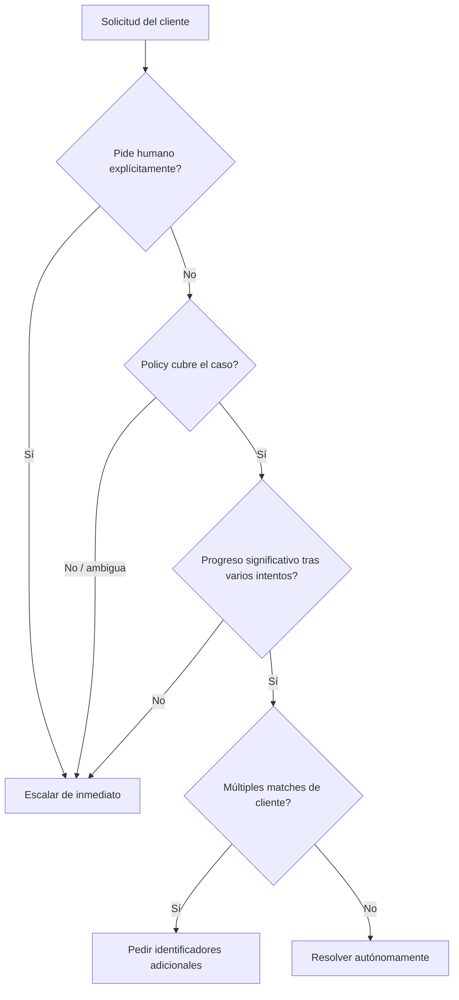
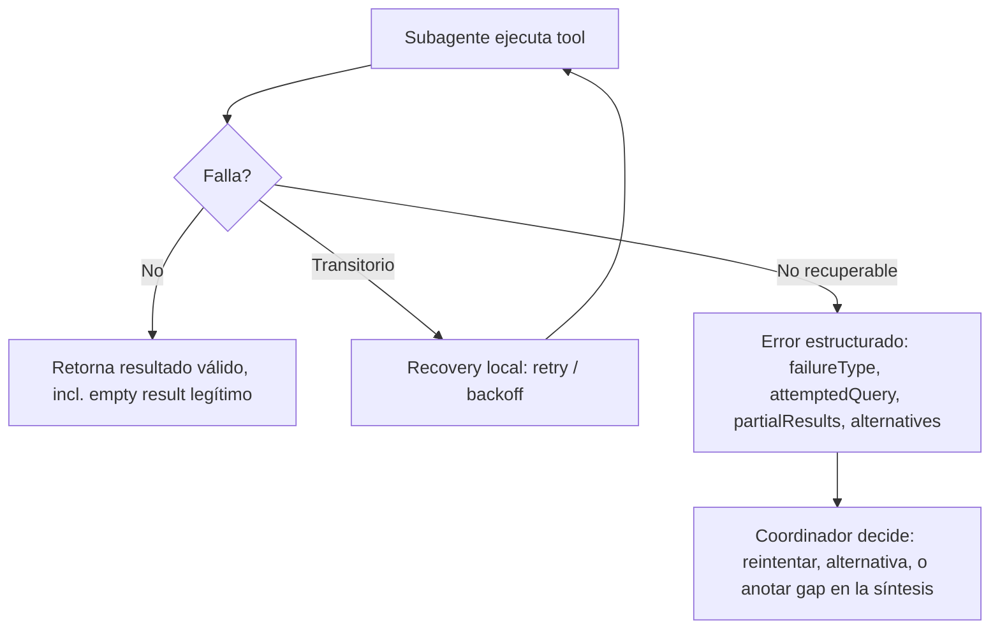

```yaml
---
bloque: 5
nombre: "Gestión de contexto y fiabilidad"
dominio_oficial: "D5"
peso_examen: 15
version: "1.0"
fecha: "2026-08-05"
guia_oficial_examen: "1.0"
task_statements: ["5.1", "5.2", "5.3", "5.4", "5.5", "5.6"]
fuentes:
  - {titulo: "Effective context engineering for AI agents", url: "https://www.anthropic.com/engineering/effective-context-engineering-for-ai-agents", origen: "anthropic", tipo: "blog"}
  - {titulo: "Context windows", url: "https://platform.claude.com/docs/en/build-with-claude/context-windows", origen: "anthropic", tipo: "doc"}
  - {titulo: "Compaction", url: "https://platform.claude.com/docs/en/build-with-claude/compaction", origen: "anthropic", tipo: "doc"}
  - {titulo: "Demystifying evals for AI agents", url: "https://www.anthropic.com/engineering/demystifying-evals-for-ai-agents", origen: "anthropic", tipo: "blog"}
  - {titulo: "How we built our multi-agent research system", url: "https://www.anthropic.com/engineering/built-multi-agent-research-system", origen: "anthropic", tipo: "blog"}
  - {titulo: "Effective harnesses for long-running agents", url: "https://www.anthropic.com/engineering/effective-harnesses-for-long-running-agents", origen: "anthropic", tipo: "blog"}
  - {titulo: "Prompting for long context", url: "https://www.anthropic.com/news/prompting-long-context", origen: "anthropic", tipo: "blog"}
estado: aprobado
---
```

# Bloque 5 — Gestión de contexto y fiabilidad {#bloque-5}

Este bloque corresponde al Dominio 5 oficial (**Context Management & Reliability**, 15% del examen) y cierra el temario abordando la pregunta que atraviesa a los otros cuatro dominios: qué pasa cuando la conversación, la exploración o el sistema multi-agente se alargan lo suficiente como para que el contexto deje de ser fiable. Mientras el Bloque 4 (Agent SDK) se centra en *cómo* orquestar agentes y subagentes, este bloque se centra en *qué* información sobrevive esa orquestación —hechos transaccionales, atribución de fuentes, criterios de escalación— y con qué garantías. El examen evalúa aquí la capacidad de reconocer cuándo un mecanismo automático (compaction, context awareness) es suficiente y cuándo hace falta un patrón de ingeniería explícito (bloques de hechos persistentes, scratchpads, manifiestos de estado, mappings claim-source). Los seis task statements (5.1–5.6) cubren, en este orden, preservación de contexto conversacional, diseño de escalación, propagación de errores entre agentes, exploración de código a gran escala, calibración de revisión humana y preservación de procedencia en síntesis multi-fuente.

## Mapa del bloque

| Task statement | Sección | Conceptos clave |
|---|---|---|
| 5.1 | Preservar contexto crítico en interacciones largas | context rot, lost in the middle, persistent case facts block, trimming de tool outputs |
| 5.2 | Escalación y resolución de ambigüedad | triggers de escalación, proxies no fiables (sentiment, self-reported confidence), clarificación vs heurística |
| 5.3 | Propagación de errores multi-agente | error estructurado, access failure vs empty result, local recovery, coverage annotations |
| 5.4 | Contexto en exploración de codebases grandes | context degradation, scratchpad files, subagent delegation, compaction, manifiestos de estado |
| 5.5 | Revisión humana y calibración de confianza | aggregate accuracy engañosa, stratified sampling, field-level confidence, pass@k vs pass^k |
| 5.6 | Procedencia y manejo de incertidumbre en síntesis | claim-source mappings, anotación de conflictos, metadatos temporales, rendering por tipo de contenido |

---

## 5.1 — Manage conversation context to preserve critical information across long interactions {#ts-5-1}

> *Task statement oficial:* «Manage conversation context to preserve critical information across long interactions»

**Concepto.** A medida que una conversación acumula turnos, la ventana de contexto crece y la precisión de recuperación de información se degrada, fenómeno conocido como **context rot**. No es un límite duro (como agotar tokens): es una degradación progresiva de la fiabilidad con la que el modelo recupera y usa datos concretos, incluso cuando técnicamente todavía caben en la ventana. El problema que resuelve este task statement es cómo diseñar el flujo de información para que los hechos críticos —importes, fechas, números de pedido, expectativas del cliente— sobrevivan intactos aunque la conversación se alargue y se resuma.

**Cómo funciona.** La ventana de contexto (hasta 1M tokens según modelo) contiene el historial de conversación completo más el output nuevo que genera Claude; cada response reporta el consumo exacto en el campo `usage`. La API es stateless, por lo que reenviar el historial de conversación completo en cada request sigue siendo necesario para mantener coherencia conversacional —este es un requisito real, no un anti-patrón—, pero ese requisito choca con dos fenómenos que sí hay que mitigar activamente: el **lost in the middle effect** (los modelos procesan de forma fiable información al principio y al final de entradas largas, pero pueden omitir hallazgos de secciones intermedias) y la **acumulación desproporcionada de tool results** (un resultado de tool puede traer 40+ campos cuando solo 5 son relevantes para la tarea, y esos campos irrelevantes se acumulan en contexto turno tras turno consumiendo presupuesto sin aportar valor). A esto se suma el riesgo de la **progressive summarization**: condensar valores numéricos, porcentajes, fechas y expectativas explícitas del cliente en resúmenes vagos ("el cliente tiene un problema de envío") pierde precisión que después no se puede reconstruir. Claude Sonnet 5, Sonnet 4.6, Sonnet 4.5 y Haiku 4.5 incorporan **context awareness** automático: la API inyecta una etiqueta `<budget:token_budget>` al inicio y actualizaciones `<system_warning>` tras cada tool call, permitiendo que el propio modelo rastree su presupuesto restante y ajuste su comportamiento (p. ej., ser más conciso) sin intervención del desarrollador.

```xml
<!-- Inyectado por la API al inicio de la conversación -->
<budget:token_budget>200000</budget:token_budget>
```

```xml
<!-- Actualización tras cada tool call -->
<system_warning>Token usage: 35000/200000; 165000 remaining</system_warning>
```

```json
// Persistent "case facts" block: se incluye en CADA prompt, fuera del historial resumible
{
  "case_facts": {
    "order_id": "ORD-88214",
    "amount": 129.99,
    "currency": "USD",
    "issue_date": "2026-07-30",
    "customer_stated_expectation": "full refund within 5 business days",
    "status": "shipped"
  }
}
```

**Patrón correcto.** El patrón nuclear es separar dos capas: el historial conversacional completo (necesario para coherencia y se reenvía sin recortar) y una **capa de hechos estructurados** que se extrae y persiste aparte —order IDs, amounts, statuses— para sesiones multi-issue, de forma que ningún resumen posterior pueda diluir esos valores. Sobre esa base se añaden mitigaciones puntuales: recortar tool outputs verbosos a solo los campos relevantes antes de que se acumulen (mantener solo los campos relevantes para un return de una búsqueda de pedido, no los 40+ del payload completo); colocar los resúmenes de hallazgos clave al principio de los inputs agregados y organizar los resultados detallados con headers de sección explícitos, mitigando el efecto de posición; y, en arquitecturas multi-agente, exigir a los subagentes que incluyan metadata (fechas, ubicaciones de fuente, contexto metodológico) en sus outputs estructurados para que la síntesis downstream sea correcta, sustituyendo verbose content y reasoning chains por datos estructurados (key facts, citations, relevance scores) cuando el agente downstream tiene presupuesto de contexto limitado.

**Anti-patrones.** Cargar todos los archivos o toda la información disponible por adelantado ("just in case") consume tokens innecesarios y acelera el context rot; el patrón correcto es exploración bajo demanda (*just-in-time exploration*), cargando datos dinámicamente según se necesiten. Resumir de forma vaga —comprimiendo "pedido #ORD-88214, $129.99, reembolso completo en 5 días" a "el cliente tiene un problema de envío"— parece ahorrar espacio pero destruye precisamente los datos que se necesitarán después para actuar o para justificar una decisión ante el cliente o un auditor.

Un hallazgo relacionado, específico de prompting en contextos largos: pedir al modelo que **extraiga primero a un scratchpad las citas o pasajes relevantes** antes de responder mejora la precisión de recuperación en comparaciones directas frente a responder sin ese paso intermedio, a un coste pequeño de latencia adicional; la mejora se mantiene incluso cuando el pasaje relevante está cerca del principio o del medio del documento, no solo al final. Es el mismo principio de fondo que el bloque de "case facts": obligar a que la información crítica quede escrita explícitamente en algún lugar del contexto en vez de confiar en que el modelo la recupere implícitamente de un historial largo.

**Trampas de examen.** El examen contrapone dos afirmaciones que suenan contradictorias pero no lo son: "hay que reenviar el historial de conversación completo para mantener coherencia" (cierto, es requisito de la API stateless) y "hay que recortar/extraer/resumir agresivamente" (también cierto, pero aplicado selectivamente a tool outputs verbosos y a hechos transaccionales, no al historial conversacional en sí). La opción incorrecta típica generaliza el trimming al historial completo, lo que rompe coherencia; la correcta reconoce que el trimming se aplica a outputs de tools y que los hechos críticos se extraen a un bloque persistente aparte, no se resumen junto con el resto.

**Fuentes.** Context windows — https://platform.claude.com/docs/en/build-with-claude/context-windows · Prompting for long context — https://www.anthropic.com/news/prompting-long-context (hallazgo del scratchpad de extracción de citas) · Guía oficial del examen (Domain 5, Task Statement 5.1).

---

## 5.2 — Design effective escalation and ambiguity resolution patterns {#ts-5-2}

> *Task statement oficial:* «Design effective escalation and ambiguity resolution patterns»

**Concepto.** Un agente autónomo necesita un criterio explícito para decidir cuándo resolver por sí mismo y cuándo escalar a un humano; el problema de fondo es que las señales "obvias" para inferir esa decisión —cuán frustrado suena el cliente, cuán seguro dice estar el propio modelo— no correlacionan de forma fiable con la complejidad real del caso, y diseñar la escalación sobre esas señales produce sistemas que escalan mal en ambas direcciones: casos simples escalados de más y casos complejos resueltos de menos.

**Cómo funciona.** Los triggers de escalación apropiados son tres y están explícitamente delimitados: (1) el cliente solicita explícitamente un humano, (2) existe una excepción o un vacío de policy —no basta con que el caso sea "complejo"—, y (3) el agente no puede hacer progreso significativo tras varios intentos. Sobre el primer trigger hay una distinción fina: si el cliente exige explícitamente un humano, se escala de inmediato, sin intentar investigación previa; si el issue es sencillo y está dentro de las capacidades del agente, se reconoce la frustración del cliente pero se ofrece resolución, escalando solo si el cliente reitera su preferencia. El vacío de policy es un trigger legítimo aunque el caso no sea "difícil" en sí: por ejemplo, un cliente pide igualar el precio de un competidor y la policy solo cubre ajustes de precio en el propio sitio —la policy está silente sobre ese escenario concreto, y eso basta para escalar—. Cuando una búsqueda retorna múltiples matches de cliente, la resolución correcta de la ambigüedad es pedir identificadores adicionales, nunca seleccionar por heurística (p. ej., "el registro más reciente"): la heurística puede llevar a actuar sobre el cliente equivocado.

```text
# Fragmento de system prompt: criterios explícitos + few-shot
Escalate when:
- Customer explicitly requests human agent
- Policy does not address the specific request
- You cannot make meaningful progress after several attempts

Do NOT escalate when:
- Issue is within your capabilities and straightforward
- Customer is frustrated but not requesting a human
```

**Patrón correcto.** El patrón que el examen premia es añadir criterios de escalación explícitos con few-shot examples al system prompt, demostrando cuándo escalar frente a cuándo resolver autónomamente: es la intervención proporcionada y de bajo esfuerzo cuando el problema de fondo es que los límites de decisión son ambiguos. Un caso de producción típico: un agente logra 55% de first-contact resolution frente a un objetivo de 80%; los logs muestran que escala casos sencillos (reemplazos por daño con evidencia fotográfica) mientras intenta resolver autónomamente casos que requieren excepciones de policy. La causa raíz son límites de decisión poco claros, y la solución proporcionada es exactamente esa: criterios explícitos con few-shot en el system prompt, no infraestructura adicional.

**Anti-patrones.** Escalar en función de sentiment analysis (detectar frustración del cliente) es un proxy no fiable porque sentiment no correlaciona con complejidad real: un cliente muy frustrado con un problema trivial no necesita escalación, y uno tranquilo con un caso complejo sí. Usar el confidence score autoreportado del propio modelo como criterio de escalación es igualmente fútil: en sistemas agénticos, cambios menores en el input pueden producir cambios grandes de comportamiento [How we built our multi-agent research system], y el modelo puede mostrarse incorrectamente seguro precisamente en los casos difíciles donde más falla. Desplegar un clasificador separado entrenado con tickets históricos para predecir escalación antes de que el agente principal procese nada es sobre-ingeniería cuando el problema real —criterios ambiguos en el prompt— ni siquiera se ha intentado resolver con la intervención más barata.

**Trampas de examen.** El examen suele presentar la palabra señal "most effective" o "first step" junto a cuatro opciones: criterios explícitos + few-shot (proporcionada, correcta), confidence autoreportado (falla porque el modelo ya está mal calibrado en casos difíciles), un clasificador separado (sobre-ingeniería, requiere datos etiquetados e infraestructura ML no justificada todavía) y sentiment analysis (resuelve un problema distinto: sentiment no es complejidad). La opción correcta es casi siempre la de menor esfuerzo que ataca la causa raíz real (límites de decisión poco claros), no la más sofisticada técnicamente.

**Fuentes.** Guía oficial del examen (Domain 5, Task Statement 5.2, incluye Sample Question 3 del banco de preguntas de práctica) · How we built our multi-agent research system — https://www.anthropic.com/engineering/built-multi-agent-research-system (en sistemas agénticos, cambios menores en el input pueden producir cambios grandes de comportamiento).

<!-- HUECO: 5.2 — Cobertura limitada en fuentes oficiales de blogs/documentación de Anthropic sobre patrones de escalación; el contenido de esta sección procede casi en su totalidad del exam guide oficial y su Sample Question 3, sin ejemplos adicionales de terceros que amplíen umbrales concretos, plantillas de few-shot más extensas o métricas de éxito post-implementación. -->

---

## 5.3 — Implement error propagation strategies across multi-agent systems {#ts-5-3}

> *Task statement oficial:* «Implement error propagation strategies across multi-agent systems»

**Concepto.** Cuando un subagente falla —un timeout, una búsqueda sin resultados, un permiso denegado—, la forma en que ese fallo se comunica al coordinador determina si el sistema puede recuperarse inteligentemente o si el fallo se propaga de forma opaca hasta romper todo el flujo. El problema que resuelve este task statement es diseñar un contrato de error que dé al coordinador la información necesaria para decidir —reintentar, usar una alternativa, o aceptar un resultado parcial— en lugar de un simple booleano de éxito/fracaso.

**Cómo funciona.** El contrato de error estructurado (patrón `isError` de MCP) incluye, más allá del booleano, el tipo de fallo, si es reintentable, un mensaje legible, qué se intentó, resultados parciales si los hay, y alternativas posibles. Esta estructura es lo que habilita decisiones de recuperación inteligentes en el coordinador; un status genérico como "search unavailable" esconde exactamente ese contexto y le impide decidir con criterio. Una distinción central es entre **access failures** (timeouts u otros fallos de acceso que requieren una decisión de reintento) y **valid empty results** (una consulta que se ejecutó correctamente y simplemente no encontró coincidencias): ambos pueden "parecer" lo mismo de cara al coordinador si no se distinguen explícitamente, pero exigen respuestas opuestas. Los subagentes deben implementar recovery local para fallos transitorios (reintentos con backoff, por ejemplo) y solo propagar al coordinador los errores que no pueden resolver por sí mismos, incluyendo qué se intentó y qué resultados parciales obtuvieron. Cuando la síntesis final combina resultados de varios subagentes y alguno falló sin recuperación, el output de síntesis se estructura con **coverage annotations** que indican explícitamente qué hallazgos están bien soportados y qué áreas temáticas tienen huecos por fuentes no disponibles, en lugar de presentar un resultado aparentemente completo que en realidad tiene lagunas silenciosas.

```json
// Contrato de error estructurado (patrón isError de MCP)
{
  "isError": true,
  "errorCategory": "transient",
  "isRetryable": true,
  "message": "Search service timed out after 30s",
  "failureType": "timeout",
  "attemptedQuery": "orders WHERE customer_id = 88214",
  "partialResults": null,
  "alternativeApproaches": ["retry with backoff", "query secondary index"]
}
```

```json
// Error no reintentable, con explicación en vez de status genérico
{
  "isError": true,
  "retriable": false,
  "message": "Customer price match requests are not eligible under current policy"
}
```

**Patrón correcto.** El coordinador recibe siempre contexto de error estructurado —failure type, qué se intentó, resultados parciales, alternativas posibles— nunca un status plano. Los subagentes distinguen explícitamente access failures de empty results legítimos en su reporting, de modo que el coordinador no confunda "no encontré nada" (aceptable) con "no pude buscar" (requiere decisión). Los fallos transitorios se resuelven localmente en el subagente antes de considerar siquiera propagar; solo se propaga lo que el subagente no puede resolver por sí mismo. La síntesis final anota qué partes están bien cubiertas y cuáles tienen gaps, en vez de presentar un resultado uniforme que oculta la incertidumbre real.

**Anti-patrones.** Suprimir errores en silencio —devolver un resultado vacío marcado como éxito cuando en realidad hubo un timeout— esconde el fallo, impide cualquier recuperación y arriesga entregar un output incompleto sin que nadie lo sepa. Propagar una excepción de timeout directamente hasta un handler de nivel superior que termina todo el workflow es el anti-patrón opuesto e igual de dañino: un solo fallo puntual no debería tumbar resultados parciales que sí eran válidos y aprovechables; lo correcto es permitir resultados parciales y alternativas de recuperación. Retornar solo "search unavailable" sin contexto de qué se intentó o qué resultados parciales existen impide que el coordinador tome decisiones informadas —es la versión "boolean" del contrato de error, insuficiente para sistemas multi-agente.

**Trampas de examen.** La confusión central que el examen explota es tratar un empty result válido como si fuera un fallo de acceso (o viceversa): ambos pueden llegar al coordinador como "sin datos", pero solo uno amerita reintento. Otra trampa clásica contrasta dos anti-patrones que suenan opuestos pero son ambos incorrectos —suprimir el error (demasiado silencioso) y terminar todo el workflow (demasiado drástico)— frente a la única opción correcta intermedia: recovery local + propagación estructurada + resultados parciales.

**Fuentes.** Guía oficial del examen (Domain 5, Task Statement 5.3) · How we built our multi-agent research system — https://www.anthropic.com/engineering/built-multi-agent-research-system (recuperación local que retoma el punto donde ocurrió el fallo en vez de reiniciar todo el flujo, y coordinación mediante resultados parciales frente a fallos de subagentes).

---

## 5.4 — Manage context effectively in large codebase exploration {#ts-5-4}

> *Task statement oficial:* «Manage context effectively in large codebase exploration»

**Concepto.** Explorar un codebase grande en una sesión extendida tiene un síntoma de degradación característico: el modelo empieza a dar respuestas inconsistentes y a referenciar "patrones típicos" en lugar de las clases concretas que había descubierto anteriormente en esa misma sesión. El problema que resuelve este task statement es cómo estructurar la exploración —qué se delega, qué se persiste, qué se comprime— para que ese conocimiento adquirido no se diluya según avanza la sesión.

**Cómo funciona.** Tres mecanismos complementarios (no intercambiables) atacan la degradación desde ángulos distintos. Los **scratchpad files** persisten hallazgos clave a través de los límites de contexto: el agente escribe notas fuera de la ventana de contexto y las recupera después para preguntas subsecuentes, contrarrestando directamente el efecto de "olvidar" clases o patrones descubiertos antes. La **delegación en subagentes** aísla el output verboso de la exploración (leer decenas de archivos, greps extensos) mientras el agente principal coordina el entendimiento de alto nivel sin cargar ese ruido en su propio contexto; se generan subagentes para investigar preguntas concretas ("find all test files", "trace refund flow dependencies") mientras el agente principal preserva la coordinación. La **persistencia estructurada de estado** habilita recuperación ante caídas: cada agente exporta su estado a una ubicación conocida (manifiesto), y el coordinador carga ese manifiesto al reanudar e inyecta su contenido en los prompts de los agentes. Este mismo patrón aparece con artefactos concretos con nombre en el diseño de harnesses para agentes de larga duración: un **fichero de progreso** (`claude-progress.txt`) mantiene un log de lo que el agente ya ha hecho, y se lee al inicio de cada sesión con contexto fresco para entender el estado del proyecto sin tener que redescubrirlo; un **`feature_list.json`** enumera las features previstas con un campo `passes` (pass/fail) que el agente solo puede actualizar, nunca borrar o editar la definición de la feature, para no enmascarar funcionalidad rota o pendiente; los **commits de git** documentan el progreso con mensajes descriptivos y sirven como puntos de recuperación explícitos a los que revertir si un cambio deja el código en mal estado; y un **script de bootstrap** (`init.sh`) se ejecuta al iniciar sesión para arrancar el entorno de desarrollo en un estado conocido antes de retomar el trabajo. Son, en esencia, el mismo manifiesto genérico de estado descrito arriba, pero materializado en artefactos con nombre y responsabilidad concretos en vez de un JSON de estructura libre. Independientemente de estos tres, la **compaction** es un mecanismo de plataforma (beta) que resume automáticamente la conversación cuando se dispara un umbral de tokens, reduciendo el uso de contexto sin intervención manual del agente; el comando `/compact` de Claude Code aplica esta misma idea bajo demanda durante sesiones de exploración extendidas cuando el contexto se llena de output de descubrimiento verboso.

```python
# Compaction API (beta): resumen automático al alcanzar el umbral
response = client.beta.messages.create(
    betas=["compact-2026-01-12"],
    model="claude-opus-5",
    max_tokens=4096,
    messages=messages,
    context_management={"edits": [{"type": "compact_20260112"}]}
)
```

```text
# Parámetros de compaction
trigger: 150,000 tokens (mínimo configurable: 50,000)
pause_after_compaction: false (valor por defecto)
instructions: None (usa el resumen por defecto si no se especifica)
```

```json
// Manifiesto de estado exportado por un agente (recuperación ante caída)
{
  "phase": "codebase_analysis",
  "key_findings": {
    "entry_points": ["src/main.ts", "src/index.ts"],
    "key_classes": ["UserService", "AuthHandler"],
    "dependencies_identified": {}
  },
  "files_analyzed": ["src/auth.ts", "src/user.ts"],
  "questions_pending": ["find all test files", "trace refund flow"]
}
```

**Patrón correcto.** La construcción de entendimiento de un codebase se hace de forma incremental: se empieza con Grep para localizar puntos de entrada, y se usa Read para seguir imports y trazar flujos, en vez de leer todo por adelantado. Antes de generar subagentes para la siguiente fase de exploración, se resumen los hallazgos clave de la fase anterior y ese resumen se inyecta en el contexto inicial de los nuevos subagentes, evitando que cada fase redescubra desde cero lo que la anterior ya sabía. El diseño de recuperación ante caídas se apoya en exports de estado estructurados (manifiestos) que el coordinador carga al reanudar, no en reiniciar la exploración desde el principio.

**Anti-patrones.** Sobrecargar un único agente sin ningún tipo de delegación hace que acumule contexto verboso de la exploración completa y pierda la coordinación de alto nivel que debería mantener: es la falta de aislamiento entre "detalle de exploración" y "entendimiento general". No persistir hallazgos a través de los límites de contexto —sin scratchpads ni exports de estado— provoca que, al agotarse el contexto y comenzar una sesión nueva, los hallazgos clave ya descubiertos se pierdan, y el agente empiece a referenciar "patrones típicos" genéricos en lugar de las clases específicas que ya había identificado.

**Trampas de examen.** El examen distingue tres mecanismos que suenan intercambiables pero no lo son: compaction (resumen automático a nivel de API/plataforma, activado por umbral de tokens), scratchpad (persistencia manual de hallazgos por decisión del agente, no es un resumen sino notas explícitas) y delegación en subagentes (aislamiento de contexto verboso, no persistencia). Una opción distractora típica presenta el uso de `/compact` como sustituto de mantener scratchpads, cuando en realidad son complementarios: compaction resume lo acumulado, el scratchpad preserva hallazgos concretos que un resumen automático podría diluir.

**Fuentes.** Guía oficial del examen (Domain 5, Task Statement 5.4) · Compaction — https://platform.claude.com/docs/en/build-with-claude/compaction · Context windows — https://platform.claude.com/docs/en/build-with-claude/context-windows · Effective harnesses for long-running agents — https://www.anthropic.com/engineering/effective-harnesses-for-long-running-agents (`claude-progress.txt`, `feature_list.json`, commits de git como puntos de recuperación, `init.sh`).

---

## 5.5 — Design human review workflows and confidence calibration {#ts-5-5}

> *Task statement oficial:* «Design human review workflows and confidence calibration»

**Concepto.** Cuando un sistema de extracción o clasificación reporta una métrica de precisión agregada alta (p. ej. 97% overall), esa cifra puede enmascarar un rendimiento pobre en tipos de documento o campos específicos que quedan diluidos en el promedio. El problema que resuelve este task statement es cómo diseñar el flujo de revisión humana y la calibración de confianza para que la reducción de revisión manual se apoye en evidencia por segmento, no en una media global que puede ocultar fallos concentrados.

**Cómo funciona.** El riesgo de fondo es que la accuracy agregada esconda que un tipo de documento tiene, por ejemplo, 50% de accuracy mientras otro tiene 99%: las extracciones de alta confianza del segmento con baja accuracy real seguirían siendo auto-aprobadas y fallando. Para mitigarlo, se aplica **stratified random sampling** sobre las extracciones de alta confianza, tanto para medir tasas de error reales como para detectar patrones de error nuevos que no se habían anticipado. Los modelos deben producir **confidence scores a nivel de campo** (no solo a nivel de documento), y esos scores se calibran contra conjuntos de validación etiquetados antes de usarlos para enrutar la atención de revisión: un confidence score sin calibrar puede estar mal calibrado (el modelo dice 95% de confianza cuando la accuracy real es 60%). Antes de automatizar cualquier extracción de alta confianza, es necesario validar la accuracy por tipo de documento y por segmento de campo, verificando rendimiento consistente en todos los segmentos. Relacionado con esto, en el diseño de evaluaciones de fiabilidad de agentes es clave distinguir **pass@k** (probabilidad de obtener al menos una solución correcta en k intentos) de **pass^k** (probabilidad de que los k intentos sean TODOS exitosos), siendo esta última la métrica relevante cuando los usuarios esperan comportamiento fiable de forma consistente, no solo "acertar alguna vez". Los modelos-juez basados en LLM usados para evaluar a otros agentes deben calibrarse cuidadosamente contra expertos humanos para minimizar divergencias entre la evaluación automática y la humana, y las puntuaciones bajas deben revisarse sistemáticamente para distinguir si reflejan limitaciones reales del agente o problemas de la propia evaluación (especificaciones ambiguas, graders defectuosos). Este bloque de pass@k/pass^k y calibración de jueces LLM procede de "Demystifying evals for AI agents" (fuente oficial asignada a este bloque) y se incluye aquí porque complementa directamente el skill de calibración de confianza del TS 5.5 —aplicado a evaluar la fiabilidad del propio agente en vez de a la extracción documental, que es el foco literal del enunciado del task statement.

```json
// Confidence score a nivel de campo
{
  "extracted_field": "value",
  "confidence_score": 0.92,
  "field_type": "date",
  "should_review": false
}
```

```text
# Umbral de revisión calibrado (ejemplo ilustrativo, no es una cifra oficial del examen)
If confidence < 0.70: route to human review
If ambiguous or contradictory source document: route to human review
Otherwise: auto-approve
```

**Patrón correcto.** Antes de reducir la revisión humana en cualquier segmento, se analiza la accuracy por tipo de documento y por campo para confirmar rendimiento consistente en todos ellos. En paralelo, se mantiene un muestreo aleatorio estratificado sobre las extracciones de alta confianza como mecanismo continuo de medición de error y detección de patrones nuevos, no como una validación puntual de lanzamiento. El enrutamiento a revisión humana combina confianza de campo calibrada con detección de ambigüedad o contradicción en el documento origen, priorizando la capacidad limitada del revisor humano hacia los casos donde realmente aporta valor. Para evaluación de agentes, se construyen conjuntos de prueba balanceados —que verifican tanto que un comportamiento SÍ ocurra donde debe como que NO ocurra donde no debe— y se calibra periódicamente al evaluador automático contra estudios humanos estructurados.

**Anti-patrones.** Apoyarse solo en métricas agregadas ("97% overall accuracy") sin desglose por tipo de documento o campo esconde que un segmento concreto tiene una accuracy mucho más baja, y ese segmento sigue auto-aprobándose con extracciones de alta confianza que en realidad fallan con frecuencia. No calibrar los confidence scores del modelo contra un conjunto de validación etiquetado deja que scores mal calibrados —alta confianza aparente con accuracy real baja— determinen el enrutamiento de revisión, socavando todo el propósito de la calibración de confianza.

**Trampas de examen.** El distractor típico presenta la accuracy agregada alta como justificación suficiente para reducir la revisión humana; la opción correcta exige primero segmentar por tipo de documento/campo y validar consistencia antes de automatizar. Otro par de conceptos que el examen contrapone deliberadamente es pass@k vs pass^k: la opción incorrecta usa pass@k (al menos un acierto) como si fuera la métrica relevante para fiabilidad consistente, cuando pass^k (todos los intentos correctos) es la que importa quándo el usuario espera comportamiento fiable en cada ejecución, no solo en la mejor de varias.

**Fuentes.** Guía oficial del examen (Domain 5, Task Statement 5.5) · Demystifying evals for AI agents — https://www.anthropic.com/engineering/demystifying-evals-for-ai-agents.

<!-- HUECO: 5.5 — Cobertura limitada en fuentes oficiales sobre patrones detallados de routing de revisión humana con ejemplos prácticos de umbrales de confianza en producción; el blog "Demystifying evals for AI agents" aporta las métricas (pass@k, pass^k, calibración de jueces LLM) pero no casos de despliegue con cifras concretas de umbral, volumen de revisión o coste del reviewer humano. -->

---

## 5.6 — Preserve information provenance and handle uncertainty in multi-source synthesis {#ts-5-6}

> *Task statement oficial:* «Preserve information provenance and handle uncertainty in multi-source synthesis»

**Concepto.** Cuando varios subagentes investigan fuentes distintas y sus hallazgos se combinan en una síntesis final, es fácil perder la trazabilidad de qué afirmación proviene de qué fuente durante los pasos de compresión y resumen. El problema que resuelve este task statement es cómo preservar esa procedencia (*provenance*) y cómo representar honestamente la incertidumbre —estadísticas conflictivas entre fuentes creíbles, diferencias temporales entre datos— en lugar de aplanarlas en una única respuesta aparentemente segura.

**Cómo funciona.** La atribución de fuente se pierde durante los pasos de resumen cuando los hallazgos se comprimen sin preservar los **claim-source mappings** (qué afirmación concreta proviene de qué fuente concreta); por eso es importante exigir a los subagentes que produzcan esos mappings de forma estructurada —URLs de fuente, nombres de documento, extractos relevantes— y que el agente de síntesis los preserve y los combine explícitamente al fusionar hallazgos, en vez de reescribirlos como prosa genérica. Cuando dos fuentes creíbles reportan estadísticas distintas para el mismo hecho, el tratamiento correcto es **anotar el conflicto con atribución de fuente** para cada valor, no seleccionar arbitrariamente uno de los dos. Los datos temporales son otra fuente de falsos conflictos: si el output estructurado no exige fecha de publicación o de recolección de cada dato, una diferencia temporal real (un dato de mayo frente a uno de junio) puede malinterpretarse como una contradicción cuando en realidad simplemente cambió el valor con el tiempo. Por último, distintos tipos de contenido merecen renderizados distintos en la síntesis final —datos financieros como tablas, noticias como prosa, hallazgos técnicos como listas estructuradas— en lugar de forzar todo a un formato uniforme, que pierde las convenciones que facilitan la lectura de cada tipo de dato. Algunos sistemas multi-agente dedican un agente especializado (**CitationAgent**) exclusivamente a localizar la ubicación exacta de cada cita y asegurar que toda afirmación del reporte final quede correctamente atribuida a su fuente.

```json
// Claim-source mapping estructurado
{
  "claim": "AI adoption in music production increased 45% in 2025",
  "sources": [
    {
      "source_url": "https://example.com/report",
      "document_name": "Music Industry Report 2025",
      "relevant_excerpt": "45% year-over-year increase...",
      "publication_date": "2025-06-15"
    }
  ],
  "confidence": "high",
  "conflict_detected": false
}
```

```json
// Estadísticas conflictivas: se anotan ambas con atribución, no se elige una
{
  "metric": "AI adoption in music",
  "values": [
    {"value": "45%", "source": "Music Industry Report 2025", "publication_date": "2025-06-15"},
    {"value": "38%", "source": "Tech Market Analysis", "publication_date": "2025-05-20"}
  ],
  "interpretation": "Different measurement methodologies; dates differ by one month"
}
```

**Patrón correcto.** Los subagentes producen siempre claim-source mappings estructurados que los agentes downstream preservan a través de la síntesis, en lugar de convertir los hallazgos en prosa libre sin trazabilidad. El reporte final estructura secciones explícitas que distinguen hallazgos bien establecidos de hallazgos contestados, preservando la caracterización original de la fuente y su contexto metodológico. Cuando el análisis de documentos detecta valores conflictivos, se completan con esos conflictos explícitamente anotados, dejando que el coordinador —no el subagente individual— decida cómo reconciliarlos antes de pasar a síntesis. Los outputs estructurados incluyen siempre fecha de publicación o de recolección para permitir una interpretación temporal correcta, y el renderizado final respeta las convenciones de cada tipo de contenido.

**Anti-patrones.** Perder la atribución durante la compresión —resumir hallazgos sin preservar los claim-source mappings— produce un output sintetizado donde es imposible rastrear qué fuente dijo qué, lo que imposibilita la verificación y permite que se cuelen afirmaciones no respaldadas. Seleccionar arbitrariamente uno de dos valores conflictivos de fuentes creíbles esconde la incertidumbre real y puede inducir a error al lector, que cree estar viendo un dato consensuado cuando en realidad hay discrepancia sin resolver. Sin fechas de publicación en los outputs, diferencias temporales legítimas pueden malinterpretarse como conflictos reales entre fuentes cuando simplemente reflejan el paso del tiempo. Convertir todos los hallazgos a un formato uniforme (todo como prosa, por ejemplo) pierde las convenciones específicas de cada tipo de contenido —una tabla facilita comparar cifras financieras de un vistazo, algo que la prosa no ofrece igual de bien.

**Trampas de examen.** El examen contrasta "resolver el conflicto eligiendo la fuente más reciente o más creíble" (incorrecto: oculta la incertidumbre) frente a "anotar ambos valores con su atribución y dejar la interpretación al lector o al coordinador" (correcto). También aparece como distractor tratar una diferencia temporal entre dos cifras como una contradicción de fondo, cuando la causa real es la ausencia de metadatos de fecha en el output estructurado.

**Fuentes.** Guía oficial del examen (Domain 5, Task Statement 5.6) · How we built our multi-agent research system — https://www.anthropic.com/engineering/built-multi-agent-research-system (patrón CitationAgent).

---

## Tabla de decisión del dominio {#ts-5-decision}

| Situación | Elección correcta | Por qué |
|---|---|---|
| Conversación larga con hechos transaccionales críticos (importes, fechas, IDs) | Bloque "case facts" persistente fuera del historial resumible | Un resumen posterior no puede diluir valores que nunca entraron en el historial resumible |
| Tool result con 40+ campos, solo 5 relevantes | Recortar (*trim*) a los campos relevantes antes de que se acumulen en contexto | Evita consumir presupuesto de tokens en datos irrelevantes para la tarea |
| Cliente exige explícitamente un humano | Escalar de inmediato, sin investigar antes | Honrar la preferencia explícita del cliente tiene prioridad sobre cualquier intento de resolución |
| Detectar cuándo escalar es ambiguo en el prompt | Criterios explícitos + few-shot examples en el system prompt | Es la intervención de menor esfuerzo que ataca la causa raíz (límites de decisión poco claros) |
| Decidir si un caso es "complejo" | Nunca sentiment analysis ni confidence autoreportado del modelo | Ninguno de los dos correlaciona de forma fiable con la complejidad real del caso |
| Subagente sufre un timeout transitorio | Recovery local (retry/backoff) antes de propagar | Solo se propaga al coordinador lo que el subagente no puede resolver por sí mismo |
| Un subagente falla sin recuperación posible | Propagar error estructurado (failure type, attempted query, partial results, alternatives) | Habilita al coordinador tomar una decisión informada, no un simple fallback genérico |
| Exploración de un codebase grande y complejo | Grep para localizar entry points + Read incremental, subagentes para preguntas puntuales | Evita cargar todo el codebase de golpe y preserva coordinación de alto nivel en el agente principal |
| Sesión de exploración muy larga con contexto saturado | `/compact` (resumen) + scratchpad (hallazgos concretos) combinados, no uno sustituyendo al otro | Compaction resume lo acumulado; el scratchpad preserva hallazgos que un resumen automático podría diluir |
| Accuracy agregada alta (p. ej. 97%) antes de reducir revisión humana | Validar por tipo de documento y campo con stratified sampling primero | La media puede esconder un segmento con accuracy mucho más baja que sigue auto-aprobándose |
| Dos fuentes creíbles reportan cifras distintas para el mismo hecho | Anotar ambos valores con atribución de fuente, no elegir uno | Elegir arbitrariamente oculta la incertidumbre real ante quien lee la síntesis |

## Diagramas



El diagrama muestra que la escalación se decide por triggers explícitos en cascada —petición explícita, vacío de policy, falta de progreso, ambigüedad de identidad— y nunca por proxies indirectos como sentiment o confidence autoreportado.



El diagrama muestra que solo los fallos que el subagente no puede resolver localmente llegan al coordinador, y siempre como contexto estructurado —nunca como un status genérico— para habilitar una decisión de recuperación informada.

## Deuda conocida

<!-- HUECO: 5.2 — Cobertura limitada en fuentes oficiales sobre patrones de escalación más allá del exam guide y su Sample Question 3; faltan ejemplos adicionales de terceros con umbrales concretos o plantillas de few-shot más extensas. -->
<!-- HUECO: 5.5 — Cobertura limitada en fuentes oficiales sobre patrones detallados de routing de revisión humana con ejemplos prácticos de despliegue (umbrales de confianza en producción, volumen de revisión, coste del reviewer humano); el blog "Demystifying evals for AI agents" cubre las métricas (pass@k, pass^k, calibración de jueces LLM) pero no casuística operativa de human review workflows. -->
