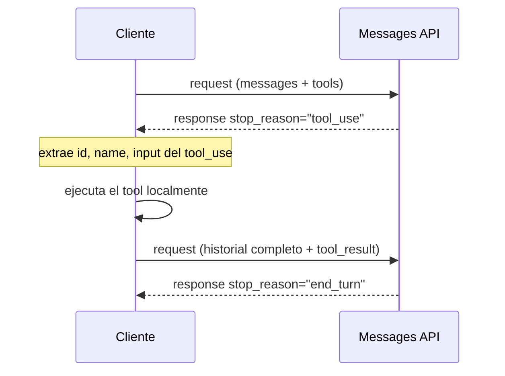
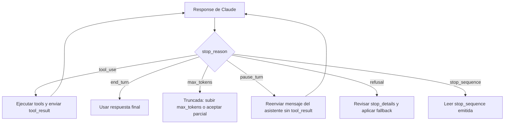

# Bloque 0 — Fundamentos: API de Claude, tool use y bucle agéntico

> **Versión:** 1.0 · **Fecha:** 2026-08-05 · **Generada desde:** corpus v1.0 · **Guía oficial del examen:** v1.0
> **Peso en el examen:** transversal (sin dominio propio; sustenta los Task Statements 1.1, 2.1, 2.3 y 4.3) · **Escenarios donde cae:** distractores de mecánica de la API incrustados en preguntas de los cinco dominios examinables
## Qué evalúa el examen en este bloque

Este bloque no tiene preguntas propias en el blueprint oficial —no aparece como dominio ni lleva peso asignado—, pero el examen da por sentado su dominio como base mecánica de los cinco dominios evaluables y lo explota como fuente de distractores en preguntas de nivel superior. Cuando una pregunta de arquitectura multi-agente (dominio 1) menciona `stop_reason`, o cuando una pregunta de diseño de tools (dominio 2) contrasta dos descripciones parecidas, lo que realmente se mide es si dominas esta mecánica de base, no solo el concepto de nivel superior que la envuelve. Un ejemplo típico de enunciado: se muestra un fragmento de código con el orden de content blocks invertido (`text` antes que `tool_result`) y se pregunta qué ocurre al enviar ese request, o se presenta un `stop_reason: "pause_turn"` y se pide identificar el siguiente paso correcto del cliente. Los seis ejes de este bloque (0.1 a 0.6) recorren, en orden, la anatomía del request/response, la definición de tools, el ciclo `tool_use`/`tool_result`, el control por `stop_reason`, las opciones de `tool_choice`, y la frontera entre decisión dirigida por el modelo y flujo determinista.

## Antes de empezar

Este es el primer bloque del curso: no exige haber completado ningún otro antes. Sí conviene llegar con familiaridad general en el uso de una API REST y en JSON Schema, porque el bloque no se detiene a explicar esos fundamentos genéricos, solo su aplicación específica en la Messages API de Claude. Al terminarlo deberías poder leer cualquier fragmento de código de un bucle agéntico —correcto o defectuoso— y saber de inmediato en qué campo mirar primero: antes de razonar sobre arquitectura multi-agente, diseño de tools o gestión de contexto (bloques siguientes), hay que dominar esta mecánica de base.

---

## Lección 1 — Anatomía de la Messages API: request, response y la trampa del estado {#leccion-0-1}

La Messages API (`POST /v1/messages`) es el único punto de entrada a Claude, y entenderla bien es el primer filtro que separa a quien sabe construir un bucle agéntico de quien lo intenta a base de prueba y error. La razón de que exista como endpoint único, sin variantes por caso de uso, es que todo —desde una pregunta suelta hasta un agente que encadena veinte llamadas a tools— se reduce a la misma forma de request. Y esa forma esconde la asunción que más bugs de arranque provoca: la API es completamente **stateless** (sin estado). El servidor no recuerda nada entre dos requests; cada iteración de un bucle agéntico es, literalmente, un request nuevo que reenvía el historial completo acumulado hasta ese punto. Si el cliente no reconstruye y envía ese historial, el modelo simplemente no lo tiene.

Un request lleva `model`, `max_tokens` (obligatorio) y el array `messages`; opcionalmente, `system` como parámetro **top-level**, nunca como un mensaje con `role: "system"` dentro del array (la única excepción documentada son *system messages* a mitad de conversación en Claude Opus 5, Opus 4.8, Fable 5 y Mythos 5, y siempre después de un turno de usuario). Cada elemento de `messages` tiene `role` (`user` o `assistant`) y `content` (string o array de content blocks). `max_tokens` acota únicamente el presupuesto de tokens de **salida**: si la generación lo agota a media respuesta, `stop_reason` pasa a `"max_tokens"`, y no tiene nada que ver con el tamaño de la ventana de contexto. La response devuelve `id`, `type: "message"`, `role: "assistant"`, `content` (array de blocks generados por el modelo: `text` y `tool_use` — los blocks `tool_result` pertenecen siempre a mensajes `role: "user"` que construye el cliente, nunca a la respuesta del asistente), `model`, `stop_reason`, `stop_sequence` (`null` si no aplica) y `usage` (`input_tokens`, `output_tokens`).

```json
// Request básico
{
  "model": "claude-opus-5",
  "max_tokens": 1024,
  "system": "You are a helpful assistant.",
  "messages": [
    {"role": "user", "content": "Hello, Claude"},
    {"role": "assistant", "content": "Hello!"},
    {"role": "user", "content": "Can you describe LLMs?"}
  ]
}
```

```json
// Response de éxito
{
  "id": "msg_01XFDUDYJgAACzvnptvVoYEL",
  "type": "message",
  "role": "assistant",
  "content": [{"type": "text", "text": "LLMs are..."}],
  "model": "claude-opus-5",
  "stop_reason": "end_turn",
  "stop_sequence": null,
  "usage": {"input_tokens": 12, "output_tokens": 6}
}
```

El patrón correcto para multi-turno es simple: hacer *append* de cada turno (mensaje de usuario, respuesta del asistente) al array `messages` local del cliente, y reenviar ese array completo en el siguiente request. Es literalmente el mecanismo que sostiene la conversación progresiva y, extendido con `tool_result`, el bucle agéntico completo. Un detalle que suele sorprender: los turnos previos no tienen por qué provenir de respuestas reales del modelo — la documentación oficial permite mensajes `assistant` **sintéticos** construidos por el propio cliente (few-shot conversacional, contexto preconfigurado), un patrón válido y frecuente en producción.

En producción, el síntoma de no haber interiorizado esto es reconocible al instante: un agente que "olvida" lo que el usuario dijo hace tres turnos, o que responde con normalidad a la primera pregunta y luego empieza a repetir información ya dada. La causa casi siempre es la misma: alguien, buscando "ahorrar tokens", empezó a enviar solo el último turno en vez del historial completo, sin darse cuenta de que sin ese historial el modelo literalmente no tiene memoria de nada anterior — no es que "se le olvide", es que nunca lo recibió.

El anti-patrón gemelo, más sutil, es colocar `system` como un mensaje dentro del array (`{"role": "system", "content": "..."}`). Alguien razonable podría pensar que, si `messages` acepta roles, `system` debería ser uno más — pero eso produce error o comportamiento indefinido, porque `system` está reservado como parámetro top-level, fuera del array. El examen explota exactamente esta confusión como distractor: presenta un ejemplo con `system` dentro de `messages` y pregunta si es válido.

**Regla mnemotécnica:** `system` siempre es top-level, nunca un rol dentro de `messages` (salvo la excepción de mid-conversation system messages en los cuatro modelos citados); `max_tokens` limita solo la salida, nunca el contexto total.

> **Mini-check 1.** ¿Dónde debe ir el parámetro `system` en un request a la Messages API?
> - [ ] A. Como un mensaje `{"role": "system", ...}` dentro del array `messages`.
> - [x] B. Como parámetro top-level del request, fuera del array `messages`.
> - [ ] C. Dentro de `tools`, junto a la definición de cada tool.
>
> _Respuesta: B — salvo la excepción de mid-conversation system messages en modelos concretos (Opus 5, Opus 4.8, Fable 5, Mythos 5), `system` siempre es un parámetro top-level, nunca un mensaje con role `system` dentro del array._

📖 Para profundizar: Working with the Messages API (https://platform.claude.com/docs/en/build-with-claude/working-with-messages) cubre la anatomía completa del request/response, los roles y el patrón multi-turno con más ejemplos que los aquí resumidos.

---

## Lección 2 — Definición de tools con JSON Schema: description, input_schema y strict tool use {#leccion-0-2}

Una tool se define con `name` (regex `^[a-zA-Z0-9_-]{1,64}$`), `description` (texto plano) e `input_schema` (JSON Schema con `type: "object"`, `properties` y `required`); opcionalmente `input_examples`, un array de instancias válidas del schema. La razón de que esto merezca una lección propia dentro de "fundamentos" es que la `description` es el **único** mecanismo que tiene el modelo para decidir cuándo y cómo invocar una tool: no existe un canal adicional de "intención" fuera de ese texto, así que su calidad determina de forma directa la fiabilidad de la selección de tools en producción.

Una descripción efectiva cubre qué hace la tool, cuándo usarla (y cuándo NO), qué significa cada parámetro y cómo afecta al comportamiento, caveats o limitaciones explícitas, y ejemplos de entrada si el input es complejo. Compárense estas dos definiciones para la misma tool:

```json
// Descripción POBRE (distractor típico)
{
  "name": "get_stock_price",
  "description": "Gets the stock price for a ticker.",
  "input_schema": {
    "type": "object",
    "properties": {"ticker": {"type": "string"}},
    "required": ["ticker"]
  }
}
```

```json
// Descripción BUENA: qué hace, cuándo usarla, límites explícitos
{
  "name": "get_stock_price",
  "description": "Retrieves the current stock price for a given ticker symbol. The ticker symbol must be a valid symbol for a publicly traded company on a major US stock exchange like NYSE or NASDAQ. The tool will return the latest trade price in USD. It should be used when the user asks about the current or most recent price of a specific stock. It will not provide any other information about the stock or company.",
  "input_schema": {
    "type": "object",
    "properties": {
      "ticker": {"type": "string", "description": "The stock ticker symbol, e.g. AAPL for Apple Inc."}
    },
    "required": ["ticker"]
  }
}
```

La primera versión no dice nada sobre mercado admitido, formato de salida ni límites — el modelo tiene que adivinar. El campo `input_examples` refuerza esto para parámetros opcionales o complejos, a un coste aproximado de 20-50 tokens por ejemplo simple (100-200 para ejemplos complejos), aunque **no está soportado en server-side tools**:

```json
// input_examples para parámetros opcionales/complejos
{
  "name": "get_weather",
  "description": "Get the current weather in a given location",
  "input_schema": {
    "type": "object",
    "properties": {
      "location": {"type": "string", "description": "The city and state, e.g. San Francisco, CA"},
      "unit": {"type": "string", "enum": ["celsius", "fahrenheit"], "description": "The unit of temperature"}
    },
    "required": ["location"]
  },
  "input_examples": [
    {"location": "San Francisco, CA", "unit": "fahrenheit"},
    {"location": "Tokyo, Japan", "unit": "celsius"},
    {"location": "New York, NY"}
  ]
}
```

`strict: true` añade una garantía distinta: mediante *grammar-constrained sampling* (muestreo restringido por gramática) sobre el `input`, asegura que toda llamada a la tool matchea el schema exactamente —sin parámetros requeridos ausentes ni type mismatches— y funciona **con cualquier valor de `tool_choice`**, incluida `"auto"`: la garantía aplica siempre que Claude decida llamar a esa tool. Combinarlo con `tool_choice: "any"` añade una segunda garantía, independiente — que la llamada se produzca —, logrando la garantía compuesta llamada + conformidad de schema:

```json
// "any" + strict: true — garantía combinada de llamada Y schema compliance
{
  "tools": [
    {"name": "extract_data", "description": "...", "strict": true, "input_schema": {}}
  ],
  "tool_choice": {"type": "any"}
}
```

Cuando el catálogo de tools crece, conviene consolidar: 4-5 tools con un parámetro `action` reducen la ambigüedad de selección frente a 20 tools hiperespecíficas; y cuando las tools abarcan varios servicios, el *namespacing* con prefijo (`github_list_prs`, `slack_send_message`) evita confusión entre integraciones parecidas.

En producción, el síntoma más habitual de una `description` pobre es el *misrouting*: dos tools parecidas (`analyze_content` vs `analyze_document`) y el modelo eligiendo la equivocada porque nada en el texto marcaba la frontera entre ambas. La solución no es tocar el schema, es reescribir la prosa de `description` para que explique explícitamente cuándo elegir una u otra.

El anti-patrón gemelo, más peligroso, ocurre en el schema: marcar como `required` un campo que el documento origen no siempre trae (por ejemplo `customer_phone` en un formulario donde ese dato es opcional). Alguien razonable piensa "si es obligatorio en el output, márcalo required" — pero el modelo no fabricará valores de la nada para satisfacer un campo requerido; el resultado es un dato inventado (alucinado) para rellenar el hueco. La solución aquí tampoco es la `description`: es marcar el campo como opcional/nullable en el schema, y si se necesita categorización extensible, usar el patrón `enum` + campo `"other"` con detalle en string.

**Tabla de decisión — dos fallos distintos, dos soluciones distintas:**

| Síntoma observado | Causa | Solución |
|---|---|---|
| Claude llama a la tool equivocada entre dos parecidas | `description` insuficiente (no marca la frontera de uso) | Reescribir `description`: cuándo sí, cuándo no, con ejemplos |
| Claude inventa un valor para un campo que el origen no siempre tiene | `input_schema` insuficiente (campo marcado `required` sin serlo realmente) | Marcar el campo opcional/nullable, o usar `enum` + `"other"` |

**Trampa de examen:** el distractor típico afirma que `strict: true` "solo funciona con `tool_choice: 'any'` o tool forzada" — es falso: `strict` garantiza conformidad de schema con cualquier `tool_choice`; lo que aporta `"any"` es la garantía adicional de que la llamada se produzca.

> **Mini-check 2.** Si defines una tool con `strict: true` y dejas `tool_choice: "auto"` (el valor por defecto), ¿qué garantiza la API?
> - [ ] A. Nada: `strict` solo funciona combinado con `tool_choice: "any"` o una tool forzada.
> - [x] B. Que, si Claude decide llamar a esa tool, el `input` cumplirá exactamente el `input_schema`.
> - [ ] C. Que Claude llamará obligatoriamente a esa tool en algún momento de la conversación.
>
> _Respuesta: B — `strict` garantiza conformidad de schema con cualquier valor de `tool_choice`, incluido `"auto"`; lo que aporta `"any"` es una garantía independiente y adicional: que la llamada se produzca._

📖 Para profundizar: Define tools (https://platform.claude.com/docs/en/agents-and-tools/tool-use/define-tools) detalla cómo escribir descripciones efectivas y el uso de `input_examples`; Strict tool use (https://platform.claude.com/docs/en/agents-and-tools/tool-use/strict-tool-use) explica el grammar-constrained sampling detrás de `strict: true`.

---

## Lección 3 — El ciclo tool_use/tool_result: el mecanismo real del bucle agéntico {#leccion-0-3}

Si el bloque anterior explicaba cómo describir una tool, este explica qué pasa cuando el modelo decide usarla — y es, en la práctica, el mecanismo concreto en el que se reduce todo "agentic loop" del examen: Claude emite una petición de llamada a tool, el cliente la ejecuta fuera del modelo, y el resultado vuelve a entrar en el historial para que el modelo razone sobre el siguiente paso.



El diagrama muestra que la API es stateless: cada iteración del bucle agéntico reenvía el historial completo acumulado por el cliente, y es el cliente quien decide cuándo terminar el ciclo según el valor de `stop_reason`.

La secuencia para **client tools** es: (1) request con array `tools` y mensaje de usuario; (2) response con `stop_reason: "tool_use"` y uno o más blocks `tool_use`; (3) el cliente extrae `id`, `name` e `input` de cada block; (4) el cliente ejecuta el tool real en su propio código; (5) el cliente envía un nuevo request con el historial completo más un mensaje `user` que contiene el/los block(s) `tool_result`; (6) el bucle continúa mientras `stop_reason == "tool_use"`. El block `tool_use` lleva `type: "tool_use"`, `id`, `name` e `input`. El block `tool_result` lleva `type: "tool_result"`, `tool_use_id` (debe matchear exactamente el `id` del `tool_use` que responde), `content` opcional (string; array de blocks de texto/imagen/documento/`search_result`; o vacío) e `is_error` opcional.

Hay dos reglas de ordenamiento estrictas que conviene memorizar literalmente: los `tool_result` deben venir inmediatamente después de los `tool_use` del asistente en el historial (nada se interpola entre medias), y dentro del content array del mensaje que los contiene, los blocks `tool_result` van **primero** y cualquier texto adicional va después. Invertir ese orden produce un error 400.

```json
// Response con tool_use
{
  "id": "msg_01Aq9w938a90dw8q",
  "type": "message",
  "role": "assistant",
  "stop_reason": "tool_use",
  "content": [
    {"type": "text", "text": "I'll check the current weather in San Francisco for you."},
    {"type": "tool_use", "id": "toolu_01A09q90qw90lq917835lq9", "name": "get_weather", "input": {"location": "San Francisco, CA"}}
  ]
}
```

```json
// Siguiente request con tool_result (content va primero si hay texto)
{
  "role": "user",
  "content": [
    {"type": "tool_result", "tool_use_id": "toolu_01A09q90qw90lq917835lq9", "content": "15 degrees Celsius, partly cloudy"}
  ]
}
```

```json
// tool_result con error: mensaje instructivo, no genérico
{
  "role": "user",
  "content": [
    {
      "type": "tool_result",
      "tool_use_id": "toolu_01A09q90qw90lq917835lq9",
      "content": "ConnectionError: the weather service API is not available (HTTP 500)",
      "is_error": true
    }
  ]
}
```

Dentro de los client tools conviven las tools **user-defined** (schema propio) y las de **schema definido por Anthropic** pero ejecución en cliente (`bash`, `text_editor`, `memory`, `computer`). Los **server tools** (`web_search`, `web_fetch`, `code_execution`, `tool_search`) los ejecuta Anthropic internamente: si coexisten en el mismo turno con client tools, el cliente solo responde con `tool_result` para los client tools, mientras el servidor resuelve y devuelve resultado para los suyos. Claude puede emitir varios blocks `tool_use` en una sola respuesta (llamadas en paralelo); el cliente debe ejecutarlos todos y devolver todos sus `tool_result` en el siguiente request.

En producción, el incidente más frecuente ligado a este ciclo es un error 400 esporádico que nadie sabe explicar a la primera: alguien añadió un mensaje de "pensando en voz alta" del cliente antes del `tool_result` en el mismo content array, sin saber que el orden es estricto. El otro incidente típico, más silencioso, es un `tool_result` con `"is_error": true` pero mensaje genérico ("failed") — Claude recibe el fallo pero no tiene información suficiente para decidir entre reintentar o escalar, y el comportamiento resultante parece errático sin que el log ayude a diagnosticar por qué.

El anti-patrón más grave y menos intuitivo es enviar manualmente un `tool_result` para un **server tool**: parece razonable "cerrar el ciclo" igual que con un client tool, pero produce comportamiento indefinido porque Anthropic ya lo ejecutó y resolvió internamente — el cliente no tiene nada que resolver ahí.

**Regla mnemotécnica:** `tool_result` siempre primero en el content array; cada `tool_use` exige su `tool_result`, sin excepción, salvo que sea un server tool (que no lleva `tool_result` manual); mensajes de error siempre instructivos, nunca genéricos.

> **Mini-check 3.** En un mensaje `user` que contiene un block `tool_result` y también texto adicional, ¿qué orden exige la API en el array `content`?
> - [ ] A. Es indiferente; la API reordena los blocks internamente.
> - [x] B. El `tool_result` va primero; el texto adicional después.
> - [ ] C. El texto va siempre primero, como contexto previo al resultado.
>
> _Respuesta: B — invertir el orden (texto antes que `tool_result`) produce un error 400._

📖 Para profundizar: How tool use works (https://platform.claude.com/docs/en/agents-and-tools/tool-use/how-tool-use-works) y Tool use overview (https://platform.claude.com/docs/en/agents-and-tools/tool-use/overview) cubren el ciclo completo y la distinción client/server tools; Handle tool calls (https://platform.claude.com/docs/en/agents-and-tools/tool-use/handle-tool-calls) detalla la construcción del `tool_result` en el lado del cliente.

---

## Lección 4 — stop_reason como control del bucle: el único campo que debe decidir cuándo parar {#leccion-0-4}

`stop_reason` es el único campo que debe determinar si el bucle agéntico continúa o termina, y con qué acción. Verificarlo antes de procesar el `content` de la respuesta es crítico: no hacerlo lleva a tratar una respuesta truncada, un rechazo o una pausa de server tools como si fuera una respuesta completa y final.

| `stop_reason` | Qué significa | Qué hacer |
|---|---|---|
| `"end_turn"` | Respuesta completada con normalidad | Usar el resultado tal cual |
| `"tool_use"` | Claude quiere llamar a una tool | Ejecutar, devolver `tool_result`, continuar el bucle |
| `"max_tokens"` | Se agotó el límite de tokens de salida; respuesta truncada, posiblemente a media palabra | Subir `max_tokens` y reintentar, o aceptar la respuesta parcial |
| `"stop_sequence"` | Se emitió una secuencia personalizada (`stop_sequences`) | Leer el campo `stop_sequence` de la response |
| `"pause_turn"` | Con server tools, se alcanzó el límite de iteraciones internas (10 por defecto) sin terminar | Reenviar el mensaje del asistente tal cual, incluyendo los resultados de `server_tool_use` ya recibidos |
| `"refusal"` | Claude rechazó responder por política | Revisar `stop_details` (categoría, p. ej. "violence") para logging o fallback |
| `"model_context_window_exceeded"` | La ventana de contexto se llenó (raro en modelos recientes, más común con historiales muy largos) | Tratar como respuesta truncada |

La lógica canónica de control es un bucle que reenvía requests mientras `stop_reason == "tool_use"` y sale explícitamente en cualquier otro valor:

<!-- variantes:inicio -->
```typescript
let messages: MessageParam[] = [
  { role: "user", content: "What's the weather in San Francisco?" },
];

while (true) {
  const response = await client.messages.create({
    model: "claude-opus-5",
    max_tokens: 1024,
    tools,
    messages,
  });

  if (response.stop_reason === "tool_use") {
    messages.push({ role: "assistant", content: response.content });
    const toolResults = [];
    for (const block of response.content) {
      if (block.type === "tool_use") {
        const result = await executeTool(block.name, block.input);
        toolResults.push({
          type: "tool_result",
          tool_use_id: block.id,
          content: result,
          is_error: false,
        });
      }
    }
    messages.push({ role: "user", content: toolResults });
  } else if (response.stop_reason === "end_turn") {
    return response;
  } else if (response.stop_reason === "max_tokens") {
    break; // truncada: subir max_tokens y reintentar, o aceptar parcial
  } else if (response.stop_reason === "refusal") {
    console.log(`Refusal: ${JSON.stringify(response.stop_details)}`);
    break;
  } else if (response.stop_reason === "pause_turn") {
    messages.push({ role: "assistant", content: response.content });
    // reenviar sin tool_result: el servidor continúa iterando
  }
}
```
```python
messages = [{"role": "user", "content": "What's the weather in San Francisco?"}]

while True:
    response = client.messages.create(
        model="claude-opus-5", max_tokens=1024, tools=tools, messages=messages
    )

    if response.stop_reason == "tool_use":
        messages.append({"role": "assistant", "content": response.content})
        tool_results = []
        for block in response.content:
            if block.type == "tool_use":
                result = execute_tool(block.name, block.input)
                tool_results.append({
                    "type": "tool_result", "tool_use_id": block.id,
                    "content": result, "is_error": False
                })
        messages.append({"role": "user", "content": tool_results})

    elif response.stop_reason == "end_turn":
        return response

    elif response.stop_reason == "max_tokens":
        break  # truncada: subir max_tokens y reintentar, o aceptar parcial

    elif response.stop_reason == "refusal":
        print(f"Refusal: {response.stop_details}")
        break

    elif response.stop_reason == "pause_turn":
        messages.append({"role": "assistant", "content": response.content})
        # reenviar sin tool_result: el servidor continúa iterando
```
<!-- variantes:fin -->



El diagrama muestra que solo `tool_use` y `pause_turn` realimentan el bucle; el resto de valores son estados terminales que exigen una decisión explícita de la aplicación (aceptar, truncar, reintentar o escalar).

En producción, el incidente más grave ligado a este eje no es un error visible, sino uno silencioso: un servicio con server tools que devuelve al usuario una respuesta con `stop_reason: "pause_turn"` como si fuera definitiva, porque el código solo comprobaba `if response.content` sin mirar `stop_reason`. El usuario recibe una respuesta a medias —el trabajo de los server tools quedó incompleto— y nadie detecta el patrón hasta que se acumulan quejas de "respuestas cortadas" sin ningún error en los logs.

El anti-patrón de fondo es no verificar `stop_reason` en absoluto, o sustituirlo por heurísticas de texto ("si la respuesta termina en punto, ha terminado") o un contador arbitrario de iteraciones como mecanismo principal de parada. Ambos enfoques son frágiles: el primero falla ante cualquier respuesta que termine con puntos suspensivos o cite código; el segundo corta bucles legítimos que necesitaban una iteración más, o deja correr bucles que ya deberían haber parado.

**Regla mnemotécnica:** de los siete valores, solo `tool_use` y `pause_turn` continúan el bucle; los otros cinco son terminales y exigen una acción explícita distinta de "seguir iterando".

> **Mini-check 4.** Un response llega con `stop_reason: "pause_turn"`. ¿Qué debe hacer el cliente?
> - [ ] A. Tratarlo como una respuesta final y mostrarla al usuario.
> - [ ] B. Terminar el bucle: `pause_turn` es un error irrecuperable.
> - [x] C. Reenviar el mensaje del asistente tal cual, sin `tool_result`, para que el servidor continúe iterando los server tools.
>
> _Respuesta: C — `pause_turn` indica que se alcanzó el límite de iteraciones internas de server tools (10 por defecto) sin terminar; no es un estado terminal como `end_turn`._

📖 Para profundizar: Handling stop reasons (https://platform.claude.com/docs/en/build-with-claude/handling-stop-reasons) detalla los siete valores y su tratamiento recomendado; How tool use works (https://platform.claude.com/docs/en/agents-and-tools/tool-use/how-tool-use-works) sitúa `stop_reason` dentro del patrón de bucle completo.

---

## Lección 5 — Opciones de tool_choice: de la libertad total a la garantía estructural {#leccion-0-5}

`tool_choice` controla si Claude puede, debe, o no puede llamar a una tool, y en su caso a cuál. Es la palanca que convierte tool use en una garantía estructural (salida siempre validada por schema) o en una decisión libre del modelo, y elegir bien depende de si el caso de uso necesita determinismo o flexibilidad.

Hay cuatro valores: `"auto"` (por defecto: Claude decide si llama a una tool o responde directamente, llamando solo cuando el request encaja con una capacidad descrita y la respuesta no está ya en su conocimiento); `"any"` (Claude debe llamar a alguna tool disponible —no puede responder solo con texto— pero elige cuál); `{"type": "tool", "name": "..."}` (tool forzada: Claude debe llamar exactamente a esa tool); y `"none"` (Claude no puede usar ninguna tool, solo texto; es el comportamiento por defecto cuando no hay tools definidas).

```json
// "any": fuerza una tool, cualquiera, cuando el tipo de documento es desconocido
{
  "model": "claude-opus-5",
  "max_tokens": 1024,
  "tools": [
    {"name": "extract_json", "description": "...", "input_schema": {}},
    {"name": "extract_xml", "description": "...", "input_schema": {}}
  ],
  "tool_choice": {"type": "any"},
  "messages": [{"role": "user", "content": "Extract this document. (type unknown)"}]
}
```

```json
// tool forzada: siempre la misma, para el primer paso de un pipeline crítico
{
  "tool_choice": {"type": "tool", "name": "extract_metadata"}
}
```

Un detalle poco intuitivo pero recurrente en el examen: cuando `tool_choice` es `"any"` o tool forzada, la API **prefilla automáticamente** el mensaje del asistente, así que Claude no emitirá ninguna explicación en texto antes del block `tool_use`, aunque el prompt se lo pida explícitamente — el prefill lo impide por diseño, no por elección del modelo. Otro efecto colateral real: cambiar el valor de `tool_choice` entre requests invalida los bloques de mensaje cacheados por prompt caching, aunque las definiciones de tools y el `system` prompt permanezcan cacheados. Y con *extended thinking* manual (`thinking: {type: "enabled"}`), solo son compatibles `"auto"` o `"none"`: `"any"` y la tool forzada NO están soportados con thinking manual, aunque sí lo están con el *adaptive thinking* (activado por defecto en modelos como Opus 5).

En producción, `"any"` es la elección natural cuando el tipo de documento de entrada es desconocido pero hay varios extraction schemas disponibles: deja que el modelo elija cuál encaja, en vez de forzar una tool concreta que podría no ser la adecuada para ese documento. Un patrón habitual en agentes de soporte con varios sub-agentes distribuidos por dominio (facturación, envíos, cuenta) es dejar `"auto"` para la mayoría de la conversación y reservar la tool forzada exclusivamente para el primer paso de un flujo crítico —"siempre verificar al cliente antes de procesar un refund"—, preservando flexibilidad donde no hay riesgo real.

El anti-patrón más costoso es forzar una tool en cada turno del bucle: parece más seguro, pero elimina la flexibilidad del modelo por completo — en ese punto ya no es un agente, es un workflow disfrazado (ver Lección 6). Otro anti-patrón, más una trampa de configuración que un error de diseño, es fijar `tool_choice: "none"` mientras el prompt pide explícitamente que se llame a una tool: la API rechazará la llamada, porque la configuración explícita siempre prevalece sobre lo que pide el texto.

**Tabla de decisión:**

| Situación | Elección correcta | Por qué |
|---|---|---|
| Salida estructurada garantizada por schema | `tool_choice: "any"` + `strict: true` en la tool | El prefill fuerza la llamada; `strict` garantiza que el input cumple el schema |
| Orden crítico de pasos | Tool forzada en el primer paso, `"auto"` en el resto | Garantiza la secuencia sin sacrificar flexibilidad en lo no crítico |
| Conversación general, tool opcional | `"auto"` (por defecto) | Deja que el modelo decida si una tool aporta valor |
| Modo QA puro, sin efectos secundarios | `"none"` | Impide cualquier llamada a tool |
| Extended thinking manual activado | Solo `"auto"` o `"none"` | `"any"` y la tool forzada no son compatibles con thinking manual |

> **Mini-check 5.** Con *extended thinking* manual activado (`thinking: {type: "enabled"}`), ¿qué valores de `tool_choice` son compatibles?
> - [ ] A. Cualquiera, incluido `"any"` y la tool forzada.
> - [x] B. Solo `"auto"` o `"none"`.
> - [ ] C. Solo la tool forzada (`{"type": "tool", "name": "..."}`).
>
> _Respuesta: B — `"any"` y la tool forzada no están soportados con thinking manual; sí lo están con adaptive thinking (activado por defecto en modelos como Opus 5)._

📖 Para profundizar: Define tools (https://platform.claude.com/docs/en/agents-and-tools/tool-use/define-tools) y Tool use overview (https://platform.claude.com/docs/en/agents-and-tools/tool-use/overview) cubren los cuatro valores de `tool_choice` y su interacción con `strict` y con extended thinking.

---

## Lección 6 — Decisión dirigida por el modelo vs flujo determinista: cuándo un agente, cuándo un workflow {#leccion-0-6}

La elección entre dejar que Claude decida en cada turno qué tool llamar y en qué orden (decisión dirigida por el modelo, propia de un agente) o fijar de antemano una secuencia de pasos sin margen de decisión (flujo determinista, propio de un workflow programado) es la bisagra conceptual que separa flexibilidad de garantía. No es una elección binaria de "todo agente" o "todo workflow": la pregunta que decide es si el sistema necesita ser 100% determinístico porque una falla es crítica, o si puede permitirse adaptación a contexto variable.

Un agente (por ejemplo, un customer support agent) analiza el request entrante y decide, con `tool_choice: "auto"`, si resolver directamente o escalar, basándose en el contenido y no en una ruta fija:

```typescript
// AGENTE: tool_choice "auto", el modelo decide qué tool llamar y cuándo
const response = await client.messages.create({
  model: "claude-opus-5",
  max_tokens: 4096,
  tools: [getCustomer, lookupOrder, processRefund, escalateToHuman],
  tool_choice: { type: "auto" },
  system: "You are a support agent. Analyze customer requests and decide whether to resolve or escalate.",
  messages,
});
```

Un workflow determinista fija la secuencia sin decisión del modelo —"siempre: 1. verificar cliente, 2. buscar pedido, 3. procesar refund"— y si cualquier paso falla, se detiene sin margen de adaptación; se reserva para operaciones críticas donde el cumplimiento no es negociable:

```typescript
// WORKFLOW: secuencia fija, sin decisión del modelo
function processRefundWorkflow(customerId: string, orderId: string) {
  const customer = getCustomer(customerId);
  if (!customer.verified) {
    return error("Customer not verified");
  }
  const order = lookupOrder(orderId);
  if (order.status !== "shipped") {
    return error("Order not eligible");
  }
  return processRefund(orderId, order.total);
}
```

Un tercer patrón, intermedio, combina ambos: mantener el agente flexible en su decisión general mientras se aplica una garantía dura como restricción no negociable, separada del prompt, mediante un hook de enforcement:

```typescript
// HOOK de enforcement dentro de un agente: determinismo puntual sin perder flexibilidad
if (response.stop_reason === "tool_use") {
  for (const block of response.content) {
    if (block.type === "tool_use" && block.name === "process_refund") {
      const amount = block.input.amount ?? 0;
      if (amount > 500) {
        block.name = "escalate_to_human"; // bloquea y redirige
      }
    }
  }
}
```

Relacionado con esta distinción están el *prompt chaining* (secuencia fija de llamadas, pipeline determinista) y la *dynamic decomposition* (el modelo genera subtareas a partir de hallazgos intermedios, dirigido por el modelo). El patrón coordinador-subagente es en sí mismo dirigido por modelo —el coordinador decide qué subagentes invocar y en qué orden según la complejidad de la query— aunque cada subagente individual pueda internamente ejecutar un workflow determinista de tarea acotada.

En producción, el escenario que más se repite en los enunciados del examen es este: un equipo confía únicamente en una instrucción de prompt ("verify customer first") para garantizar un orden crítico, y esa aproximación falla en la práctica en un **12%** de los casos —cifra que el propio exam guide documenta explícitamente—. La solución correcta no es "escribir mejor el prompt", es sustituir esa instrucción por un hook o un gate de prerrequisito programático que bloquee la tool hasta que su dependencia se cumpla, porque un gate programático no depende del razonamiento del modelo en cada turno.

El anti-patrón narrado más revelador, sin embargo, es el opuesto: forzar todas las tools de un agente en cada paso del bucle (`tool_choice` forzado siempre) elimina cualquier rasgo de agente real. Alguien razonable podría pensar que forzar cada paso da más control y por tanto más seguridad — pero en ese punto ya no hay agente, es un workflow disfrazado de agente, con el coste añadido (más iteraciones, más tokens) de un sistema que aparenta flexibilidad sin ejercerla. Reconocerlo como lo que es —y simplificarlo a un workflow programado explícito— suele ser más barato y más mantenible que mantener la ficción de "agente" sin decisión real del modelo.

**Regla mnemotécnica:** usa un agente para las fases de descubrimiento y decisión donde la variabilidad del caso real exige razonamiento, y reserva el workflow determinista —o un hook de enforcement dentro del propio agente— para los pasos que no admiten fallo (refund, delete, escalación). El prompt-only guidance nunca es, por sí solo, una garantía estructural.

> **Mini-check 6.** Un equipo garantiza "verificar siempre al cliente antes de procesar un refund" únicamente mediante una instrucción en el `system` prompt. Según el exam guide, ¿qué riesgo documentado tiene ese enfoque?
> - [ ] A. Ninguno: las instrucciones de prompt son tan fiables como un gate programático.
> - [x] B. Falla en la práctica en un porcentaje significativo de casos (12% documentado); se necesita un hook o gate programático.
> - [ ] C. Solo falla si `tool_choice` está en `"none"`.
>
> _Respuesta: B — el prompt-only guidance no es una garantía estructural; el exam guide documenta explícitamente esa tasa de fallo frente a mecanismos programáticos._

📖 Para profundizar: How tool use works (https://platform.claude.com/docs/en/agents-and-tools/tool-use/how-tool-use-works) sitúa el patrón de bucle e implícitamente la distinción model-driven vs pre-configured que recorre este eje.

---

## Checklist de salida

Dominas este bloque si puedes, sin mirar la guía:

- [ ] Explicar por qué la Messages API es stateless y qué implica reenviar el historial completo en cada request, sin confundir `max_tokens` con el límite de contexto total.
- [ ] Distinguir cuándo un fallo de tool use se debe a una `description` insuficiente (misrouting) frente a un `input_schema` insuficiente (alucinación de valores), y saber cuándo aplicar `strict: true`.
- [ ] Reconstruir de memoria el ciclo completo `tool_use`/`tool_result`: orden de content blocks, `tool_use_id`, y la diferencia entre client tools y server tools.
- [ ] Ante cualquier valor de `stop_reason` (`end_turn`, `tool_use`, `max_tokens`, `pause_turn`, `refusal`, `stop_sequence`, `model_context_window_exceeded`), saber qué acción tomar sin depender de heurísticas de texto o contadores arbitrarios.
- [ ] Elegir el valor correcto de `tool_choice` (`auto`, `any`, tool forzada, `none`) según si el caso exige determinismo, flexibilidad o una garantía compuesta de salida estructurada.
- [ ] Decidir con criterio cuándo un caso de uso necesita un agente (decisión dirigida por el modelo) y cuándo un workflow determinista o un hook de enforcement, sin caer en "todo prompt" como garantía de comportamiento crítico.

## Para ir más allá — referencias anotadas

- Working with the Messages API — https://platform.claude.com/docs/en/build-with-claude/working-with-messages — anatomía completa del request/response, roles y patrón multi-turno; lectura base de la Lección 1.
- How tool use works — https://platform.claude.com/docs/en/agents-and-tools/tool-use/how-tool-use-works — el ciclo completo `tool_use`/`tool_result` y el patrón de bucle agéntico; base de las Lecciones 3, 4 y 6.
- Define tools — https://platform.claude.com/docs/en/agents-and-tools/tool-use/define-tools — cómo escribir `description` e `input_schema` efectivos, `input_examples` y consolidación de tools; base de las Lecciones 2 y 5.
- Handle tool calls — https://platform.claude.com/docs/en/agents-and-tools/tool-use/handle-tool-calls — detalle de ejecución client-side y construcción del `tool_result`; complementa la Lección 3.
- Handling stop reasons — https://platform.claude.com/docs/en/build-with-claude/handling-stop-reasons — los siete valores de `stop_reason` y su tratamiento recomendado; base de la Lección 4.
- Tool use overview — https://platform.claude.com/docs/en/agents-and-tools/tool-use/overview — panorama general de tool use, client vs server tools y `tool_choice`; complementa las Lecciones 3 y 5.
- Strict tool use — https://platform.claude.com/docs/en/agents-and-tools/tool-use/strict-tool-use — mecánica de `strict: true` y grammar-constrained sampling; base de la Lección 2.

*Historial de versiones del curso: [changelog](../../changelog.html) — único para todo el material; esta guía no lleva el suyo propio.*
