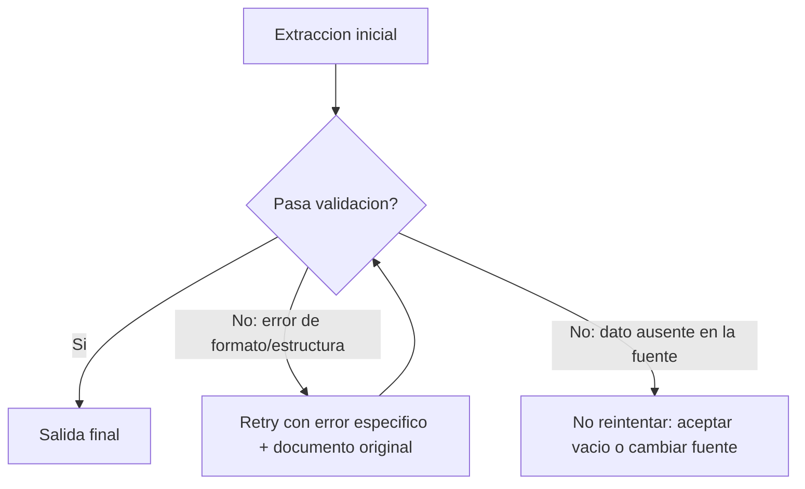
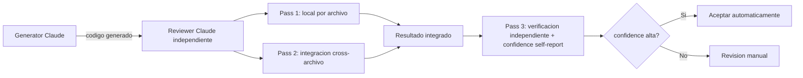

# Bloque 1 — Prompt Engineering y salida estructurada

> **Versión:** 1.0 · **Fecha:** 2026-08-05 · **Generada desde:** corpus v1.0 · **Guía oficial del examen:** v1.0
> **Peso en el examen:** 20% (Dominio D4; segundo dominio de mayor peso tras la arquitectura agéntica) · **Escenarios donde cae:** pipelines de extracción de datos estructurados y revisión automatizada de código que deben producir salida fiable, consistente y auditable a partir de un modelo probabilístico

## Qué evalúa el examen en este bloque

Las preguntas de este dominio giran alrededor de un mismo problema de fondo: convertir la salida probabilística de Claude en algo que un pipeline downstream pueda consumir sin sorpresas. El examen avanza en capas, y la guía sigue ese mismo orden: criterios explícitos (4.1) y few-shot (4.2) atacan la calidad del *juicio* del modelo — qué reporta y con qué severidad; tool use con JSON schemas (4.3) y validación con retry (4.4) atacan la *conformidad estructural* de la salida; batch processing (4.5) ataca la *economía* de ejecutarlo a escala; y multi-instancia/multi-pass review (4.6) ataca la *fiabilidad* cuando una sola pasada no es suficiente. Un ejemplo típico de enunciado presenta un pipeline de code review con una categoría de hallazgo que genera muchos falsos positivos, o un batch job con un SLA numérico concreto, y pide identificar el mecanismo exacto que corrige el síntoma — no una mejora genérica de "escribir mejor el prompt". El juicio que se mide no es "¿conoces la técnica?" sino "¿sabes cuál de varias técnicas parecidas aplica a este síntoma concreto, y por qué las demás no bastan?".

## Antes de empezar

Este bloque asume el ciclo mecánico de tool use del Bloque 0: `tool_use`/`tool_result`, `stop_reason` y la anatomía de `input_schema`. Los task statements 4.3 y 4.4 no vuelven a explicar esa mecánica — dan por sentado que sabes construir una tool y leer una response, y se centran solo en su aplicación específica a extracción estructurada (`strict: true`, diseño de campos, retry). Si algo de `tool_choice` o del ciclo `tool_use`/`tool_result` no te resulta inmediato, conviene repasar el Bloque 0 antes de seguir.

---

## Lección 1 — Criterios explícitos: de la confianza vaga a la precisión verificable {#leccion-1-1}

Pide a Claude que "solo reporte hallazgos de alta confianza" o que "sea conservador" y obtendrás resultados tan inconsistentes como si no hubieras dado ninguna instrucción: "confianza" y "conservador" no son conceptos que el modelo pueda operacionalizar por sí solo, así que cada ejecución los interpreta de forma distinta. El problema que resuelve el task statement 4.1 no es solo de calidad técnica — es de adopción: una categoría de hallazgo con muchos falsos positivos erosiona la confianza del desarrollador incluso en las categorías que sí funcionan bien, y una herramienta en la que no se confía deja de usarse por completo, aunque el resto de su output sea correcto.

La alternativa que exige el examen es sustituir el filtrado por confianza por **criterios categóricos explícitos**: definir en el prompt, con lenguaje concreto y verificable, qué tipos de problema se reportan y cuáles se omiten deliberadamente.

```text
Vago (no mejora precisión):
"Flag comments only when confidence is high."

Explícito (criterio categórico verificable):
"Flag a comment only when the claimed behavior contradicts the actual code behavior.
Do NOT flag: style preferences, comments that are imprecise but not contradictory,
comments about intent rather than mechanism."
```

Para severidad, el patrón que produce clasificación consistente entre ejecuciones no es una etiqueta textual suelta ("alta", "media") sino ejemplos concretos de código por cada nivel, envueltos en tags `<example>`/`<examples>` para que el modelo no los confunda con parte de las instrucciones:

```xml
<examples>
  <example>
    <input>commented_code = true, actual_behavior = true</input>
    <classification>NO REPORT</classification>
    <reason>El comentario describe con precisión el comportamiento actual</reason>
  </example>
  <example>
    <input>commented_code = "close file", actual_behavior = "delete file"</input>
    <classification>REPORT</classification>
    <reason>El comentario contradice el comportamiento real — crítico encontrar discrepancias</reason>
  </example>
</examples>
```

En producción, el síntoma que dispara este rediseño suele llegar como una queja concreta de un equipo: "la categoría de seguridad reporta ruido en el 40% de los PRs y ya nadie la mira". La respuesta correcta no es afinar el umbral de confianza ni pedirle al modelo "sé más estricto" — es medir la tasa de falsos positivos por categoría, desactivar temporalmente la peor mientras se reescriben sus criterios con ejemplos concretos, y reactivarla cuando la tasa mejore. El test de humo recomendado por Claude prompting best practices es simple: mostrar el prompt a un colega con contexto mínimo y comprobar si lo entendería sin ambigüedad; si el colega dudaría, el modelo también.

El anti-patrón más frecuente es doble. El primero es confiar en instrucciones de "conservadurismo" sin definición operativa: parece una mejora razonable, pero no le da al modelo ningún criterio verificable, así que la precisión no mejora frente a la línea base — solo cambia el vocabulario del prompt. El segundo, más sutil, es intentar arreglar el ruido en post-procesamiento, filtrando resultados después de generarlos: el criterio mal definido sigue produciendo el mismo volumen de ruido, solo que ahora se descarta a ciegas en vez de nunca haberse generado, y el coste de generarlo no se recupera.

**Regla mnemotécnica:** cuando el examen contraste "confidence-based filtering" contra "criterios categóricos explícitos" como opciones parecidas, la respuesta correcta es casi siempre la segunda; y cuando aparezca "deshabilitar la categoría" como opción, comprueba si es *temporal* (correcto) o *permanente* (distractor).

> **Mini-check 1.** Una categoría de revisión de código tiene una tasa alta de falsos positivos. ¿Cuál es el enfoque correcto según el examen?
> - [ ] A. Subir el umbral de "confianza" en la instrucción del prompt hasta que el ruido baje.
> - [x] B. Definir criterios categóricos explícitos (qué se reporta vs qué se omite, con ejemplos de severidad) y desactivar temporalmente la categoría mientras se refina.
> - [ ] C. Dejar la categoría activa y filtrar los resultados en post-procesamiento antes de mostrarlos.
>
> _Respuesta: B — un umbral de confianza no le da al modelo un criterio operativo verificable, y el post-procesamiento no ataca la causa: sigue generando el mismo ruido, solo que se descarta después._

📖 Para profundizar: Claude prompting best practices (https://platform.claude.com/docs/en/build-with-claude/prompt-engineering/claude-prompting-best-practices) desarrolla el patrón de criterios explícitos y el test de humo de "mostrarlo a un colega".

---

## Lección 2 — Few-shot prompting: pocos ejemplos, muy dirigidos {#leccion-1-2}

Cuando las instrucciones detalladas por sí solas producen salida inconsistentemente formateada — un campo unas veces presente y otras ausente, una clasificación que cambia entre ejecuciones idénticas —, el few-shot prompting es la técnica más efectiva para fijar consistencia. Pero el task statement 4.2 va más allá del formato: bien elegidos, los ejemplos enseñan al modelo a generalizar *juicio* en casos ambiguos o nuevos, no solo a copiar la forma de los casos ya vistos.

El rango que documenta la fuente es de 2 a 4 ejemplos dirigidos cuando el objetivo es enseñar a manejar ambigüedad (mostrando el razonamiento de por qué se elige una interpretación sobre otra plausible), y de 3 a 5 cuando el objetivo es consistencia de formato general. Los ejemplos se envuelven en `<example>` (singular) o `<examples>` (plural), separados de las instrucciones:

```xml
<examples>
  <example>
    <input>var x = "hello"; console.log(x.toUpperCase())</input>
    <output_format>
      <location>line_5</location>
      <issue>potential_type_error</issue>
      <severity>medium</severity>
      <suggested_fix>ensure variable is string before calling method</suggested_fix>
    </output_format>
  </example>
  <example>
    <input>// undefined variable used
result = y + 5</input>
    <output_format>
      <location>line_2</location>
      <issue>undefined_variable</issue>
      <severity>high</severity>
      <suggested_fix>declare y with var/let/const before use</suggested_fix>
    </output_format>
  </example>
</examples>
```

Hay cuatro usos documentados que conviene distinguir: fijar el formato exacto de salida cuando las instrucciones solas producen JSON inconsistente; demostrar el manejo de casos ambiguos incluyendo el razonamiento explícito; distinguir patrones de código aceptables de problemas genuinos mostrando ambos lados; y reducir alucinación en extracción, incluyendo ejemplos con estructuras de documento variadas y, crucialmente, al menos un ejemplo donde un campo está correctamente ausente (`null`) en vez de inventado.

En producción, el escenario recurrente es un pipeline de extracción de facturas que, con instrucciones extensas pero sin ejemplos, empieza a rellenar el campo `tax_id` con valores plausibles cuando el documento simplemente no lo incluye. Añadir un ejemplo few-shot donde ese campo aparece explícitamente como `null` — con una nota de por qué — resuelve el problema de forma mucho más directa que seguir ampliando las instrucciones textuales sobre "no inventar datos".

El anti-patrón más común es doble: usar ejemplos genéricos que no reflejan la variabilidad real de los datos de producción, lo que hace que el modelo iguale el patrón superficial del ejemplo en vez del criterio subyacente; y añadir ejemplos de solo input/output sin razonamiento explícito, lo que enseña al modelo a copiar el patrón en vez de decidir en zonas grises nuevas. Añadir más de 5 ejemplos sin ganancia real de claridad, además, infla el *context length* sin mejora proporcional en consistencia.

**Regla mnemotécnica:** pocos ejemplos muy dirigidos al punto ambiguo real del dominio, con razonamiento explícito, superan a muchos ejemplos genéricos sin razonamiento; para extracción, incluye siempre un ejemplo con campo ausente correctamente marcado `null`.

> **Mini-check 2.** ¿Qué distingue a un buen ejemplo few-shot de uno que no generaliza bien a casos nuevos?
> - [ ] A. Cuantos más ejemplos, mejor: la cantidad es lo que garantiza consistencia.
> - [x] B. Pocos ejemplos (2-4), dirigidos al caso ambiguo real, con el razonamiento explícito de por qué se eligió esa interpretación.
> - [ ] C. Basta con mostrar el output_format esperado; el razonamiento es redundante si el formato ya está claro.
>
> _Respuesta: B — los ejemplos sin razonamiento enseñan a copiar el patrón superficial, no a generalizar el criterio; y más de 5 ejemplos sin ganancia de claridad solo infla el contexto._

📖 Para profundizar: Claude prompting best practices (https://platform.claude.com/docs/en/build-with-claude/prompt-engineering/claude-prompting-best-practices) cubre el uso de few-shot y las tags `<example>`/`<examples>` con más detalle; el Interactive Prompt Engineering Tutorial (https://github.com/anthropics/prompt-eng-interactive-tutorial) permite practicar el diseño de ejemplos dirigidos de forma guiada.

---

## Lección 3 — Tool use y JSON schemas: la garantía que sí da, y la que no {#leccion-1-3}

Cuando la salida debe conformar exactamente a un schema para alimentar un pipeline downstream sin parseo frágil, tool use con JSON schemas es el enfoque más fiable: elimina por completo los errores de *sintaxis* JSON. Pero el límite exacto de esa garantía es el punto que el examen explota con más insistencia en este task statement: `strict: true` valida estructura y tipos mediante *grammar-constrained sampling* (muestreo restringido por gramática), no valida semántica. Un line item que no suma al total declarado, o un valor colocado en el campo equivocado, pasan el schema sin ningún problema — el JSON tiene la forma correcta, aunque el contenido esté mal.

```typescript
{
  name: "extract_data",
  description: "Extract structured data from document",
  strict: true,
  input_schema: {
    type: "object",
    properties: {
      title: { type: "string" },
      amount: { type: "number" },
      date: { type: "string", format: "date" },
      category: {
        type: "string",
        enum: ["positive", "negative", "neutral", "other"]
      },
      category_details: {
        type: "string",
        description: "Use when category is 'other'"
      }
    },
    required: ["title", "amount"],
    additionalProperties: false
  }
}
```

El diseño de campos es la palanca principal contra la alucinación: solo deben marcarse `required` los campos que existen siempre en los documentos de origen; el resto se deja opcional o nullable, para que el modelo no fabrique valores con tal de satisfacer el schema. Para categorías extensibles, el patrón es un `enum` con un valor `"other"` acompañado de un campo de detalle en string (y valores como `"unclear"` para casos genuinamente ambiguos). En strict mode están soportados los tipos básicos (`object`, `array`, `string`, `integer`, `number`, `boolean`, `null`), `enum`, `anyOf`, `allOf`, `$ref`/`definitions`, los formatos de string `date-time`, `date`, `email`, `uri`, `uuid`, `required` y `additionalProperties: false`; NO están soportados los schemas recursivos, las restricciones numéricas (`minimum`/`maximum`), las de string (`minLength`/`maxLength`) ni `additionalProperties: true`. Esta lista no es exhaustiva — la referencia completa vive en la página oficial de structured outputs.

`tool_choice` completa el cuadro: `"auto"` permite texto en vez de tool use (no garantiza la llamada), `"any"` obliga a llamar a alguna tool pero deja elegir cuál — útil cuando hay varios schemas de extracción y el tipo de documento es incierto —, y la selección forzada (`{"type": "tool", "name": "extract_metadata"}`) asegura que una tool concreta corre antes de pasos de enriquecimiento posteriores. Y aunque el schema sea estricto, sigue haciendo falta normalización en el prompt para formatos de origen inconsistentes — fechas en múltiples formatos que deben convertirse a `YYYY-MM-DD`, por ejemplo — porque el schema valida forma, no homogeneidad de contenido.

En producción, el incidente típico es una extracción de facturas que "pasa todos los tests de schema" pero cuyo `calculated_total` nunca coincide con el `stated_total` del documento: el equipo confió en `strict: true` como garantía de calidad completa, y descubre semanas después que el schema nunca estaba diseñado para detectar ese tipo de error. El anti-patrón de fondo es exactamente esa confusión entre sintaxis y semántica, y su síntoma gemelo es marcar todos los campos como `required`: eso no evita que el documento fuente esté incompleto, solo garantiza que el modelo alucinará algo para rellenar el hueco.

**Regla mnemotécnica:** `strict: true` = forma correcta garantizada; nunca = contenido correcto garantizado. `"auto"` no garantiza llamada; `"any"` garantiza llamada con tool libre; forzada garantiza llamada con tool fija.

> **Mini-check 3.** Tienes una tool con `strict: true` y el modelo decide llamarla. ¿Qué te garantiza exactamente esa configuración?
> - [ ] A. Que el `input` cumple el schema en forma Y que los valores son semánticamente correctos (p. ej. que un total cuadra).
> - [x] B. Que el `input` cumple el schema en forma y tipos (grammar-constrained sampling); nada sobre si los valores tienen sentido semántico.
> - [ ] C. Nada, salvo que además se combine con `tool_choice: "any"`.
>
> _Respuesta: B — strict mode elimina errores de sintaxis JSON, no errores semánticos; confundir ambos es el distractor central de este task statement._

📖 Para profundizar: Strict tool use (https://platform.claude.com/docs/en/agents-and-tools/tool-use/strict-tool-use) detalla el grammar-constrained sampling y la lista de soporte; Structured outputs (https://platform.claude.com/docs/en/build-with-claude/structured-outputs) cubre el resto de mecanismos de salida estructurada.

---

## Lección 4 — Validación, retry y feedback loops: cuándo reintentar y cuándo no {#leccion-1-4}

Tool use elimina errores de sintaxis, pero no los semánticos (Lección 3); este task statement cubre el mecanismo que sí ataca esos errores: reintentar con feedback específico de qué falló exactamente. El matiz que el examen espera que domines es distinguir cuándo un retry puede funcionar (errores de formato o estructura recuperables) de cuándo es estructuralmente inútil (la información simplemente no está en el documento de origen, y ningún número de reintentos la va a producir).

El patrón de retry-con-error-feedback consiste en anexar al prompt de reintento los errores de validación exactos —nunca un mensaje genérico— junto con el documento original y la extracción fallida completa, de modo que el modelo tenga todo el contexto necesario para autocorregirse:

```text
Prompt inicial: "Extract invoice data as JSON"
Respuesta: { "items": [...], "total": 1500 }  ← validación falla

Follow-up: "The extraction failed validation:
- Sum of item amounts ($1000) != stated total ($1500)
- Fix the discrepancy by re-examining the document.
Provide the corrected extraction."
```

Dos diseños de campo habilitan este patrón en la práctica. El primero es `detected_pattern`, que etiqueta qué construcción de código disparó cada hallazgo — no como dato decorativo, sino porque permite después correlacionar categorías con tasas de descarte por parte de los desarrolladores:

```json
{
  "finding": "potential null pointer dereference",
  "location": "line 42",
  "detected_pattern": "variable_accessed_without_null_check",
  "confidence": 0.85
}
```

El segundo es el par `calculated_total`/`stated_total` con un booleano `conflict_detected`, que expone de forma explícita cuándo el dato derivado y el dato declarado en el documento no coinciden, en vez de escoger uno de los dos en silencio:

```json
{
  "stated_total": 1500,
  "calculated_total": 1000,
  "conflict_detected": true,
  "conflict_description": "Sum of items does not match stated total"
}
```

En producción, el escenario que distingue a quien domina este task statement es reconocer el límite del retry a tiempo: un pipeline de extracción de contratos empieza a reintentar automáticamente cuando un campo `signing_date` sale vacío, sin comprobar antes si ese contrato en concreto simplemente no lleva fecha de firma en el documento origen. El resultado es un bucle de reintentos que quema tokens y latencia sin ninguna posibilidad de éxito, porque el problema nunca fue de formato.

El anti-patrón más costoso, además del bucle sin salida anterior, es reintentar con un mensaje genérico como "try again": sin el error específico, el modelo no tiene información accionable sobre qué corregir, y el resultado suele repetir exactamente el mismo fallo. Y no instrumentar `detected_pattern` desde el diseño inicial del schema de hallazgos —parece un campo prescindible al principio— impide después cualquier análisis sistemático de por qué ciertas categorías se descartan de forma recurrente.

**Regla mnemotécnica:** retry solo si el fallo es de formato/estructura (recuperable); si el dato no existe en la fuente, no hay número de reintentos que lo genere — la salida correcta es aceptar el vacío o cambiar de fuente.



El diagrama muestra que un fallo de validación no dispara automáticamente un retry: solo los errores de formato o estructura se benefician del bucle de feedback; si la causa es información ausente en el documento fuente, el diseño correcto es salir del bucle y tratarlo como un vacío legítimo.

> **Mini-check 4.** Una extracción de contratos falla porque el campo `signing_date` sale vacío, y el documento original nunca incluyó esa fecha. ¿Cuál es la acción correcta?
> - [ ] A. Reintentar con un mensaje de error genérico ("the date is missing, try again") hasta que aparezca.
> - [ ] B. Reintentar subiendo la temperatura del modelo para forzar variabilidad en la respuesta.
> - [x] C. No reintentar: aceptar el campo vacío o buscar la fecha en otra fuente, porque el retry no puede generar un dato que no está en el documento.
>
> _Respuesta: C — el retry solo ayuda ante errores de formato o estructura; cuando la causa es información ausente en el origen, es un bucle sin salida._

<!-- HUECO: 4.1/4.4 — implementación detallada de evals/graders. Las fuentes procesadas para este bloque referencian "Define success criteria & evals" para métricas de precisión/falsos positivos, pero no cubren notebooks o graders específicos para precisión de clasificación o tasa de falso positivo; se deja como hueco para verificación posterior. -->

📖 Para profundizar: este mecanismo no tiene una página oficial dedicada en las fuentes de este bloque; combina los principios de feedback específico de Claude prompting best practices (ya citada en la Lección 1) con el diseño de criterios de éxito medibles de Define success criteria and evals (https://platform.claude.com/docs/en/docs/test-and-evaluate/develop-tests).

---

## Lección 5 — Batch processing: cuándo el ahorro de coste compensa la espera {#leccion-1-5}

No todo procesamiento a escala necesita respuesta inmediata. Cuando el workload es no bloqueante y tolera latencia — reportes overnight, auditorías semanales, generación nocturna de tests —, la Message Batches API ofrece un 50% de ahorro de coste a cambio de una ventana de procesamiento de hasta 24 horas, sin SLA de latencia garantizado. La decisión de diseño central de este task statement es reconocer cuándo ese trade-off es aceptable y cuándo no.

Cada request de un batch lleva un `custom_id` que correlaciona la petición con su respuesta correspondiente — indispensable porque las respuestas no llegan necesariamente en el mismo orden ni de forma síncrona. El formato exigido es una cadena de 1 a 64 caracteres que cumpla el patrón `^[a-zA-Z0-9_-]{1,64}$` (letras, dígitos, guion y guion bajo); un `custom_id` con espacios, puntos o más de 64 caracteres es una request inválida, y es un distractor de examen habitual presentarlo como si fuera válido.

```python
requests = [
    {
        "custom_id": "invoice-001",
        "params": {
            "model": "claude-opus-5",
            "max_tokens": 1024,
            "messages": [{"role": "user", "content": "Extract invoice data..."}]
        }
    },
    {
        "custom_id": "invoice-002",
        "params": {
            "model": "claude-opus-5",
            "max_tokens": 1024,
            "messages": [{"role": "user", "content": "Extract invoice data..."}]
        }
    }
]

batch = client.messages.batches.create(requests=requests)
```

El límite de un batch es 100.000 requests o 256 MB de tamaño total, lo que se alcance primero; la mayoría se completan en menos de una hora, con un máximo de 24 horas antes de expirar, y los resultados quedan accesibles durante 29 días. La limitación arquitectónica más importante para el examen es que el batch API **no soporta multi-turn tool calling** dentro de una misma request: no se puede ejecutar una tool a mitad de proceso y devolver el resultado dentro del mismo request batcheado, porque cada request se procesa de forma independiente y sin estado compartido. Tampoco están soportados `stream: true`, `speed` (fast mode), `store`/`previous_thread_event_id` (threads), `cache_hint`/`context_hint`, ni `max_tokens: 0`.

En producción, el ejercicio que el examen plantea con más frecuencia es un cálculo directo: dado un SLA numérico —por ejemplo, garantizar que los resultados estén disponibles en un máximo de 30 horas— y el límite de 24 horas del batch, ¿con qué frecuencia hay que enviar lotes? La respuesta es cada 4 horas: el peor caso es un lote enviado justo antes de la siguiente ventana de envío, que tiene hasta 24 horas para completarse, más las 4 horas de margen entre envíos, que en total no debe superar las 30 horas del SLA. Antes de lanzar un batch masivo conviene además refinar el prompt sobre una muestra pequeña, para maximizar la tasa de éxito en el primer intento y no desperdiciar coste en reenvíos evitables; y ante fallos, reenviar solo los documentos identificados por su `custom_id`, con las modificaciones apropiadas (por ejemplo, *chunking* de documentos que excedieron el límite de contexto).

El anti-patrón más costoso es usar batch para un flujo que necesita respuesta en minutos —pre-merge checks, feedback en tiempo real—: el máximo de 24 horas lo hace inadecuado de fondo para cualquier caso bloqueante, sin importar cuánto se optimice el resto del pipeline. Un segundo anti-patrón, más silencioso, es esperar poder ejecutar tool calling multi-turno dentro de un batch: ignora que cada request se procesa de forma completamente independiente, sin estado compartido entre pasos.

**Tabla de decisión:**

| Situación | Elección correcta | Por qué |
|---|---|---|
| Workload tolera latencia (reportes overnight, auditorías) | Message Batches API | 50% de ahorro de coste a cambio de hasta 24h de ventana, sin SLA garantizado |
| Workload bloqueante (pre-merge checks, feedback en vivo) | API síncrona | El batch no garantiza latencia y puede tardar hasta 24h |
| SLA de X horas con el límite de 24h del batch | Enviar lotes cada (X − 24) horas | El peor caso (lote justo antes del siguiente envío) debe seguir cumpliendo el SLA |
| Necesitas tool calling multi-turno dentro de la misma request | No usar batch: usar la API síncrona | El batch procesa cada request de forma independiente, sin estado compartido |

> **Mini-check 5.** Necesitas garantizar un SLA de 30 horas para un pipeline de auditoría que usa la Message Batches API (ventana máxima de 24 horas). ¿Con qué frecuencia debes enviar los lotes?
> - [ ] A. Cada 24 horas, justo al límite de la ventana del batch.
> - [x] B. Cada 4 horas, para que el peor caso (batch enviado justo antes del siguiente envío) siga cumpliendo el SLA de 30 horas.
> - [ ] C. Cada 30 horas, coincidiendo directamente con el SLA.
>
> _Respuesta: B — el margen disponible es SLA (30h) menos ventana máxima del batch (24h) = 6h, pero la frecuencia de envío debe ser menor que ese margen para cubrir el peor caso; la fuente fija ese cálculo en enviar cada 4 horas._

📖 Para profundizar: Batch processing / Message Batches API (https://platform.claude.com/docs/en/build-with-claude/batch-processing) documenta el `custom_id`, los límites y la lista completa de parámetros no soportados en batch.

---

## Lección 6 — Multi-instancia y multi-pass review: separar quien genera de quien revisa {#leccion-1-6}

Un modelo que acaba de generar código retiene en su contexto el razonamiento que usó para producirlo, lo que lo hace menos propenso a cuestionar sus propias decisiones si se le pide revisarlas en la misma sesión — ni instrucciones de auto-revisión ni extended thinking dentro de la misma sesión igualan la efectividad de un revisor sin ese contexto previo. El task statement 4.6 cubre el diseño arquitectónico que corrige esa limitación: separar generación y revisión en instancias independientes, y separar el volumen de revisión en pasadas con foco distinto para no diluir la atención del modelo.

```python
# Generator instance
generated_code = generator_claude.generate_code(prompt)

# Independent reviewer instance (different context, no knowledge of generator's reasoning)
review = reviewer_claude.review_code(
    code=generated_code,
    criteria=review_criteria
    # NO incluir razonamiento del generador
)
```

Para reviews de múltiples archivos, el patrón correcto divide el trabajo en dos pasadas de *tipo* de análisis distinto, no en fragmentos del mismo tipo: un *local analysis pass* por archivo (problemas locales, patrones directos, sintaxis) y un *cross-file integration pass* (flujo de datos entre archivos, dependencias, contradicciones). Hacerlo en una sola pasada combinada diluye la atención del modelo y produce hallazgos contradictorios entre ambos tipos de análisis.

```python
# Pass 1: Local file analysis
local_findings = []
for file in files:
    findings = claude.analyze_file(
        file=file,
        focus="local issues, syntax, direct patterns"
    )
    findings = [{**f, "confidence": ...} for f in findings]
    local_findings.extend(findings)

# Pass 2: Integration analysis (cross-file)
integration_findings = claude.analyze_integration(
    files=files,
    local_findings=local_findings,
    focus="data flow, dependencies, contradictions"
)
```

Hay todavía una tercera variante arquitectónica que el examen distingue explícitamente de las dos pasadas anteriores: una **pasada de verificación independiente**, ejecutada por una instancia separada *después* de que el resultado local y el de integración ya se han combinado. Su única función es revisar ese resultado ya integrado y reportar su propia confianza sobre si es correcto — no vuelve a analizar el código desde cero ni sustituye a las pasadas local/integration, sino que añade una comprobación final de extremo a extremo con su propio *confidence self-report*, independiente del de los hallazgos individuales. Ese self-report de confianza, tanto en hallazgos individuales como en la pasada de verificación, habilita *calibrated review routing*: lo de alta confianza se acepta directamente, y lo de baja confianza se enruta a revisión manual.



El diagrama muestra que la instancia revisora es independiente del generador (sin su contexto de razonamiento), que la revisión se divide en dos pasadas de foco distinto (local e integración) y que una tercera pasada de verificación independiente revisa el resultado ya integrado y aporta su propio confidence self-report antes de enrutar según confianza.

En producción, el escenario que más se repite es un equipo que, para "ahorrar una llamada", pide a la misma instancia que generó el código que lo revise a continuación en la misma conversación, confiando en instrucciones tipo "sé crítico con tu propio código" o en activar extended thinking para forzar más autocuestionamiento. El resultado es sistemáticamente menos efectivo que una instancia nueva: el modelo tiende a confirmar su razonamiento previo, no a cuestionarlo, precisamente porque ese razonamiento sigue en su contexto.

El anti-patrón gemelo aparece al escalar a multi-archivo: dividir el trabajo por *volumen* —varios chunks del mismo tipo de análisis repartidos entre instancias— en vez de por *tipo de análisis* (local vs integración), que es la distinción real que exige la fuente. Y no instrumentar confianza por hallazgo elimina la posibilidad de enrutar selectivamente: obliga a revisar todo con el mismo nivel de escrutinio manual, sin priorización posible.

**Regla mnemotécnica:** genera y revisa siempre en instancias distintas; divide la revisión multi-archivo por tipo de análisis (local vs integración), no por volumen; y si hace falta una comprobación final, añade una tercera pasada de verificación independiente sobre el resultado ya integrado, no una repetición de las dos anteriores.

<!-- HUECO: 4.6 — implementación práctica con el Agent SDK (subagentes independientes concretos, mecanismo de confidence routing en código). La guía oficial es breve en este task statement y las fuentes procesadas para este bloque no cubren ese detalle de implementación; se espera resolver en el Bloque 4 (Agent SDK). -->

> **Mini-check 6.** Un equipo revisa código multi-archivo dividiendo el trabajo en varios chunks, cada uno analizando tanto problemas locales como de integración entre archivos. ¿Qué distinción está ignorando respecto al patrón correcto?
> - [ ] A. Ninguna: dividir por chunks es equivalente a dividir por tipo de análisis.
> - [x] B. Debería dividir por *tipo de análisis* (local por archivo vs integración cross-archivo), no por volumen de chunks del mismo tipo combinado.
> - [ ] C. El problema es no usar extended thinking en cada chunk.
>
> _Respuesta: B — mezclar ambos focos en la misma pasada diluye la atención y produce hallazgos contradictorios; la fuente exige separar por tipo de análisis, no por volumen de trabajo._

📖 Para profundizar: la guía oficial es breve en este task statement (ver Deuda conocida); Claude Cookbooks (https://github.com/anthropics/claude-cookbooks) recoge ejemplos prácticos de patrones multi-agente que ilustran instancias independientes de generación y revisión, aunque el detalle de implementación con el Agent SDK se cubre en el Bloque 4.

---

## Checklist de salida

Dominas este bloque si puedes, sin mirar la guía:

- [ ] Sustituir un filtro por confianza vago por criterios categóricos explícitos y ejemplos de severidad por código, y saber cuándo desactivar temporalmente una categoría ruidosa (4.1).
- [ ] Diseñar few-shot con 2-4 ejemplos dirigidos y razonamiento explícito, incluyendo casos de campo ausente en extracción, sin caer en "más ejemplos siempre ayuda" (4.2).
- [ ] Explicar el límite exacto de `strict: true` (sintaxis, no semántica), diseñar campos `required`/opcional para evitar alucinación, y elegir entre `"auto"`, `"any"` y tool forzada según el caso (4.3).
- [ ] Distinguir un fallo recuperable con retry-y-feedback-específico de uno no recuperable por ausencia de dato en la fuente, e instrumentar campos como `detected_pattern` o `conflict_detected` (4.4).
- [ ] Decidir cuándo un workload cabe en Message Batches API frente a la API síncrona, calcular la frecuencia de envío para un SLA dado, y conocer los límites y funcionalidades no soportadas en batch (4.5).
- [ ] Diseñar una arquitectura de revisión con instancia independiente del generador, pasadas separadas por tipo de análisis (local vs integración) y, si aplica, una pasada de verificación final con confidence self-report (4.6).

## Para ir más allá — referencias anotadas

- Claude prompting best practices — https://platform.claude.com/docs/en/build-with-claude/prompt-engineering/claude-prompting-best-practices — base de las Lecciones 1 y 2: criterios explícitos, severidad por ejemplos y few-shot con razonamiento.
- Structured outputs — https://platform.claude.com/docs/en/build-with-claude/structured-outputs — base de la Lección 3: mecanismos de salida estructurada más allá de tool use.
- Strict tool use — https://platform.claude.com/docs/en/agents-and-tools/tool-use/strict-tool-use — base de la Lección 3: grammar-constrained sampling y la lista de tipos/keywords soportados en strict mode.
- Batch processing (Message Batches API) — https://platform.claude.com/docs/en/build-with-claude/batch-processing — base de la Lección 5: `custom_id`, límites de tamaño y funcionalidades no soportadas en batch.
- Define success criteria y evals — https://platform.claude.com/docs/en/docs/test-and-evaluate/develop-tests — complementa las Lecciones 1 y 4: cómo definir criterios de éxito medibles para precisión y calidad de extracción; no cubre graders específicos de falsos positivos (ver Deuda conocida en el corpus).
- Interactive Prompt Engineering Tutorial — https://github.com/anthropics/prompt-eng-interactive-tutorial — práctica guiada de las técnicas de las Lecciones 1 y 2 (criterios explícitos, few-shot) con ejercicios paso a paso.
- Claude Cookbooks (GitHub) — https://github.com/anthropics/claude-cookbooks — ejemplos de código de extracción estructurada, batch processing y patrones multi-agente que ilustran varias lecciones de este bloque, especialmente la 5 y la 6.

*Historial de versiones del curso: [changelog](../../changelog.html) — único para todo el material; esta guía no lleva el suyo propio.*
