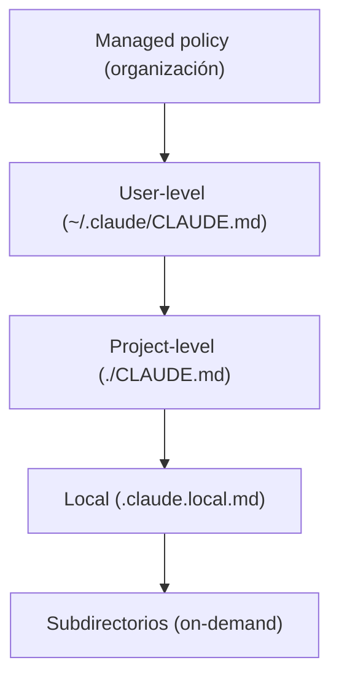
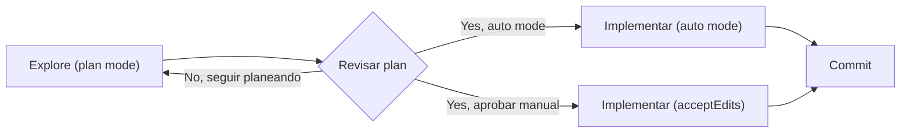

# Bloque 2 — Claude Code: configuración y flujos

> **Versión:** 1.0 · **Fecha:** 2026-08-07 · **Generada desde:** corpus v1.0 · **Guía oficial del examen:** v1.0
> **Peso en el examen:** 20% (dominio oficial D3 — Claude Code Configuration & Workflows) · **Escenarios donde cae:** task statements 3.1 a 3.6, con preguntas de diagnóstico de jerarquía de configuración, elección del mecanismo correcto (`CLAUDE.md` vs skill vs rule vs hook) y criterio para decidir entre plan mode, ejecución directa e integración en CI/CD

## Qué evalúa el examen en este bloque

Este bloque cubre Claude Code como herramienta de desarrollo, no la mecánica de la Messages API: cómo se configura su memoria persistente, cómo se extiende con comandos y skills, cómo se acotan convenciones a subconjuntos de archivos, cuándo conviene planificar antes de ejecutar, cómo se refina iterativamente una solución y cómo se integra en pipelines automatizados. El examen mezcla dos tipos de pregunta: conocimiento declarativo puro (sintaxis exacta de un frontmatter, jerarquía de carga de un archivo, nombre literal de un flag de CLI) y criterio de aplicación (dado un escenario de equipo o de CI, qué mecanismo es el correcto entre varios plausibles). Un ejemplo típico de enunciado: se describe un `CLAUDE.md` de 250 líneas que un nuevo miembro del equipo dice no estar recibiendo, y se pregunta cuál de varias causas explica el síntoma —de las cuales solo una es correcta y las demás son variaciones plausibles de jerarquía o de scoping—. La guía recorre, en orden, los seis task statements del dominio D3: `CLAUDE.md` (3.1), comandos y skills (3.2), path-specific rules (3.3), plan mode (3.4), refinamiento iterativo (3.5) y CI/CD (3.6).

## Antes de empezar

No hace falta haber completado ningún bloque previo para seguir este: los seis ejes son autocontenidos y giran alrededor del uso cotidiano de Claude Code como CLI, no de la Messages API subyacente. Sí conviene llegar con experiencia mínima usando Claude Code en un proyecto real —haber abierto una sesión, editado archivos, ejecutado algún comando— porque la guía no explica qué es Claude Code desde cero, sino cómo configurarlo y operarlo con criterio. Si vienes de un bloque centrado en arquitectura de agentes, aquí encontrarás la misma tensión entre flexibilidad y determinismo aplicada a un contexto distinto: cuándo confiar en que Claude decida (plan mode, auto-invocación de skills) y cuándo forzar un mecanismo que garantice comportamiento (hooks, workflows CI con código de salida verificable).

---

## Lección 1 — Configuración de CLAUDE.md: jerarquía, scoping y organización modular {#leccion-2-1}

`CLAUDE.md` es un archivo markdown que Claude Code lee al inicio de cada sesión para obtener instrucciones persistentes: convenciones de código, comandos de build, decisiones arquitectónicas del proyecto. Existe para resolver un problema muy concreto: sin él, cada sesión nueva empieza desde cero y Claude repite exactamente los mismos errores que ya se corrigieron en la sesión anterior. La alternativa —explicar el proyecto de memoria cada vez— no escala ni para una persona ni, mucho menos, para un equipo.

La jerarquía de carga va de más general a más específico: managed policy (nivel organización, no excluible por configuración individual) → user-level (`~/.claude/CLAUDE.md`, personal, no se comparte por control de versiones) → project-level (`./CLAUDE.md` o `./.claude/CLAUDE.md`, compartido con el equipo vía version control) → local (`./.claude.local.md`, personal y específico del proyecto, pensado para `.gitignore`) → subdirectorios, que cargan **on-demand** cuando Claude lee archivos dentro de ellos, no al inicio de sesión. Los archivos no se sobrescriben entre sí, se **concatenan** en el contexto:



El diagrama muestra el orden de carga, de más general a más específico; los archivos se concatenan (no se sobrescriben) y los subdirectorios solo cargan cuando Claude lee archivos dentro de ellos, nunca al arrancar la sesión.

El objetivo de tamaño es **menos de 200 líneas**: por encima de ese umbral, las instrucciones importantes se diluyen en el ruido y la adherencia baja. La herramienta para modularizar sin fragmentar en archivos inconexos es `@import`, que referencia otro archivo markdown y admite anidamiento recursivo hasta una profundidad máxima de **4 saltos**. El detalle que el examen explota sin piedad es la diferencia entre una referencia real y una literal:

```markdown
# Import de archivo externo (@import real, sin backticks)
@docs/testing-standards.md

# Esto NO se importa: se trata como texto literal
`@docs/testing-standards.md`
```

En producción, el síntoma más frecuente de una jerarquía mal entendida es un nuevo miembro del equipo que "no recibe" ciertas convenciones aunque el resto del equipo asegura que "siempre están ahí": la causa casi siempre es que esas instrucciones viven en `~/.claude/CLAUDE.md` de quien las escribió —personal, nunca versionado— en vez de en el `CLAUDE.md` del proyecto. El comando `/memory` lista todas las ubicaciones de memoria y permite editarlas; `/context` muestra bajo **Memory files** cuáles cargaron realmente en la sesión activa, el primer sitio donde mirar ante este síntoma.

El anti-patrón más costoso, sin embargo, no es de jerarquía sino de expectativa: tratar `CLAUDE.md` como si formara parte del *system prompt* y por tanto garantizara cumplimiento estricto. En realidad se entrega como **mensaje de usuario posterior al system prompt**, así que es guía de contexto, no configuración forzada; alguien razonable que necesite bloquear de verdad una acción ("nunca hacer push a main") y confíe solo en una línea de `CLAUDE.md` para lograrlo se lleva una sorpresa cuando Claude, en un caso límite, no la sigue. El mecanismo que sí garantiza el bloqueo es un hook `PreToolUse`, no una instrucción de memoria.

**Regla mnemotécnica:** los archivos de memoria se concatenan, no se sobrescriben; el orden es managed → user → project → local → subdirectorio (on-demand); `@import` sin backticks importa, con backticks es texto literal; y ninguna instrucción de `CLAUDE.md` es vinculante por sí sola —solo un hook lo es—.

> **Mini-check 1.** Un desarrollador añade una convención de estilo en `~/.claude/CLAUDE.md` esperando que todo el equipo la reciba automáticamente al clonar el repositorio. ¿Por qué no ocurre así?
> - [ ] A. Porque `~/.claude/CLAUDE.md` requiere el flag `--include-user-memory` para activarse.
> - [x] B. Porque `~/.claude/CLAUDE.md` es user-level, personal, y no se comparte vía control de versiones.
> - [ ] C. Porque las instrucciones de usuario solo se aplican dentro de subdirectorios.
>
> _Respuesta: B — el nivel user-level vive en la máquina de cada desarrollador; para que llegue a todo el equipo la convención debe estar en `./CLAUDE.md` (project-level), versionado junto al código._

📖 Para profundizar: Memory (CLAUDE.md) (https://code.claude.com/docs/en/memory) detalla la jerarquía completa de carga, `@import`, `claudeMdExcludes` y la auto memory.

---

## Lección 2 — Custom slash commands y skills: frontmatter, scoping y precedencia {#leccion-2-2}

Los custom slash commands y las skills son, en la implementación actual, el mismo mecanismo bajo dos formas de archivo: `.claude/commands/deploy.md` y `.claude/skills/deploy/SKILL.md` crean ambos el comando `/deploy` y funcionan de forma idéntica. Existen para encapsular procedimientos repetibles —checklists, workflows multi-paso, conocimiento de referencia— que de otro modo habría que reexplicar en cada sesión, exactamente el mismo problema de fondo que resuelve `CLAUDE.md`, pero para contenido que solo hace falta cargar cuando la tarea lo requiere, no siempre.

`SKILL.md` es el archivo de entrada obligatorio de una skill: YAML frontmatter más contenido markdown, con archivos adicionales opcionales (plantillas, scripts). A diferencia de `CLAUDE.md`, el cuerpo de una skill solo carga cuando se invoca o cuando Claude decide que es relevante, así que referencias extensas no cuestan contexto hasta que hacen falta.

```markdown
# .claude/skills/summarize-changes/SKILL.md
---
description: Summarizes uncommitted changes and flags risky patterns. Use when asking about changes.
---

## Current changes
!`git diff HEAD`

Summarize above in 2-3 bullets. List risks: missing error handling, hardcoded values, untested changes.
```

El frontmatter admite varios campos con propósitos que el examen distingue con precisión: `description` es el texto que Claude lee para decidir cuándo auto-invocar la skill —se recomienda hacerla explícita, pero omitirla **no desactiva la auto-invocación**: Claude cae de vuelta al primer párrafo del cuerpo markdown, solo que con peor calidad de matching—; `context: fork` aísla la ejecución en un subagente con contexto separado, para que salidas verbosas no contaminen la conversación principal; `allowed-tools` preaprueba herramientas concretas para el turno de invocación (el permiso se limpia en el siguiente mensaje); `disable-model-invocation: true` impide que Claude cargue la skill automáticamente, reservándola para disparo manual (`/deploy`); y `argument-hint` es solo una pista de autocompletado (`[issue-number]`), sin efecto funcional.

```yaml
---
name: my-skill
description: What this skill does
disable-model-invocation: true
allowed-tools: "Read,Grep"
argument-hint: "[issue-number]"
context: fork
---
```

En producción, la elección entre skill y `CLAUDE.md` se resuelve con una pregunta simple: ¿la instrucción aplica a todo el trabajo en este proyecto (va a `CLAUDE.md`) o solo a una tarea puntual que se repite de vez en cuando (va a una skill)? Un equipo que documenta su procedimiento de deployment en `CLAUDE.md` —cargado siempre, en cada sesión, aunque el 95% de las sesiones no despliegan nada— está pagando el coste de contexto de una skill sin obtener su beneficio de carga condicional; mover ese procedimiento a `.claude/skills/deploy/SKILL.md` con `disable-model-invocation: true` resuelve exactamente ese desajuste.

El anti-patrón más citado en el examen es asumir que renombrar el campo `name` de una skill cambia el comando invocable: no es así, `name` solo afecta la etiqueta mostrada, y el comando real lo determina el nombre del directorio o archivo. Alguien razonable, acostumbrado a que `name` sea el identificador en otros sistemas de configuración, cae en pensar que basta cambiar ese campo para tener dos variantes del mismo comando bajo distinto nombre — y termina con dos skills que responden al mismo `/deploy` porque no renombró la carpeta.

**Tabla de decisión:**

| Situación | Elección correcta | Por qué |
|---|---|---|
| Skill y comando con el mismo nombre coexisten | La skill tiene precedencia | Comportamiento documentado del resolutor de comandos |
| Procedimiento de tarea puntual (deploy, commit) | Skill con `disable-model-invocation: true` | Disparo manual explícito, sin auto-invocación accidental |
| Skill de análisis de solo lectura | `allowed-tools: "Read,Grep"` sin `Write`/`Bash` | Restringe el acceso durante la invocación al mínimo necesario |
| Skill con salida verbosa o exploratoria | `context: fork` | Aísla el output en un subagente sin contaminar la conversación principal |

> **Mini-check 2.** Un desarrollador crea una skill personal en `~/.claude/skills/` y le cambia el campo `name` a `my-deploy` para diferenciarla de la skill `deploy` del proyecto. ¿Qué ocurre?
> - [ ] A. El comando invocable pasa a ser `/my-deploy`.
> - [x] B. El comando sigue siendo el que determina el nombre de la carpeta o archivo; `name` solo cambia la etiqueta mostrada.
> - [ ] C. Las dos skills se fusionan automáticamente bajo `/deploy`.
>
> _Respuesta: B — para cambiar el comando invocado hay que renombrar el directorio o archivo de la skill, no solo el campo `name` del frontmatter._

📖 Para profundizar: Extend Claude with skills (https://code.claude.com/docs/en/skills) documenta todos los campos de frontmatter y la precedencia skill/command; Explore the .claude directory (https://code.claude.com/docs/en/claude-directory) da el mapa completo de convenciones de directorio.

---

## Lección 3 — Path-specific rules: glob patterns y carga condicional {#leccion-2-3}

`.claude/rules/` organiza instrucciones en archivos markdown por tema, con descubrimiento recursivo de subdirectorios. Resuelve un problema distinto al de `CLAUDE.md` monolítico o al de una skill de proyecto: aplicar una convención a archivos de un mismo tipo dispersos por todo el codebase —todos los ficheros de test, por ejemplo— sin replicar un `CLAUDE.md` en cada carpeta donde aparezcan.

Una rule sin frontmatter `paths:` carga al inicio de sesión igual que `.claude/CLAUDE.md`; una rule con `paths:` carga **on-demand**, solo cuando Claude lee un archivo que matchea alguno de los glob patterns declarados:

```markdown
---
paths:
  - "**/*.test.ts"
  - "**/*.test.tsx"
---

# Testing Rules
- Use descriptive test names: "should [expected] when [condition]"
- Mock external dependencies, not internal modules
- Clean up side effects in afterEach
```

Los patrones siguen sintaxis glob estándar (`**/*.ts` en cualquier directorio, `src/**/*` todo dentro de `src/`, `*.md` solo en la raíz) y admiten brace expansion para cubrir varias extensiones a la vez (`src/**/*.{ts,tsx}`), con un presupuesto compartido de **1.000 patrones expandidos y 4 MiB por rule** para los patrones con llaves; los patrones sin llaves no cuentan contra ese límite. Un detalle de sintaxis que el examen usa como trampa: el carácter `[` abre una bracket expression (`[abc]`), así que un `[` literal debe escaparse como `\[` —un patrón como `photos [2024/**` no genera error, simplemente no matchea nada—.

Las rules a nivel de usuario (`~/.claude/rules/`) aplican a todos los proyectos de la máquina y cargan **antes** que las rules de proyecto, de modo que estas últimas prevalecen ante cualquier conflicto: exactamente el mismo orden de precedencia que ya viste en la Lección 1 para `CLAUDE.md` (lo más específico gana), aplicado aquí a un mecanismo de carga condicional en vez de siempre-cargado.

En producción, el escenario donde este eje marca la diferencia es un codebase con tests de integración, unitarios y end-to-end repartidos en media docena de carpetas distintas. Replicar un `CLAUDE.md` con las convenciones de testing en cada una de esas carpetas es frágil —hay que mantener seis copias sincronizadas— y desperdicia contexto cuando Claude trabaja fuera de esas carpetas. Una única rule con `paths: ["**/*.test.ts", "**/*.spec.ts"]` resuelve el mismo problema con un solo archivo, cargando solo cuando hace falta.

El anti-patrón más habitual es un `paths` con demasiados grupos de llaves que expanden por encima de 1.000 patrones o 4 MiB: alguien razonable que quiere cubrir "todo tipo de archivo de código fuente" añade brace expansions cada vez más amplias sin medir el resultado, y cuando el presupuesto se excede la búsqueda cae de vuelta al patrón sin expandir —que no matchea nada—, con el efecto silencioso de que la rule deja de aplicarse sin ningún error visible.

**Regla mnemotécnica:** rule sin `paths` = carga siempre, como `CLAUDE.md`; rule con `paths` = carga on-demand por glob; user-level carga antes, project-level prevalece; `[` literal siempre escapado como `\[`.

> **Mini-check 3.** Un equipo tiene tests dispersos en `src/`, `lib/` y `e2e/`, todos con extensión `.test.ts`. ¿Cuál es la forma correcta de aplicarles una convención común de testing?
> - [ ] A. Crear un `CLAUDE.md` idéntico en cada una de las tres carpetas.
> - [x] B. Una rule en `.claude/rules/testing.md` con `paths: ["**/*.test.ts"]`.
> - [ ] C. Añadir la convención al `CLAUDE.md` raíz del proyecto, que ya se carga siempre.
>
> _Respuesta: B — una path-scoped rule aplica por glob independientemente del directorio, sin replicar `CLAUDE.md` por carpeta ni cargar la convención en sesiones donde no se trabaja con tests._

📖 Para profundizar: Memory (CLAUDE.md) (https://code.claude.com/docs/en/memory) cubre `.claude/rules/`, el presupuesto de brace expansion y la precedencia user/project.

---

## Lección 4 — Plan mode vs ejecución directa: cuándo explorar antes de ejecutar {#leccion-2-4}

Plan mode existe para separar la fase de exploración y diseño de la fase de cambio efectivo del código: investigar el codebase, evaluar enfoques y comprometerse a una arquitectura antes de que se produzca ninguna modificación. Resuelve el riesgo de reescritura costosa cuando una tarea admite varios enfoques válidos y el primero elegido resulta equivocado —el coste de deshacer trabajo ya escrito suele ser mayor que el de haber planificado antes de escribirlo—.

Se activa pulsando `Shift+Tab` hasta que la barra de estado muestre `⏸ plan mode on` (el ciclo recorre default → acceptEdits → plan), arrancando la sesión con `claude --permission-mode plan`, o con `/plan` dentro de una sesión normal:

```bash
# Arrancar directamente en plan mode
claude --permission-mode plan
```

En plan mode, Claude lee archivos y responde preguntas sin aplicar cambios; las ediciones quedan bloqueadas hasta que el plan se aprueba. Al terminar de planificar, Claude presenta el plan con tres opciones: aprobar y usar auto mode, aprobar y aplicar ediciones manualmente, o seguir planificando. `Ctrl+G` abre el plan en el editor por defecto para modificarlo directamente. El **Explore subagent** aísla las fases de descubrimiento verboso en un contexto separado y devuelve solo resúmenes, preservando el contexto de la conversación principal durante tareas multi-fase.



El diagrama muestra el workflow Explore → Plan → Implement → Commit: la fase de plan mode no aplica cambios hasta que el plan se aprueba explícitamente, con tres desenlaces posibles tras la revisión.

El criterio de decisión no es "planificar siempre" ni "planificar nunca", sino el nivel de complejidad de la tarea. Plan mode es la elección correcta ante implicación arquitectónica: reestructuración de microservicios, migraciones de librería que afectan a **45 o más archivos**, o elección entre enfoques de integración con requisitos de infraestructura distintos. La ejecución directa se reserva para cambios bien entendidos y de alcance claro: un bug fix de un solo archivo con stack trace evidente, o añadir una condición de validación de fecha. La recomendación explícita para tareas cortas es tajante: "si puedes describir el diff en una frase, sáltate el plan".

En producción, el escenario que el examen repite con variaciones es un equipo que decide migrar una librería usada en decenas de archivos y salta directo a editar sin explorar primero el alcance real del cambio: a mitad de la migración descubren un patrón de uso que no habían anticipado en un subconjunto de archivos, y tienen que revertir y volver a empezar con un enfoque distinto. El plan mode existe precisamente para detectar ese patrón de uso divergente **antes** de tocar el primer archivo.

El anti-patrón opuesto, menos comentado pero igual de real, es planificar sistemáticamente incluso ediciones triviales de un solo archivo: introduce overhead de aprobación en cada turno sin que la tarea lo necesite, ralentizando un flujo de trabajo que no tenía ningún riesgo de reescritura que mitigar.

**Regla mnemotécnica:** plan mode y ejecución directa no son mutuamente excluyentes: se puede planificar la investigación de una migración compleja y ejecutar el enfoque aprobado en modo directo dentro de la misma tarea.

> **Mini-check 4.** Un equipo necesita migrar una librería usada en 60 archivos con dos enfoques de integración posibles, cada uno con requisitos de infraestructura distintos. ¿Qué recomienda el criterio del examen?
> - [ ] A. Ejecución directa: cualquier migración de librería es un cambio mecánico y repetitivo.
> - [x] B. Plan mode: la escala (60 archivos) y los múltiples enfoques válidos son señal de complejidad arquitectónica.
> - [ ] C. Ninguno de los dos: delegar toda la tarea a un hook `PreToolUse`.
>
> _Respuesta: B — el umbral de archivos afectados y la existencia de varios enfoques válidos con implicaciones de infraestructura distintas son exactamente las señales que el examen usa para marcar una tarea como candidata a plan mode._

📖 Para profundizar: Permission modes (https://code.claude.com/docs/en/permission-modes) documenta la mecánica exacta de plan mode y el ciclo de `Shift+Tab`; Best practices (https://code.claude.com/docs/en/best-practices) sitúa plan mode dentro del workflow Explore → Plan → Implement → Commit.

---

## Lección 5 — Refinamiento iterativo: ejemplos concretos, TDD, interview pattern y verificación {#leccion-2-5}

Cuando una descripción en prosa se interpreta de forma inconsistente, existen técnicas concretas para converger más rápido hacia el resultado esperado en vez de iterar a ciegas con correcciones sucesivas. Estas técnicas existen porque el coste de una mala especificación inicial —sesiones largas acumulando correcciones fallidas— suele superar el coste de invertir tiempo en clarificar antes de implementar.

Los ejemplos concretos de entrada/salida son la forma más efectiva de comunicar transformaciones esperadas:

```text
"write a validateEmail function.
example test cases:
- user@example.com → true
- invalid@.com → false
- user@test.co.uk → true

run tests after implementing"
```

La iteración dirigida por tests (*test-driven iteration*, iteración dirigida por tests) consiste en escribir primero la suite que cubre comportamiento esperado, casos límite y rendimiento, y luego iterar compartiendo los fallos de test para guiar la mejora progresiva. El *interview pattern* (patrón de entrevista) pide a Claude que haga preguntas antes de implementar, especialmente útil en dominios poco familiares donde el propio desarrollador no ha anticipado todas las consideraciones relevantes (estrategias de invalidación de caché, modos de fallo):

```text
"I want to build [feature]. Interview me in detail using AskUserQuestion.

Ask about technical implementation, UI/UX, edge cases, concerns, tradeoffs.

Keep interviewing until we've covered everything, then write spec to SPEC.md"
```

Sobre cuándo agrupar correcciones, el criterio es simple pero se olvida con facilidad bajo presión: los problemas que interactúan entre sí se comunican en un único mensaje detallado, porque corregir uno sin considerar el otro puede producir soluciones incompatibles; los problemas independientes se corrigen de forma secuencial, porque mezclarlos en un solo mensaje diluye la señal de cada corrección. Dar a Claude evidencia —salida de tests, resultado de un comando, una captura de pantalla— en vez de solo aserciones ("ya funciona") es lo que distingue una sesión que se puede dejar desatendida de una que exige supervisión constante.

En producción, la señal de que algo va mal no es "el problema persiste" sino "Claude corrige el mismo problema más de dos veces en la misma sesión": el contexto queda contaminado de enfoques fallidos, y seguir iterando sobre esa base suele rendir peor que empezar de cero. La recomendación en ese punto es `/clear` y escribir un prompt inicial mejor que incorpore lo aprendido en la sesión fallida, en vez de seguir acumulando correcciones sobre un historial ya viciado.

El anti-patrón más citado por el examen es confundir `/clear` con `/compact`: son mecanismos distintos para escenarios distintos. `/clear` borra el contexto por completo —la sesión empieza de cero— y es la opción correcta cuando el contexto está contaminado de enfoques fallidos; `/compact` resume el contexto conservando lo esencial, y es la opción correcta cuando solo hace falta liberar espacio sin perder el hilo de la tarea en curso. Alguien razonable que solo conoce `/compact` como "el comando que limpia contexto" lo usa también en el escenario de contaminación, y arrastra sin darse cuenta el mismo enfoque fallido resumido en vez de eliminado.

**Tabla de decisión:**

| Situación | Elección correcta | Por qué |
|---|---|---|
| Descripción en prosa se interpreta de forma inconsistente | 2-3 ejemplos concretos de entrada/salida | Elimina la ambigüedad que la prosa por sí sola no resuelve |
| Dominio poco familiar, consideraciones no anticipadas | Interview pattern antes de implementar | Saca a la luz edge cases y tradeoffs antes de escribir código |
| Problemas de una revisión que interactúan entre sí | Un único mensaje detallado | Corregir uno sin el otro puede producir soluciones incompatibles |
| Mismo problema corregido más de dos veces en la sesión | `/clear` + prompt inicial mejor | El contexto contaminado de enfoques fallidos rinde peor que empezar limpio |
| Solo hace falta liberar espacio de contexto | `/compact` | Resume conservando el hilo de la tarea, sin perder lo esencial |

> **Mini-check 5.** Claude ha corregido el mismo bug de validación tres veces en la misma sesión sin resolverlo del todo. ¿Cuál es la acción recomendada?
> - [ ] A. Usar `/compact` para resumir el contexto y seguir en la misma sesión.
> - [x] B. Usar `/clear` y escribir un prompt inicial mejor que incorpore lo aprendido.
> - [ ] C. Repetir la misma corrección una cuarta vez con más detalle.
>
> _Respuesta: B — más de dos correcciones fallidas sobre el mismo problema es la señal de que el contexto está contaminado; `/clear` empieza de cero, mientras `/compact` solo resumiría (y arrastraría) el mismo enfoque fallido._

📖 Para profundizar: Best practices (https://code.claude.com/docs/en/best-practices) documenta ejemplos concretos, TDD iteration, interview pattern y la diferencia `/clear` vs `/compact`.

---

## Lección 6 — Integración de Claude Code en pipelines CI/CD {#leccion-2-6}

Claude Code puede ejecutarse en modo no interactivo dentro de pipelines automatizados, lo que permite usarlo como linter, revisor de código o generador de tests dentro de CI/CD. Este modo existe porque un pipeline no puede esperar entrada interactiva del usuario ni interpretar salida en prosa libre: necesita ejecución determinista, con código de salida verificable y, cuando aplica, salida estructurada parseable por máquina.

El flag `-p` (o `--print`) ejecuta Claude Code en modo no interactivo, evitando que el pipeline se quede colgado esperando entrada:

```bash
# Modo no interactivo básico, con herramientas pre-aprobadas
claude -p "Run the test suite and fix any failures" \
  --allowedTools "Bash,Read,Edit"
```

`--output-format json` devuelve un JSON estructurado con el resultado, el ID de sesión y metadatos, incluyendo `total_cost_usd` para llevar seguimiento de gasto. `--json-schema` fuerza que la salida cumpla un JSON Schema dado, devolviendo además el campo `structured_output` conforme a ese schema —dos garantías distintas y combinables, no intercambiables—:

```bash
claude -p "Extract the main function names from auth.py" \
  --output-format json \
  --json-schema '{"type":"object","properties":{"functions":{"type":"array","items":{"type":"string"}}},"required":["functions"]}'
```

`--bare` reduce el tiempo de arranque saltando el auto-descubrimiento de hooks, skills, plugins, servidores MCP, auto memory y `CLAUDE.md` —útil en CI, donde importa la consistencia de resultados por encima de la personalización—; en ese modo no se leen credenciales OAuth ni el keychain del sistema, así que para la API de Anthropic hay que fijar `ANTHROPIC_API_KEY` en el entorno. Claude Code sale con código 0 en éxito y no-cero en fallo, permitiendo que los scripts ramifiquen según el estado de salida; la entrada por stdin está limitada a **10 MB**, y si se excede, Claude termina con error y estado no-cero.

Un principio clave del bloque es el aislamiento de contexto de sesión: la misma sesión de Claude que generó el código es menos efectiva revisando sus propios cambios que una instancia de revisión independiente, porque el contexto acumulado sesga la revisión hacia la propia implementación. Para GitHub, el workflow básico `@claude` se dispara con los eventos `issue_comment` y `pull_request_review_comment` —responde cuando alguien menciona `@claude` en un comentario de PR o issue—; distinta de ambas es **GitHub Code Review**, que provee revisión automática de PRs sin mención explícita, como capacidad propia de la integración:

```yaml
# GitHub Actions — workflow v1.0 (GA)
- uses: anthropics/claude-code-action@v1
  with:
    anthropic_api_key: ${{ secrets.ANTHROPIC_API_KEY }}
    prompt: "Review this PR for security issues"
    claude_args: |
      --append-system-prompt "Follow our coding standards"
      --max-turns 10
      --model claude-sonnet-5
```

En producción, un patrón habitual es envolver la llamada no interactiva en un script para usar Claude como linter específico del proyecto —`"lint:claude": "git diff main | claude -p \"you are typo linter. report filename:line and issue.\""`— o como auditor de seguridad, canalizando un diff y pidiendo una revisión de inyección, autenticación y secretos hardcodeados. Documentar en `CLAUDE.md` los estándares de testing y los fixtures disponibles mejora la calidad de la generación de tests dentro de ese pipeline, exactamente el mismo mecanismo de la Lección 1 aplicado ahora a un contexto de CI.

El anti-patrón más grave de este eje, y el que el examen documenta explícitamente como error, es usar la misma sesión de Claude para generar código y revisarlo en el mismo pipeline: parece eficiente reutilizar el contexto ya cargado, pero produce una revisión sesgada hacia la propia implementación en vez de una evaluación independiente. El anti-patrón más silencioso es olvidar aportar el contexto de tests existentes al generar tests nuevos: sin esa referencia, Claude propone escenarios ya cubiertos, desperdiciando tokens y tiempo de CI en duplicados.

**Regla mnemotécnica:** `-p` evita cuelgues por entrada interactiva; `--bare` salta auto-discovery no determinista (y exige `ANTHROPIC_API_KEY` explícita); `--output-format json` da metadatos y coste; `--json-schema` fuerza conformidad estricta en `structured_output`; revisar con una sesión distinta a la que generó el código, siempre.

> **Mini-check 6.** Un pipeline de CI invoca a Claude Code para revisar el mismo PR que otra invocación de Claude Code acaba de generar, reutilizando el `session_id` de la generación para "ahorrar contexto". ¿Qué señala el examen sobre este patrón?
> - [ ] A. Es la práctica recomendada: reutilizar la sesión reduce coste sin perder calidad.
> - [x] B. Es un anti-patrón: la misma sesión que generó el código revisa con sesgo hacia su propia implementación; se necesita una instancia independiente.
> - [ ] C. Solo es un problema si no se usa `--bare` en la invocación de revisión.
>
> _Respuesta: B — el aislamiento de contexto de sesión es un principio documentado del bloque: revisar con la misma sesión que generó el código da peor resultado que una instancia de revisión independiente._

📖 Para profundizar: Headless mode (https://code.claude.com/docs/en/headless) documenta todos los flags de modo no interactivo; GitHub Actions (https://code.claude.com/docs/en/github-actions) y GitHub Code Review (https://code.claude.com/docs/en/code-review) cubren la integración específica con GitHub.

---

## Checklist de salida

Dominas este bloque si puedes, sin mirar la guía:

- [ ] Explicar la jerarquía de carga de `CLAUDE.md` (managed → user → project → local → subdirectorio on-demand), diagnosticar por qué una instrucción no llega a un miembro del equipo, y distinguir `@import` real de una referencia entre backticks.
- [ ] Elegir entre `CLAUDE.md`, una skill y un comando según si la instrucción es universal o específica de tarea, y explicar la precedencia skill/command y el efecto real (o nulo) del campo `name`.
- [ ] Decidir cuándo una convención dispersa por tipo de archivo requiere una path-scoped rule con `paths:` en vez de replicar `CLAUDE.md` por carpeta, y reconocer un glob pattern mal formado.
- [ ] Aplicar el criterio de complejidad (escala, múltiples enfoques válidos, implicación arquitectónica) para decidir entre plan mode y ejecución directa, y describir el workflow Explore → Plan → Implement → Commit.
- [ ] Aplicar ejemplos concretos, TDD iteration e interview pattern para converger más rápido, y distinguir cuándo usar `/clear` frente a `/compact`.
- [ ] Configurar una invocación de Claude Code en CI con los flags correctos (`-p`, `--output-format json`, `--json-schema`, `--bare`) y explicar por qué la revisión de código generado exige una sesión independiente.

## Para ir más allá — referencias anotadas

- Memory (CLAUDE.md) — https://code.claude.com/docs/en/memory — jerarquía completa de carga, `@import`, `.claude/rules/` y auto memory; base de las Lecciones 1 y 3.
- Extend Claude with skills — https://code.claude.com/docs/en/skills — todos los campos de frontmatter de una skill y su interacción; base de la Lección 2.
- Explore the .claude directory — https://code.claude.com/docs/en/claude-directory — mapa completo de convenciones de directorio (`commands/`, `skills/`, `rules/`); complementa la Lección 2.
- Permission modes — https://code.claude.com/docs/en/permission-modes — mecánica exacta de plan mode, `Shift+Tab` y auto mode; base de la Lección 4.
- Best practices — https://code.claude.com/docs/en/best-practices — workflow Explore → Plan → Implement → Commit y técnicas de refinamiento iterativo; base de las Lecciones 4 y 5.
- Headless mode — https://code.claude.com/docs/en/headless — flags de modo no interactivo (`-p`, `--output-format`, `--json-schema`, `--bare`); base de la Lección 6.
- GitHub Actions — https://code.claude.com/docs/en/github-actions — configuración del workflow `@claude` y `claude_args`; complementa la Lección 6.
- GitHub Code Review — https://code.claude.com/docs/en/code-review — revisión automática de PRs sin mención `@claude`; complementa la Lección 6.

*Historial de versiones del curso: [changelog](../../changelog.html) — único para todo el material; esta guía no lleva el suyo propio.*
