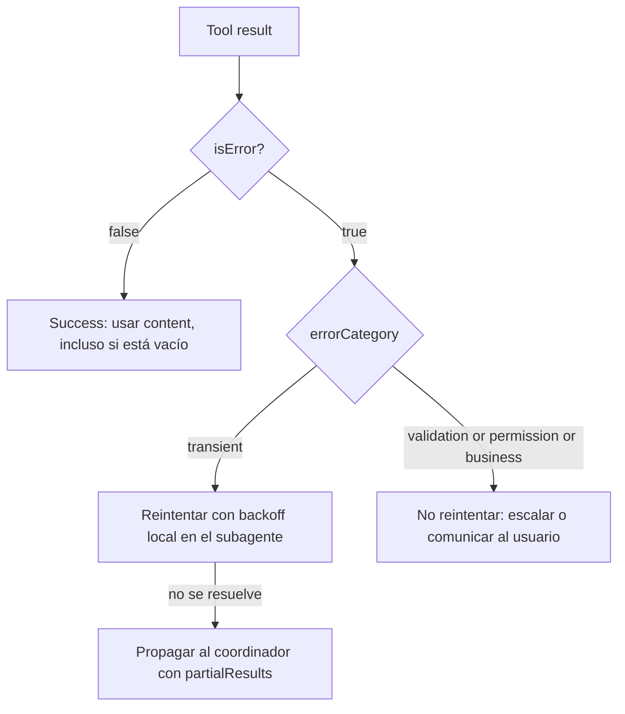
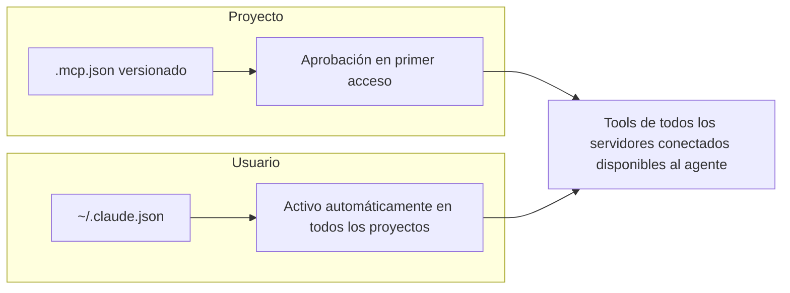

# Bloque 3 — Diseño de tools y MCP

> **Versión:** 1.0 · **Fecha:** 2026-08-07 · **Generada desde:** corpus v1.0 · **Guía oficial del examen:** v1.0
> **Peso en el examen:** 18% (Domain 2 oficial, "Tool Design & MCP Integration") · **Escenarios donde cae:** comparación de dos tools con descripciones casi idénticas, catálogos de tools sobredimensionados repartidos sin criterio, respuestas de error de tools MCP sin categorizar, configuración de servidores MCP con campos ausentes o mal ubicados, elección entre Read/Write/Edit/Bash/Grep/Glob ante una tarea de exploración o modificación de código

## Qué evalúa el examen en este bloque

El Domain 2 pesa el 18% del examen y mide un tipo de juicio muy concreto: no basta con conocer la sintaxis de `tool_choice` o el flag `isError`, hay que reconocer *cuándo* un diseño de tool concreto producirá *misrouting* (enrutado incorrecto hacia la tool equivocada), *cuándo* un error mal categorizado bloqueará la recuperación de un agente, y *cuándo* escalar de tools nativas a un servidor MCP tiene sentido frente a construir uno propio innecesariamente. Un ejemplo típico de enunciado: se presentan dos tools con descripciones casi idénticas (`analyze_content` y `analyze_document`) y se pregunta por qué el modelo eligió la incorrecta, o se muestra un catálogo de 18 tools repartidas sin criterio entre varios agentes y se pide identificar el problema de diseño subyacente. Los cinco task statements de este bloque recorren ese eje de dentro hacia fuera: primero cómo escribir una interfaz de tool sin ambigüedad (2.1); después cómo comunicar fallos de forma estructurada para que el agente decida entre reintentar, escalar o abandonar (2.2); a continuación cómo repartir el catálogo entre agentes especializados y forzar su uso con `tool_choice` (2.3); luego cómo conectar servidores MCP —el protocolo estándar para exponer tools y recursos externos— a Claude Code y a flujos de agentes (2.4); y por último cómo usar con criterio el set de tools nativas de Claude Code —Read, Write, Edit, Bash, Grep, Glob— en tareas de exploración y modificación de código (2.5).

## Antes de empezar

Este bloque asume que el bloque 0 (fundamentos de la Messages API) ya está dominado, en particular el ciclo `tool_use`/`tool_result`, el significado de `stop_reason` y las cuatro configuraciones de `tool_choice` (`auto`, `any`, tool forzada, `none`): aquí se construye sobre esa mecánica para tomar decisiones de *diseño*, no para repetir cómo funciona la llamada a una tool. Conviene traer fresco también el concepto de `description` como único canal de decisión del modelo —ya introducido en el bloque 0—, porque este bloque lo convierte en una disciplina de ingeniería con reglas propias de consolidación, *namespacing* y granularidad de catálogo.

---

## Lección 1 — Interfaces de tools sin ambigüedad: description, input_schema y los límites del catálogo {#leccion-3-1}

La `description` de una tool es el único canal por el que el modelo decide cuándo y cómo invocarla: no existe un canal adicional de "intención" fuera de ese texto. La razón de que este task statement (2.1) trate el diseño de la interfaz —nombre, descripción, schema, granularidad— como disciplina propia es que una descripción mínima ("Retrieves customer information" frente a "Retrieves order details") no le da al modelo contexto suficiente para diferenciar tools parecidas, y el resultado es *misrouting*.

El JSON mínimo de una tool exige `name` (regex `^[a-zA-Z0-9_-]{1,64}$`), `description` e `input_schema` (JSON Schema con `type`, `properties`, `required`):

```json
// Definición mínima de una tool
{
  "name": "tool_name",
  "description": "Detailed description: what it does, when to use it, boundaries, caveats",
  "input_schema": {
    "type": "object",
    "properties": { "param1": { "type": "string" } },
    "required": ["param1"]
  }
}
```

Una descripción efectiva no es "más texto", es texto con contenido específico: qué hace, cuándo usarla frente a alternativas, inputs/outputs esperados, condiciones de contorno y qué NO hace. Compárense estas dos versiones de la misma tool:

```text
Descripción POBRE: "Gets the stock price for a ticker."

Descripción BUENA: "Retrieves the current stock price for a given ticker symbol.
The ticker symbol must be a valid symbol for a publicly traded company on a major
US stock exchange like NYSE or NASDAQ. The tool will return the latest trade
price in USD. It should be used when the user asks about the current or most
recent price of a specific stock. It will not provide any other information
about the stock or company."
```

La primera versión obliga al modelo a adivinar mercado admitido, formato de salida y límites; la segunda cierra esas tres preguntas de una vez. El campo opcional `input_examples` refuerza la desambiguación con instancias válidas de entrada —a un coste de 20-50 tokens por ejemplo simple y 100-200 para ejemplos complejos— cuando el patrón de entrada es ambiguo (formatos, objetos anidados).

La granularidad del catálogo se gobierna con dos principios opuestos. La **consolidación** agrupa operaciones relacionadas en una sola tool con un parámetro `action`, en vez de exponer cada endpoint de una API como tool separada: `schedule_event` en lugar de `list_users` + `list_events` + `create_event`. Su contrario, la **descomposición por propósito**, divide una tool genérica en funciones con contratos bien definidos cuando sus responsabilidades se solapan —por ejemplo, partir `analyze_document` en `extract_data_points`, `summarize_content` y `verify_claim_against_source`—. El *namespacing* con prefijos o sufijos (`asana_search`, `asana_projects_search`) ayuda al modelo a diferenciar tools de distintos servicios cuando coexisten muchas en el mismo contexto. En el diseño del output también hay reglas de higiene: nombres de campo semánticos (`name`, `image_url`) en vez de identificadores opacos (`uuid`, `256px_image_url`) reducen consumo de tokens y mejoran el razonamiento del modelo, y la paginación o truncado por defecto evita que el payload de respuesta sature el contexto con información de bajo valor.

En producción, el síntoma que delata un catálogo mal diseñado no es un error explícito, sino una tasa de *misrouting* que solo se detecta al revisar transcripciones: un equipo migra una API REST a tools 1:1 con cada endpoint —`list_users`, `list_events`, `create_event`, `update_event`, `delete_event`...— y el agente empieza a llamar a la tool contigua en vez de la correcta cuando el catálogo pasa de 10-12 tools. La causa no es un bug de la API, es que la superficie de decisión del modelo creció más rápido que su capacidad de diferenciarlas por descripción.

El anti-patrón narrado más frecuente ocurre cuando dos tools se solapan funcionalmente —`analyze_content` frente a `analyze_document`, con descripciones casi idénticas—. Alguien razonable, al ver que el modelo confunde ambas, añade más prosa a las dos descripciones existentes esperando que la desambiguación llegue con volumen de texto. Eso no corrige el problema porque la causa no es "poco texto", es solapamiento de propósito: la corrección real es renombrar y reescribir para diferenciar —`analyze_content` pasa a `extract_web_results` con una descripción específica de contenido web—. Cuando la descripción por sí sola no basta para desambiguar un escenario recurrente, 2-4 *few-shot examples* mostrando el razonamiento de selección para peticiones ambiguas cierran el hueco que ni la reescritura resuelve. "Writing effective tools for agents" plantea además el diseño de tools como ciclo iterativo, no como ejercicio de una sola pasada: prototipar con servidores MCP locales, evaluar contra tareas realistas, iterar la `description` y el `input_schema` a partir de transcripciones reales, y validar contra un *held-out set* no usado durante la iteración.

El examen distingue con cuidado "la descripción es insuficiente" (causa *misrouting* entre tools similares, remedio: reescribir) de "el catálogo tiene demasiadas tools granulares" (causa complejidad de decisión, remedio: consolidar o *scoping*, tema que retoma la Lección 3): son dos problemas de diseño distintos con remedios distintos, y confundirlos es el distractor más habitual de este eje.

> **Mini-check 1.** Dos tools de un catálogo (`analyze_content` y `analyze_document`) tienen descripciones casi idénticas y el modelo las confunde de forma sistemática. ¿Cuál es la corrección correcta?
> - [ ] A. Añadir más texto explicativo a las dos descripciones existentes.
> - [x] B. Renombrar una de las tools y reescribir su descripción para diferenciar el propósito de cada una.
> - [ ] C. Eliminar `input_schema` de ambas para simplificar la decisión del modelo.
>
> _Respuesta: B — el solapamiento funcional, no la falta de longitud, es la causa del misrouting; alargar la prosa de dos descripciones ya solapadas no resuelve el problema de fondo._

📖 Para profundizar: Define tools (https://platform.claude.com/docs/en/agents-and-tools/tool-use/define-tools) detalla la sintaxis de `description`, `input_schema` e `input_examples`; Writing effective tools for agents (https://www.anthropic.com/engineering/writing-tools-for-agents) desarrolla consolidación, *namespacing* y el ciclo de iteración con transcripciones reales.

---

## Lección 2 — Errores estructurados en tools MCP: categorización y recuperación {#leccion-3-2}

MCP (Model Context Protocol) comunica el fallo de una tool al agente mediante el flag `isError` en el resultado: este es el mecanismo estándar de señalización de errores del protocolo. El task statement 2.2 aborda un problema muy concreto: una respuesta de error genérica ("Operation failed") no le da al agente ninguna base para decidir entre reintentar, escalar o abandonar la tarea. La estructura del error —no solo su presencia— es lo que habilita recuperación inteligente.

Un resultado de error MCP lleva `isError: true`, un `content` legible para humanos, y metadatos (`_metadata`) que categorizan el fallo en cuatro clases: **transient** (timeouts, servicio no disponible — reintentable), **validation** (input inválido — no reintentable), **business** (violación de reglas de negocio — no reintentable) y **permission** (acceso denegado — no reintentable). El campo `isRetryable` señala explícitamente si el agente debe reintentar:

```json
// Error estructurado con metadata de categorización (esquema base oficial)
{
  "isError": true,
  "content": [
    { "type": "text", "text": "Human-readable error description" }
  ],
  "_metadata": {
    "errorCategory": "transient|validation|permission|business",
    "isRetryable": true
  }
}
```

Para errores de negocio conviene además incluir una explicación orientada al usuario final, para que el agente pueda comunicar el motivo sin reintentar en vano:

```text
// Error de negocio: no reintentable, explicación orientada al cliente
"isRetryable": false,
"text": "Refund amount $750 exceeds the maximum single-transaction limit of $500.
         Please contact the customer support team for policy exceptions."
```

Dentro de una arquitectura de subagentes, la recuperación de errores transitorios debe resolverse *localmente* dentro del subagente (reintento con *backoff*); solo los errores que el subagente no puede resolver se propagan al coordinador, junto con los resultados parciales obtenidos y una descripción de qué se intentó:

```json
// Propagación subagente → coordinador: el subagente no pudo resolver
// el error localmente y escala añadiendo contexto adicional (campos
// ilustrativos de esta arquitectura, no parte del esquema base oficial)
{
  "isError": true,
  "content": [
    { "type": "text", "text": "Human-readable error description" }
  ],
  "_metadata": {
    "errorCategory": "transient|validation|permission|business",
    "isRetryable": true,
    "originalQuery": "what was attempted",
    "partialResults": []
  }
}
```

Un punto de diseño crítico y fácil de pasar por alto: una consulta que se ejecuta con éxito pero no encuentra resultados es un caso de éxito —`isError: false`, contenido vacío—, completamente distinto de un timeout o un permiso denegado.

```json
// Respuesta exitosa (sin error), aunque el contenido esté vacío
{
  "isError": false,
  "content": [
    { "type": "text", "text": "Response content" }
  ]
}
```



El diagrama muestra que la primera bifurcación es `isError`, no la ausencia de resultados: un resultado vacío exitoso sigue el camino de éxito, y solo los errores transitorios activan el reintento local antes de escalar al coordinador.

En producción, el incidente típico ligado a este eje es un sistema de búsqueda MCP que, ante cero coincidencias, devuelve `isError: true` con el texto "No results found" tratado como fallo: el coordinador, al ver `isError: true`, dispara reintentos indiscriminados o escala prematuramente a un humano, cuando en realidad la consulta se ejecutó correctamente y simplemente no había nada que devolver. El log muestra reintentos sin sentido y nadie entiende por qué, porque el error de fondo no está en la lógica de negocio sino en la categorización del resultado.

El anti-patrón narrado inverso es igual de costoso: tratar *todos* los errores como reintentables. Alguien razonable, al ver que un reintento con *backoff* resuelve los timeouts, generaliza esa lógica a cualquier fallo —incluidos errores de validación y de permisos, que nunca cambian de resultado por reintentarse—. El agente entra en un bucle de reintentos que consume tiempo y presupuesto sin ninguna posibilidad real de éxito, porque la causa del fallo no es transitoria sino estructural.

**Regla mnemotécnica:** solo `transient` es reintentable; `validation`, `business` y `permission` nunca lo son. Un resultado vacío legítimo es éxito, no error.

> **Mini-check 2.** Una tool MCP ejecuta una consulta con éxito pero no encuentra ninguna coincidencia. ¿Cómo debe reportarse ese resultado?
> - [ ] A. `isError: true` con `errorCategory: "validation"`, porque la búsqueda no produjo datos útiles.
> - [x] B. `isError: false` con `content` vacío: es un resultado válido, distinto de un fallo de acceso o timeout.
> - [ ] C. Omitir el campo `isError` por completo para que el agente decida.
>
> _Respuesta: B — suprimir la distinción entre "no hay resultados" y "la consulta falló" rompe la capacidad del coordinador de interpretar correctamente qué pasó._

📖 Para profundizar: Build an MCP server (https://modelcontextprotocol.io/docs/develop/build-server) documenta el esquema base de `isError` y `content` en resultados de tool MCP.

---

## Lección 3 — Distribución de tools entre agentes y configuración de tool_choice {#leccion-3-3}

Dar a un agente acceso a demasiadas tools —18 en vez de 4-5— degrada la fiabilidad de selección, porque el agente tiene más opciones entre las que confundirse. Además, los agentes con tools fuera de su especialización tienden a usarlas mal: un agente de síntesis con acceso a búsqueda web intentará buscar en vez de apoyarse en los datos ya recopilados. El task statement 2.3 trata la distribución del catálogo entre agentes especializados y la configuración de `tool_choice` como dos palancas del mismo problema: reducir la superficie de decisión a lo estrictamente necesario para cada rol.

El principio de **scoped tool access** da a cada agente solo las tools de su rol, con tools cruzadas limitadas para necesidades de alta frecuencia específicas —por ejemplo, una tool `verify_fact` disponible también para el agente de síntesis aunque pertenezca conceptualmente al rol de verificación—:

```yaml
# Restricción de tools de un subagente en el Agent SDK
---
name: "synthesis-agent"
tools: ["verify_fact", "read_documents"]
disallowedTools: ["web_search"]
---
```

`tool_choice` tiene tres configuraciones relevantes en este contexto: `"auto"` (Claude decide si llama a alguna tool; valor por defecto cuando se proveen `tools`), `"any"` (Claude debe usar alguna tool, sin especificar cuál; garantiza que se llamará a una) y la selección forzada `{"type": "tool", "name": "..."}` (garantiza que se llame exactamente a esa tool, útil para forzar un primer paso obligatorio en una secuencia):

```json
{ "tool_choice": {"type": "tool", "name": "get_weather"} }
```

Combinar `tool_choice: "any"` con `strict: true` en la tool garantiza a la vez que se llamará a una tool y que su input cumplirá el schema exactamente. Reducir el número de tools por agente también reduce el overhead de tokens por sesión, porque las tools de cada servidor conectado se cargan en el contexto al inicio de la sesión.

Un matiz que el examen explota como distractor recurrente: cuando `tool_choice` es `"any"` o una tool forzada, la API prefila el mensaje del asistente, por lo que el modelo no emite texto natural antes del `tool_use` aunque el prompt pida explícitamente un razonamiento previo. Si se necesita tanto contexto conversacional como la garantía de llamada, la combinación correcta es `tool_choice: "auto"` junto con una instrucción explícita en el prompt, no `"any"` ni la tool forzada.

En producción, el patrón que funciona es el *role-based tool scoping*: un agente de búsqueda web tiene `[search_web, fetch_url]`, uno de análisis tiene `[extract_data, analyze_text]`, uno de síntesis tiene `[verify_fact, summarize]`, y las tools cruzadas se listan explícitamente solo donde se necesitan. Sustituir tools genéricas por alternativas restringidas —`fetch_url` genérica por `load_document`, que valida URLs de documentos— reduce además el riesgo de mal uso. Cuando el orden de pasos es crítico (autenticar antes de procesar un reembolso), forzar la tool concreta en el primer paso garantiza la secuencia; los pasos siguientes se gestionan en turnos posteriores con `"auto"`.

El anti-patrón narrado más habitual es dar todas las tools a todos los agentes "por si acaso". Alguien razonable piensa que más tools disponibles dan más capacidad, pero el resultado observado es el contrario: el tamaño de contexto por sesión crece y el agente de síntesis, viendo `web_search` disponible, la usa en vez de apoyarse en los datos ya recopilados por el agente de búsqueda —justo el mal uso que el scoping por rol existe para prevenir—. El anti-patrón simétrico es confiar en exceso en `tool_choice: "auto"` cuando la secuencia es crítica: el agente puede saltarse un prerrequisito (procesar un reembolso sin autenticar primero) porque nada le impide hacerlo, y ahí se necesita selección forzada para un orden determinista.

**Tabla de decisión:**

| Situación | Elección correcta | Por qué |
|---|---|---|
| Catálogo de tools disponible para un agente de más de 5-6 tools sin relación clara con su rol | Scoped tool access: recortar al catálogo del rol, con cruces explícitos si hacen falta | Reduce la superficie de decisión y evita mal uso de tools ajenas al rol |
| Un paso debe ejecutarse siempre primero en una secuencia crítica | Tool forzada `{"type": "tool", "name": "..."}` en ese paso | Garantiza el orden sin depender del razonamiento del modelo en ese turno |
| Se necesita razonamiento en texto Y garantía de llamada a tool | `tool_choice: "auto"` + instrucción explícita en el prompt | `"any"` y la tool forzada prefilan la respuesta e impiden texto previo |

> **Mini-check 3.** Un flujo necesita que el modelo explique en texto su razonamiento antes de llamar obligatoriamente a una tool de extracción de datos. ¿Qué configuración de `tool_choice` cumple ambos requisitos?
> - [ ] A. `tool_choice: "any"`, porque garantiza la llamada a alguna tool.
> - [ ] B. Tool forzada `{"type": "tool", "name": "extract_data"}`, porque fija cuál se llama.
> - [x] C. `tool_choice: "auto"` combinado con una instrucción explícita en el prompt pidiendo el uso de la tool.
>
> _Respuesta: C — tanto `"any"` como la tool forzada prefilan el mensaje del asistente y eliminan la posibilidad de texto de razonamiento previo al `tool_use`; solo `"auto"` deja ese espacio abierto._

📖 Para profundizar: Define tools (https://platform.claude.com/docs/en/agents-and-tools/tool-use/define-tools) cubre `tool_choice` y su combinación con `strict`; MCP quickstart (https://code.claude.com/docs/en/mcp-quickstart) ilustra la restricción de tools en configuraciones de subagente.

---

## Lección 4 — Integración de servidores MCP en Claude Code y flujos de agentes {#leccion-3-4}

MCP (Model Context Protocol) es el mecanismo estándar para conectar herramientas y fuentes de datos externas a Claude Code y a flujos de agentes, evitando reimplementar integraciones ad hoc por cada servicio. El task statement 2.4 es, en el fondo, un problema de alcance y gobernanza: dónde se registra un servidor MCP, cómo se gestionan credenciales sin comprometerlas, y cuándo conviene un servidor comunitario frente a uno propio.

Hay dos ámbitos de configuración. El **project-level** usa `.mcp.json`, versionado en el repositorio y disponible para todo el equipo; el primer acceso pide aprobación explícita del usuario antes de conectar, y una vez aprobado queda disponible en todas las sesiones de ese proyecto:

```json
// .mcp.json de proyecto: servidor HTTP remoto
{
  "mcpServers": {
    "claude-code-docs": {
      "type": "http",
      "url": "https://code.claude.com/docs/mcp"
    }
  }
}
```

```json
// .mcp.json de proyecto: servidor local stdio
{
  "mcpServers": {
    "playwright": {
      "type": "stdio",
      "command": "npx",
      "args": ["-y", "@playwright/mcp@latest"]
    }
  }
}
```

El **user-level** usa `~/.claude.json`, registrado una sola vez y activo automáticamente en todos los proyectos del usuario, sin aprobación por proyecto: pensado para servidores personales o experimentales. La expansión de variables de entorno dentro de `.mcp.json` (sintaxis `${GITHUB_TOKEN}`) permite gestionar credenciales sin comprometerlas en el control de versiones; las variables se resuelven en el momento de la conexión:

```json
// Expansión de variable de entorno para credenciales
{
  "mcpServers": {
    "github": {
      "type": "http",
      "url": "https://github.com/mcp",
      "env": { "GITHUB_TOKEN": "${GITHUB_TOKEN}" }
    }
  }
}
```

```bash
# Añadir un servidor MCP vía CLI
claude mcp add --transport http server-name https://example.com/mcp
```



El diagrama muestra que ambos ámbitos convergen en el mismo resultado —tools disponibles simultáneamente para el agente desde la conexión—, pero difieren en gobernanza: aprobación explícita por proyecto frente a activación automática por usuario.

Las tools de todos los servidores MCP configurados se descubren en el momento de la conexión y quedan disponibles simultáneamente para el agente: no existe un paso explícito de selección de servidor, el agente elige entre todas las tools disponibles igual que con cualquier otra tool. Distinto de las tools son los **MCP resources**: exponen catálogos de contenido de solo lectura (resúmenes de issues, jerarquías de documentación, esquemas de base de datos) para que el agente vea qué datos existen sin necesidad de llamadas de tool exploratorias, referenciables desde un prompt con el formato `@server:protocol://resource/path`:

```text
# Referencia a un MCP resource dentro de un prompt
# formato: @server:protocol://resource/path (el componente de protocolo es obligatorio)
@github:issue://123
@docs:file://api/authentication
```

En producción, el escenario que se repite es un servidor MCP recién conectado cuyas tools el agente ignora sistemáticamente en favor de Grep u otras tools nativas más simples, aunque el servidor MCP sea objetivamente más capaz para esa tarea. La causa casi siempre es la misma que en la Lección 1: descripciones de tool pobres en el servidor MCP por defecto. La solución no es sustituir el servidor, es aplicar el mismo rigor de descripción de 2.1 a sus tools.

El anti-patrón narrado más grave en este eje es comprometer credenciales directamente en `.mcp.json` en texto plano, en vez de usar expansión de variables `${VAR}` —un error que, al estar el fichero versionado, expone el secreto a todo el repositorio—. Un anti-patrón de configuración más sutil, y trampa de examen frecuente: definir un servidor con `url` pero sin el campo `"type"`. Alguien razonable asume que Claude Code infiere `"http"` a partir de la presencia de `url`, pero no es así: sin `"type"` explícito el servidor se interpreta como `stdio` por defecto y la conexión falla. Por último, antes de construir un servidor MCP propio para una integración estándar (Jira, Slack, GitHub) conviene evaluar el directorio de servidores comunitarios existentes; el desarrollo a medida se reserva para flujos específicos del equipo. Como restricción de nomenclatura, nombres reservados como `workspace`, `claude-in-chrome`, `computer-use`, `Claude Preview` o `Claude Browser` no pueden reutilizarse para servidores MCP propios.

> **Mini-check 4.** Un equipo quiere compartir un servidor MCP con todos los miembros que trabajen en un repositorio concreto, exigiendo aprobación explícita antes de la primera conexión. ¿Dónde debe registrarse?
> - [ ] A. En `~/.claude.json`, porque se activa automáticamente en todos los proyectos.
> - [x] B. En `.mcp.json` de proyecto, versionado en el repositorio.
> - [ ] C. En ambos ficheros simultáneamente, para redundancia.
>
> _Respuesta: B — `.mcp.json` de proyecto es el ámbito que exige aprobación explícita en el primer acceso y queda disponible para todo el equipo tras aprobarse; `~/.claude.json` se activa sin aprobación por proyecto._

📖 Para profundizar: Connect Claude Code to tools via MCP (https://code.claude.com/docs/en/mcp) detalla `.mcp.json` frente a `~/.claude.json`, la expansión de variables y los nombres reservados; MCP quickstart (https://code.claude.com/docs/en/mcp-quickstart) cubre la conexión inicial vía CLI.

---

## Lección 5 — Tools nativas de Claude Code: Read, Write, Edit, Bash, Grep, Glob {#leccion-3-5}

Claude Code expone un set nativo de tools de exploración y modificación de ficheros —Read, Write, Edit, Bash, Grep, Glob—, cada una con un propósito y un contrato de permisos distintos. El task statement 2.5 evalúa el criterio para elegir la tool correcta según la tarea —búsqueda de contenido frente a búsqueda de rutas, modificación puntual frente a reescritura completa— y reconocer cuándo el uso incorrecto de una tool nativa produce fallos evitables.

**Read** carga el contenido completo de un fichero con números de línea; si excede el límite de tokens devuelve la primera página con aviso de vista parcial, y soporta `offset`/`limit`. Maneja tipos especiales: imágenes PNG/JPG como contenido visual, PDFs completos en documentos cortos o por rangos de páginas (`pages: "1-5"`, hasta 20 páginas por llamada) en PDFs de más de 10 páginas, y notebooks Jupyter (`.ipynb`) con todas las celdas y sus outputs. Read es de solo lectura y no requiere permiso por defecto para rutas dentro del directorio de trabajo.

**Write** crea un fichero nuevo o sobrescribe uno existente con el contenido completo, sin *append* ni *merge*; si el fichero ya existe, exige que Claude lo haya leído antes en la conversación actual, o la escritura falla —los ficheros nuevos no tienen ese requisito—. Write requiere permiso.

**Edit** realiza reemplazo de cadena exacta: toma `old_string` y `new_string` y sustituye la primera coincidencia exacta, sin regex ni *fuzzy matching*. Para que Edit se aplique deben cumplirse tres condiciones: lectura previa del fichero en la conversación actual (aunque modelos recientes pueden editar ficheros no leídos si la lectura no requeriría permiso), coincidencia exacta de `old_string`, y unicidad de esa coincidencia —o usar `replace_all: true`—. Cuando Edit falla por coincidencias no únicas, el patrón de respaldo es Read + Write. Edit requiere permiso, y una regla de permiso de Edit también concede acceso de lectura a la misma ruta.

**Bash** ejecuta comandos de shell; un conjunto de comandos de solo lectura (`ls`, `cat`, `echo`, `pwd`, `head`, `tail`, `grep`, `find`, `wc`, `which`, `diff`, `stat`, `du`, `cd`, `git`) se ejecuta sin *prompt* de permiso. Las variables de entorno no persisten entre comandos salvo que se fijen con `CLAUDE_ENV_FILE`, porque cada comando corre en un proceso separado. El *timeout* por defecto es de 2 minutos (máximo 10, configurable con `BASH_DEFAULT_TIMEOUT_MS` y `BASH_MAX_TIMEOUT_MS`); los comandos que superan el *timeout* pasan a segundo plano automáticamente. Bash requiere permiso.

**Grep** busca patrones en el contenido de ficheros —líneas, no ficheros— y está construido sobre ripgrep, no el `grep` POSIX estándar, por lo que requiere sintaxis de escape propia de ripgrep (`interface\{\}` para encontrar `interface{}` en Go). Tiene tres modos de salida: `files_with_matches` (rutas de fichero, por defecto), `content` (líneas con fichero y número de línea) y `count` (número de coincidencias por fichero y total). Respeta `.gitignore` por defecto; soporta `glob` (`**/*.tsx`) y `type` (`py`, `rust`); el *matching* es de una sola línea por defecto, y `multiline: true` habilita patrones que cruzan líneas. Grep es de solo lectura.

**Glob** encuentra ficheros por patrón de nombre, con soporte de `**` para recursividad (`**/*.js` en cualquier profundidad, `src/**/*.ts` bajo `src/`) y expansión de llaves (`*.{json,yaml}`). Los resultados se ordenan por fecha de modificación, con un tope de 100 ficheros y un flag de truncamiento que indica que hay que acotar el patrón. Glob no respeta `.gitignore` por defecto. Glob es de solo lectura.

```text
// Patrones típicos de Glob
**/*.test.tsx        # todos los tests, en cualquier profundidad
src/**/*.ts          # todo TypeScript bajo src/
*.{json,yaml}        # cualquier fichero .json o .yaml en el nivel actual
```

En producción, el patrón de exploración que funciona es incremental: empezar con Grep para localizar puntos de entrada (todos los llamadores de una función, mensajes de error, imports), y usar Read solo después para seguir esos hallazgos y trazar flujos, en vez de leer todo el repositorio por adelantado. Para rastrear el uso de una función, primero se identifican todos los nombres exportados y luego se usa Grep para cada nombre a través de la base de código, incluyendo módulos *wrapper*.

El anti-patrón narrado más costoso es leer bases de código enteras por adelantado "para tener todo el contexto de golpe": alguien razonable piensa que más contexto de partida reduce errores posteriores, pero el resultado es agotar el presupuesto de contexto antes de llegar a la tarea real, eliminando la posibilidad de exploración incremental. El anti-patrón simétrico, más frecuente como distractor de examen, es tratar Grep y Glob como intercambiables: Grep busca contenido —líneas dentro de ficheros—, Glob busca ficheros por patrón de nombre; usar Grep para "encontrar todos los ficheros `.test.tsx`" o Glob para "encontrar dónde se llama a esta función" es un error de categoría, no de sintaxis. Un tercer distractor habitual distingue dos condiciones distintas de fallo de Edit: "falla por coincidencia no única" (remedio: Read + Write, o `replace_all: true`) frente a "falla por no haber leído el fichero antes" (remedio: leer el fichero primero); son dos de las tres condiciones que Edit exige, y el remedio de una no resuelve la otra.

**Tabla de decisión:**

| Necesito... | Tool correcta | Por qué |
|---|---|---|
| Buscar contenido de código (funciones, errores, imports) | Grep | Busca líneas dentro de ficheros, no nombres de fichero |
| Buscar ficheros por patrón de nombre o extensión | Glob | *Pattern matching* sobre rutas, con soporte de `**` y expansión de llaves |
| Edit falla por texto no único | Read + Write (o `replace_all: true`) | Edit exige coincidencia única de `old_string`; Read + Write no tiene esa restricción |
| Crear un fichero nuevo | Write | Edit no está pensado para creación; Write es la tool correcta |

> **Mini-check 5.** Un intento de Edit falla porque `old_string` aparece dos veces en el fichero. ¿Cuál es el remedio correcto?
> - [ ] A. Volver a leer el fichero con Read antes de reintentar el mismo Edit.
> - [x] B. Usar Read + Write para reescribir el fichero completo, o repetir Edit con `replace_all: true`.
> - [ ] C. Ejecutar `sed` vía Bash, porque Edit no admite reemplazos múltiples.
>
> _Respuesta: B — "coincidencia no única" es una condición distinta de "fichero no leído"; volver a leer un fichero ya leído no resuelve la falta de unicidad del `old_string`._

📖 Para profundizar: Tools reference (https://code.claude.com/docs/en/tools-reference) documenta el comportamiento, permisos y límites exactos de Read, Write, Edit, Bash, Grep y Glob.

---

## Checklist de salida

Dominas este bloque si puedes, sin mirar la guía:

- [ ] Diagnosticar si un fallo de selección de tool se debe a una `description` insuficiente (misrouting entre tools parecidas) o a un catálogo con demasiadas tools granulares (complejidad de decisión), y aplicar el remedio correcto en cada caso (2.1).
- [ ] Categorizar un error de tool MCP en `transient`, `validation`, `business` o `permission`, decidir su `isRetryable`, y distinguir un resultado vacío legítimo (`isError: false`) de un fallo real (2.2).
- [ ] Diseñar un reparto de tools por rol de agente (*scoped tool access*) y elegir entre `tool_choice: "auto"`, `"any"` y tool forzada según se necesite flexibilidad, garantía de llamada o determinismo de secuencia (2.3).
- [ ] Configurar un servidor MCP en `.mcp.json` de proyecto o `~/.claude.json` de usuario según su alcance, gestionar credenciales con expansión de variables, y decidir cuándo un servidor comunitario basta frente a construir uno propio (2.4).
- [ ] Elegir entre Read, Write, Edit, Bash, Grep y Glob según la tarea de exploración o modificación, reconociendo las tres condiciones que exige Edit y por qué Grep y Glob no son intercambiables (2.5).

## Para ir más allá — referencias anotadas

- Define tools — https://platform.claude.com/docs/en/agents-and-tools/tool-use/define-tools — sintaxis de `description`, `input_schema`, `input_examples` y `tool_choice`; base de las Lecciones 1 y 3.
- Writing effective tools for agents — https://www.anthropic.com/engineering/writing-tools-for-agents — consolidación, *namespacing* y el ciclo iterativo de diseño de tools contra tareas realistas; base de la Lección 1.
- Build an MCP server — https://modelcontextprotocol.io/docs/develop/build-server — esquema base de `isError`, `content` y categorización de errores en resultados de tool MCP; base de la Lección 2.
- MCP quickstart — https://code.claude.com/docs/en/mcp-quickstart — conexión inicial de servidores MCP vía CLI y restricción de tools en subagentes; complementa las Lecciones 3 y 4.
- Connect Claude Code to tools via MCP — https://code.claude.com/docs/en/mcp — `.mcp.json` frente a `~/.claude.json`, expansión de variables de entorno y nombres reservados; base de la Lección 4.
- Tools reference — https://code.claude.com/docs/en/tools-reference — comportamiento, permisos y límites de Read, Write, Edit, Bash, Grep y Glob; base de la Lección 5.

*Historial de versiones del curso: [changelog](../../changelog.html) — único para todo el material; esta guía no lleva el suyo propio.*
