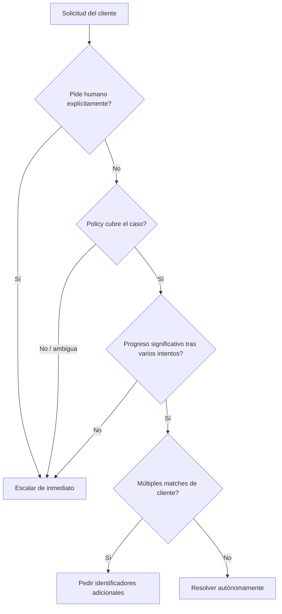
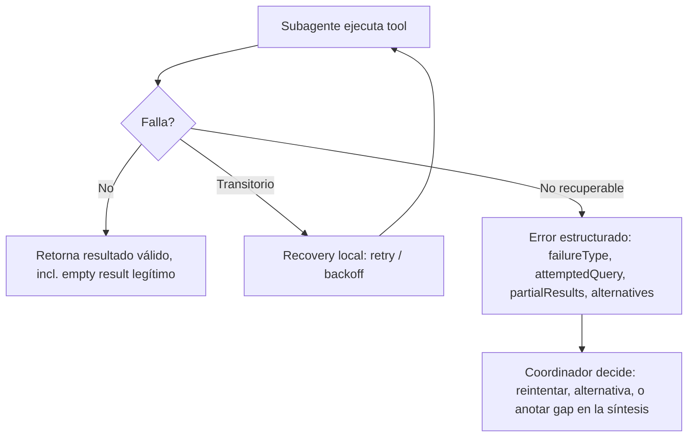
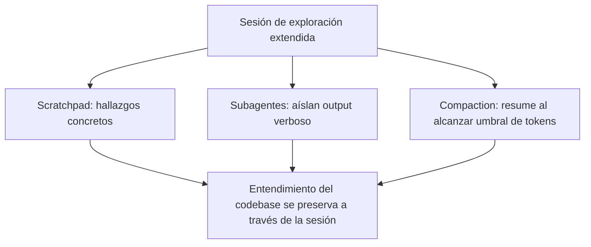

# Bloque 5 — Gestión de contexto y fiabilidad

> **Versión:** 1.0 · **Fecha:** 2026-08-07 · **Generada desde:** corpus v1.0 · **Guía oficial del examen:** v1.0
> **Peso en el examen:** 15% (Dominio 5 oficial: Context Management & Reliability) · **Escenarios donde cae:** conversaciones y sesiones de exploración muy largas, sistemas multi-agente con subagentes que fallan o divergen, flujos de revisión humana con métricas agregadas engañosas, síntesis de múltiples fuentes con datos conflictivos

## Qué evalúa el examen en este bloque

Este bloque cierra el temario con la pregunta que atraviesa a los otros cuatro dominios: qué pasa cuando la conversación, la exploración de código o el sistema multi-agente se alargan lo suficiente como para que el contexto deje de ser fiable. Mientras otros bloques se centran en *cómo* orquestar agentes y tools, aquí se evalúa *qué* información sobrevive esa orquestación —hechos transaccionales, atribución de fuentes, criterios de escalación— y con qué garantías. Un enunciado típico describe un agente de soporte que tras veinte turnos empieza a repetir preguntas ya respondidas, o un sistema de research con varios subagentes donde uno falla en silencio y la síntesis final no lo refleja; la pregunta pide identificar la causa raíz y el mecanismo correcto, no solo reconocer el síntoma. Los seis task statements (5.1 a 5.6) recorren, en este orden, la preservación de contexto conversacional, el diseño de escalación, la propagación de errores entre agentes, la exploración de codebases grandes, la calibración de revisión humana y la preservación de procedencia en síntesis multi-fuente.

## Antes de empezar

Este bloque asume que ya dominas el bucle agéntico básico (Bloque 0), el diseño de tools y sub-agentes (Bloques 1-2) y, sobre todo, el Agent SDK y los patrones de orquestación multi-agente del Bloque 4: aquí no se explica de nuevo cómo se lanza un subagente o cómo se estructura un coordinador, sino qué información debe sobrevivir esa orquestación cuando las cosas se alargan o fallan. Conviene llegar con una intuición clara de qué es la ventana de contexto y por qué la API de Claude es stateless (sin estado), porque buena parte de los mecanismos de este bloque —case facts, scratchpads, compaction— existen precisamente para gestionar las consecuencias de esa arquitectura sin estado a lo largo de sesiones largas.

---

## Lección 1 — Preservar contexto crítico en interacciones largas: case facts, context awareness y el efecto lost in the middle {#leccion-5-1}

A medida que una conversación acumula turnos, la ventana de contexto crece y la precisión con la que el modelo recupera datos concretos se degrada de forma progresiva, un fenómeno conocido como *context rot* (degradación progresiva de la fiabilidad de recuperación de información en contextos largos). No es un límite duro como agotar tokens: técnicamente los datos siguen cabiendo en la ventana, pero la fiabilidad con la que el modelo los usa cae. El problema que resuelve este eje es cómo diseñar el flujo de información para que los hechos críticos —importes, fechas, números de pedido, expectativas explícitas del cliente— sobrevivan intactos aunque la conversación se alargue y se resuma varias veces.

La causa de fondo tiene dos componentes que conviene separar bien. Por un lado está el *lost in the middle effect* (efecto de pérdida en el medio): los modelos procesan de forma fiable la información al principio y al final de una entrada larga, pero pueden omitir hallazgos situados en secciones intermedias. Por otro está la acumulación desproporcionada de resultados de tools: un resultado de búsqueda de pedido puede traer 40 o más campos cuando solo 5 son relevantes para la tarea, y esos campos irrelevantes se acumulan turno tras turno consumiendo presupuesto sin aportar nada. A esto se suma el riesgo de la *progressive summarization*: condensar valores numéricos y expectativas explícitas del cliente en resúmenes vagos ("el cliente tiene un problema de envío") destruye precisión que después no se puede reconstruir. Los modelos más recientes (Sonnet 5, Sonnet 4.6, Sonnet 4.5, Haiku 4.5) mitigan parcialmente esto con **context awareness** automático: la API inyecta una etiqueta al inicio de la conversación y actualizaciones tras cada tool call para que el propio modelo rastree su presupuesto restante.

```xml
<!-- Inyectado por la API al inicio de la conversación -->
<budget:token_budget>200000</budget:token_budget>
```

```xml
<!-- Actualización tras cada tool call -->
<system_warning>Token usage: 35000/200000; 165000 remaining</system_warning>
```

Pero context awareness ayuda al modelo a autorregularse; no resuelve el problema de fondo, que es de diseño de la aplicación. El patrón nuclear consiste en separar dos capas: el historial conversacional completo, que se reenvía sin recortar porque la API es *stateless* (sin estado) y ese reenvío es literalmente lo que sostiene la coherencia de la conversación —esto no es un anti-patrón, es un requisito real—, y una **capa de hechos estructurados** que se extrae y persiste aparte, fuera de cualquier resumen, para que ningún paso de compresión posterior pueda diluirla.

```json
// Persistent "case facts" block: se incluye en CADA prompt, fuera del historial resumible
{
  "case_facts": {
    "order_id": "ORD-88214",
    "amount": 129.99,
    "currency": "USD",
    "issue_date": "2026-07-30",
    "customer_stated_expectation": "full refund within 5 business days",
    "status": "shipped"
  }
}
```

Sobre esa base se añaden mitigaciones puntuales: recortar (*trim*) los tool outputs verbosos a solo los campos relevantes antes de que se acumulen; colocar los resúmenes de hallazgos clave al principio de los inputs agregados en vez de enterrarlos a mitad de un bloque largo; y, en arquitecturas multi-agente, exigir a los subagentes que incluyan metadata explícita (fechas, fuente, contexto metodológico) en sus outputs estructurados para que la síntesis downstream no dependa de reconstruir esa información implícitamente. Un hallazgo relacionado y contraintuitivo: pedir al modelo que extraiga primero a un *scratchpad* (bloc de notas temporal) las citas o pasajes relevantes antes de responder mejora la precisión de recuperación frente a responder directamente, a un coste pequeño de latencia, y la mejora se mantiene incluso cuando el pasaje relevante está cerca del principio del documento, no solo al final. Es el mismo principio que el bloque de case facts: obligar a que lo crítico quede escrito explícitamente en vez de confiar en que el modelo lo recupere de un historial largo.

En producción esto se ve en sesiones de soporte multi-issue: un cliente abre un caso, la conversación se alarga con varias idas y vueltas, y al turno 20 el agente necesita seguir sabiendo con precisión que el importe es 129.99 USD y que la promesa fue "reembolso completo en 5 días hábiles" —no una paráfrasis vaga de esos datos generada dos resúmenes atrás—. El anti-patrón más costoso en la dirección opuesta es cargar todos los archivos o toda la información disponible por adelantado "por si acaso": consume tokens innecesarios y acelera precisamente el context rot que se quiere evitar; el patrón correcto es exploración *just-in-time* (bajo demanda), cargando datos dinámicamente según se necesiten.

El examen suele contraponer dos afirmaciones que parecen contradictorias pero no lo son: "hay que reenviar el historial completo para mantener coherencia" (cierto, requisito de la API stateless) y "hay que recortar/extraer agresivamente" (también cierto, pero aplicado a tool outputs verbosos y a hechos transaccionales extraídos a un bloque aparte, no al historial conversacional en sí). La opción distractora generaliza el trimming al historial completo, lo que rompe coherencia; la correcta reconoce que ambas cosas conviven porque actúan en capas distintas.

> **Mini-check 1.** Un agente de soporte lleva 25 turnos de conversación con un cliente. ¿Cuál es la forma correcta de asegurar que el importe exacto del pedido no se pierda en un resumen posterior?
> - [ ] A. Reenviar solo los últimos 3 turnos en cada request para ahorrar tokens.
> - [x] B. Mantener un bloque de "case facts" persistente con los datos transaccionales, aparte del historial resumible.
> - [ ] C. Confiar en que `context awareness` reconstruya el dato automáticamente cuando haga falta.
>
> _Respuesta: B — un bloque de hechos estructurados que se incluye en cada prompt, fuera del historial que puede resumirse, es el único mecanismo que garantiza que un resumen posterior no diluya ese valor; context awareness solo informa del presupuesto restante, no protege datos concretos._

📖 Para profundizar: Context windows (https://platform.claude.com/docs/en/build-with-claude/context-windows) explica el mecanismo de context awareness y el consumo de tokens por turno; Prompting for long context (https://www.anthropic.com/news/prompting-long-context) documenta el hallazgo del scratchpad de extracción de citas.

---

## Lección 2 — Diseñar escalación y resolución de ambigüedad sin proxies engañosos {#leccion-5-2}

Un agente autónomo necesita un criterio explícito para decidir cuándo resolver por sí mismo y cuándo escalar a un humano. El problema de fondo es que las señales "obvias" para inferir esa decisión —cuán frustrado suena el cliente, cuán seguro dice estar el propio modelo— no correlacionan de forma fiable con la complejidad real del caso, y diseñar la escalación sobre esas señales produce sistemas que escalan mal en ambas direcciones: casos simples escalados de más, casos complejos resueltos de menos.

Los triggers de escalación apropiados están explícitamente delimitados a tres: el cliente solicita un humano de forma explícita, existe una excepción o un vacío de policy (no basta con que el caso sea "complejo" en abstracto), o el agente no puede hacer progreso significativo tras varios intentos. La primera categoría tiene una distinción fina que el examen explota: si el cliente exige un humano explícitamente, se escala de inmediato, sin intentar investigación previa; pero si el issue es sencillo y está dentro de las capacidades del agente, se reconoce la frustración del cliente y se ofrece resolución, escalando solo si el cliente reitera su preferencia. El vacío de policy es un trigger legítimo aunque el caso no sea "difícil": un cliente que pide igualar el precio de un competidor, cuando la policy solo cubre ajustes de precio en el propio sitio, no está frente a un caso complejo sino frente a un silencio de la policy, y eso basta para escalar. Cuando una búsqueda retorna múltiples matches de cliente, la resolución correcta de la ambigüedad de identidad es pedir identificadores adicionales, nunca elegir por heurística (como "el registro más reciente"): esa heurística puede llevar a actuar sobre el cliente equivocado.

```text
# Fragmento de system prompt: criterios explícitos + few-shot
Escalate when:
- Customer explicitly requests human agent
- Policy does not address the specific request
- You cannot make meaningful progress after several attempts

Do NOT escalate when:
- Issue is within your capabilities and straightforward
- Customer is frustrated but not requesting a human
```

El patrón que el examen premia es exactamente ese: añadir criterios explícitos de escalación con ejemplos *few-shot* (unos pocos ejemplos de referencia en el propio prompt) al system prompt, mostrando cuándo escalar frente a cuándo resolver de forma autónoma. Es la intervención de menor esfuerzo, y suele ser la correcta cuando el problema de fondo es que los límites de decisión son ambiguos, no que falte infraestructura. Un caso de producción recurrente: un agente logra 55% de resolución en el primer contacto frente a un objetivo del 80%, y los logs muestran que escala casos sencillos —un reemplazo por daño con evidencia fotográfica adjunta— mientras intenta resolver por su cuenta casos que requieren excepciones de policy que no tiene autoridad para conceder. La causa raíz son límites de decisión poco claros en el prompt, y la solución es la misma de siempre: criterios explícitos con few-shot, no un sistema nuevo.



El diagrama muestra que la escalación se decide por triggers explícitos en cascada —petición explícita, vacío de policy, falta de progreso, ambigüedad de identidad— y nunca por proxies indirectos como el sentimiento del cliente o la confianza autoreportada del modelo.

Los anti-patrones de este eje son casi siempre proxies plausibles pero no fiables. Escalar según *sentiment analysis* (detección de frustración en el texto del cliente) falla porque el sentimiento no correlaciona con la complejidad real: un cliente muy frustrado con un problema trivial no necesita escalación, y uno tranquilo con un caso genuinamente complejo sí. Usar el *confidence score* autoreportado por el propio modelo es igual de frágil: en sistemas agénticos, cambios menores en el input pueden producir cambios grandes de comportamiento, y el modelo puede mostrarse incorrectamente seguro precisamente en los casos difíciles donde más falla. Desplegar un clasificador separado entrenado con tickets históricos para predecir la escalación es sobre-ingeniería cuando el problema real —criterios ambiguos en el prompt— ni siquiera se ha intentado resolver con la intervención más barata.

**Tabla de decisión:**

| Situación | Elección correcta | Por qué |
|---|---|---|
| Cliente exige explícitamente un humano | Escalar de inmediato, sin investigar antes | La preferencia explícita tiene prioridad sobre cualquier intento de resolución |
| Umbral de escalación ambiguo en el prompt | Criterios explícitos + few-shot en el system prompt | Intervención de menor esfuerzo que ataca la causa raíz real |
| Decidir si un caso es "complejo" | Nunca sentiment analysis ni confidence autoreportado | Ninguno de los dos correlaciona de forma fiable con la complejidad real |
| Múltiples matches de cliente en una búsqueda | Pedir identificadores adicionales | Elegir por heurística arriesga actuar sobre el cliente equivocado |

> **Mini-check 2.** Un agente de soporte tiene un 55% de resolución en primer contacto frente a un objetivo del 80%, y los logs muestran que escala casos sencillos mientras intenta resolver casos que exigen excepciones de policy. ¿Cuál es la intervención más efectiva como primer paso?
> - [ ] A. Entrenar un clasificador separado con tickets históricos para predecir cuándo escalar.
> - [x] B. Añadir criterios de escalación explícitos con ejemplos few-shot al system prompt.
> - [ ] C. Usar el confidence score autoreportado del modelo como señal de escalación.
>
> _Respuesta: B — la causa raíz es que los límites de decisión son ambiguos en el prompt; esa es la intervención de menor esfuerzo que la ataca directamente, frente a un clasificador (sobre-ingeniería) o un confidence score (proxy no fiable)._

<!-- HUECO: TS 5.2 — cobertura limitada en fuentes oficiales de blog/documentación más allá del exam guide y su Sample Question 3; no se incluyen umbrales concretos adicionales ni plantillas de few-shot más extensas por no estar respaldados en el corpus. -->

📖 Para profundizar: How we built our multi-agent research system (https://www.anthropic.com/engineering/built-multi-agent-research-system) documenta cómo cambios menores en el input pueden producir cambios grandes de comportamiento en sistemas agénticos, relevante para entender por qué el confidence autoreportado no es fiable.

---

## Lección 3 — Propagar errores entre agentes con contexto estructurado, no con un booleano {#leccion-5-3}

Cuando un subagente falla —un timeout, una búsqueda sin resultados, un permiso denegado—, la forma en que ese fallo se comunica al coordinador determina si el sistema puede recuperarse con criterio o si el fallo se propaga de forma opaca hasta romper todo el flujo. El problema que resuelve este eje es diseñar un contrato de error que dé al coordinador la información necesaria para decidir —reintentar, usar una alternativa, aceptar un resultado parcial— en lugar de un simple éxito/fracaso.

El contrato de error estructurado (el patrón `isError` de MCP) incluye, más allá del booleano, el tipo de fallo, si es reintentable, un mensaje legible, qué se intentó, resultados parciales si los hay, y alternativas posibles. Un status genérico como "search unavailable" esconde exactamente ese contexto y le impide al coordinador decidir con criterio. La distinción central que hay que memorizar es entre **access failures** (fallos de acceso, como un timeout, que requieren una decisión de reintento) y **valid empty results** (una consulta que se ejecutó correctamente y simplemente no encontró coincidencias): ambos pueden llegar al coordinador como "sin datos" si no se distinguen explícitamente, pero exigen respuestas opuestas —reintentar en el primer caso, aceptar el resultado en el segundo—.

```json
// Contrato de error estructurado (patrón isError de MCP)
{
  "isError": true,
  "errorCategory": "transient",
  "isRetryable": true,
  "message": "Search service timed out after 30s",
  "failureType": "timeout",
  "attemptedQuery": "orders WHERE customer_id = 88214",
  "partialResults": null,
  "alternativeApproaches": ["retry with backoff", "query secondary index"]
}
```

Los subagentes deben implementar *recovery local* para fallos transitorios —reintentos con backoff, por ejemplo— y propagar al coordinador únicamente los errores que no pueden resolver por sí mismos, incluyendo qué se intentó y qué resultados parciales obtuvieron. Cuando la síntesis final combina resultados de varios subagentes y alguno falló sin recuperación, el output se estructura con **coverage annotations** (anotaciones de cobertura) que indican explícitamente qué hallazgos están bien soportados y qué áreas tienen huecos por fuentes no disponibles, en vez de presentar un resultado aparentemente completo con lagunas silenciosas.



El diagrama muestra que solo los fallos que el subagente no puede resolver localmente llegan al coordinador, y siempre como contexto estructurado —nunca como un status genérico— para habilitar una decisión de recuperación informada.

En un sistema de research con varios subagentes especializados, este patrón se traduce en algo concreto: si un subagente de búsqueda tiene un timeout en una de tres fuentes, el subagente reintenta localmente con backoff antes de considerar siquiera propagar; si tras varios intentos sigue fallando, propaga un error con `failureType: "timeout"` y las alternativas que probó, y el coordinador puede decidir aceptar la síntesis con una nota de cobertura ("fuente X no disponible") en vez de bloquear todo el reporte.

Los dos anti-patrones que el examen contrapone son igual de dañinos en direcciones opuestas. Suprimir errores en silencio —devolver un resultado vacío marcado como éxito cuando en realidad hubo un timeout— esconde el fallo e impide cualquier recuperación, arriesgando entregar un output incompleto sin que nadie lo sepa. Propagar la excepción directamente hasta un handler de nivel superior que termina todo el workflow es el anti-patrón opuesto: un fallo puntual en una de varias fuentes no debería tumbar resultados parciales que sí eran válidos y aprovechables. La opción correcta está en medio: recovery local, propagación estructurada solo de lo irresoluble, y resultados parciales con anotaciones de cobertura.

> **Mini-check 3.** Un subagente de búsqueda ejecuta una consulta que se completa correctamente pero no encuentra ningún resultado. ¿Cómo debe reportarlo al coordinador?
> - [ ] A. Como un error con `isError: true` y `isRetryable: true`, igual que un timeout.
> - [x] B. Como un resultado válido (empty result legítimo), distinto de un access failure.
> - [ ] C. Suprimiendo el reporte por completo, ya que no hay datos que sintetizar.
>
> _Respuesta: B — un empty result válido no es un fallo de acceso; tratarlo como error dispararía reintentos innecesarios, y suprimirlo oculta información legítima (que esa fuente no tiene datos) que la síntesis final podría necesitar._

📖 Para profundizar: How we built our multi-agent research system (https://www.anthropic.com/engineering/built-multi-agent-research-system) describe la recuperación local que retoma el punto donde ocurrió el fallo en vez de reiniciar todo el flujo, y la coordinación mediante resultados parciales.

---

## Lección 4 — Gestionar el contexto en la exploración de codebases grandes: scratchpads, subagentes y compaction {#leccion-5-4}

Explorar un codebase grande en una sesión extendida tiene un síntoma de degradación característico y fácil de reconocer: el modelo empieza a dar respuestas inconsistentes y a referenciar "patrones típicos" genéricos en lugar de las clases concretas que había descubierto antes en esa misma sesión. El problema que resuelve este eje es cómo estructurar la exploración —qué se delega, qué se persiste, qué se comprime— para que ese conocimiento adquirido no se diluya a medida que avanza la sesión.

Tres mecanismos complementarios, no intercambiables, atacan esta degradación desde ángulos distintos. Los **scratchpad files** (ficheros de notas persistentes) permiten que el agente escriba hallazgos clave fuera de la ventana de contexto y los recupere después para preguntas subsecuentes, contrarrestando directamente el efecto de "olvidar" clases o patrones ya descubiertos. La **delegación en subagentes** aísla el output verboso de la exploración —leer decenas de archivos, greps extensos— mientras el agente principal coordina el entendimiento de alto nivel sin cargar ese ruido en su propio contexto: se generan subagentes para preguntas puntuales ("find all test files", "trace refund flow dependencies") mientras el agente principal preserva la coordinación general. La **compaction** es distinta de las dos anteriores: es un mecanismo de plataforma (en beta) que resume automáticamente la conversación al alcanzar un umbral de tokens, sin intervención manual del agente; el comando `/compact` de Claude Code aplica la misma idea bajo demanda cuando el contexto se llena de output de descubrimiento verboso.

```python
# Compaction API (beta): resumen automático al alcanzar el umbral
response = client.beta.messages.create(
    betas=["compact-2026-01-12"],
    model="claude-opus-5",
    max_tokens=4096,
    messages=messages,
    context_management={"edits": [{"type": "compact_20260112"}]}
)
```

```text
# Parámetros de compaction
trigger: 150,000 tokens (mínimo configurable: 50,000)
pause_after_compaction: false (valor por defecto)
instructions: None (usa el resumen por defecto si no se especifica)
```



El diagrama muestra que los tres mecanismos actúan en paralelo sobre el mismo problema —preservar entendimiento durante una exploración larga— pero desde ángulos distintos: notas explícitas, aislamiento de ruido y resumen automático; ninguno sustituye a los otros dos.

Un cuarto ángulo, orientado a recuperación ante caídas, es la **persistencia estructurada de estado**: cada agente exporta su estado a una ubicación conocida (un manifiesto), y el coordinador carga ese manifiesto al reanudar e inyecta su contenido en los prompts de los agentes siguientes. Este mismo patrón aparece materializado en artefactos con nombre concreto en el diseño de harnesses para agentes de larga duración: un fichero de progreso (`claude-progress.txt`) que se lee al inicio de cada sesión para entender el estado sin redescubrirlo; un `feature_list.json` con un campo `passes` que el agente solo puede actualizar, nunca borrar ni redefinir, para no enmascarar funcionalidad rota; los commits de git como puntos de recuperación explícitos con mensajes descriptivos; y un script de bootstrap (`init.sh`) que arranca el entorno en un estado conocido al inicio de cada sesión.

```json
// Manifiesto de estado exportado por un agente (recuperación ante caída)
{
  "phase": "codebase_analysis",
  "key_findings": {
    "entry_points": ["src/main.ts", "src/index.ts"],
    "key_classes": ["UserService", "AuthHandler"],
    "dependencies_identified": {}
  },
  "files_analyzed": ["src/auth.ts", "src/user.ts"],
  "questions_pending": ["find all test files", "trace refund flow"]
}
```

En producción, el patrón correcto de construcción de entendimiento es incremental: empezar con grep para localizar puntos de entrada, seguir imports con lecturas dirigidas para trazar flujos, y solo entonces delegar en subagentes para las siguientes preguntas, inyectándoles un resumen de lo que la fase anterior ya encontró en vez de dejar que cada fase redescubra desde cero. El anti-patrón más costoso es justo lo contrario en dos direcciones: sobrecargar un único agente sin ninguna delegación, que acumula todo el ruido de la exploración y pierde la coordinación de alto nivel que debería mantener; y no persistir hallazgos a través de los límites de contexto —sin scratchpads ni exports de estado—, de forma que al agotarse el contexto y empezar una sesión nueva, el agente empieza a hablar de "patrones típicos" genéricos en vez de las clases concretas que ya conocía.

**Regla mnemotécnica:** compaction resume automáticamente lo acumulado (a nivel de plataforma, por umbral de tokens); el scratchpad preserva hallazgos concretos por decisión explícita del agente; la delegación en subagentes aísla ruido de exploración del entendimiento de alto nivel. Son complementarios, no sustitutos entre sí — un distractor típico presenta `/compact` como reemplazo de mantener scratchpads.

> **Mini-check 4.** Una sesión de exploración de un codebase grande empieza a producir respuestas que mencionan "patrones típicos" en lugar de las clases concretas descubiertas 40 turnos antes. ¿Cuál es la causa más probable?
> - [ ] A. El comando `/compact` se ejecutó y eliminó permanentemente esa información.
> - [x] B. No se persistieron los hallazgos clave en un scratchpad o export de estado antes de que el contexto se saturara.
> - [ ] C. Se delegó demasiado trabajo en subagentes en vez de que el agente principal lo hiciera todo.
>
> _Respuesta: B — sin scratchpads ni manifiestos de estado, los hallazgos ya descubiertos se pierden al agotarse el contexto o iniciar una sesión nueva, y el modelo recurre a generalidades; la delegación en subagentes (C) es precisamente una mitigación, no la causa._

📖 Para profundizar: Compaction (https://platform.claude.com/docs/en/build-with-claude/compaction) detalla el mecanismo de resumen automático y sus parámetros; Effective harnesses for long-running agents (https://www.anthropic.com/engineering/effective-harnesses-for-long-running-agents) documenta `claude-progress.txt`, `feature_list.json`, los commits de git como puntos de recuperación e `init.sh`.

---

## Lección 5 — Revisión humana y calibración de confianza: por qué la accuracy agregada engaña {#leccion-5-5}

Cuando un sistema de extracción o clasificación reporta una métrica de precisión agregada alta —97% overall, por ejemplo—, esa cifra puede esconder un rendimiento pobre en tipos de documento o campos específicos que quedan diluidos en el promedio. El problema que resuelve este eje es cómo diseñar el flujo de revisión humana y la calibración de confianza para que reducir la revisión manual se apoye en evidencia por segmento, no en una media global que puede ocultar fallos concentrados.

El riesgo concreto es que la accuracy agregada esconda que un tipo de documento tiene, por ejemplo, 50% de accuracy real mientras otro tiene 99%: las extracciones de alta confianza del segmento con baja accuracy real seguirían auto-aprobándose y fallando sin que nadie lo note. Para mitigarlo se aplica *stratified random sampling* (muestreo aleatorio estratificado, es decir, tomar muestras de cada segmento por separado en vez de una muestra global) sobre las extracciones de alta confianza, tanto para medir tasas de error reales como para detectar patrones de error nuevos que no se habían anticipado. Los modelos deben producir **confidence scores a nivel de campo**, no solo a nivel de documento, y esos scores se calibran contra conjuntos de validación etiquetados antes de usarlos para enrutar la atención de revisión: un score sin calibrar puede decir "95% de confianza" con una accuracy real de solo 60%.

```json
// Confidence score a nivel de campo
{
  "extracted_field": "value",
  "confidence_score": 0.92,
  "field_type": "date",
  "should_review": false
}
```

```text
# Umbral de revisión calibrado (ejemplo ilustrativo, no es una cifra oficial del examen)
If confidence < 0.70: route to human review
If ambiguous or contradictory source document: route to human review
Otherwise: auto-approve
```

Antes de automatizar cualquier extracción de alta confianza, hace falta validar la accuracy por tipo de documento y por segmento de campo, confirmando rendimiento consistente en todos los segmentos —no solo en el promedio—. Relacionado con esta misma idea de calibración, pero aplicado a evaluar la fiabilidad del propio agente en vez de a extracción documental, está la distinción entre **pass@k** (la probabilidad de obtener al menos una solución correcta en k intentos) y **pass^k** (la probabilidad de que los k intentos sean *todos* exitosos). Esta segunda métrica es la relevante cuando los usuarios esperan comportamiento fiable de forma consistente, no solo "acertar alguna vez". Los modelos-juez basados en LLM que se usan para evaluar a otros agentes deben calibrarse cuidadosamente contra expertos humanos, y las puntuaciones bajas deben revisarse sistemáticamente para distinguir si reflejan limitaciones reales del agente o problemas de la propia evaluación —especificaciones ambiguas, graders defectuosos—.

**Tabla de decisión:**

| Situación | Elección correcta | Por qué |
|---|---|---|
| Accuracy agregada alta (p. ej. 97%) antes de reducir revisión humana | Validar por tipo de documento y campo con stratified sampling primero | La media puede esconder un segmento con accuracy mucho más baja que sigue auto-aprobándose |
| Se necesita fiabilidad consistente en cada ejecución, no solo "acertar alguna vez" | Medir con pass^k, no con pass@k | pass@k solo exige un acierto en k intentos; pass^k exige que todos lo sean |
| Enrutar a revisión humana | Confidence de campo calibrado + detección de ambigüedad en el documento origen | Prioriza la capacidad limitada del revisor humano hacia donde realmente aporta valor |

El anti-patrón central es apoyarse solo en la métrica agregada como justificación para reducir revisión humana, sin desglose por tipo de documento o campo: ese segmento con accuracy real baja sigue auto-aprobándose con extracciones de "alta confianza" que en realidad fallan con frecuencia. Igual de dañino es no calibrar los confidence scores contra un conjunto de validación etiquetado, dejando que scores mal calibrados determinen el enrutamiento y socavando todo el propósito de la calibración de confianza.

> **Mini-check 5.** Un sistema de extracción reporta 97% de accuracy agregada, y el equipo se plantea reducir la revisión humana sobre las extracciones de alta confianza. ¿Qué debe verificarse antes?
> - [ ] A. Nada más: 97% es suficientemente alto para automatizar sin más análisis.
> - [x] B. La accuracy desglosada por tipo de documento y por campo, con stratified sampling sobre las extracciones de alta confianza.
> - [ ] C. Solo el pass@k del modelo en un benchmark interno.
>
> _Respuesta: B — la accuracy agregada puede esconder un segmento con rendimiento mucho más bajo que el promedio; hay que confirmar consistencia por segmento antes de reducir revisión, no limitarse a la cifra global._

<!-- HUECO: TS 5.5 — cobertura limitada en fuentes oficiales sobre patrones detallados de routing de revisión humana con ejemplos prácticos de despliegue (umbrales de confianza en producción, volumen de revisión, coste del reviewer humano); el blog "Demystifying evals for AI agents" aporta las métricas (pass@k, pass^k, calibración de jueces LLM) pero no casuística operativa adicional. -->

📖 Para profundizar: Demystifying evals for AI agents (https://www.anthropic.com/engineering/demystifying-evals-for-ai-agents) desarrolla pass@k vs pass^k y la calibración de modelos-juez LLM contra expertos humanos.

---

## Lección 6 — Preservar procedencia y manejar incertidumbre en síntesis multi-fuente {#leccion-5-6}

Cuando varios subagentes investigan fuentes distintas y sus hallazgos se combinan en una síntesis final, es fácil perder la trazabilidad de qué afirmación proviene de qué fuente durante los pasos de compresión y resumen. El problema que resuelve este eje es cómo preservar esa procedencia (*provenance*, en inglés) y cómo representar honestamente la incertidumbre —estadísticas conflictivas entre fuentes creíbles, diferencias temporales entre datos— en lugar de aplanarla en una única respuesta aparentemente segura.

La atribución de fuente se pierde durante los pasos de resumen cuando los hallazgos se comprimen sin preservar los **claim-source mappings** (el vínculo estructurado entre una afirmación concreta y la fuente concreta que la respalda). Por eso es necesario exigir a los subagentes que produzcan esos mappings de forma estructurada —URLs, nombres de documento, extractos relevantes— y que el agente de síntesis los preserve explícitamente al fusionar hallazgos, en vez de reescribirlos como prosa genérica sin trazabilidad.

```json
// Claim-source mapping estructurado
{
  "claim": "AI adoption in music production increased 45% in 2025",
  "sources": [
    {
      "source_url": "https://example.com/report",
      "document_name": "Music Industry Report 2025",
      "relevant_excerpt": "45% year-over-year increase...",
      "publication_date": "2025-06-15"
    }
  ],
  "confidence": "high",
  "conflict_detected": false
}
```

Cuando dos fuentes creíbles reportan estadísticas distintas para el mismo hecho, el tratamiento correcto es anotar el conflicto con atribución de fuente para cada valor, nunca seleccionar arbitrariamente uno de los dos —eso ocultaría la incertidumbre real ante quien lee la síntesis, dándole la falsa impresión de un dato consensuado—.

```json
// Estadísticas conflictivas: se anotan ambas con atribución, no se elige una
{
  "metric": "AI adoption in music",
  "values": [
    {"value": "45%", "source": "Music Industry Report 2025", "publication_date": "2025-06-15"},
    {"value": "38%", "source": "Tech Market Analysis", "publication_date": "2025-05-20"}
  ],
  "interpretation": "Different measurement methodologies; dates differ by one month"
}
```

Los datos temporales son otra fuente frecuente de falsos conflictos: si el output estructurado no exige fecha de publicación o de recolección de cada dato, una diferencia temporal real —un dato de mayo frente a uno de junio— puede malinterpretarse como una contradicción de fondo cuando en realidad el valor simplemente cambió con el tiempo. Por último, distintos tipos de contenido merecen renderizados distintos en la síntesis final —datos financieros como tablas, noticias como prosa, hallazgos técnicos como listas estructuradas— en lugar de forzar todo a un formato uniforme, que pierde las convenciones que facilitan la lectura de cada tipo de dato. Algunos sistemas multi-agente dedican un agente especializado, un **CitationAgent**, exclusivamente a localizar la ubicación exacta de cada cita y asegurar que toda afirmación del reporte final quede correctamente atribuida a su fuente.

En un sistema de research que sintetiza hallazgos de varios subagentes, esto se traduce en un reporte final con secciones que distinguen explícitamente hallazgos bien establecidos de hallazgos contestados, cada cifra con su fuente y su fecha visibles, y el coordinador —no el subagente individual— decidiendo cómo reconciliar cualquier conflicto detectado antes de presentarlo. El anti-patrón más dañino es justo lo contrario en dos frentes: perder la atribución al comprimir hallazgos en prosa libre, lo que hace imposible verificar después qué fuente dijo qué; y elegir arbitrariamente uno de dos valores conflictivos, escondiendo una discrepancia real tras una apariencia de consenso.

**Regla mnemotécnica:** ante dos cifras distintas de fuentes creíbles, se anotan ambas con su atribución y se deja la interpretación al lector o al coordinador; nunca se elige una "porque parece más fiable" sin decirlo explícitamente. Sin fecha de publicación en el output estructurado, cualquier diferencia entre dos cifras es indistinguible entre "conflicto real" y "cambió con el tiempo".

> **Mini-check 6.** Dos fuentes creíbles reportan cifras distintas (45% y 38%) para la misma métrica en una síntesis multi-fuente. ¿Cuál es el tratamiento correcto?
> - [ ] A. Usar la cifra de la fuente más reciente y descartar la otra silenciosamente.
> - [x] B. Anotar ambos valores con su atribución de fuente y fecha, señalando el conflicto explícitamente.
> - [ ] C. Promediar ambas cifras para dar un único valor de consenso.
>
> _Respuesta: B — elegir o promediar oculta la incertidumbre real; anotar ambos valores con atribución permite que el lector o el coordinador downstream entienda que hay discrepancia sin resolver, y por qué podría existir (metodología, fecha)._

📖 Para profundizar: How we built our multi-agent research system (https://www.anthropic.com/engineering/built-multi-agent-research-system) describe el patrón CitationAgent y la preservación de claim-source mappings a través de la síntesis.

---

## Checklist de salida

Dominas este bloque si puedes, sin mirar la guía:

- [ ] Explicar qué es el context rot, distinguirlo de agotar `max_tokens`, y diseñar un bloque de "case facts" persistente que separe hechos transaccionales del historial resumible.
- [ ] Reconocer los tres triggers legítimos de escalación (petición explícita, vacío de policy, falta de progreso) y descartar sentiment analysis y confidence autoreportado como proxies fiables.
- [ ] Diseñar un contrato de error estructurado para subagentes que distinga access failures de empty results, con recovery local antes de propagar y coverage annotations en la síntesis final.
- [ ] Elegir entre scratchpads, delegación en subagentes y compaction según el problema concreto de una sesión de exploración de codebase larga, sin tratarlos como sustitutos entre sí.
- [ ] Justificar por qué una accuracy agregada alta no basta para automatizar revisión humana, y aplicar stratified sampling y confidence de campo calibrado antes de reducirla; distinguir pass@k de pass^k.
- [ ] Preservar claim-source mappings en una síntesis multi-fuente y anotar —nunca resolver arbitrariamente— conflictos estadísticos o temporales entre fuentes creíbles.

## Para ir más allá — referencias anotadas

- Effective context engineering for AI agents — https://www.anthropic.com/engineering/effective-context-engineering-for-ai-agents — panorama general de context rot, gestión de tool outputs y patrones de contexto estructurado; base conceptual de la Lección 1.
- Context windows — https://platform.claude.com/docs/en/build-with-claude/context-windows — mecanismo de context awareness (`budget:token_budget`, `system_warning`) y consumo de tokens por turno; base de la Lección 1.
- Prompting for long context — https://www.anthropic.com/news/prompting-long-context — el hallazgo del scratchpad de extracción de citas antes de responder; complementa la Lección 1.
- How we built our multi-agent research system — https://www.anthropic.com/engineering/built-multi-agent-research-system — recuperación local ante fallos de subagentes, coordinación con resultados parciales y patrón CitationAgent; base de las Lecciones 2, 3 y 6.
- Compaction — https://platform.claude.com/docs/en/build-with-claude/compaction — mecanismo y parámetros del resumen automático de plataforma; base de la Lección 4.
- Effective harnesses for long-running agents — https://www.anthropic.com/engineering/effective-harnesses-for-long-running-agents — `claude-progress.txt`, `feature_list.json`, commits de git como puntos de recuperación e `init.sh`; base de la Lección 4.
- Demystifying evals for AI agents — https://www.anthropic.com/engineering/demystifying-evals-for-ai-agents — pass@k vs pass^k y calibración de modelos-juez LLM; base de la Lección 5.

*Historial de versiones del curso: [changelog](../../changelog.html) — único para todo el material; esta guía no lleva el suyo propio.*
