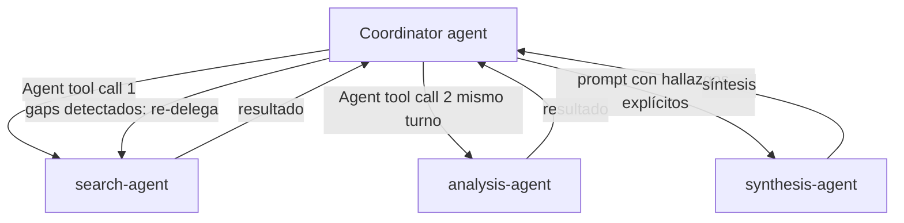

# Bloque 4 — Agent SDK: arquitectura agéntica y orquestación

> **Versión:** 1.0 · **Fecha:** 2026-08-07 · **Generada desde:** corpus v1.0 · **Guía oficial del examen:** v1.0
> **Peso en el examen:** 27% (Domain 1 — Agentic Architecture & Orchestration, el de mayor peso del examen) · **Escenarios donde cae:** diseño de sistemas multi-agente, elección entre agente dirigido por el modelo y workflow determinista, uso correcto de hooks para enforcement, gestión de sesiones de trabajo largas

## Qué evalúa el examen en este bloque

Este bloque cubre el dominio de mayor peso del examen y cuya evaluación gira, sobre todo, alrededor del **juicio arquitectónico**: dado un escenario concreto, decidir si un agente dirigido por el modelo es la elección correcta o si la garantía debe forzarse de forma programática. Un ejemplo típico de enunciado presenta un equipo que confía en una instrucción de prompt ("verify customer before refund") para un paso crítico, y pide identificar qué falla y cómo corregirlo. Los siete task statements de este bloque recorren una progresión: primero el bucle agéntico como unidad atómica (1.1), después cómo coordinar varios agentes entre sí (1.2, 1.3), cómo forzar determinismo en flujos que por defecto son probabilísticos (1.4, 1.5), cómo descomponer tareas complejas (1.6), y finalmente cómo persistir y retomar sesiones de trabajo (1.7). Este bloque construye directamente sobre la mecánica `tool_use`/`tool_result`/`stop_reason` del Bloque 0, pero eleva el nivel de abstracción a lo que ofrece el **Agent SDK** (*Software Development Kit*, kit de desarrollo de software): la capa que envuelve ese bucle en una API de más alto nivel, con orquestación multi-agente, hooks y sesiones persistentes.

## Antes de empezar

Este bloque asume que ya dominas el Bloque 0: el ciclo `tool_use`/`tool_result`, el papel de `stop_reason` en el control del bucle, y la distinción entre decisión dirigida por el modelo y flujo determinista. Todo lo que sigue son abstracciones de más alto nivel construidas sobre esa mecánica: el Agent SDK no la sustituye, la envuelve. Si algún concepto de `stop_reason` o `tool_choice` no te resulta inmediato, conviene repasarlo antes de seguir, porque este bloque no lo vuelve a explicar desde cero.

---

## Lección 1 — El bucle agéntico como unidad atómica: lifecycle, turns y cuándo termina realmente {#leccion-4-1}

El *agentic loop* (bucle agéntico) es el ciclo que ejecuta el Agent SDK por debajo de cualquier llamada a `query()`: Claude evalúa el estado actual y responde con tool calls, texto final, o ambos; el SDK ejecuta las tools solicitadas; los resultados vuelven a Claude; y el ciclo se repite hasta que la respuesta ya no trae tool calls. Existe porque, sin esta capa, el desarrollador tendría que gestionar a mano el array `messages` e inspeccionar `stop_reason` en cada iteración (como en el Bloque 0); el SDK lo sustituye por un generador asíncrono que emite eventos ya clasificados.

El *lifecycle* tiene cinco pasos: se recibe el prompt junto con el `system prompt`, las tools y el historial, y el SDK emite un `SystemMessage` con `subtype: "init"`; Claude responde y el SDK emite un `AssistantMessage`; el SDK ejecuta cada tool solicitada y los resultados alimentan el siguiente turno; los dos pasos anteriores se repiten mientras haya tool calls; y al producirse una respuesta sin tool calls, el SDK emite el `AssistantMessage` final seguido de un `ResultMessage` con texto, coste, uso de tokens y `session_id`. Un **turn** es esa ronda completa —tool calls, ejecución, resultados devueltos— sin que la aplicación ceda el control; los turns cuentan contra `maxTurns` (`max_turns` en Python), que es una red de seguridad, no el mecanismo principal de parada. Por debajo de esta abstracción sigue el mismo campo `stop_reason` del Bloque 0: mientras la respuesta trae `stop_reason: "tool_use"` el bucle continúa, y termina cuando trae `"end_turn"`. `maxBudgetUsd` (`max_budget_usd`) es el límite equivalente medido en gasto estimado en USD —incluyendo el de los subagentes—, y al alcanzarse el `ResultMessage` llega con `subtype: "error_max_budget_usd"` en vez de `"success"`.

```typescript
import { query } from "@anthropic-ai/claude-agent-sdk";

for await (const message of query({
  prompt: "Find and fix bugs in auth module",
  options: {
    allowedTools: ["Read", "Edit", "Bash", "Glob", "Grep"],
    settingSources: ["project"],  // Python: setting_sources
    maxTurns: 30,                 // Python: max_turns
    effort: "high"                // "low" | "medium" | "high" | "xhigh" | "max"
  }
})) {
  if (message.type === "assistant") {
    for (const block of message.message.content) {
      if (block.type === "tool_use") console.log(`Tool called: ${block.name}`);
    }
  }
  if (message.type === "result") {
    if (message.subtype === "success") console.log(message.result);
    else if (message.subtype === "error_max_turns") console.log(`Hit turn limit. Resume ${message.session_id}`);
    console.log(`Cost: $${message.total_cost_usd.toFixed(4)}`);
  }
}
```

En producción, este código es exactamente el punto donde se descubre si un equipo entendió bien el loop: la rama `message.type === "result"` no se limita a leer `message.result`, comprueba primero `subtype`, porque un corte por `error_max_turns` o `error_max_budget_usd` no es un éxito silencioso — es una tarea incompleta que además trae un `session_id` capturable para reanudar (Lección 7). Un detalle que conviene memorizar porque el examen lo usa como distractor de mecánica interna: cuando Claude pide varias tool calls en el mismo turno, el SDK las ejecuta **concurrentemente** solo si son de solo lectura (`Read`, `Glob`, `Grep`, MCP read-only); si alguna modifica estado (`Edit`, `Write`, `Bash`) se ejecutan **secuencialmente**, para evitar conflictos de escritura.

El anti-patrón más repetido en los enunciados de examen es tratar la señal de finalización como si fuera un problema de lenguaje natural: buscar en el texto de Claude frases como "I'm done" para decidir si el loop terminó. Falla porque un agente no siempre produce esa señal explícita, y porque Claude puede devolver texto y tool calls en el mismo turno — la presencia de texto no indica finalización, la ausencia de tool calls sí. El anti-patrón gemelo es usar `maxTurns` como criterio *principal* de parada en lugar de red de seguridad: corta arbitrariamente tareas legítimas que necesitaban un paso más. El examen contrasta explícitamente estos dos anti-patrones —parsing de lenguaje natural, iteration cap como mecanismo principal— junto con la idea errónea de que todas las tool calls de un turno se ejecutan siempre en paralelo, con el patrón correcto: la señal real es la ausencia de tool calls en la respuesta, equivalente a `stop_reason: "end_turn"` por debajo.

> **Mini-check 1.** Un agente lleva 25 turns y `maxTurns` está fijado en 30. La respuesta actual de Claude no contiene ningún tool call. ¿Qué debe hacer la aplicación?
> - [ ] A. Seguir iterando hasta llegar a 30 turns, porque `maxTurns` es el criterio de parada.
> - [x] B. Terminar el loop: la ausencia de tool calls en la respuesta es la señal real de finalización, independientemente de cuántos turns queden.
> - [ ] C. Buscar en el texto de la respuesta una frase de cierre explícita antes de decidir.
>
> _Respuesta: B — el bucle continúa mientras la respuesta contenga tool calls (`stop_reason: "tool_use"` por debajo) y termina cuando no los hay (`"end_turn"`); `maxTurns` es solo una red de seguridad, no el mecanismo primario de parada._

📖 Para profundizar: How the agent loop works (https://code.claude.com/docs/en/agent-sdk/agent-loop) detalla el lifecycle de cinco pasos, los cinco tipos de mensaje y la relación entre `maxTurns`/`maxBudgetUsd` y los `subtype` de error del `ResultMessage`.

---

## Lección 2 — Orquestación coordinator-subagent: hub-and-spoke y paralelismo {#leccion-4-2}

Cuando una tarea se beneficia de razonamiento especializado en paralelo —por ejemplo, una investigación que requiere buscar fuentes, analizar documentos y sintetizar hallazgos—, el patrón que la organiza es **coordinator-subagent**, con arquitectura **hub-and-spoke** (eje y radios): un coordinator agent gestiona toda la comunicación entre subagentes, el manejo de errores y el enrutamiento de información, y los subagentes nunca se comunican directamente entre sí. Existe porque delegar en paralelo reduce drásticamente el tiempo de tareas de investigación complejas, pero solo si el enrutamiento permanece centralizado y observable en el coordinator.

Las responsabilidades del coordinator son cuatro: *task decomposition* (analizar los requisitos de la query), *dynamic subagent selection* (decidir qué subagentes invocar según la complejidad real, sin rutear siempre por el pipeline completo), *result aggregation* (recolectar los outputs) e *iterative refinement* (evaluar la síntesis en busca de huecos, re-delegar con queries específicas, y repetir hasta cobertura suficiente). En la arquitectura de investigación multi-agente que documenta Anthropic, el lead agent genera entre 3 y 5 subagentes de forma **concurrente** —no secuencial—, cada uno ejecutando 3 o más tools en paralelo; este patrón redujo el tiempo de investigación hasta un **90%** en queries complejas frente a la alternativa secuencial.



El diagrama muestra la arquitectura hub-and-spoke: los subagentes nunca se comunican entre sí, todo el enrutamiento pasa por el coordinator, y el bucle de refinamiento iterativo —re-delegar tras detectar huecos en la síntesis— cierra sobre el propio coordinator, no sobre los subagentes.

```typescript
import { query } from "@anthropic-ai/claude-agent-sdk";

for await (const message of query({
  prompt: "Research AI safety and prepare a comprehensive report",
  options: {
    allowedTools: ["Read", "Grep", "Glob", "Agent"],
    agents: {
      "search-agent": {
        description: "Web search specialist for finding authoritative sources",
        prompt: "You are a research specialist. Find and catalog credible sources...",
        tools: ["WebSearch", "WebFetch"]
      },
      "analysis-agent": {
        description: "Document analysis specialist",
        prompt: "You analyze documents and extract key findings...",
        tools: ["Read", "Grep", "Glob"]
      },
      "synthesis-agent": {
        description: "Synthesis specialist that combines findings",
        prompt: "You synthesize findings from multiple sources...",
        tools: ["Read", "Write"]
      }
    }
  }
})) {
  if ("result" in message) console.log(message.result);
}
```

En producción, la señal de que un coordinator está mal diseñado es la duplicación de trabajo entre subagentes: dos subagentes investigando esencialmente lo mismo porque la instrucción de delegación fue vaga ("research this", sin objetivos, formato de output ni guía de tools). La corrección no es dar más tools al subagente, es que el coordinator especifique objetivos de investigación amplios, formato esperado y límites claros al delegar, dejando que cada subagente decida *cómo* investigar dentro de esos límites, no fijando sub-preguntas demasiado específicas de antemano.

El anti-patrón inverso, más costoso pero menos visible en el código, es rutear siempre por el pipeline completo incluso cuando la query es simple: incurre en coste y latencia innecesarios porque el coordinator no está ejerciendo *dynamic subagent selection*. Un tercer anti-patrón es la *overly narrow task decomposition* —descomponer un tema de investigación amplio en sub-preguntas demasiado estrechas fijadas de antemano—: produce cobertura incompleta porque el subagente pierde margen para adaptar su exploración a lo que va encontrando.

**Regla mnemotécnica:** coordinator siempre en el centro (nunca comunicación directa subagente-subagente); selección dinámica de subagentes según complejidad, nunca pipeline completo por defecto; delegación con objetivos y formato explícitos, nunca instrucciones vagas.

📖 Para profundizar: Subagents in the SDK (https://code.claude.com/docs/en/agent-sdk/subagents) documenta el patrón hub-and-spoke y las cuatro responsabilidades del coordinator; How we built our multi-agent research system (https://www.anthropic.com/engineering/built-multi-agent-research-system) es la fuente de la cifra del 90% y del ejemplo de 3-5 subagentes concurrentes.

---

## Lección 3 — Invocar subagentes: la Agent tool, aislamiento de contexto y forking {#leccion-4-3}

El mecanismo concreto que hace posible el patrón coordinator-subagent de la lección anterior es la **Agent tool** —renombrada desde `"Task"` en la versión 2.1.63 del SDK; el exam guide oficial, redactado sobre una versión anterior, todavía cita el nombre `"Task"`, y ambas variantes designan la misma tool—. Para que el coordinator pueda invocar subagentes, `allowedTools` debe incluir `"Agent"` (o `"Task"` en SDKs anteriores a la 2.1.63).

Lo que hace que este mecanismo merezca lección propia es que los subagentes operan con **contexto aislado**: no heredan automáticamente ni la conversation history del coordinator ni memoria entre invocaciones. Lo que sí heredan es su propio system prompt (`AgentDefinition.prompt`), el prompt de la llamada a la Agent tool, el `CLAUDE.md` del proyecto si `settingSources`/`setting_sources` lo incluye, y el subconjunto de tools declarado en `tools`. Lo que **no** heredan es el historial de conversación del padre, los resultados de tools del padre, su system prompt, ni el contenido de skills precargadas —salvo que se listen explícitamente en `AgentDefinition.skills`—. `AgentDefinition` admite, entre otros campos: `description` (obligatorio, cuándo usar este agente), `prompt` (obligatorio, su system prompt), `tools` (opcional; si se omite, hereda todas las tools disponibles para subagentes), `disallowedTools` (opcional, quita tools del conjunto heredado, incluyendo patrones MCP: `mcp__server` o `mcp__server__*` retiran todas las tools de ese servidor, `mcp__*` retira todas las tools MCP de cualquier servidor), `model` (alias `'haiku'`, `'sonnet'`, `'opus'`, `'inherit'`, o un model ID completo), `skills`, `memory` (`'user' | 'project' | 'local'`), `mcpServers`, `initialPrompt` (se auto-envía como primer turno de usuario solo si este agente corre como agente principal del hilo; se ignora si se invoca como subagente), `maxTurns`/`max_turns`, `background` (ejecuta el agente como tarea en segundo plano no bloqueante) y `permissionMode`.

```typescript
const codeReviewer: AgentDefinition = {
  description: "Expert code review specialist. Use for quality, security reviews.",
  prompt: `You are a code review specialist with expertise in security and performance.
When reviewing code: identify security vulnerabilities, check performance issues,
verify adherence to coding standards. Be thorough but concise.`,
  tools: ["Read", "Grep", "Glob"],   // read-only: aislamiento de escritura
  model: "sonnet",
  maxTurns: 20,                       // Python: max_turns
  effort: "high"
};

// Contexto explícito: los hallazgos previos se incluyen en el prompt, no se asumen heredados
const synthesisPrompt = `Synthesize these findings from search and analysis:

Search results:
${webSearchResults}

Document analysis:
${documentAnalysis}

Create comprehensive report with proper attribution.`;
```

Para spawnear subagentes en paralelo, el coordinator debe emitir múltiples llamadas a la Agent tool en una **única respuesta** (mismo turno), no en turnos separados. En producción, esto se manifiesta como un incidente de atribución: un agente de síntesis que combina hallazgos de varias fuentes sin conservar de dónde viene cada afirmación. La causa suele ser que el contexto se pasó como texto plano en vez de un formato estructurado que separe contenido de metadatos (URL de fuente, nombre de documento, número de página); la corrección es usar JSON u otro formato estructurado al pasar contexto entre agentes. Otro matiz que sorprende: el coordinator recibe el mensaje final del subagente como resultado de la Agent tool, pero por defecto puede resumirlo en su propia respuesta al usuario en lugar de citarlo literalmente — si se necesita preservar el output palabra por palabra, hay que indicarlo explícitamente en el prompt de la llamada principal a `query()`. `forkSession: true` (`fork_session=True`) crea ramas independientes de sesión desde una línea base compartida, útil para explorar enfoques divergentes sin perder el análisis original (se retoma en la Lección 7).

El anti-patrón más repetido en este eje es asumir herencia automática de contexto: esperar que un subagente tenga acceso al historial previo del coordinator sin haberlo inyectado explícitamente. Falla porque el aislamiento de contexto es un diseño deliberado, no un descuido — todo lo que el subagente necesita saber debe pasarse en su prompt. La corrección exacta es la del ejemplo de arriba: incluir los hallazgos completos como texto dentro del prompt de la llamada a la Agent tool, nunca asumirlos disponibles.

> **Mini-check 2.** Un coordinator invoca un `synthesis-agent` para combinar los hallazgos de `search-agent` y `analysis-agent`. ¿Cómo debe recibir el `synthesis-agent` esos hallazgos?
> - [ ] A. Automáticamente, porque comparte la misma sesión que el coordinator.
> - [x] B. Inyectados explícitamente en el prompt de la llamada a la Agent tool, ya que el contexto de los subagentes está aislado por diseño.
> - [ ] C. A través de un mensaje directo entre subagentes, sin pasar por el coordinator.
>
> _Respuesta: B — los subagentes no heredan la conversation history ni los resultados de tools del padre; todo debe pasarse explícitamente, y en un sistema hub-and-spoke la comunicación entre subagentes nunca es directa._

<!-- HUECO: contenido de los workshops en vídeo "Claude Agent SDK Full Workshop" y "Prompting for Agents" (YouTube) no fue accesible vía extracción de texto para este corpus; si aportan sintaxis adicional de invocación/spawning de subagentes no cubierta por la documentación escrita, queda pendiente de revisión manual. -->

📖 Para profundizar: Subagents in the SDK (https://code.claude.com/docs/en/agent-sdk/subagents) detalla los campos de `AgentDefinition`, el aislamiento de contexto y `forkSession`; Introduction to Subagents (Skilljar, parcial) [NO OFICIAL] (https://anthropic.skilljar.com/introduction-to-subagents) complementa con ejemplos introductorios.

---

## Lección 4 — Enforcement programático y protocolos de handoff en workflows multi-paso {#leccion-4-4}

Hay una distinción que el examen convierte en el eje central de este task statement: *programmatic enforcement* (hooks, gates de prerrequisitos) frente a *prompt-based guidance*. La primera da cumplimiento determinista; la segunda, por sí sola, tiene una tasa de fallo distinta de cero. Esta distinción importa siempre que un paso de un workflow tenga consecuencias financieras o de seguridad —verificación de identidad antes de una operación financiera es el ejemplo canónico del exam guide— porque en esos casos las instrucciones de prompt no bastan como único mecanismo de cumplimiento.

Un *prerequisite gate* programático bloquea llamadas a tools posteriores hasta que un paso previo se ha completado: por ejemplo, bloquear `process_refund` hasta que `get_customer` haya devuelto un customer ID verificado. El dato que hace tangible el riesgo de no aplicarlo es concreto: confiar únicamente en una instrucción de prompt ("always verify customer before processing refund") falla en la práctica, porque `get_customer` se omite en un **12%** de los casos cuando el único control es la instrucción de prompt — ese 12% es el "non-zero failure rate" que exige conocer este task statement.

```python
# Prerequisite gate programático vía PreToolUse hook.
# Firma real del callback: (input_data, tool_use_id, context); en Python
# el acceso a los campos es por clave de diccionario, no por atributo.
verified_customers = set()

async def record_verified_customer(input_data, tool_use_id, context):
    # PostToolUse: registra que get_customer devolvió una identidad verificada
    if input_data["tool_name"] == "get_customer":
        result = input_data.get("tool_result", {})
        if result.get("verified"):
            verified_customers.add(result.get("customer_id"))
    return {}

async def prerequisite_gate_hook(input_data, tool_use_id, context):
    # PreToolUse: bloquea process_refund hasta que get_customer haya verificado al cliente
    if input_data["tool_name"] == "process_refund":
        customer_id = input_data["tool_input"].get("customer_id")
        if customer_id not in verified_customers:
            return {
                "hookSpecificOutput": {
                    "hookEventName": input_data["hook_event_name"],
                    "permissionDecision": "deny",
                    "permissionDecisionReason": "Customer verification required. Call get_customer first.",
                }
            }
    return {}

# Registro: hooks = { "PreToolUse": [{ matcher: "process_refund", hooks: [prerequisite_gate_hook] }],
#                      "PostToolUse": [{ matcher: "get_customer", hooks: [record_verified_customer] }] }
```

El mismo task statement cubre el otro extremo del workflow: cómo escalar a mitad de proceso a un humano. Cuando una petición de cliente mezcla varias preocupaciones distintas, el patrón correcto es descomponerla en ítems separados, investigar cada uno en paralelo compartiendo contexto, y solo entonces sintetizar una resolución unificada. Para el escalado en sí, el protocolo de *handoff* estructurado incluye ID de cliente, causa raíz, importe y acción recomendada, de forma que el agente humano tenga contexto suficiente sin necesitar el transcript completo de la conversación:

```typescript
// Structured handoff summary
const handoffSummary = {
  customerId: "CUST-12345",
  rootCause: "Damaged package on arrival - photo evidence provided",
  refundAmount: "$85.00",
  recommendedAction: "Process full refund + send replacement",
  additionalContext: "Customer has been with us 5 years, high lifetime value"
};

const escalationPrompt = `Escalating to human agent:
${JSON.stringify(handoffSummary, null, 2)}

Customer message: "Please help, my package arrived broken."`;
```

En producción, el escenario que más se repite en los enunciados de examen es casi idéntico al de arriba: un equipo confía únicamente en el prompt para un paso crítico, y el fallo aparece de forma intermitente y difícil de reproducir en QA, porque no ocurre siempre — ocurre en ese ~12% de casos, lo suficientemente raro para pasar desapercibido en pruebas manuales pero lo suficientemente frecuente para causar incidentes reales en producción. La corrección no es "reforzar el texto del prompt" con mayúsculas o repetición, es sustituir la instrucción por el hook `PreToolUse` de arriba.

El anti-patrón que el examen contrasta con más insistencia es precisamente ese: confiar en instrucciones de prompt sin enforcement programático para pasos con consecuencia financiera o de seguridad. El distractor típico usa vocabulario que suena a garantía ("ensure", "always", "instruct") pero describe una instrucción de prompt, no un mecanismo programático; la señal correcta para elegir enforcement programático es la presencia de consecuencias financieras o de seguridad en el paso protegido, no la redacción del prompt.

> **Mini-check 3.** Un sistema de soporte debe garantizar que `process_refund` nunca se ejecute sin que `get_customer` haya verificado antes al cliente. ¿Qué mecanismo lo garantiza de forma determinista?
> - [ ] A. Una instrucción clara en el `system` prompt: "always verify the customer before processing a refund".
> - [x] B. Un hook `PreToolUse` que bloquea `process_refund` con `permissionDecision: "deny"` si el cliente no está en el registro de verificados.
> - [ ] C. Pedirle a Claude que confirme en texto que ha verificado al cliente antes de llamar a la tool.
>
> _Respuesta: B — el prompt-only guidance tiene una tasa de fallo documentada del 12% (`get_customer` se omite); solo el hook programático garantiza el orden sin depender del razonamiento del modelo en cada turno._

<!-- HUECO: ejemplos detallados de error propagation en sistemas multi-agente al escalar entre coordinator y subagentes (qué ocurre cuando un subagente falla a mitad de un handoff) solapan con Domain 5 y solo se cubrieron parcialmente desde la arquitectura de investigación multi-agente; no se documenta un mecanismo específico de propagación de error en este corpus. -->

📖 Para profundizar: el Task Statement 1.4 del exam guide oficial es la fuente de la cifra del 12% y del ejemplo de verificación de identidad antes de operación financiera; no hay una página de documentación dedicada exclusivamente a este patrón — se apoya en los hooks de la Lección 5.

---

## Lección 5 — Hooks del Agent SDK: intercepción determinista y normalización de datos {#leccion-4-5}

Los **hooks** son *callbacks* (funciones de retorno de llamada) que se ejecutan en respuesta a eventos del agente, y son el mecanismo concreto detrás del *prerequisite gate* de la lección anterior. Existen porque hay dos necesidades que el prompting probabilístico no puede garantizar: transformar datos heterogéneos antes de que el modelo los procese, y bloquear determinísticamente acciones que violan reglas de negocio. Un detalle que el examen usa como distractor recurrente: los hooks corren **fuera** del *context window* del agente —en el proceso de la aplicación, no dentro de la conversación con Claude—, así que no consumen contexto, y pueden cortocircuitar el loop: un hook `PreToolUse` que rechaza una llamada impide su ejecución, y Claude recibe un mensaje de rechazo en su lugar.

Los patrones de hook más usados son `PreToolUse` (antes de ejecutar una tool: validar inputs, bloquear comandos peligrosos), `PostToolUse` (después de que la tool retorna: auditar outputs, normalizar datos), `UserPromptSubmit` (cuando se envía un prompt: inyectar contexto adicional) y `Stop` (cuando el agente termina: validar el resultado, guardar el estado de sesión). El registro se hace vía la opción `hooks` de `query()`: un diccionario cuyas claves son el nombre del evento y cuyos valores son arrays de *matchers*, cada uno con `matcher` (opcional), `hooks` (array de callbacks, obligatorio) y `timeout` (opcional, en segundos). El `matcher` es un **string**, no un objeto: si contiene solo letras, dígitos, `_`, `-`, espacios, `,` y `|`, se compara como lista exacta de alternativas separadas por `|` o `,` (`"Write|Edit"` casa exactamente esas dos tools); cualquier otro carácter lo convierte en una expresión regular sin anclar (`"^mcp__"` casa toda tool MCP cuyo nombre empiece por `mcp__`). Para MCP, el patrón de nombre de tool es `mcp__<server>__<action>`; un matcher como `"mcp__memory"` (solo caracteres de coincidencia exacta) **no** casa ninguna tool de ese servidor — hace falta `"mcp__memory__.*"` para casar todas sus tools.

Cada callback recibe siempre **tres argumentos**: `(input_data, tool_use_id, context)`. En Python, el acceso a los campos de `input_data` es por **clave de diccionario** (`input_data["tool_name"]`), no por atributo. `tool_use_id` correlaciona el `PreToolUse` y el `PostToolUse` de la misma tool call. La salida del callback distingue campos de nivel superior (`systemMessage`, `continue`/`continue_`) de `hookSpecificOutput`, cuyo contenido depende del evento: en `PreToolUse` se fija `permissionDecision` (`"allow"`, `"deny"`, `"ask"` o `"defer"`) y opcionalmente `permissionDecisionReason`; en `PostToolUse` se fija `additionalContext` o `updatedToolOutput` (reemplaza el output antes de que Claude lo vea). Devolver `{}` permite la operación sin cambios.

```typescript
// Registro de hooks: PreToolUse con matcher exacto, PostToolUse con matcher regex MCP
const hooks = {
  PreToolUse: [
    { matcher: "process_refund", hooks: [enforceRefundThreshold] }
  ],
  PostToolUse: [
    { matcher: "^mcp__", hooks: [normalizeGetCustomerOutput] }
  ]
};

const enforceRefundThreshold: HookCallback = async (input, toolUseId, { signal }) => {
  const preInput = input as PreToolUseHookInput;
  const amount = (preInput.tool_input as Record<string, unknown>).amount as number;
  if (amount > 500) {
    return {
      hookSpecificOutput: {
        hookEventName: preInput.hook_event_name,
        permissionDecision: "deny",
        permissionDecisionReason: `Refund $${amount} exceeds $500 policy limit. Escalating.`
      }
    };
  }
  return {};
};
```

```python
# PostToolUse: normaliza timestamps Unix a ISO 8601 antes de que Claude los procese.
# Acceso por clave de diccionario, no por atributo.
async def normalize_get_customer_output(input_data, tool_use_id, context):
    if input_data["hook_event_name"] != "PostToolUse":
        return {}
    if input_data["tool_name"] == "get_customer":
        result_text = input_data.get("tool_result", {}).get("content", [{}])[0].get("text", "")
        normalized = convert_to_iso8601(result_text)
        return {
            "hookSpecificOutput": {
                "hookEventName": input_data["hook_event_name"],
                "updatedToolOutput": normalized,
            }
        }
    return {}
```

En producción, estos dos hooks resuelven dos incidentes distintos y frecuentes: el `PreToolUse` de arriba impide que un refund por encima de $500 se ejecute aunque el prompt del agente nunca menciona ese umbral explícitamente en ese turno; el `PostToolUse` normaliza timestamps Unix, ISO 8601 y códigos de estado numéricos heterogéneos provenientes de distintas MCP tools a un formato consistente, antes de que el modelo tenga que razonar sobre datos con formatos mezclados.

El anti-patrón de fondo es el mismo de la lección anterior aplicado a hooks: confiar únicamente en el prompt ("never approve refunds > $500") sin hook de enforcement, que falla porque el LLM ocasionalmente no sigue la instrucción. Un anti-patrón más específico de esta lección, y frecuente en el código real, es acceder a los campos del input del hook como si fueran atributos de un objeto en Python (`input_data.tool_name`) en vez de claves de diccionario (`input_data["tool_name"]`) — la API real es siempre un diccionario. El examen distingue con insistencia `PreToolUse` (intercepta antes de ejecutar, puede bloquear con `permissionDecision`) de `PostToolUse` (intercepta después, transforma el resultado con `updatedToolOutput`/`additionalContext`, pero **no** dispone de `permissionDecision`): usar el campo equivocado para cada caso es un distractor típico.

> **Mini-check 4.** Un hook necesita bloquear la ejecución de una tool cuando su input incumple una regla de negocio. ¿En qué evento debe registrarse, y con qué campo de salida?
> - [ ] A. `PostToolUse`, con `permissionDecision: "deny"`.
> - [x] B. `PreToolUse`, con `permissionDecision: "deny"`.
> - [ ] C. `UserPromptSubmit`, con `updatedToolOutput`.
>
> _Respuesta: B — `PreToolUse` intercepta antes de la ejecución y es el único evento donde `permissionDecision` tiene efecto; `PostToolUse` transforma el resultado ya obtenido, pero no puede impedir que la tool se haya ejecutado._

<!-- HUECO: el mecanismo exacto para bloquear o revertir un efecto a partir del resultado de una tool ya ejecutada (es decir, dentro de `PostToolUse`) permanece sin verificar en la documentación vigente; `permissionDecision` no tiene efecto en `PostToolUse`, así que no existe hoy un patrón confirmado de "deny" post-hoc — punto a vigilar, no usar código inventado para esto. -->

📖 Para profundizar: Hooks del Agent SDK (https://code.claude.com/docs/en/agent-sdk/hooks) documenta los cuatro eventos, la sintaxis del `matcher`, la firma de tres argumentos del callback y los campos de `hookSpecificOutput` por evento; How the agent loop works (https://code.claude.com/docs/en/agent-sdk/agent-loop) sitúa los hooks fuera del context window dentro del lifecycle completo.

---

## Lección 6 — Estrategias de descomposición de tareas para workflows complejos {#leccion-4-6}

No toda tarea compleja se descompone igual, y el examen evalúa precisamente saber elegir entre dos estrategias: *fixed sequential pipelines* (**prompt chaining**) para workflows predecibles, y **dynamic adaptive decomposition** basada en hallazgos intermedios para investigación abierta. Esta elección determina si el plan de subtareas se fija de antemano o se genera sobre la marcha, y equivocarla produce o rigidez injustificada o caos sin estructura.

El *prompt chaining* rompe una revisión en pasos secuenciales fijos —analizar cada fichero individualmente y luego ejecutar un pase de integración cruzada entre ficheros— para evitar la **dilución de atención** (*attention dilution*) que ocurre cuando se intenta analizar todo un codebase en un único pase monolítico. La *dynamic decomposition* se reserva para tareas abiertas —"añade tests exhaustivos a este codebase legacy"— donde primero se mapea la estructura del código, se identifican las áreas de mayor impacto, y se genera un plan priorizado que se adapta conforme se descubren dependencias no anticipadas.

```python
# Prompt chaining: pases secuenciales fijos
local_analysis_prompt = "Analyze each file for bugs, security issues: File: auth.py ... File: config.py ..."
integration_prompt = f"""Given these local findings:
{local_analysis_results}

Now analyze: data flow across files, shared state dependencies, integration points."""

# Dynamic decomposition: el plan se genera a partir de lo descubierto
mapping_prompt = "Map the structure of this codebase. List all test files and untested modules."
# Salida de ejemplo: "High-impact untested modules: auth.py (30% coverage), db.py (20% coverage)"
adaptive_subtasks = [
    {"module": "auth.py", "priority": "high", "target_coverage": "80%"},
    {"module": "db.py", "priority": "medium", "target_coverage": "75%"},
]
```

En producción, la señal de que un pase de revisión de código necesitaba prompt chaining y no lo tuvo es un informe con hallazgos inconsistentes o contradictorios entre secciones: el modelo detectó un problema de seguridad en un fichero y no relacionó ese hallazgo con una dependencia compartida en otro, porque intentó cubrir todo el codebase en un único pase y la atención se diluyó. La corrección es exactamente la del ejemplo: separar el análisis local por fichero del pase de integración cruzada, como dos llamadas distintas encadenadas. El caso inverso ocurre en tareas de investigación abierta: un plan de subtareas fijado por completo al principio —por ejemplo, decidir de antemano exactamente qué módulos testear y con qué prioridad, sin margen de ajuste— falla en cuanto la exploración inicial revela dependencias que nadie anticipó; el plan rígido no tiene mecanismo para incorporar ese hallazgo.

El anti-patrón de fondo en ambas direcciones es aplicar la estrategia equivocada al tipo de tarea: usar descomposición fija para una tarea abierta, o descomposición dinámica innecesaria para una revisión predecible con pasos ya conocidos de antemano (coste añadido de planificación sin beneficio real). El examen contrasta "prompt chaining para revisiones multi-aspecto predecibles" con "dynamic decomposition para investigación abierta" como la elección correcta según el tipo de tarea, y ambos usos cruzados como distractores.

**Regla mnemotécnica:** si los pasos son conocidos y su orden no depende de lo que se descubra por el camino, prompt chaining; si el plan solo puede definirse bien a medida que se explora, dynamic decomposition.

> **Mini-check 5.** Un equipo necesita revisar un codebase de 40 ficheros buscando bugs, problemas de seguridad y de integración entre módulos. ¿Qué estrategia de descomposición evita la dilución de atención?
> - [ ] A. Un único prompt que reciba los 40 ficheros y pida un informe completo en una sola pasada.
> - [x] B. Prompt chaining: un pase de análisis local por fichero, seguido de un pase separado de integración cruzada.
> - [ ] C. Dynamic decomposition: dejar que el modelo decida sobre la marcha qué ficheros analizar primero.
>
> _Respuesta: B — la tarea es predecible y sus pasos son conocidos de antemano; un pase monolítico sobre 40 ficheros diluye la atención del modelo, mientras que separar análisis local e integración es el patrón de prompt chaining._

📖 Para profundizar: el Task Statement 1.6 del exam guide oficial documenta la distinción entre prompt chaining y dynamic decomposition con los ejemplos de revisión de código y testing de codebases legacy usados en esta lección.

---

## Lección 7 — Gestión de sesiones: continue, resume y fork {#leccion-4-7}

Las sesiones del Agent SDK persisten en disco automáticamente, lo que permite retomar, continuar o ramificar una conversación previa sin reconstruir manualmente el historial. Hay tres mecanismos distintos que resuelven necesidades diferentes, y elegir el incorrecto produce estado obsoleto o pérdida de trabajo previo: **continue** encuentra la sesión más reciente en el directorio actual sin necesidad de rastrear un ID (`continue: true`; `continue_conversation=True` en Python); **resume** toma un session ID específico —necesario cuando hay varias sesiones o se quiere volver a una que no es la más reciente— vía `resume: sessionId` (`resume=session_id`), y también admite resumption por nombre con `--resume <session-name>` desde CLI; **fork** crea una sesión nueva con una copia del historial de la original, dejando la original sin modificar, vía `forkSession: true` (`fork_session=True`).

```typescript
// Resume por session ID
const sessionId = "5b3f2c1a-8d4e-4f6b-9a7c-2e1d0f9b8a6c";
for await (const message of query({
  prompt: "Now implement the refactoring you suggested",
  options: { resume: sessionId, allowedTools: ["Read", "Edit", "Write", "Glob", "Grep"] }
})) {
  if (message.type === "result" && message.subtype === "success") console.log(message.result);
}
```

```python
# Fork: rama independiente desde una línea base compartida
forked_id = None
async for message in query(
    prompt="Instead of JWT, outline OAuth2 approach for auth module",
    options=ClaudeAgentOptions(resume=session_id, fork_session=True, max_turns=5),
):
    if isinstance(message, ResultMessage):
        forked_id = message.session_id
        if message.subtype == "success":
            print(message.result)
# Dos IDs de sesión independientes a partir de aquí: session_id (original) y forked_id
```

`fork` es el mecanismo para explorar enfoques divergentes —comparar una estrategia JWT frente a OAuth2, como en el ejemplo— desde una misma línea base de análisis compartida, sin perder la sesión original. Un matiz que el examen explota como distractor: el *fork* rama el historial de conversación, **no el sistema de ficheros** — si un agente forkeado edita ficheros, esos cambios son reales y visibles para cualquier otra sesión que trabaje en el mismo directorio; ramificar también los cambios de fichero requeriría *file checkpointing* aparte, un mecanismo distinto. Las sesiones se escriben en disco en `~/.claude/projects/<encoded-cwd>/*.jsonl` (o en `$CLAUDE_CONFIG_DIR/projects/<encoded-cwd>/*.jsonl`). El session ID se captura desde `ResultMessage.session_id` en ambos SDKs; en TypeScript también está disponible directamente en el `SystemMessage` de tipo `"init"`, mientras que en Python queda anidado dentro de `SystemMessage.data`. En Python, `ClaudeSDKClient` es la alternativa a llamar `query()` repetidamente: mantiene la sesión y su `session_id` automáticamente a través de múltiples llamadas dentro del mismo objeto cliente, en lugar de que el desarrollador gestione `resume`/`continue` a mano entre invocaciones sueltas.

En producción, el incidente típico de este eje ocurre al reanudar una sesión después de que el código haya cambiado entre medias: si el prompt de reanudación no informa explícitamente qué ficheros cambiaron desde la última sesión, el agente sigue razonando sobre resultados de tools que ya no son válidos —cree que un fichero tiene el contenido que tenía la última vez que lo leyó, aunque alguien lo haya modificado desde entonces—. La corrección no es evitar `resume` y empezar de cero siempre: si el estado previo sigue siendo mayormente confiable, reanudar con un resumen explícito de los cambios es más eficiente que volver a explorar todo desde el principio; solo cuando los datos son claramente obsoletos conviene empezar de nuevo con un resumen estructurado inyectado.

El anti-patrón más citado por el examen es exactamente ese: reanudar una sesión antigua sin informar al agente de que los ficheros analizados han cambiado. El anti-patrón gemelo, menos intuitivo, es asumir que el fork ramifica también los cambios de fichero en disco — solo ramifica el historial de conversación; los efectos en el sistema de ficheros son compartidos y reales para cualquier sesión que trabaje en ese directorio.

**Tabla de decisión:**

| Necesidad | Mecanismo | Detalle |
|---|---|---|
| Retomar el trabajo más reciente sin rastrear IDs | `continue: true` (`continue_conversation=True`) | No requiere gestión manual de session ID |
| Retomar una sesión concreta que no es la más reciente | `resume: sessionId` (`resume=session_id`) o `--resume <session-name>` | Permite volver a una sesión específica entre varias activas |
| Explorar dos enfoques divergentes desde una misma línea base | `forkSession: true` (`fork_session=True`) | Crea una rama de historial independiente; los cambios de fichero en disco NO se ramifican |
| Reanudar sesión después de cambios de código | Informar explícitamente en el prompt qué ficheros cambiaron | Los resultados de tools previos pueden estar obsoletos; el agente no lo sabe si no se le dice |

> **Mini-check 6.** Un agente forkea su sesión (`forkSession: true`) para comparar dos enfoques de refactorización. El agente forkeado edita un fichero durante su exploración. ¿Qué ocurre con ese cambio?
> - [ ] A. Solo existe dentro de la rama forkeada; la sesión original no lo ve nunca.
> - [x] B. Es un cambio real en el sistema de ficheros, visible para la sesión original y para cualquier otra que trabaje en el mismo directorio.
> - [ ] C. Se descarta automáticamente si la rama forkeada no se fusiona explícitamente de vuelta.
>
> _Respuesta: B — `fork` rama el historial de conversación, no el sistema de ficheros; los efectos de tools que escriben en disco son reales y compartidos, no ramificados. Ramificar también los ficheros requeriría un mecanismo aparte de file checkpointing._

📖 Para profundizar: Work with sessions (https://code.claude.com/docs/en/agent-sdk/sessions) documenta `continue`, `resume`, `fork`, la ubicación en disco de los `.jsonl` y las diferencias TypeScript/Python en la captura del `session_id`.

---

## Checklist de salida

Dominas este bloque si puedes, sin mirar la guía:

- [ ] Explicar el lifecycle de cinco pasos del bucle agéntico y por qué la señal real de terminación es la ausencia de tool calls, no un contador de turns ni una heurística de texto (1.1).
- [ ] Diseñar un coordinator que seleccione dinámicamente subagentes según la complejidad de la query, en arquitectura hub-and-spoke, evitando duplicación de trabajo por instrucciones de delegación vagas (1.2).
- [ ] Invocar subagentes con la Agent tool inyectando explícitamente el contexto necesario en el prompt, sabiendo qué campos de `AgentDefinition` existen y qué NO heredan los subagentes por defecto (1.3).
- [ ] Distinguir cuándo un paso de un workflow exige programmatic enforcement (hook, gate de prerrequisito) frente a cuándo basta con prompt guidance, y construir un protocolo de handoff estructurado para escalados a humano (1.4).
- [ ] Elegir el evento de hook correcto (`PreToolUse`, `PostToolUse`, `UserPromptSubmit`, `Stop`) según si la necesidad es bloquear antes de ejecutar o transformar después, y escribir el `matcher` con la sintaxis correcta de string (1.5).
- [ ] Elegir entre prompt chaining y dynamic decomposition según si la tarea es predecible o abierta, y explicar por qué un pase monolítico diluye la atención del modelo (1.6).
- [ ] Elegir entre `continue`, `resume` y `fork` según la necesidad exacta de la sesión, y saber que el fork rama el historial de conversación pero no el sistema de ficheros (1.7).

## Para ir más allá — referencias anotadas

- How the agent loop works — https://code.claude.com/docs/en/agent-sdk/agent-loop — lifecycle de cinco pasos, tipos de mensaje del SDK y relación con `stop_reason`; base de la Lección 1 y referencia cruzada de la Lección 5.
- Subagents in the SDK — https://code.claude.com/docs/en/agent-sdk/subagents — patrón hub-and-spoke, campos de `AgentDefinition`, aislamiento de contexto y `forkSession`; base de las Lecciones 2 y 3.
- How we built our multi-agent research system — https://www.anthropic.com/engineering/built-multi-agent-research-system — arquitectura de investigación multi-agente de Anthropic, origen de la cifra del 90% de reducción de tiempo y del patrón de 3-5 subagentes concurrentes; base de la Lección 2.
- Hooks del Agent SDK — https://code.claude.com/docs/en/agent-sdk/hooks — los cuatro eventos de hook, sintaxis del `matcher`, firma del callback y campos de `hookSpecificOutput`; base de la Lección 5.
- Work with sessions — https://code.claude.com/docs/en/agent-sdk/sessions — `continue`, `resume`, `fork`, ubicación en disco de las sesiones y diferencias TypeScript/Python; base de la Lección 7.
- Introduction to Subagents (Skilljar, parcial) [NO OFICIAL] — https://anthropic.skilljar.com/introduction-to-subagents — ejemplos introductorios de invocación de subagentes; complementa la Lección 3.

*Historial de versiones del curso: [changelog](../../changelog.html) — único para todo el material; esta guía no lleva el suyo propio.*
